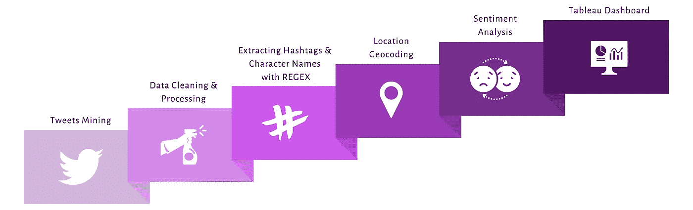
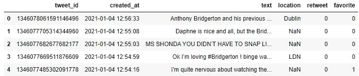
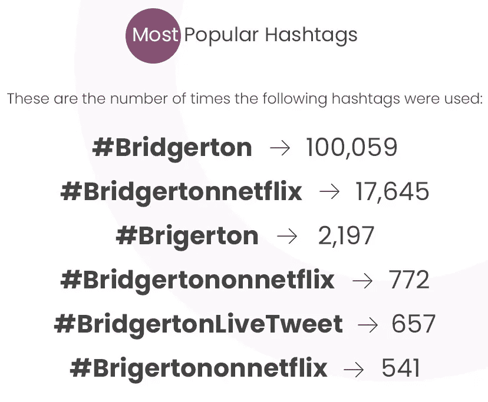

# 布里奇顿:网飞最热门的电视连续剧分析

> 原文：<https://towardsdatascience.com/bridgerton-an-analysis-of-netflixs-most-streamed-tv-series-c4c9e2926397?source=collection_archive---------14----------------------->

## 使用 Python 和 Tableau 中的 NLP 技术对 Bridgerton 电视连续剧上的 300，000 多条推文进行分析

在 [Unsplash](https://unsplash.com?utm_source=medium&utm_medium=referral) 上由 [Thibault Penin](https://unsplash.com/@thibaultpenin?utm_source=medium&utm_medium=referral) 拍摄的照片

《布里奇顿》系列电视剧在圣诞节上映后，占据了全球大多数电视频道。几乎所有的电影爱好者都在谈论这件事，因为炒作，我被*【胁迫】*在 ***网飞*** 看了这部连续剧。最近， [CNN](https://www.cnn.com/2021/01/28/media/bridgerton-netflix-biggest-series-intl-scli/index.html) 报道称，《布里奇顿》是“ ***有史以来最大的网飞剧集”*** ，因为它已经在超过 8200 万个家庭中播放。然而，最吸引我注意的是推特上的官方标签*，这帮助为这部剧制造了更多的轰动。正如你在下图中看到的，它们都有一个特殊的标志。如果你问我，我会说这是伟大的营销策略！*

**

*推特上布里奇顿官方标签的截图(图片由[杰西卡·乌戈格伦](https://jess-analytics.com/)提供)*

# *基础*

*为了这个项目，我决定在我上一个情感分析项目的基础上，根据 Twitter 用户对电视连续剧《布里吉顿》的评论做一个评论。用于该项目的推文创建于 2020 年 12 月 27 日至 2021 年 1 月 28 日*。*除了*，*分析只涵盖了用 ***英文*** 写的推文。我可以肯定地说，如果你在那段时间里在你的推文中使用了任何 ***布里奇顿*** 标签或者提到了“ ***【布里奇顿】*** ”，那么你的推文就是这个分析的一部分。*

*以下是我想了解的关于这部电视剧的一些事情:*

*   *最受欢迎的布里奇顿标签*
*   *最受关注的*人物*布里顿*
*   *普通观众对布里奇顿的看法*
*   *关于布里奇顿的推特常用词*
*   *哪个国家关于布里奇顿的推特最多*

*我还在组合中加入了一个 Tableau 仪表板，让您可以按国家、日期和时间来浏览我的分析结果。*

# *项目策略*

*项目步骤如下所示。在我上一个[项目](/the-year-2020-analyzing-twitter-users-reflections-using-nlp-3afdfdf2f68e)中详细讨论了一些关键概念。因此，在本文中，我将展示一些简短的 Python 脚本，用于实现我的分析的一些结果。*

**

*布里奇顿电视剧分析项目流程图(图片由[杰西卡·乌戈格伦](https://jess-analytics.com/)使用 Canva 开发)*

*使用的 Python 库包括 Pandas(用于数据清理/操纵)、Tweepy(用于推文挖掘)、NLTK(用于文本分析的自然语言工具包)、TextBlob(用于情感分析)、Matplotlib & WordCloud(用于数据探索)、Emot(用于表情符号识别)、Plotly(用于数据可视化)等内置库，如我的 [Jupyter 笔记本](https://nbviewer.jupyter.org/github/jess-data/Twitter-2020-Sentiment-Analysis/blob/master/Twitter%20Sentiment%20Analysis%20Project.ipynb)所示。*

# *推特挖掘*

*有一个月，我使用他们的 API 和 Python 库， ***Tweepy 从 Twitter 上搜集了一些推文。要使用 Twitter 的 API，你只需要在创建 Twitter 开发者账户后获得一些证书。你也可以查看我上一篇[文章](/the-year-2020-analyzing-twitter-users-reflections-using-nlp-3afdfdf2f68e)中关于如何使用 Twitter 的 API 的简要说明。对于搜索查询，我使用了单词“Bridgerton”和所有官方的 Bridgerton 标签。我甚至添加了错误的拼写，例如，为拼错电影名称的用户添加了“Brigerton”。请参见下面的代码片段。****

*用于 Bridgerton Tweet 挖掘的 Python 脚本(代码由 [Jessica Uwoghiren](https://jess-analytics.com/) 编写)*

# *数据清理和处理*

*我一直说，一个数据科学或分析项目，大约 80%都是围绕这一步展开的。想象一下处理 300，000 多行数据，您不可能检查每一行的正确性或完整性。在任何数据项目中，缺失值总是一个大问题。在这个例子中，Location 列有许多缺失值，因为只有少数 Twitter 用户在他们的简历中有正确的位置。我还需要确保没有使用“Tweet ID”的重复 Tweet，这是我的数据集的主键。请参见下面的熊猫数据框。*

**

*显示推特数据集的熊猫数据框(截图来自 [Jupyter 笔记本](https://nbviewer.jupyter.org/github/jess-data/Twitter-2020-Sentiment-Analysis/blob/master/Twitter%20Sentiment%20Analysis%20Project.ipynb)作者[杰西卡·乌戈格伦](https://jess-analytics.com/)*

# *使用正则表达式从推文中提取标签和角色名*

*我非常喜欢分析的这一部分。我想看看哪个官方的 ***推特“布里吉顿”标签*** 和 ***角色名字*** 最受欢迎。我必须找到一种方法，从每条推文中提取这些信息，并将它们返回到我的数据框中的新列。我是怎么做到的？答案是正则表达式。REGEX 代表“正则表达式”,它用于指定想要匹配的字符串模式。它在这里证明是有效的。对于角色的名字，我使用了 REGEX 来纠正名字拼写错误的地方，如下面的代码片段所示。*

*Python 脚本从 Bridgerton Tweets 中提取标签和角色名(代码由 [Jessica Uwoghiren](https://jess-analytics.com/) 编写)*

*查看我的 Jupyter 笔记本[这里](https://nbviewer.jupyter.org/github/jess-data/Bridgerton/blob/main/Bridgerton%20Twitter%20Analysis%20Project.ipynb)看最后的数据框。基于上面的分析，最受欢迎的标签如下所示。*

**

*布里奇顿推特标签的频率。(图片由 [Steve Uwoghiren](https://www.linkedin.com/in/steveuwoghiren/) 使用 Adobe Photoshop 开发)*

# *布里奇顿推文中的词频*

*对于这部分分析，我使用了 ***WordCloud*** 库，根据推文中使用的单词频率生成单词云图像。使用 ***Matplotlib*** 库中的 ***Pyplot*** 模块显示下图。单词云以更大的文本尺寸显示具有更高频率*的单词*。*

**

*关于 Bridgerton 电视剧的推文中最常用的词(图片由 [Jessica Uwoghiren](https://www.linkedin.com/in/jessicauwoghiren/) 使用 WordCloud 和 Python 的 Matplotlib 库生成)*

# *位置地理编码*

*为了确定哪个国家在推特上发布的关于布里吉顿电视剧的信息最多，我使用了位置地理编码，这是一种返回给定城市、地点、州或国家的精确坐标的奇特方式。我这样做是因为大多数 Twitter 用户只在他们的简历中使用他们的“州”或“城市”,而我需要检索他们的国家名称。像我的上一个项目一样，我使用了[开发者的 API](https://developer.here.com/documentation/geocoding-search-api/dev_guide/topics/endpoint-geocode-brief.html) 来返回每个 tweet 位置的 ***国家代码和国家名称*** 。*

# *情感分析*

*最后，我想看看对 Bridgerton 系列的整体看法。为了实现这一点，我使用了一种被称为自然语言处理(NLP)的机器学习技术。另一种说法是处理人类文本或单词。NLP 有几个方面，这里最重要的是“情感分析”。一个简单的例子，请查看我上一篇关于这个主题的文章。*

*对于这个分析，我使用了 [**TextBlob**](https://textblob.readthedocs.io/en/dev/quickstart.html#sentiment-analysis) 中的情感分析器模块。Python 上的库。该算法通过给每个句子一个**极性**分数来分析句子的情感。基于**极性**得分，人们可以定义推文的情感类别。对于这个项目，我将一条**负面**推文定义为极性得分为 **<** 0，而 **≥** 0 为**正面**。情感类别的分布如下所示。您可以在 Tableau dashboard [**这里**](https://public.tableau.com/views/BridgertonTVSeriesDashboard/Dashboard1?:language=en&:display_count=y&:origin=viz_share_link) **探索按国家划分的情绪类别分布。***

*根据 2020 年 12 月 27 日至 2021 年 1 月 27 日的推文(由 [Jessica Uwoghiren](https://www.linkedin.com/in/jessicauwoghiren/) 使用 Python 的 Plotly 库生成的情节),观众对布里吉顿电视剧的总体看法*

# *交互式 Tableau 仪表板*

*为了帮助读者更深入地探索我的分析，我利用 Tableau 创建了一个用户友好的交互式[仪表板](https://public.tableau.com/views/BridgertonTVSeriesDashboard/Dashboard1?:language=en&:display_count=y&:origin=viz_share_link)。这允许你通过国家、推文创建日期、时间等等来探索结果。请注意，虽然可以在任何设备上查看仪表板，但最好使用平板电脑或计算机查看。*

*布里奇顿推特分析仪表板剪辑(仪表板由[杰西卡·乌戈格伦](https://www.linkedin.com/in/jessicauwoghiren/)使用[画面](https://public.tableau.com/views/BridgertonTVSeriesDashboard/Dashboard1?:language=en&:display_count=y&:origin=viz_share_link)创建)*

# ***最终想法***

*感谢您花时间阅读这篇文章。你可以去我的个人资料浏览更多文章。一如既往，我喜欢分享我的见解。以下是一些例子:*

*   ****布里奇顿的营销策略:*** 这个特殊的布里奇顿标签引起了超越网飞订户的轰动。这让人们在推特上谈论这部电视剧。*
*   ****假日季:*** 根据[cnn.com](https://www.cnn.com/2021/01/28/media/bridgerton-netflix-biggest-series-intl-scli/index.html)的报道，这部电影在圣诞节期间上映也帮助提升了这部电视剧的收视率，在上映的第一个月就有超过 8200 万家庭观看了这部电视剧*
*   ****发微博最多的国家:*** 与尼日利亚和印度等其他国家相比，美国、英国和加拿大的推特用户发了更多关于这部电视剧的微博。我想到了几个原因，如互联网普及率较低，网飞用户较少等。*
*   ****推出电影或产品？你可能要考虑研究一下布里奇顿的推特策略。吸引你的观众，让人们为你销售你的产品！****

# *评论*

*文章中使用的所有参考文献都有超链接。关于在 Jupyter Notebook、GitHub、Tableau Dashboard 和我的社交媒体页面上编写的完整 Python 代码，请使用以下链接:*

*   *[Tableau 仪表盘](https://public.tableau.com/views/BridgertonTVSeriesDashboard/Dashboard1?:language=en&:display_count=y&publish=yes&:origin=viz_share_link)*
*   *[Jupyter 笔记本](https://nbviewer.jupyter.org/github/jess-data/Bridgerton/blob/main/Bridgerton%20Twitter%20Analysis%20Project.ipynb)*
*   *[GitHub 资源库](https://github.com/jess-data/Bridgerton)*
*   *[个人网站](https://jess-analytics.com/)*
*   *[领英](https://www.linkedin.com/in/jessicauwoghiren/)*
*   *[推特](https://twitter.com/jessica_xls)*
*   *[Instagram](https://instagram.com/jessica_xls)*
*   *[数据技术空间社区](https://linktr.ee/DataTechSpace)*