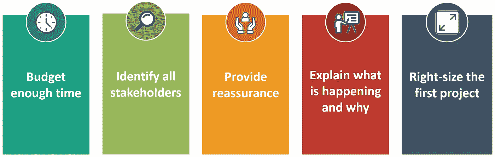

# 弥合人工智能的概念验证与生产差距

> 原文：<https://towardsdatascience.com/bridging-ais-proof-of-concept-to-production-gap-insights-from-andrew-ng-f2ac119ee737?source=collection_archive---------16----------------------->

## 关于在现实世界中部署机器学习项目的挑战和解决方案的三个关键要点(来自吴恩达)

亚历克斯·拉德里奇在 [Unsplash](https://unsplash.com?utm_source=medium&utm_medium=referral) 上的照片

我们经常听说人工智能( **AI** )和机器学习( **ML** )领域令人兴奋的突破和新的最先进的研究。

尽管有这些进步，残酷的现实是**这些概念验证(PoC)项目中的大多数**没有**部署在现实世界中。为什么会这样？**

这个问题被称为 **PoC 到生产的差距**，ML 项目在走向实际部署的过程中遇到了重大的瓶颈和挑战。

在这篇文章中，我们发现了吴恩达分享的三个关键经验教训，关于团队如何弥合这一差距以从 ML 项目中交付更大的实际价值。

# 关于演讲者

吴恩达|图片来自[维基共享资源](https://commons.wikimedia.org/wiki/File:Andrew_Ng_WSJ_(2).jpg)

[**Andrew NG**](https://en.wikipedia.org/wiki/Andrew_Ng)**是 deeplearning.ai 的创始人，Coursera 的联合创始人。**

**他目前是斯坦福大学的兼职教授。他是百度公司的首席科学家和谷歌大脑项目的创始人。**

**目前也是 Landing AI 的创始人兼 CEO。**

# **(1)小数据问题**

**行业中对 ML 应用的讨论主要集中在消费互联网用例上，如社交媒体(如脸书)、娱乐(如 YouTube)和电子商务(如亚马逊)。**

**这种现象并不奇怪，因为这些公司可以从数百万用户那里获得大量数据。**

**然而，在消费互联网之外，还有许多其他应用和行业**只能访问小数据**。**

**这种小数据在人工智能项目的部署中是一个巨大的挑战，因为数据分布不均匀的问题被大大放大了。虽然我们可以构建平均精度良好的 ML 模型，但这些模型在数据中较少出现的**罕见事件**上可能仍然表现不佳。**

**一个例子是胸部 X 射线诊断 ML 算法的开发，该算法对积液等常见疾病的预测很好，但对疝气等罕见疾病的预测很差。**

**虽然整体模型可能具有出色的性能指标，但部署一个遗漏明显疝病例的系统在医学上是不可接受的。**

**幸运的是，在研究更好的算法来处理小数据方面取得了进展。以下是一些例子:**

*   **合成数据生成(如 GANs)**
*   **一次性/一次性学习(如 GPT-3)**
*   **自我监督学习**
*   **迁移学习**
*   **异常检测**

****

**[国立癌症研究所](https://unsplash.com/@nci?utm_source=medium&utm_medium=referral)在 [Unsplash](https://unsplash.com?utm_source=medium&utm_medium=referral) 上拍摄的照片**

**即使您只有少量数据，在企业中开发 ML 解决方案之前等待更多数据(例如，首先构建新的 it 基础设施)几乎总是一个糟糕的想法。**

**更谨慎的做法是，从您拥有的任何数据开始，然后反向工作以确定您需要收集哪些额外的数据。只有从一个系统开始，您才能进一步了解如何构建或增强 It 基础架构。**

# **(2)通用性和稳健性**

**事实证明，许多在已发表的论文中运行良好的模型在生产环境中往往**不起作用**。**

**这个问题源自于构建不良的概括和不健壮的模型，它被证明是部署 ML 概念证明的又一个挑战。**

**回到早期的 X 射线诊断的例子，一个团队可以基于从现代机器获得的高质量 X 射线图像构建一个高性能算法，这些现代机器由像斯坦福医院这样的知名机构的训练有素的技术人员操作。**

**如果我们要在一家更老的医院运行这种模型，那里的 x 光机更老，技术人员训练更差，成像协议也不同，我们预计**模型的性能会降低**。**

**这种表现与人类放射科医师形成对比，后者可能在两家医院中对扫描进行类似的良好诊断。**

**这一挑战适用于所有行业，不仅仅是医疗保健行业。它突出了深入理解训练数据分布和具有领域知识以了解数据和过程的细微差别的重要性。**

**鉴于这一挑战没有明确的解决方案，研究人员和工程师必须共同努力**开发系统化的工具和流程**以确保算法可推广到用于训练以外的数据。**

****

**在 [Unsplash](https://unsplash.com/s/photos/engineer?utm_source=unsplash&utm_medium=referral&utm_content=creditCopyText) 上拍摄的 [ThisisEngineering RAEng](https://unsplash.com/@thisisengineering?utm_source=unsplash&utm_medium=referral&utm_content=creditCopyText)**

# **(3)变革管理**

**许多团队没有意识到人工智能解决方案会扰乱许多利益相关者的工作。如果没有正确的认同和接受，企业用户将会犹豫是否使用你辛辛苦苦构建的 ML 模型。**

**下图说明了**在管理技术带来的变化时的五个关键考虑因素**:**

****

**变更管理的注意事项|作者图片**

**在**提供保证**和**解释模型的预测**方面，团队可以利用**可解释的**人工智能的工具(特定于每个利益相关者的需求)，以及**第三方审计**服务来审查 ML 系统的代码和设置。**

**一旦利益相关者理解了最大似然算法是如何得到他们的预测的，并且确信这是公平合理的，那么模型就更有可能被部署和使用。**

**当然，ML 解决方案本身是完全无用的。任何项目的第一步(可能也是最重要的一步)是**范围界定，**技术和业务团队一起在“**人工智能能做什么**”和“**什么对业务有价值**”的交叉点上确定用例。**

# **结论**

**据麦肯锡称，到 2030 年，人工智能可以为世界经济带来 13 万亿美元的增长。更重要的是，这种价值大部分存在于消费互联网行业之外的行业，这证明了还有大量未开发的价值。**

**为了在所有行业实现人工智能的全部潜力，有必要将人工智能转变为一个系统工程学科，在这里项目被有效地部署以交付重要的价值。**

**请随意查看下面的完整研讨会:**

# **在你走之前**

**欢迎您**加入我的数据科学学习之旅！**关注我的[媒体](https://kennethleungty.medium.com/)页面和 [GitHub](https://github.com/kennethleungty) 以了解更多精彩的数据科学内容。同时，享受将您的项目投入实际部署的乐趣！**

** [## MLOps 专业化认证的关键学习点—课程 1

### 面向生产的机器学习工程课程 1 的主要内容

towardsdatascience.com](/key-learning-points-from-mlops-specialization-course-deeplearning-ai-andrew-ng-5d0746605752)  [## H2O AutoML、MLflow、FastAPI 和 Streamlit 的端到端 AutoML 管道

### 关于使用一系列功能强大的工具来培训和服务 AutoML 管道的简单易懂的综合指南

towardsdatascience.com](/end-to-end-automl-train-and-serve-with-h2o-mlflow-fastapi-and-streamlit-5d36eedfe606)**