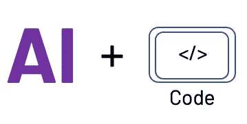
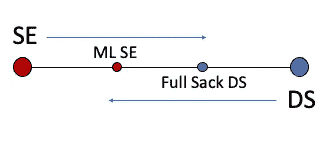

# 弥合人工智能和软件工程之间的鸿沟

> 原文：<https://towardsdatascience.com/bridging-the-gap-between-ai-and-software-engineering-386395e7ff1f?source=collection_archive---------24----------------------->

## 如何在您的数据科学家和软件工程师之间创造协同效应

AI @ DayTwo 旨在改善我们业务的各个方面。从血糖反应水平预测到个性化算法和微生物组分析，我们的人工智能应用涵盖许多领域和方面。为了最大化我们研究的影响，我们不会将研究集中在一个方向。相反，我们有大量的研究渠道，有多个人工智能问题，我们希望与业务团队、工程团队和公司外部的其他研究小组合作解决。这允许数据科学家和每个领域的业务或工程团队之间的紧密合作。此外，对于我们进行的任何研究，我们都会召集一个学习论坛，提供一个分享知识的地方，并提出我们在路上可能遇到的障碍。这些论坛也有助于确定和激励未来的研究方向。

作者图片

在实践中，大规模应用机器学习需要大量的基础设施和系统工程投资。今天，我们的主要挑战之一是缩小开发和培训 ML 模型的数据科学家与负责将这些模型引入我们的生产系统并使其可用的 ML 软件工程师之间的差距。我们一直在寻找新的方法来创建数据科学家和软件工程师之间的共享语言，并共同将我们的人工智能解决方案扩展到我们的主要产品中。

# 人工智能解决方案

在第二天，一旦一个主题已经被充分研究和建模，我们的数据科学团队就继续进入机器学习模型本身需要集成到我们的生产流程中的阶段。拥有一个机器学习模型或算法，可以解决我们的一个问题，这听起来很令人兴奋，并让我们对我们所取得的成就感到满意，毕竟，获得高准确率是每个数据科学家的梦想。但严峻的事实是，要将该解决方案部署到生产环境中，我们仍有许多工作要做，这些工作如果做得不恰当，可能会危及整个目标。此外，通常，这种工作需要数据科学团队中没有的知识，并且还必须有具有更广泛的系统工程概述能力的人参与。这就是为什么这两个团队之间的顺利合作如此重要，这甚至导致了新的行业职位名称命名为 *ML 软件工程师。*

照片由[莱昂](https://unsplash.com/@myleon?utm_source=unsplash&utm_medium=referral&utm_content=creditCopyText)在 [Unsplash](https://unsplash.com/s/photos/work-meeting?utm_source=unsplash&utm_medium=referral&utm_content=creditCopyText) 上拍摄

# 第二天的路

在第二天，我们非常依赖 AWS 服务，我们利用它们来满足我们的特定需求，我们从不害怕尝试新的服务，尤其是当它有可能对我们有用的时候。此外，我们还与 AWS 解决方案架构师密切合作，因为我们知道他们对自己的服务能力有着更深入的了解，当需要就某个解决方案集思广益时，他们是我们的咨询对象。

为了支持数据科学家和 ML 工程师之间顺畅、快速的协作，我们确保所有团队都熟悉相关的 AWS 服务，并能够编写适当的代码。例如，我们的一个推荐引擎涉及在用户流的某个点上对多个分类模型进行推理。为了支持这一点，我们使用 SageMaker MMS 端点基础设施，并确保我们将工作分开，以便我们的数据科学家在推理 docker 容器模块中编写代码，该模块调用实际的机器学习模型，而 ML 软件工程师编写端点包装器并将其集成到产品流中。此外，由于我们在多个开发环境中工作，我们开发了从代码无缝部署服务的能力，没有任何瓶颈，因此，我们确保所有团队成员都具备这方面的知识(使用 AWS CDK)。

在某些情况下，需要更复杂的算法(不仅仅是触发某种模型的推断)。在这些情况下，需要将额外的算法编程到流程中，我们要么由数据科学家将其编码到推理 docker 容器中，要么由 ML 软件工程师直接编码到产品流程代码中。在这种情况下，每种情况都要分别审查和决定。

作者图片

投资于教授我们的数据科学家技术，如 *Docker、Jenkins、REST APIs、Git、VS-Code remote work、CDK、Setuptools、Bash、*等，让他们能够自我驱动和独立，并推动他们成为全栈数据科学家。同样，向我们的软件工程师教授机器学习的基础知识，并让他们接触算法和人工智能管道，从长远来看，当团队之间真正的协作和协同作用出现时，会有回报。

# 收场白

将人工智能解决方案集成到产品中可能具有挑战性并且非常耗时。人们可能会认为大部分工作是在训练 ML 模型，而现实表明在软件工程方面也需要大量的时间。可能有助于缩小这些差距的主要要点是 **(1)** 确保您的数据科学和工程团队相互沟通。 **(2)** 确保你的数据科学团队会说软件工程的语言(反之亦然)——投资将你的一些软件工程师变成 ML SE，将你的一些数据科学家变成全栈数据科学家。 **(3)** 在你的产品中集成一个新的 AI 解决方案时，不要低估工程工作。 **(4)** 在团队之间的协作中投入资源，并经常回顾以供下次改进。

如果你想了解更多关于我们正在开发的最新最棒的产品，请随时联系我。

[亚龙](https://www.linkedin.com/in/yaronv/)