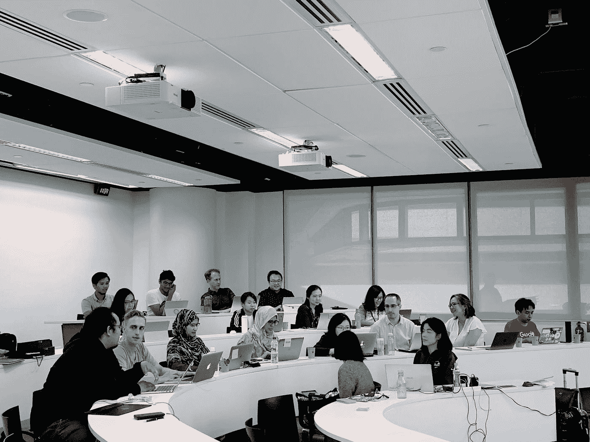

# 带回亲自参加的数据科学训练营

> 原文：<https://towardsdatascience.com/bring-back-the-in-person-data-science-bootcamp-67cc9dbb6675?source=collection_archive---------22----------------------->

照片由 [CX 洞察](https://unsplash.com/@cxinsight?utm_source=medium&utm_medium=referral)在 [Unsplash](https://unsplash.com?utm_source=medium&utm_medium=referral) 上拍摄

## 意见

## 这太有趣了

现在我们终于可以在疫情隧道的另一边看到光明，我对 [METIS](https://medium.com/u/d18bcb7f0383?source=post_page-----67cc9dbb6675--------------------------------) 和[镀锌](https://medium.com/u/d7ca6dca098f?source=post_page-----67cc9dbb6675--------------------------------)有一个请求。

> 请带回来亲自参加数据科学训练营。

我知道去偏远地区是你去年唯一的选择。但当你们都永远远离我时，我感到震惊和难过。

我是梅蒂斯大学的毕业生——我喜欢这种经历。我的一些最好的朋友是我的训练营同学，我从这次经历中获益良多。我会去一个完全偏远的训练营吗？没门，我不会为日复一日的缩放课程付 17000 美元。

我肯定不止我一个人有变焦疲劳。经过一年多的 Zoom 会议和 Zoom pair 编码，上周我第一次在办公室见到了我的团队。太棒了！我们有一个正常的会议，我们用白板，我们在外面吃午餐。如果我想问问题，我就转身问。面对面的感觉总是比变焦好，但经过 15 个月的强制变焦，面对面的感觉甚至比正常情况下更好。

# 训练营

全日制训练营是一大进步。你需要辞掉工作，拿出一大笔钱，至少花几个月时间在训练营结束后找工作，因为很多雇主会对你的训练营教育持怀疑态度。最重要的是，数据科学家的供需状况不像几年前那么好了——通常，当一个工作很热门(且薪酬很高)时，供应(数据科学家)的增长速度比需求快得多。

这是一个很大的风险，但对许多人来说，这也是转向数据职业的唯一途径(离开工作岗位两年去获得硕士学位实在是太长了)。训练营有责任让他们的学生全力以赴，提供尽可能多的价值。其中一部分就是给他们一个空间，让他们可以一起学习，一起编程，一起玩耍，一起交流。

我从训练营经历中得到的最大收获是我的同伴。它们让学习变得更有趣，让我的项目更有趣，让找工作的压力更小，并成为我的社交网络和职业网络的一部分。你可以试着让它超过 Zoom，但你就是无法复制社交体验。在我看来，一场酣畅淋漓的乒乓球赛胜过我们之间的十几场比赛，而且这还远远不够。

所以[梅蒂斯](https://medium.com/u/d18bcb7f0383?source=post_page-----67cc9dbb6675--------------------------------)、[激励](https://medium.com/u/d7ca6dca098f?source=post_page-----67cc9dbb6675--------------------------------)和其他训练营，不要把疫情作为增加利润的借口。你的学生对你做出了很大的承诺，所以你应该尽你所能给他们最好的体验。