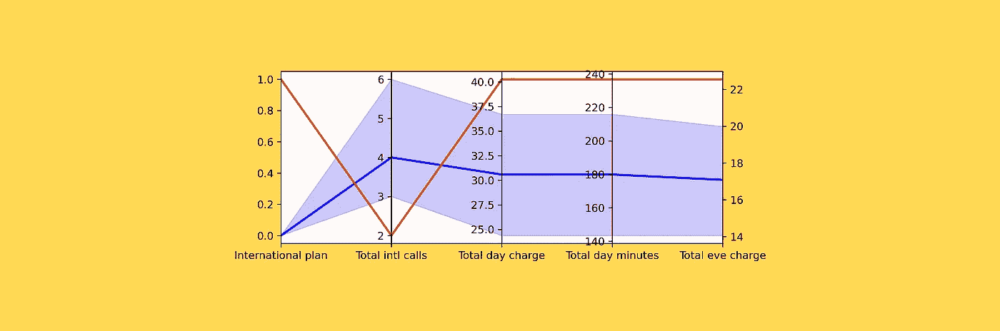
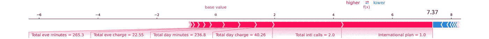
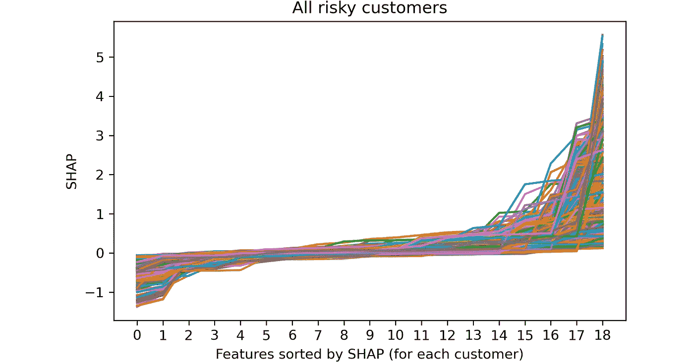
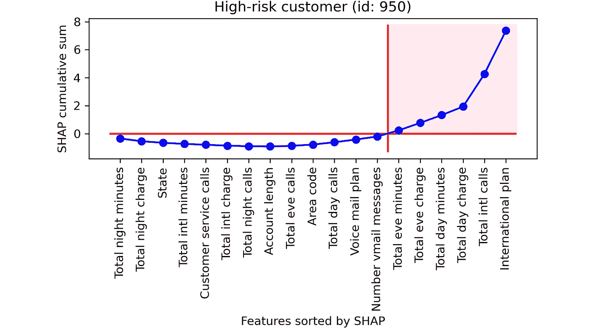
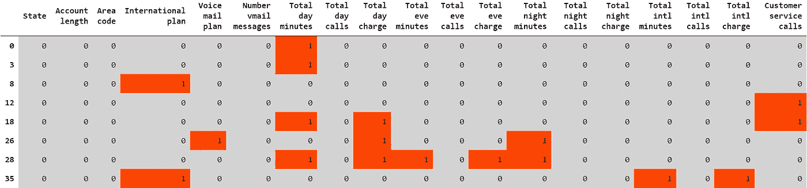
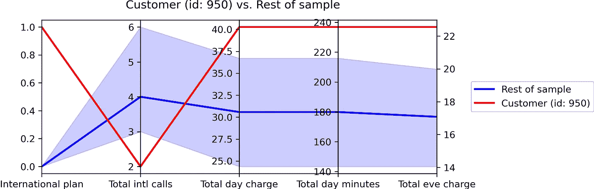
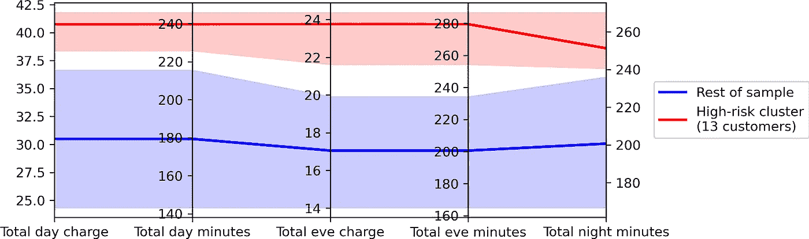
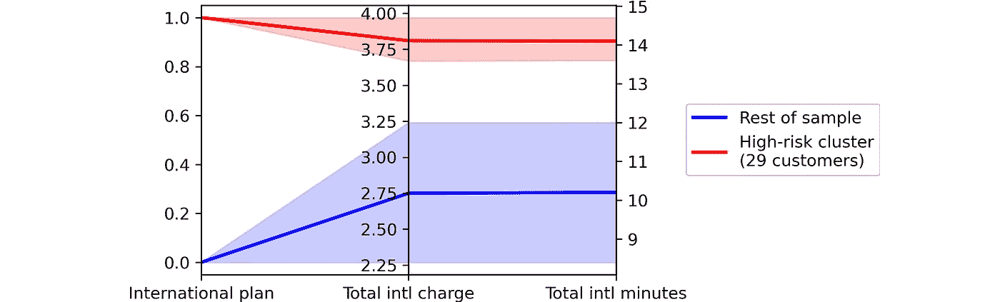

# 通过找到“几个重要原因”,将可解释的人工智能带到下一个层次

> 原文：<https://towardsdatascience.com/bring-explainable-ai-to-the-next-level-by-finding-the-few-vital-causes-4838d46857de?source=collection_archive---------24----------------------->

## 一个有效的可解释人工智能应该旨在发现“重要的少数”原因，而不是“琐碎的许多”事件。下面是如何用 Python 实现的。



[作者图]

**可解释 AI** (缩写为 **XAI** )是解释机器学习模型所做选择的**能力。在现实世界中，XAI 通常是机器学习应用程序成功的关键。**

例如，以预测客户流失这样的经典任务为例。当然，模型精度是根本。但是，一旦你知道哪些客户更有可能离开公司，关键问题是:“**我们如何让他们改变主意**”？为了帮助回答这个问题，我们需要知道**为什么模型认为他们有风险**。换句话说，我们需要确定客户流失的原因(老实说，我认为“症状”这个词比“原因”更合适，但在这里我会互换使用它们)。

最重要的概念是**任何个体(或一群个体)都有自己的原因**。这些原因可能(经常)不同于其他人的。在这篇文章中——给定一个机器学习模型——我们将看到如何为每个个体(或群体)找到(并可视化)最重要的原因。正如约瑟夫·巨然所说，我们将关注“至关重要的少数”而不是“微不足道的许多”症状。

虽然这篇文章是基于一个特定的用例(客户流失)，但下面的内容可以应用于任何机器学习任务。所有的分析都将基于 Kaggle 上的 Orange Telecom 数据集。你可以在 [Github](https://github.com/smazzanti/few_vital_causes/blob/main/few_vital_causes.ipynb) 中找到包含所有代码的 Python 笔记本。

# 不令人满意的结果

当谈到可解释的人工智能时，你可以肯定有人会说出这样的情节:



图一。Python 中 SHAP 库的 Force plot。[作者图]

这被称为“力图”，很容易通过 Python 的 [SHAP 库获得。总的来说，我认为这个情节是次优的。](https://github.com/slundberg/shap)

> 数据可视化的第一条戒律:人类的注意力非常有限。

「原力情节」有什么问题？它包含的信息太多了！事实上，

*   它显示 SHAP 值和观察值。有效的 XAI 应该只基于后者，因为 **SHAP 值对人类来说是不可理解的**；
*   它显示了所有的特征。**有效的 XAI 应该能够只选择少数与单个(或一组)客户相关的特性**；
*   它既显示了对客户流失概率产生积极影响的特征(红色)，也显示了产生消极影响的特征(蓝色)。有效的 XAI 应该只关注客户流失的原因，因为我们对客户流失感兴趣。**包括降低流失概率的因素令人困惑**；
*   它显示观察值，但不提供上下文。**有效的 XAI 应该基于上下文**。例如，图中显示该客户拨打了 2 个国际电话，但是**并没有解释为什么这是相关的**。换句话说:2 个国际电话太多了吗？还是太少？

# 找到“至关重要的少数”

在 XAI，我们离不开 SHAP 价值观(*在本文中，我们将把 SHAP 视为魔法，但如果你想知道它是如何在引擎盖下运作的，我已经写了一篇文章详细解释了这一点:* [SHAP 解释了](/shap-explained-the-way-i-wish-someone-explained-it-to-me-ab81cc69ef30))。

例如，假设我们有一个适合某些数据的模型:
`**model_fitted = model.fit(X, y)**`。

SHAP 有两个输入:拟合模型和预测矩阵。
`**shap_values = get_shap(model_fitted, X)**`。

最需要理解的是，**SHAP 的输出是一个与** `**X**`形状相同的矩阵。换句话说:


现在，我们来看看 ID 为 950 的客户的输入数据。`**X.loc[950, :]**`:


图二。原始功能(客户 id: 950)。[作者图]

相应的 SHAP 值存储在这里，`**shap_values.loc[950, :]**`:


图 3。SHAP 值(客户 id: 950)。[作者图]

当 SHAP 值为正数(粉红色)时，意味着相应的功能提高了该客户流失的可能性。SHAP 为负时相反(蓝色)。例如，“国际计划”有助于提高该客户的流失率，而“总夜间分钟数”会降低流失率。

“力图”(见图 1。)显示所有这些数字(19 个原始特征和 19 个 SHAP 值)，每个彩色条的长度与 SHAP 值的大小成比例。

但是，如前所述，我们只想关注最重要的症状，即“重要的少数”。第一步是看看 SHAP 值是如何产生的:


图 4。SHAP 值(客户 id: 950)。[作者图]

这些特征已经通过增加 SHAP 进行了分类，因此主要症状在右边。**我们可以只保留从右边开始的 4 或 5 个特征，而不是显示所有 19 个特征，从而获得更有效的可视化效果**。事实上，有了“国际计划”、“国际通话总量”、“全天费用”以及更多，我们已经考虑了最大部分的风险因素。

好吧，但也许，在这种情况下，我们只是运气好。也许，对于其他顾客来说，有很多原因，而不仅仅是几个。因此，让我们为所有有风险的客户复制上面的情节。



图 5。每个客户的 SHAP 值按升序排序。[作者图]

> (注意，这一次，我们不能在 x 轴上标注特性名称，因为每个客户的排序顺序可能不同)。

**我们在一个客户身上看到的似乎适用于所有客户:几乎所有的风险都是由少数几个功能造成的**。

实际上，这是一种“普遍”行为:它不仅发生在这个数据集或这个应用程序中。**一个结果的绝大部分是由极少数原因造成的这一观点在自然界几乎随处可见，被称为** [**帕累托原理**](https://en.wikipedia.org/wiki/Pareto_principle) 。

> 这个概念非常强大，因为不管你有多少特性，它都是有效的。

# 但是“少”是多少呢？

让我们回到我们的客户。我们已经决定只保留具有最高正 SHAP 值的要素。但是，确切地说，他们有多少人？我们希望找到**一个可以大规模应用的规则**，而不需要我们为每一个客户做出决定。

当然，没有固定的规则。但是这里有一个在实践中很有效的方法。首先，我们需要按升序对 SHAP 值进行排序。下一步是计算累积和。让我们看看结果:



图 6。SHAP 值，累积和(客户 id: 950)。[作者图]

仔细想想，最终位于 y 轴正侧的特征(在**粉色背景**上)实际上是“触发”客户从无风险(SHAP 总和≤ 0)到有风险(SHAP 总和> 0)的特征。**我们希望专注于这些功能，而忽略其他功能**。

这可以用几行 Python 代码来完成:

```
**shap_sorted = shap_values.loc[950, :].sort_values()
main_causes = shap_sorted[shap_sorted.cumsum() > 0].index**
```

既然我们已经找到了“关键的几个原因”，最重要的部分是理解**为什么它们会导致流失风险增加**。

# “治标，治本。”— **迈克尔·克莱顿**

如果我们对所有有风险的客户重复上述过程，我们将得到如下表格:



图 7。主要症状选择表。[作者图]

表中的每个元素都是一个布尔值，表示该功能是否是该客户的相关症状。

> **一旦我们获得了这张表，我们就可以彻底摆脱 SHAP 价值观了！**

重点是: **SHAP 价值观非常有用，但没有实际(或商业)意义**。在确定主要原因时，我们不能没有它们。但是，一旦我们这样做了，就没有理由把它们带在身边。

从 XAI 的角度来看，最重要的部分还没有到来。的确，仅仅指出相关症状是不够的。真正与众不同的是能够解释**为什么这些功能会让客户面临风险**。

一种有效的方法是通过基于主要原因的**平行图将客户与样本的其余部分进行比较**。



图 8。主要原因的平行图(客户 id: 950)。[作者图]

红线代表客户。蓝线是参考人群(即样本)的中值，而蓝带的上下边界分别是人群的第 25 和第 75 百分位。

> 任何说商业语言的人都能理解这个情节。

事实上，它并不涉及诸如 SHAP 价值观之类的复杂概念。此外，它一目了然地显示了“正常”人口是如何构成的，以及该客户相对于样本中的其他客户有多极端。

在这种情况下，我们立即注意到这个家伙持有“国际计划”，而至少 75%的客户没有。尽管如此，他拨打的国际电话(总国际电话数= 2)还是少于大多数客户(事实上，至少 25%的客户至少拨打了 3 次国际电话)。此外，这个人比大多数人支付更多的费用(总日费、总夜费)，也打更多的电话(总日分钟数)。

在这一点上，很容易理解为什么这个客户有流失的风险:这个人实际上是在为他没有使用的东西(一个国际计划)付费，并且他比客户群中的其他人付费更多。从图 1 中不可能注意到这一点。

# 从单一客户到群体

我们已经为客户 n. 950 建立了一个地块。但在大多数实际情况下，不可能一一列举。想象一下，有成百上千的高风险客户。在这种情况下，更有效的方法是建立**症状相似的客户群**并将它们放在一起。

让我们看几个例子:



图 9。主要原因的平行图(一组客户)。[作者图]



图 10。主要原因的平行图(一组客户)。[作者图]

在这种情况下，我们比较了两种分布:

*   红色表示有相同症状的一群顾客。实线代表中间值，而范围在第 25 和第 75 百分位之间；
*   蓝色代表样本的其余部分。

这些图表使我们的方法具有可扩展性。事实上，一旦获得了同类集群，就很容易用更适合任何给定组的“处理方法”来处理每个集群。

你可以在[这个 Github 笔记本](https://github.com/smazzanti/few_vital_causes/blob/main/few_vital_causes.ipynb)里找到帖子的所有代码。

感谢您的阅读！我希望这篇文章对你有用。

我感谢反馈和建设性的批评。如果你想谈论这篇文章或其他相关话题，你可以发短信到[我的 Linkedin 联系人](https://www.linkedin.com/in/samuelemazzanti/)。