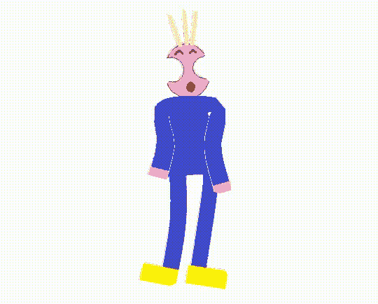
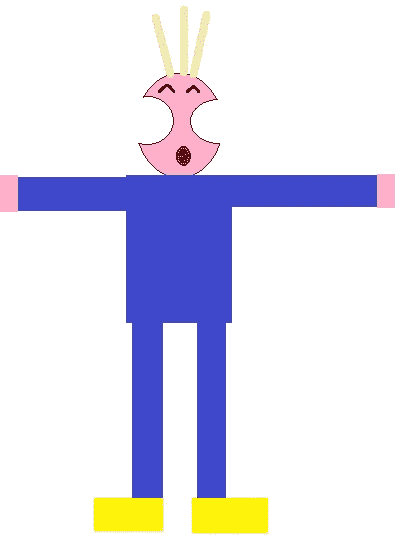
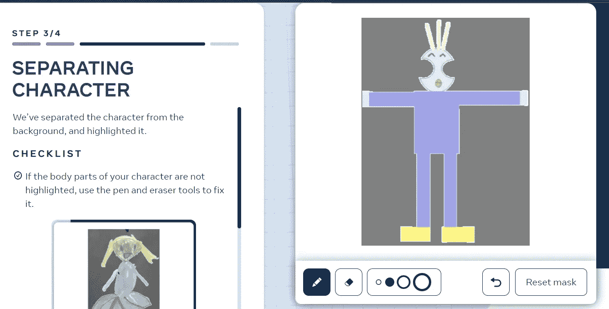
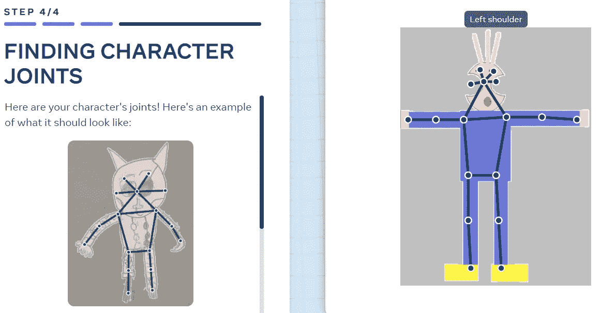
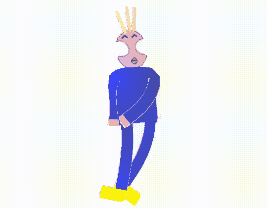
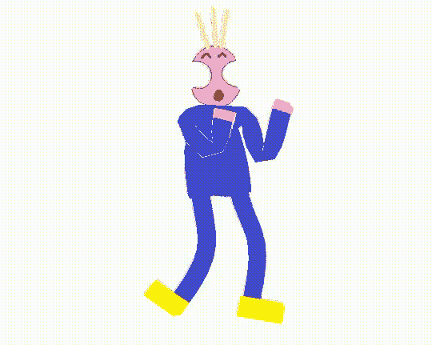

# 在几秒钟内将你童年的图画变成现实 Meta 创造性人工智能的演示

> 原文：<https://towardsdatascience.com/bring-your-childhood-drawings-to-life-within-seconds-a-demo-of-metas-creative-ai-1e8695d9f3b6?source=collection_archive---------4----------------------->

## 创造性人工智能正在兴起。在几秒钟内，Meta Demo Lab 的这款全新工具将静态绘图转换为生动的卡通版本。

从图画中创造一个动画角色从未如此简单。[作者 GIF，使用 [Meta 演示实验室](https://sketch.metademolab.com/canvas)创建]

随着假期的临近，是时候用 AI 来点轻松的娱乐了。作为一个孩子，你可能会幻想你的画变成现实——移动、跳舞、奔跑……感谢 Meta AI 研究，这不再需要保持幻想！

在**元演示实验室**，只需几秒钟就能把一幅画变成一个成熟的动画角色。诉讼程序极其简单；这简直是儿戏。我们去看看吧！

## 画点什么

嗯……不需要言语。画一幅人体解剖图就可以了。理想情况下，它在白色背景上，没有阴影或其他物体。

我的静态图。我希望我能说它源于我的童年，但遗憾的是我今天才画的。

## 创建一个遮罩

上传后，程序会自动创建一个遮罩，覆盖你所画角色的体表。这个演示很好地将人物从背景中分离出来。如果它没有完全捕捉到所有内容，标记和橡皮擦允许手动纠正遮罩。

为你的角色创建一个面具[截图来自[元演示实验室](https://sketch.metademolab.com/canvas)

## 重新调整分数

创建遮罩后，是时候设置关节(脚踝，手腕，膝盖，臀部，肩膀，肘部，手腕，耳朵，眼睛，头部中心)以确保逼真的动画。

在这种情况下，除了眼睛和(明显的)耳朵，一切都非常准确。同样，一个简单的拖放就可以修复它。你可以故意弄乱关节，看看会发生什么，但我们在这里适当地做一下。

设置角色关节【截图来自[元演示实验室](https://sketch.metademolab.com/canvas)

## 还有…跳舞！

整个过程几乎在几秒钟内完成。之后就是挑选自己喜欢的动画，渲染，就大功告成了！

[作者 GIF，使用 [Meta 演示实验室](https://sketch.metademolab.com/canvas)创建]

该动画可以作为一个简单的 MP4 下载——本文中转换为 GIF 格式降低了质量。

## 或者……盒子！

[作者 GIF，使用 [Meta 演示实验室](https://sketch.metademolab.com/canvas)创建]

## 或者…跳过！

[作者 GIF，使用 [Meta 演示实验室](https://sketch.metademolab.com/canvas)创建]

嗯，你明白了。目前有 32 部动画可供选择。

## 人工智能在哪里？

好吧，酷，但是人工智能在哪里？如果他们不从你的上传中学习，Meta 就不是 Meta 了。在开始上传时，他们会请求将您(孩子)的绘画存储在一个公共数据库中，该数据库随后将用于进一步培训和开发该工具。与任何机器学习算法一样，手头的高质量数据越多，我们未来可以预期的结果就越好。

尽管从表面上看这是一个噱头，但就此放弃创造性人工智能将是一个错误。人工智能正在以越来越快的速度产生新的内容。事实上，Gartner 将生殖人工智能确定为 2022 年的顶级技术趋势之一:

> 进入市场的最可见、最强大的人工智能技术之一是生成式人工智能——从数据中学习内容或对象的机器学习方法，并使用它来生成全新的、完全原创的、真实的人工智能。— Gartner

Gartner 预测，正在创建的*所有*数据的百分比将从 2021 年的不到 1%飙升至 2025 年的 10%。原因显而易见。把我们自己限制在内容创作上，在创作音乐、动画、艺术和——对我们来说很不幸——写作方面有大量的机会。

我们还没有到人类创造力过时的地步。现在，只需快速参观一下 Meta Demo Lab，就能在假期中神奇地将您孩子的杰作带回来！

[作者 GIF，使用[元演示实验室](https://sketch.metademolab.com/canvas)创建]

  <https://www.gartner.com/en/newsroom/press-releases/2021-10-18-gartner-identifies-the-top-strategic-technology-trends-for-2022>  <https://developer.ibm.com/blogs/what-is-generative-ai-and-how-much-power-does-it-have/> 