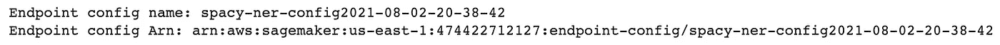

# 使用亚马逊 SageMaker 自带容器

> 原文：<https://towardsdatascience.com/bring-your-own-container-with-amazon-sagemaker-37211d8412f4?source=collection_archive---------5----------------------->

## SageMaker 中最灵活的实时推理选项

图片来自[斯蒂芬·菲利普斯](https://unsplash.com/@hostreviews)拍摄的 [Unsplash](https://unsplash.com/photos/2kH-6T6x_0I)

过去我曾谈论过如何在[亚马逊 SageMaker](/training-and-deploying-custom-tensorflow-models-with-aws-sagemaker-72027722ad76) 上训练一个定制的 TensorFlow 模型。这很容易，因为 SageMaker 为流行的框架管理[容器](https://docs.aws.amazon.com/sagemaker/latest/dg/pre-built-containers-frameworks-deep-learning.html)，比如 TensorFlow、PyTorch、HuggingFace 等等。这允许开发人员使用这些提供的容器，并专注于以一种称为[脚本模式](https://aws.amazon.com/blogs/machine-learning/bring-your-own-model-with-amazon-sagemaker-script-mode/)的方法提供用于训练和/或推断的脚本。

现在，假设 SageMaker 现有的深度学习容器不支持您正在使用的框架。这是一个真正的可能性，因为有许多现有的 ML 框架将在未来的每一周推出。SageMaker 提供了一个名为[自带容器](https://sagemaker-workshop.com/custom/containers.html) (BYOC)的功能，作为开发者，你可以完全控制这个容器。在本文中，我们将通过一个示例，将一个[预训练的](https://spacy.io/)空间 NER 模型引入 SageMaker，并通过部署过程创建一个用于推理的[实时端点](https://docs.aws.amazon.com/sagemaker/latest/dg/realtime-endpoints.html)。如果您想直接跳到代码，请查看这个[库](https://github.com/RamVegiraju/SageMaker-Deployment/tree/master/RealTime/BYOC/PreTrained-Examples/SpacyNER)的源代码和其他与推理相关的 SageMaker 示例。

**注意:**对于刚接触 AWS 的人来说，如果你想继续学习，请确保在下面的 [**链接**](https://aws.amazon.com/console/) 中注册账户。部署过程中会产生成本，尤其是如果您让端点保持运行。本文还将假设您对 SageMaker 和 AWS 有一定的了解。

# 目录

1.  容器设置
2.  构建 Docker 映像并将其推送到 ECR
3.  创建模型
4.  创建端点配置
5.  创建端点
6.  推理
7.  结论和附加资源

## 1.容器设置

在我们开始之前，请确保[创建一个笔记本实例](https://docs.aws.amazon.com/sagemaker/latest/dg/howitworks-create-ws.html)并在 SageMaker 上运行。一旦您打开了 SageMaker JupyterLab 设置，您的目录应该如下所示。创建一个笔记本(Python3 内核),然后创建一个包含 docker 文件和推理/服务文件设置的目录。

总体结构(作者截图)

服务/预测代码的 docker 文件和目录(作者截图)

您的 Docker 文件将指向您的 NER 目录，其中包含您的代码来编排 SageMaker 上的模型服务以及 Docker 将安装的内容。在这个 NER 目录中，有四个文件有助于这个设置。

NER 目录(作者截图)

*   [**nginx.conf**](https://github.com/RamVegiraju/SageMaker-Deployment/blob/master/RealTime/BYOC/PreTrained-Examples/SpacyNER/container/NER/nginx.conf) :配置设置 nginx 前端。你**可以直接复制这个文件，因为对于大多数 BYOC 例子来说它是**。
*   [**serve**](https://github.com/RamVegiraju/SageMaker-Deployment/blob/master/RealTime/BYOC/PreTrained-Examples/SpacyNER/container/NER/serve) :这个程序在后台启动一个 gunicorn 服务器，它是在容器启动托管时启动的，你**也可以把这个文件保持原样**。注意，通常情况下，如果你是负责培训和主持的 BYOC 人，你也会有一个“培训”文件。关于这个例子，请查看这个[代码](https://github.com/RamVegiraju/SageMaker-Deployment/tree/master/RealTime/BYOC/Sklearn/Sklearn-Regressor)。
*   [**predictor.py**](https://github.com/RamVegiraju/SageMaker-Deployment/blob/master/RealTime/BYOC/PreTrained-Examples/SpacyNER/container/NER/predictor.py) :这个程序实现了一个 Flask web 服务器，在 **/ping** 和 **/invocations** 中有两条路径是至关重要的。Ping 接收 GET 请求，如果您的容器是健康的，则返回 200。调用是您可以对正在使用的模型使用推理逻辑的地方，它将从您的模型返回预测。
*   [**wsgi.py**](https://github.com/RamVegiraju/SageMaker-Deployment/blob/master/RealTime/BYOC/PreTrained-Examples/SpacyNER/container/NER/wsgi.py) :是你的 predictor.py 文件的包装器，不需要修改，除非你用另一个文件名命名 predictor.py。

我们要查看的文件是 predictor.py，因为配置的其余部分不需要修改或编辑。

负载空间模型

在这里，我们可以加载我们的空间模型进行推理。接下来，正如我们所讨论的，我们正在处理两个 URL。我们可以使用 **ping** 路径对我们的容器执行**健康检查**。

健康检查

现在我们可以专注于**调用**路径中的**推理逻辑**。

空间推理

这里我们期待一个 JSON 输入，所以我们将在给端点提供信息时在客户端进行配置。我们的容器现在已经设置好了，我们现在需要创建一个 **Dockerfile** ，它指向并**执行**这些**文件**并且**安装**我们的**模型依赖**。

空间安装的 docker 文件

在这里，我们安装 Spacy 并将我们的代码指向 SageMaker [/opt/program](https://docs.aws.amazon.com/sagemaker/latest/dg/amazon-sagemaker-toolkits.html) 目录，该目录是 SageMaker 在为模型提供服务时创建的。

现在，我们可以进入笔记本，专注于将此图像推送到 ECR，SageMaker 可以在那里检索并使用此图像进行推理。

## 2.构建 Docker 映像并将其推送到 ECR

**SageMaker Classic 笔记本**带有对 **Docker** 的**支持**，因此我们也可以在实例上的终端中进行本地测试。在进入创建端点的步骤之前，我们需要构建 Docker 映像并将其推送到 ECR，SageMaker 在 ECR 中存储和检索所有用于训练和推理的映像。以下 shell 命令可以在笔记本中运行，无需任何重大更改。

将 Docker 图像推送到 ECR

在这里，我们使 serve 文件可执行，用我们的算法名命名我们的 ECR 存储库，并基于我们的容器结构和 Docker 文件构建 Docker 映像。这需要一点时间，但是你应该能够在最后看到一个成功的映像，以及一个用你的映像创建的 ECR 存储库。

图片被推送到 ECR(作者截图)

## 3.创建模型

现在，我们可以专注于使用 SageMaker 构建实时端点。对于实时端点创建，传统上要遵循三个步骤:模型创建、端点配置创建和端点创建。我们可以通过使用 [SageMaker Boto3 客户端](https://boto3.amazonaws.com/v1/documentation/api/latest/index.html)来编排这些步骤。

客户端设置

注意这里有两个客户端: [sm_client](https://boto3.amazonaws.com/v1/documentation/api/latest/reference/services/sagemaker.html#SageMaker.Client.create_model) 用于模型、端点配置和端点创建。[运行时客户端](https://boto3.amazonaws.com/v1/documentation/api/latest/reference/services/sagemaker-runtime.html#SageMakerRuntime.Client.invoke_endpoint)用于推断和调用端点。

现在的第一步是[模型创建](https://boto3.amazonaws.com/v1/documentation/api/latest/reference/services/sagemaker.html#SageMaker.Client.create_model)，这里我们需要**指向我们推送的 ECR 图像**，以便 SageMaker 可以创建我们的模型。我们通过提供我们的算法名称和 account_id 作为容器位置的变量来实现这一点，您也可以从 ECR 中手动抓取图像 URI，尽管不建议这样做。

模型创建

在这里，我们还指定了我们正在使用的实例类型，因此请确保查看 [SageMaker 实例](https://aws.amazon.com/sagemaker/pricing/)以了解什么适合您的用例及价格。您应该看到单元返回您创建的模型，我们将在端点配置创建的下一步中使用它。

模型已创建(作者截图)

## 4.创建端点配置

我们现在可以使用我们的模型名，并简单地将其作为我们的[端点配置](https://boto3.amazonaws.com/v1/documentation/api/latest/reference/services/sagemaker.html#SageMaker.Client.create_endpoint_config)的输入，这将为我们正在创建的端点类型提供必要的细节。

端点配置

端点配置创建(作者截图)

## 5.创建端点

现在，我们可以使用端点配置来创建端点，我们将用它来进行另一个简单的 Boto3 调用。

端点创建

这应该需要几分钟的时间来执行，但是如果您看到一个成功的消息，我们现在可以看到一些示例推理了。

端点已创建(作者截图)

## 6.推理

现在我们可以调用端点了。我们需要记住，我们在 predictor.py 文件中输入了一个样本输入 json，因此我们在调用之前正确地配置和序列化了输入。

示例调用

现在我们可以看到一些来自我们端点的 NER 结果样本。

作者截图

如果您不想让您的端点启动并运行，请确保运行下面的 [Boto3 调用](https://boto3.amazonaws.com/v1/documentation/api/latest/reference/services/sagemaker.html#SageMaker.Client.delete_endpoint)来删除您的端点，以免产生成本。

删除端点

## 7.结论和附加资源

<https://github.com/RamVegiraju/SageMaker-Deployment/tree/master/RealTime/BYOC/PreTrained-Examples/SpacyNER>  

要访问示例的**完整代码**，请查看上方的**链接，还有大量其他 SageMaker 推理示例和资源。BYOC 一开始可能会令人生畏，但是它提供了难以置信的灵活性来配置和调整 SageMaker 以与您的框架一起工作。在一天结束时，通过改变当前设置中的几个文件，您可以使用您正在使用的任何模型和框架进行大规模的推理。**

要了解使用什么 SageMaker 推理选项，请查看这篇文章。要了解如何使用现有的 SageMaker 图像，请查看这篇文章。

*如果你喜欢这篇文章，请在*[*LinkedIn*](https://www.linkedin.com/in/ram-vegiraju-81272b162/)*上与我联系，并订阅我的媒体* [*简讯*](https://ram-vegiraju.medium.com/subscribe) *。如果你是新手，使用我的* [*会员推荐*](https://ram-vegiraju.medium.com/membership) *报名。*