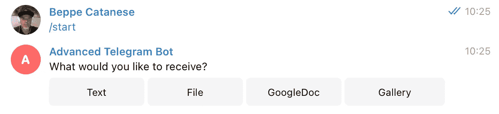
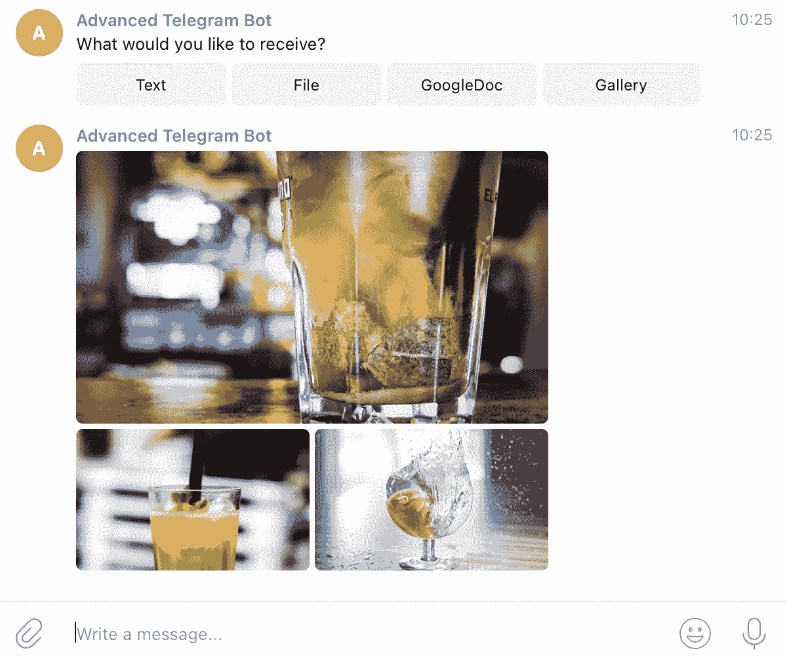

# 让你的电报聊天机器人更上一层楼

> 原文：<https://towardsdatascience.com/bring-your-telegram-chatbot-to-the-next-level-c771ec7d31e4?source=collection_archive---------3----------------------->

## 发现可以改变现状的高级功能

Telegram 是一个流行的开发聊天机器人的平台:优秀的文档，活跃的社区，各种各样的库和大量的例子。

如果你是刚入门的话，这里有很多教程，尤其是关于 T2 媒体的。并且 [Stackoverflow](https://stackoverflow.com/questions/tagged/telegram-bot) 也是一个很好的回答问题和理解问题的资源(你的作者经常被发现在那里试图帮助其他开发者🤓).

相反，本文关注于与使用 [Python 电报机器人](https://python-telegram-bot.readthedocs.io/en/stable/)实现电报机器人相关的**更高级的方面:**

*   Pull vs Webhook
*   获取聊天 ID
*   显示“正在输入…”并建议答案
*   深层链接
*   发送媒体和文件


Christian Wiediger 在 [Unsplash](/s/photos/telegram?utm_source=unsplash&utm_medium=referral&utm_content=creditCopyText) 上拍摄的照片

# 本地工作的轮询模式

电报机器人可以通过**拉**或**推**机制工作(参见更多网页挂钩)。“拉”机制是 bot(您的代码)定期检查服务器上新的可用消息的地方。

每个人都同意这不是一个理想的方法(不必要的资源浪费，消息在 24 小时后被丢弃)，但是在本地开发时它是方便的。(不需要 ngrok 之类的隧道软件)。

```
**def** main():
    updater = Updater('myTelegramToken')

    dp = updater.dispatcher *# define command handler* dp.add_handler(CommandHandler(**"**help**"**, help_command_handler))
    *# define message handler* dp.add_handler(MessageHandler(Filters.text, main_handler)) updater.**start_polling**()
```

# 生产上的网络挂钩

一旦 bot 为部署做好准备，就该启用 Webhook 了:这样做 Telegram 会将更新推送到注册的 webhook 端点，只有当有新的消息传入时，您的服务才会变得繁忙。

```
updater.start_webhook(listen=**"0.0.0.0"**,
                      port=3978,
                      url_path='myTelegramToken')
updater.bot.setWebhook('https://example.com/svc/myTelegramToken')
```

**注意** : webhook 与无服务器架构或“按需”节点配合良好。我已经在 Heroku 自由层上部署了 Telegram webhooks，它会在 30 分钟不活动后进入睡眠状态，但如果推送新消息，Heroky Dyno 会启动，消息会在几秒钟内消耗掉。

**注 2** :根据 bot 部署的位置，需要配置端口号。例如，在 Heroku 上，端口通常由 port 环境变量定义，不应该硬编码。

**如何注册 webhook**

你可以调用一个`setWebhook` URL:使用你的私有令牌并传递 webhook 的 URL(必须是 HTTPS)。

```
[https://api.telegram.org/bot{](https://api.telegram.org/bot(mytoken)/setWebhook?url=https://mywebpagetorespondtobot/mymethod)myTelegramToken}/setWebhook?url=https://example.com/svc
```

**在拉和推模式之间切换**

我发现使用环境变量以编程方式在轮询和 webhook 之间切换非常方便:默认设置是`polling`在本地工作，但是，当部署在实时系统上时，它可以被覆盖(到`webhook`)。

```
# read MODE env variable, fall back to 'polling' when undefined
mode = os.environ.get(**"MODE"**, **"polling")****if** DefaultConfig.MODE == **'webhook'**:
  # enable webhook
  updater.start_webhook(listen=**"0.0.0.0"**,
                      port=3978,
                      url_path='myTelegramToken')
  updater.bot.setWebhook('https://example.com/svc/myTelegramToken')**else**:
    # enable polling
    updater.start_polling()
```

# 获取聊天 Id

回复收到的信息非常简单。

```
update.message.reply_text("Hi there!")
```

然而，有时我们希望能够在用户没有询问任何事情的情况下发起消息(例如，几天后的通知，以重新吸引我们的用户)。

检索(并保存)在用户发送的消息的 JSON 有效负载中找到的`chat_id`(是的，您至少需要一条消息)

```
{'update_id': 527095032, 
 'message': {
     'message_id': 412, 
     'date': 1615991013, 
     'chat': {
        'id': 931365322, 
        'type': 'private', 
        'username': 'gcatanese', 
        ....
```

当解析有效负载 Python 时，不要忘记不同的消息有稍微不同的 JSON。

```
**def** get_chat_id(update, context):
    chat_id = -1

    **if** update.message **is not None**:
        # text message
        chat_id = update.message.chat.id
    **elif** update.callback_query **is not None**:
        # callback message
        chat_id = update.callback_query.message.chat.id
    **elif** update.poll **is not None**:
        # answer in Poll
        chat_id = context.bot_data[update.poll.id]

    **return** chat_id
```

# 建议的行动

引导对话，为用户提供预定义的选项以供选择。这可以通过使用`InlineKeyboardMarkup`来实现，这是一个出现在信息旁边的键盘(像一个问题)。



作者图片

下面是创建选项的 Python 片段:

```
options = []
options.append(InlineKeyboardButton(text='Text', callback_data='1'))
options.append(InlineKeyboardButton(text='File', callback_data='2'))
options.append(InlineKeyboardButton(text='GoogleDoc', callback_data='3'))
options.append(InlineKeyboardButton(text='Gallery', callback_data='4'))reply_markup = InlineKeyboardMarkup([options])context.bot.send_message(chat_id=get_chat_id(update, context), text='What would you like to receive?', reply_markup=reply_markup)
```

重要的是要理解响应将由一个`CallbackQueryHandler`来处理，并且传入的 JSON 有效负载不同于纯文本消息。

```
# input from text message
text = update.message.text
# selection from callback
choice = update.callback_query.data
```

**注意**:一旦做出选择，选项就会从聊天中消失。

**注 2** :使用常数值定义`callback_data`，该常数值将用于决定要做什么。与按钮上的`text`不同，该值不应改变，因为它对用户不可见。

```
choice = update.callback_query.data**if** choice == **'1'**:
  # Choice 1: Text
  update.callback_query.message.edit_text('You have chosen Text')
```

# 显示“正在键入…”

显示输入指示器是聊天机器人的一个常见功能:用户被告知消息即将到达，即使有一点延迟。

```
context.bot.send_chat_action(chat_id=get_chat_id(update, context), action=telegram.ChatAction.TYPING, timeout=1)
time.sleep(1)
```

**注**:在显示打字指示器时，我通常会引入一个短暂的延迟，以营造一种真实对话的感觉。

# 带有附加参数的深度链接

深度链接是一种允许打开与给定机器人对话的机制。这有助于在网站、电子邮件或社交媒体上分享机器人的链接。

定义深层链接时，可以添加一个附加参数:

```
[https://t.me/username_bot?start=signup](https://t.me/username_bot?start=signup)
```

该链接打开电报应用程序，提示与机器人进行对话。附加参数被传递给处理`/start`命令的`CommandHandler`。

```
**def** start_command_handler(update, context):
    param_value = context.args[0]
    update.message.reply_text(**'**Value is ' + param_value)
```

# 发送文件

聊天机器人可以通过不同的方式发送文件(如 pdf、Office)。

使用`send_document`和文件的完整 URL:

```
url='https://github.com/gc/TelegramBotDemo/raw/main/test.pdf'
context.bot.send_document(chat_id=get_chat_id(update, context), document=url)
```

**注意**:这种方法需要一个直接指向文件的 URL。

另一种方法是首先在本地下载文件，然后用同样的方法发送它`send_document`。

```
# fetch from Google Drive
url = 'https://drive.google.com/file/d/0BZ3dWQ2ZXVOdE1V/view'
r = requests.get(url, allow_redirects=True)
# save local copy
open(**'file.ppt', 'wb'**).write(r.content)# send file to user
context.bot.send_document(chat_id=get_chat_id(update, context), document=open(**'file.ppt'**, **'rb'**), filename="Presentation.pptx")
```

**注意**:当 URL 不直接指向一个文件时，这种方法通常是必要的，但它是一个按需输出内容的端点。

# 创建媒体集

一个很酷的功能是发送一组媒体，如照片，视频和音频。



作者图片

```
list = []# define list of files
list.append(InputMediaPhoto(media='https://../mintie.jpg', caption='Mint'))
list.append(InputMediaPhoto(media='https://../pinkie.png', caption='Pink'))
list.append(InputMediaPhoto(media='https://../orangie.png', caption='Orange'))

context.bot.send_media_group(chat_id=get_chat_id(update, context), media=list)
```

**注意**:机器人最多可以同时发送 10 个媒体文件。

**注 2** :每条消息在电报速率限制内计数(每秒 30 条消息)，因此您最多可以发送 3 条消息，每条消息包含 10 个媒体(总共 30 个)，但在这种情况下，您不能在同一事务中添加任何其他内容(甚至不能是一条简单的文本消息)。

# 结论

我希望这篇文章有助于理解一些更高级的场景，并发现可以让您的 Telegram 聊天机器人变得更特别的功能。我的建议是总是首先考虑用户在寻找什么(他们为什么要聊天？)然后以一种让他们的谈话没有摩擦、愉快的方式来设计:取得良好的平衡决定了你的聊天机器人的成功。

查看一下 Github repo ,在那里你可以获得上面显示的代码片段。

如有问题和建议，请在 Twitter[上找到我。](https://twitter.com/beppecatanese)

聊天愉快！