# 将人工智能引入下一代保险解决方案

> 原文：<https://towardsdatascience.com/bringing-ai-to-next-generation-insurance-solutions-1a75d8e81a33?source=collection_archive---------36----------------------->

## 财产保险应用中的卷积神经网络

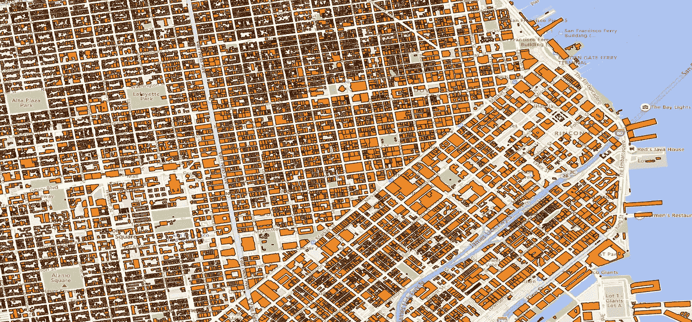

**建筑足迹——旧金山**(图片由作者提供)

从无人驾驶汽车到加密货币，科技正在颠覆我们生活的方方面面——包括我们工作、饮食和交流的方式。同样，企业正在整合技术和数字化业务流程，以推动增长并为客户创造价值。虽然技术改变了许多行业，但财产和意外伤害(P & C)行业采用技术的速度相对较慢。事实上，P & C 行业的成本结构并没有改善。在过去十年中，每份保单的管理成本增加了 30%以上。

为了解决不断增加的费用和[损失率](https://www.investopedia.com/terms/l/loss-ratio.asp)，像[河马保险](https://www.hippo.com/)和[柠檬水](https://www.lemonade.com/)这样的保险技术正在利用人工智能和自动化的力量来重新定义客户与他们的保险公司互动的方式。通过放弃传统的保险代理并创建在线分销渠道，这些保险技术公司能够最大限度地减少整个价值链中的客户接触点，从保险报价到绑定，一直到理赔。虽然大多数保险技术都专注于通过为最终用户提供快速无缝的在线体验来扰乱住宅房地产市场，但商业和工业保险市场的扰乱时机已经成熟。

> **下一个 insurtech 颠覆者将是一家能够规划商业和工业资产、构建分析以更好地进行风险选择和索赔管理，并扩展流程以覆盖中小型企业(SME)的公司。**为了简化在线分销渠道，在核保、定价和理赔之间建立分析驱动的反馈回路至关重要。在这种情况下，航空影像和照片可用于构建定制分析解决方案，以便为(再)保险公司提供更好的风险选择和管理。**考虑从航空图像中构建数据精炼厂和数据管道，这有助于在飓风或地震袭击后进行核保和事后分析。**

虽然有许多方法可以从空间影像中构建数据驱动的工作流，但在本文中，让我们探索一种从航空和街景数据中提取洞察力的强大方法。在本文中，让我们探索 C[on voluntive Neural Networks](https://en.wikipedia.org/wiki/Convolutional_neural_network)(CNN)如何帮助构建简单而强大的地理空间数据预测模型。来自这些预测模型的可操作见解有助于提高承保和理赔管理的风险选择决策树的质量。

# **卷积神经网络:**

卷积神经网络(CNN)是用于图像分析和分类问题的最常见的神经网络类型。与标准神经网络类似，卷积神经网络也有一个输入和一个输出层，以及多个隐藏层。对于细胞神经网络，隐含层包括一对运算— ***【卷积】*** 和 ***汇集*** 。CNN 架构的示意图如下所示，带有两对卷积和汇集操作。我们从输入图像开始，它通常是一个 3D 矩阵。然后，通过将 3D 阵列穿过一系列卷积层来转换图像。卷积和池层的最佳堆叠数量取决于图像中存在的更精细的模式。在每个卷积操作结束时，我们创建一个输入图层的特征地图。在达到预定数量的卷积层之后，我们将卷积后的 3D 输出展平为 1D 向量，然后将其馈送到标准的多层感知器神经网络模型。

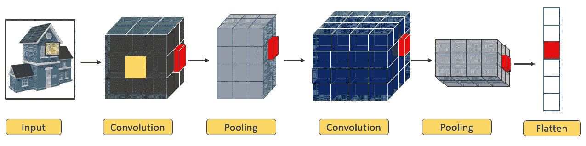

**卷积神经网络示意图**(图片由作者提供)

***卷积:*** 卷积层的作用是从图像中提取特征。图像通常由边缘、形状和对象等图案组成。由于这些模式是固定的，我们可以使用较小维度的滤波器/核来提取这些大规模图像特征。作为卷积层的一部分，我们预定义了选定数量的过滤器及其尺寸。过滤器可以被认为是一个小矩阵(例如 2×2 ),其值用随机数初始化。然后，我们通过在输入图像的每个 2x2 像素块上滑动 2x2 滤波器的中心来卷积滤波器和图像，然后将滤波器中的每个值乘以图像中的像素值，最后将这些乘积求和。卷积层的结果输出表示输入图像的特征图，其中提取了不同的模式。下图显示了 2D 图像阵列(4x4)、过滤器(2x2)和尺寸为 4x4 的输出要素图。

**卷积(输入图像 X 滤波器=特征图)**

***汇集:*** 卷积后就是汇集操作。汇集卷积特征图的目的是— (1)压缩信息&减少数据的维度，(2)改善计算时间，以及(3)控制过拟合。有两种常见的池功能:a)最大池和 b)平均池。“最大池”函数返回过滤器覆盖的卷积数组的最大值，“平均池”返回过滤器覆盖的卷积数组的平均值。下图显示了池大小为 2x2、步幅为 2 的最大池示例。在这里，我们将尺寸从 4x4 减少到 2x2。汇集的值表示原始图像中最活跃的像素(例如，边缘、图案)。

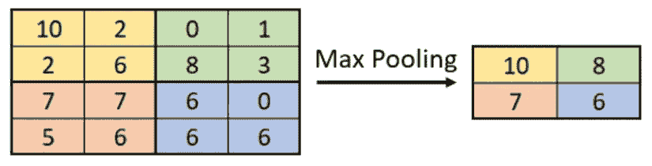

**Max Pooling[Pool Size = 2 x2&Stride = 2]**(图片由作者提供)

现在我们已经介绍了卷积神经网络的基本构建模块，让我们看看如何使用 TensorFlow Keras API 轻松实现卷积层。下面的代码片段显示了卷积层的一般实现。对于这个实现，我们选择默认的过滤器数量为 64，内核/过滤器大小为 3x3。我们还使用了最大池，池大小为 3x3，跨度设置为 1 个像素。[整流线性](https://en.wikipedia.org/wiki/Rectifier_(neural_networks)) (ReLU)是本实施方案的激活功能选择。

**卷积层—卷积和池化操作的 Keras 实现**

我们可以很容易地堆叠这些卷积层，以创建一个所需深度的 CNN 模型，如下面的代码片段所示。例如，我们首先用输入图像实例化一个 Keras 张量，然后将一个层的输出作为输入依次传递到下一个卷积层。最后，我们将 3D 特征图展平成 1D 特征向量，然后将它们馈送到标准前馈网络，该网络具有表示我们试图解决的分类问题中的标签数量的多个端节点。

**整合—卷积神经网络**

# 应用:

我们已经看到在 Keras 中实现一个基本的 CNN 是多么容易。现在，让我们将 CNN 模型应用于三个不同的数据集，并评估其从空间图像中推断信息/模式的有效性。前两个数据集涉及从航空影像中识别土地利用类别，这有助于对感兴趣的属性/基础设施进行圈定和地理编码，以及为数据管道构建暴露数据集。最后一个数据集着眼于评估建筑物损坏，这有助于自动化理赔工作流。

***数据集:***

***1。UC-Merced 土地利用数据集:*** 该数据集拥有近 2100 张航空影像，涵盖 21 个不同的土地利用类别。下面显示了 16 个不同图像的样本，以及指定的标签。数据集可以从这个[链接](http://weegee.vision.ucmerced.edu/datasets/landuse.html)下载。虽然每个图像的数据都有一个指定的标签，但是我们可以通过视觉观察发现，可以为一些图像分配多个标签。例如，第一图像可以被标记为“棒球场”、“树”和“建筑物”。

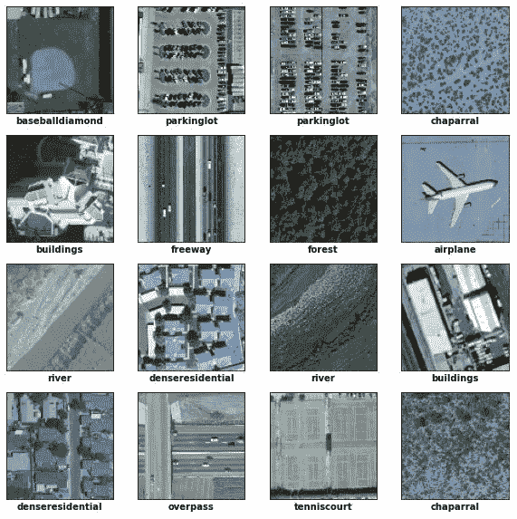

**UC-Merced 土地利用图片样本**(图片由作者提供)

***2。UC-Merced 土地利用数据集(多标签):*** 为了使 UC-Merced 土地利用目录更能代表地面参考数据，*[https://big earth . eu](https://bigearth.eu/)/的研究人员用一个或多个(最多七个)标签手动重新标记了每幅图像。在重新标记的数据集中有 17 个不同的类，下面显示了一个带有指定标签的图像示例。多标签的 UC-Merced 土地利用数据库可以从这个[链接](https://bigearth.eu/datasets)下载。*

*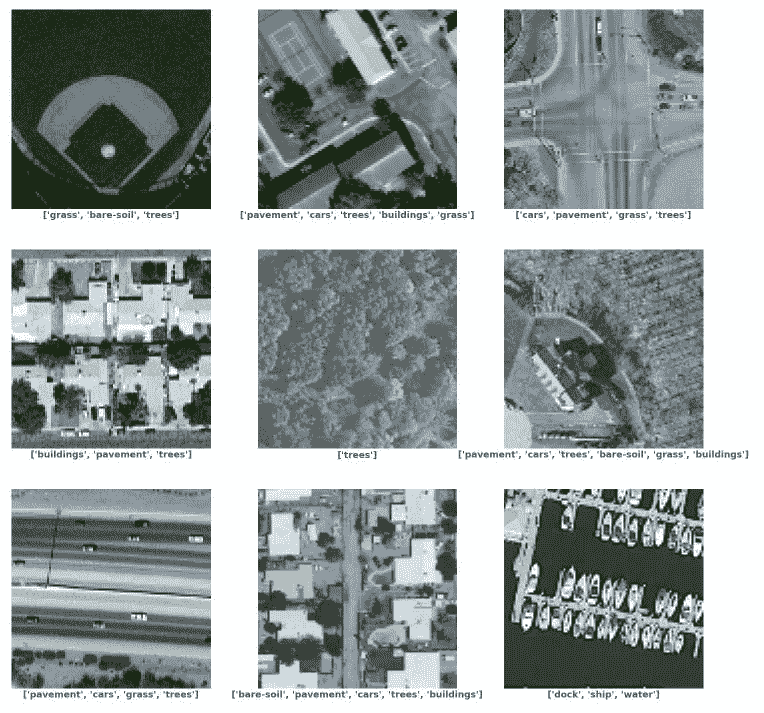*

***UC-Merced 土地利用图像样本【多标签】**(图片由作者提供)*

****3。作为 phi-net 挑战的一部分，加州大学伯克利分校的太平洋地震工程研究(PEER)中心已经收集了一个大型结构图像数据集。该数据集有助于开发和评估基于视觉的自动化算法，用于结构健康监测和损伤评估。phi-net challenge 中有[八个检测任务](https://apps.peer.berkeley.edu/phi-net/detection-tasks/)，在这项研究中，我们将使用任务 1 场景级数据，解决图像中的缩放问题。共有 24，309 幅图像，它们分为三类——a)像素，b)对象和 c)结构。可以从这个[网页](https://apps.peer.berkeley.edu/phi-net/download/)请求数据集。****

*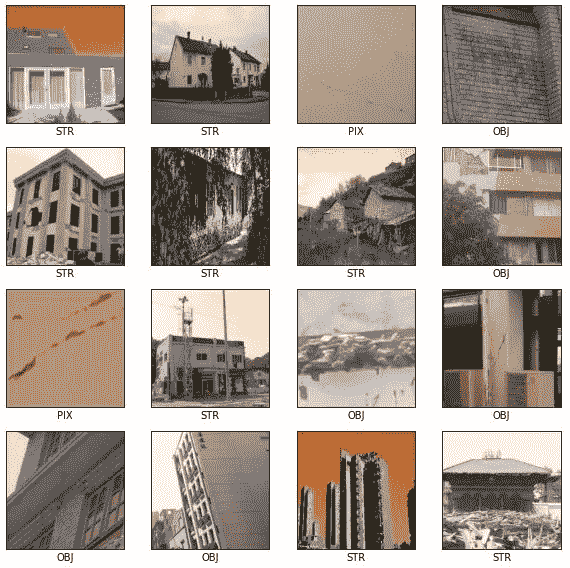*

***任务 1:场景级图像**(图片由作者提供)*

# *结果:*

*对于所有这三个应用程序，基本的 CNN 模型架构与前面所示的相同，只是对读/写操作进行了微小的修改，以反映所使用的输入-输出数据。完整的模型实现可以在我的 GitHub 页面上找到。*

****单个类别:*** 在这个数据集中的 2100 幅图像中，我们使用了 2000 幅图像用于训练和验证目的，剩余的 100 幅图像用于测试模型。下图显示了测试数据集中的图像样本，包括实际标签(左)和预测标签(右)。该模型在识别图像中的模式和预测适当的标签方面做得相当好。还存在实际标签和预测标签之间存在微小不匹配的情况。例如，第 3 行第 1 列的图像被归类为“密集住宅”，但 CNN 模型预测它是一般的“建筑”类别。*

*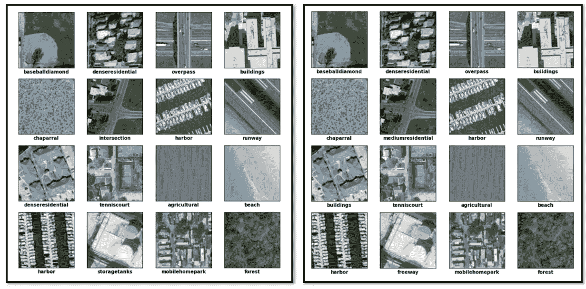*

***实际【左】和预测【右】**(图片由作者提供)*

*为了总结 CNN 模型在这个分类问题上的性能，我们基于测试数据的实际和预测标签生成了混淆矩阵。我们可以看到该模型具有良好的泛化能力，混淆矩阵看起来是合理的。*

*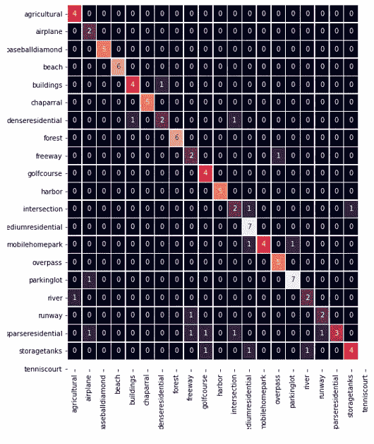*

***混淆矩阵**(图片由作者提供)*

****多标签:*** 同一个代码实现可以进一步扩展进行多标签分类。与前面的分析类似，我们使用 2000 张图像来训练和验证模型，剩余的 100 张图像用于测试目的。*

*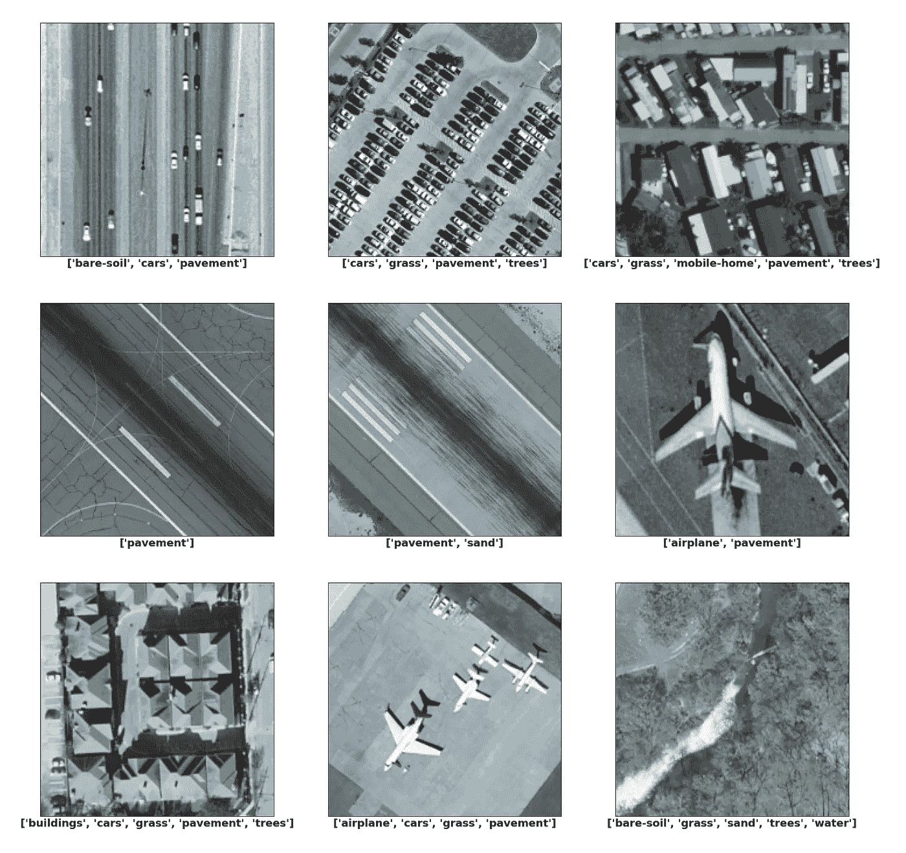*

***测试数据集中的图像样本—实际标签**(图片由作者提供)*

*上图展示了来自测试数据集的图像样本以及实际标签。现在，对于相同的图像，让我们比较和对比 CNN 模型生成的标签。我们可以清楚地看到，预测的标签更能描述图像，突出了 CNN 模型在图像中选取多个模式的有效性。*

*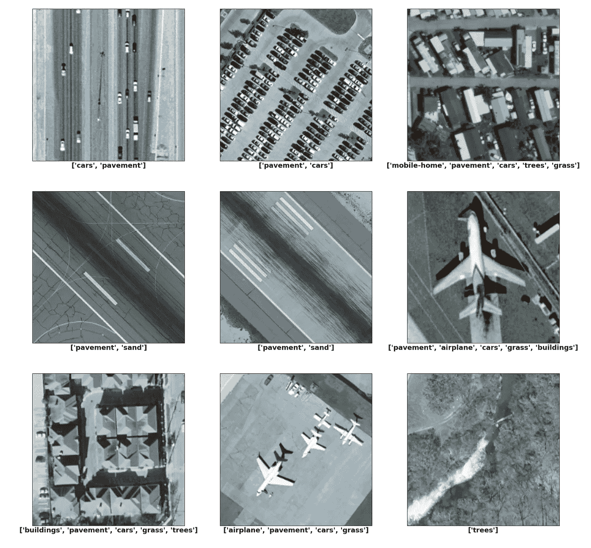*

***测试数据集中的图像样本—预测标签**(图片由作者提供)*

****建筑物损坏:*** 现在，让我们过渡到评估同一 CNN 模型在评估视觉损坏估计中的缩放问题时的鲁棒性。如前所述，这里的目标是对场景级图像进行分类，并将它们归类为像素、对象或结构。该模型能够达到 82%的预测准确度分数。*

*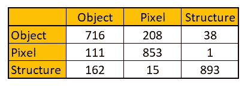*

***混淆矩阵——建筑物损坏评估任务 1 的模型性能**(图片由作者提供)*

# *结束语:*

*世界上大多数风险都没有保险。经济损失与保险损失之差称为 ***【保障缺口】*** 。保险投保率不高的原因有很多，但普遍的成本结构是最令人望而却步的原因。如果我们能够利用最新的技术和计算进步来降低保险成本结构，我们将能够在缩小保障差距方面取得重大进展。*

*在本文中，我们谈到了构建一个简单的卷积神经网络模型的主题，该模型可以帮助从空间数据中获得可操作的见解。当这些自动化模型集成到再保险(保险公司)数据工作流程中时，可以帮助优化组合比率并降低保险成本结构。地理配准完成后，这些模型可自动进行调整，以满足以下要求:*

> ***1。为感兴趣的区域开发建筑物和基础设施的位置级暴露足迹***
> 
> ***2。创建网格级别的暴露集和风险图，可以进一步扩展以开发新的参数保险产品***
> 
> ***3。改进核保和定价的风险选择决策树***
> 
> ***4。微调索赔管理流程***

*感谢阅读这篇文章！感谢所有反馈。如有任何问题，请随时联系我。*

***如果你喜欢这篇文章，这里还有一些你可能喜欢的文章:***

* [## 使用深度学习的飓风路径预测

### 每年 6 月 1 日到 11 月 30 日之间的时间窗标志着北大西洋飓风季节。在此期间…

medium.com](https://medium.com/@kap923/hurricane-path-prediction-using-deep-learning-2f9fbb390f18)  [## 使用生成对抗网络的随机天气生成器

### 使用 GANs 对多元分布建模

towardsdatascience.com](/stochastic-weather-generator-using-generative-adversarial-networks-a9856b0f83ef)  [## 飓风佛罗伦萨——建立一个简单的风暴路径预测模型

### 飓风佛罗伦萨是 2018 年大西洋飓风季节的第一场主要飓风。从它在海角附近的起源…

towardsdatascience.com](/hurricane-florence-building-a-simple-storm-track-prediction-model-1e1c404eb045) 

***参考文献:***

1.  杨和纽萨姆(2010)。土地利用分类的视觉词汇和空间扩展，ACM 地理信息系统进展空间国际会议，2010 年。
2.  乔杜里，德米尔。路易斯安那州布鲁佐内(2018 年)。使用半监督图论方法的多标签遥感图像检索，IEEE 地球科学与遥感汇刊，第 56 卷，第 1 期
3.  高，y .和莫萨拉姆，K. M. (2019 年)。PEER Hub ImageNet(*φ*-Net):结构图像的大规模多属性基准数据集，*同行报告* №2019/07，加州大学伯克利分校太平洋地震工程研究中心。
4.  高，杨，&莫萨拉姆，K. M. (2018)。基于图像的结构损伤识别的深度迁移学习。*计算机辅助土木和基础设施工程*，33(9)，748–768。*