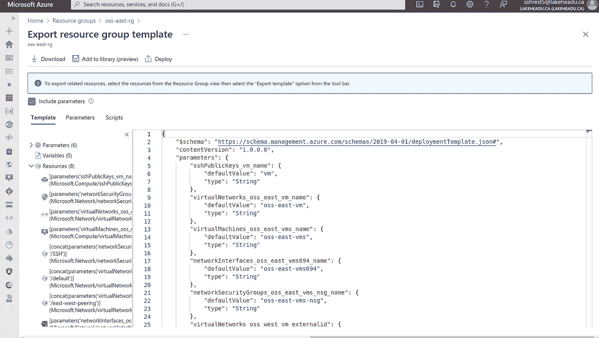

# 通过 ARM 模板将所有基础设施作为一个代码

> 原文：<https://towardsdatascience.com/bringing-all-of-the-infrastructures-as-a-code-through-arm-templates-ba9987ccac1f?source=collection_archive---------39----------------------->

## 使用 ARM 模板通过 ARM 模板将虚拟机和存储帐户置于安全的私有虚拟网络中


奥马尔·弗洛雷斯在 [Unsplash](https://unsplash.com/s/photos/network?utm_source=unsplash&utm_medium=referral&utm_content=creditCopyText) 上拍摄的照片

# 动机:

假设我们已经有了一个基础设施。有时我们可能需要再次复制相同的基础架构。手动操作肯定会在迁移阶段给我们带来错误。因此，我们将利用来自 Azure 的名为 Azure ARM Templates 的服务，以幂等的方式部署我们的基础设施。

# 建筑:


苏拉布什雷斯塔。通过 ARM 模板 1 将所有基础设施作为一个代码。2021.JPEG 文件。

# 先决条件:

1.  Azure Blob 存储
2.  Azure 虚拟机
3.  Azure VNet

# Azure 虚拟网络:

Azure 虚拟网络是 Azure 在云中的网络。这个虚拟网络可以细分成不同的子网。在本练习中，我们将创建一个带有一个子网的虚拟网络，该子网是私有的，不能访问互联网。点击**虚拟网络，填写详细信息，点击**查看+创建。****


苏拉布什雷斯塔。通过 ARM 模板 2 将所有基础设施作为一个代码。2021.JPEG 文件。

您的虚拟网络将成功部署。


苏拉布什雷斯塔。通过 ARM 模板 3 将所有基础设施作为一个代码。2021.JPEG 文件。

# Azure 虚拟机:

现在，我们在 VNet 中创建一个 Azure 虚拟机。点击 **Azure 虚拟机，**填写基本细节，选择刚刚创建的 **VNet** ，点击**审核+创建。**


苏拉布什雷斯塔。通过 ARM 模板 4 将所有基础架构作为一个代码。2021.JPEG 文件。

部署应成功完成


苏拉布什雷斯塔。通过 ARM 模板 5 将所有基础设施作为一个代码。2021.JPEG 文件。

# Azure Blob 存储:

让我们创建 Azure Blob 存储。点击**存储账户，+创建，**填写基本信息，点击**审核+创建。**


苏拉布什雷斯塔。通过 ARM 模板 6 将所有基础设施作为一个代码。2021.JPEG 文件。

您的部署将被创建。


苏拉布什雷斯塔。通过 ARM 模板 7 将所有基础设施作为一个代码。2021.JPEG 文件。

# ARM 模板:

ARM 模板是以 JSON 形式编写基础设施以获得最大可用性的幂等方法。创建虚拟机、虚拟网络和子网是一个非常漫长的过程，我们在创建过程中可能会出现错误，因此，ARM 模板是首选。我已经创建了 ARM 模板，并且在我的 [GitHub](https://github.com/codexponent/azure-arm-infrastructure) 上。但是不要担心，我会教你如何编写 ARM 模板，更重要的是生成它们，因为从头开始编写非常困难。

假设我已经创建了一些基础设施，我想为它创建一个 ARM 模板。进入**资源组，**选择**资源，**和**导出模板。**


苏拉布什雷斯塔。通过 ARM 模板 8 将所有基础设施作为一个代码。2021.JPEG 文件。

然后点击**下载**按钮。



苏拉布什雷斯塔。通过 ARM 模板 9 将所有基础设施作为一个代码。2021.JPEG 文件。

您将获得 template.json 和 parameter.json。template . JSON 包含您想要使用其详细信息创建的基础结构，parameter . JSON 包含您想要为资源指定的唯一名称。在这篇文章中，我将添加我的默认值。您可以通过 parameter.json 添加唯一的名称，并输入下面给出的命令。

在您使用 CLI 执行命令后，它可能无法运行，因为您必须对 JSON 文件进行一些整理，比如删除订阅 id 以实现动态可用性，还需要删除不必要的键值对。对于这篇文章，你不必担心，因为我提供的 JSON 已经发挥到了极致。打开代码后，这里是您需要线性输入的命令。

```
az create group --name prem-vm --location eastusaz deployment group create --resource-group prem-rg --template-file template.json
```

# 演示:

正如在体系结构中承诺的那样，让我们检查一下虚拟机和存储帐户。


苏拉布什雷斯塔。通过 ARM 模板 10 将所有基础架构作为一个代码。2021.JPEG 文件。


苏拉布什雷斯塔。通过 ARM 模板 11 将所有基础设施作为一个代码。2021.JPEG 文件。

我们的两个资源都在我们创建的虚拟网络中。

# 结论:

我们展示了如何利用 Azure ARM 模板轻松创建复杂的基础设施。这只是最低限度，因为我们可以向 ARM 模板添加越来越多的内容。还有其他工具，如 Terraform 和 Pulumi，我们可以利用它们以声明和命令的方式编写 IaC 代码。可能性是无限的，选择是无限的，你想做什么取决于你自己。如果你遇到任何问题或难以遵循这些步骤，请在下面评论这篇文章或在 tsulabh4@gmail.com 给我发消息。你也可以在 [Linkedin](https://www.linkedin.com/in/sulabhshrestha/) 和 [GitHub](https://github.com/codexponent) 上和我联系。

# 资源:

[1] Azure 虚拟网络:[https://docs . Microsoft . com/en-us/Azure/Virtual-Network/Virtual-networks-overview](https://docs.microsoft.com/en-us/azure/virtual-network/virtual-networks-overview)

[2] ARM 模板:[https://docs . Microsoft . com/en-us/azure/azure-resource-manager/templates/overview](https://docs.microsoft.com/en-us/azure/azure-resource-manager/templates/overview)