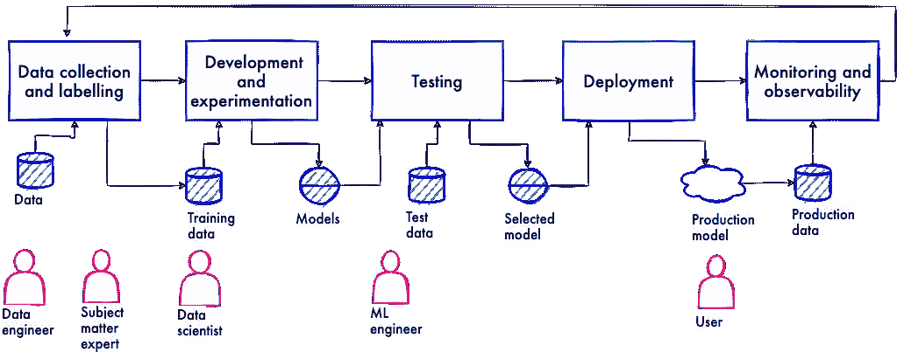
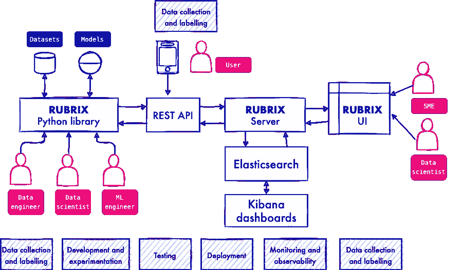
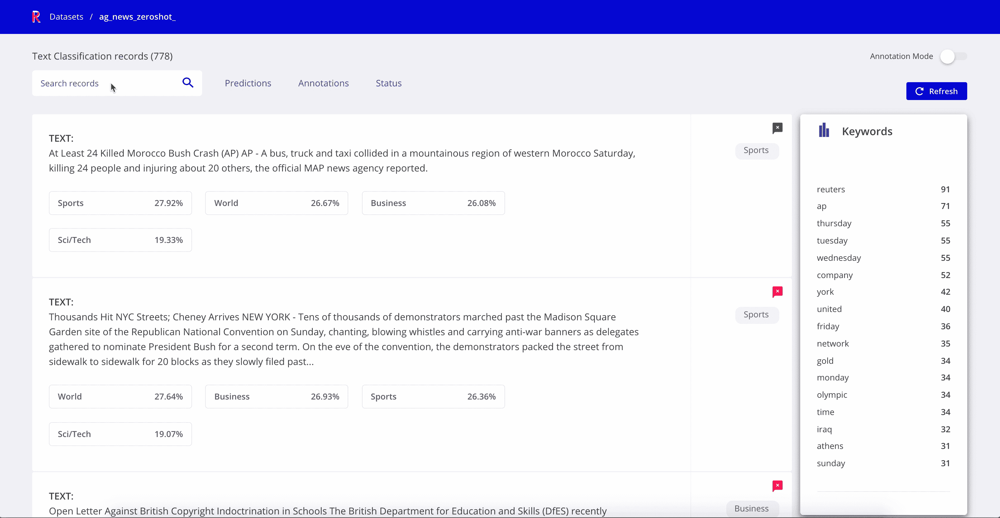
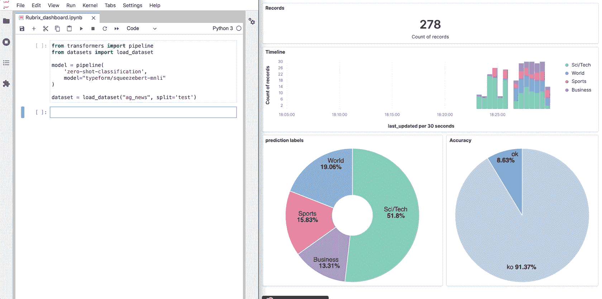
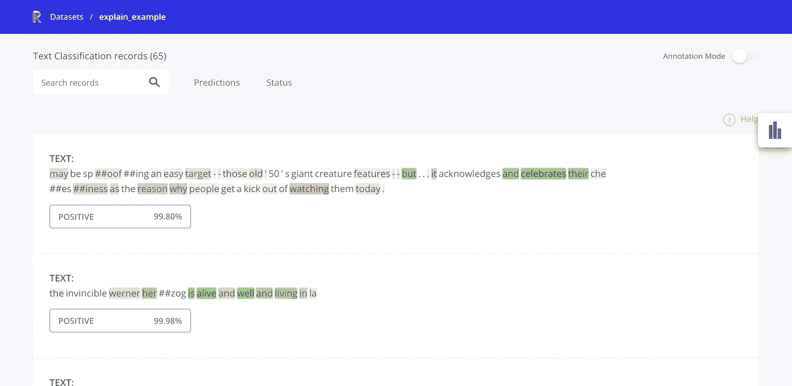
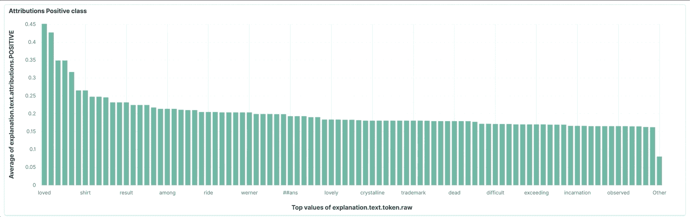
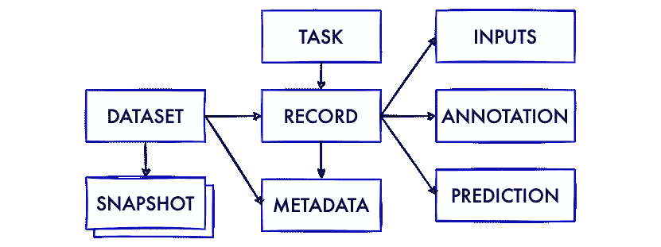
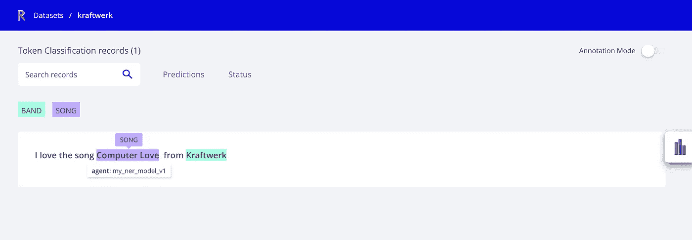
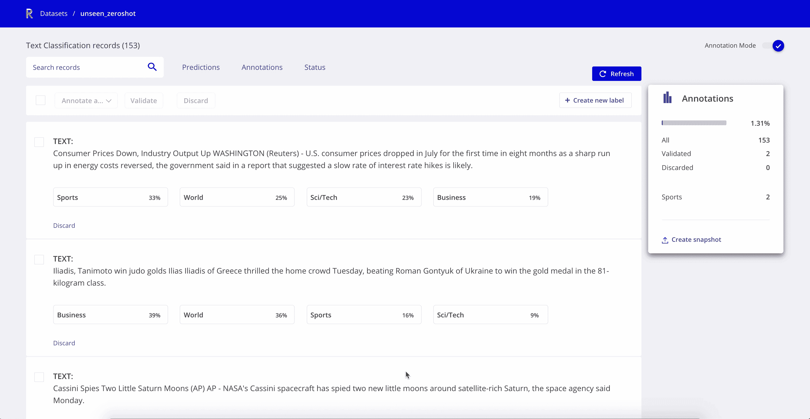

# 将更多的人类带入人工智能的生命周期

> 原文：<https://towardsdatascience.com/bringing-more-humans-into-the-ai-lifecycle-ac5bed139314?source=collection_archive---------29----------------------->

## 介绍 Rubrix，一个人在回路的工具，用于跟踪、探索和迭代人工智能项目的数据


[Ehimetalor Akhere Unuabona](https://unsplash.com/@theeastlondonphotographer?utm_source=medium&utm_medium=referral) 在 [Unsplash](https://unsplash.com?utm_source=medium&utm_medium=referral) 拍摄的照片

启动人工智能项目变得比以往任何时候都容易。像[拥抱脸枢纽](https://huggingface.co/models)或[带代码](https://paperswithcode.com/)的论文这样的倡议让开发者可以即时获得最新的研究成果。迁移学习和 AutoML 方法的兴起意味着你不需要花几个月的时间来为你的项目训练一个模型。然而，以我的经验来看，这只是故事的(一小)部分。

几乎每个处理“应用”人工智能项目的人都会同意，像数据收集和管理，或者模型服务和监控这样的事情要重要得多，而且很难做好。虽然这些事情也变得越来越容易，但管理数据和模型的任务仍然感觉像是将工具和流程拼凑在一起。当我们谈论工具和过程时，我们最终谈论的是人，我们，使用工具并试图遵循过程的人。

> “我们毕竟是人。
> 皮肉全部揭开后”
> 
> 《毕竟是人》，蠢朋克，2005 年。

关于所谓的 ML/data science 项目生命周期已经写了很多，但是关于在这样的“生命周期”中工具、数据、模型和人之间的相互关系却写得不多。让我们来看看一个“简化的”生命周期:



一个“简化的”人工智能项目生命周期

上图显示了流程中涉及的一系列活动和角色:

*   **数据收集和标记:**此活动中涉及的典型角色是*数据工程师*、*数据科学家*、*业务和主题专家*，甚至是数据饥渴项目的*群众工作者*。
*   **模型开发和实验:**这里的核心角色是*数据科学家*。
*   **模型测试:**典型角色有 *ML 工程师*和*数据科学家*。
*   **模型部署:**这里的角色是 *ML 和 DevOps 工程师*。
*   **监控和可观察性:**主要角色还是 *ML 和 DevOps 工程师*。

到目前为止，我们有流程和角色。但我们缺少两个关键因素:“生命”和“周期”。数据和模型不是静态的，它们是“活的”东西，训练/测试/服务模型也不是一次性的活动，它们形成循环。

> “这是现代生活，但在电视上看起来更好
> 哇。这是现代生活”
> 
> 《现代生活》，德沃，1981 年

进入 ML 模型的生产使用，事情会变得复杂。实践中出现了几个关键问题，例如:

*数据科学家可以轻松地回到业务和主题专家那里收集更多数据吗*？

*我们是否可以轻松地与专家分享“实时”预测，以收集更多训练示例*？

*我们能否在不将生产数据持续转移到数据收集和标记阶段的情况下测量生产精度*？

*我们能否直接从最终用户那里无缝收集反馈*？

所有上述问题都有一个潜在的主题:为基于人工智能的解决方案管理数据的角色、工具和过程之间的摩擦。

在 Recognai，自从四年前我们开始与客户合作企业 NLP 项目以来，我们就遭受了这些摩擦。我们开发了内部和开源工具来帮助我们更好地支持我们的客户。但是有一些东西我们一直在构建、重建和重新思考:**一个连接模型、数据和参与项目的人的工具，这样他们都可以在过程的任何一步为改进数据做出贡献**。

在围绕这个想法进行了多次迭代之后，我们终于高兴地分享了 [**Rubrix**](https://rubrix.ml) ，一个免费开源的[](https://github.com/recognai/rubrix/)**，**人工智能项目的人在回路工具**。**

**红框是:**

*   **一个 **Python 库**使数据科学家、数据工程师和 ML 工程师能够在数据、模型和用户之间建立桥梁，用于*数据收集*、*模型开发*、*测试、* *部署*和*监控*。**
*   **一个**网络应用**，用于在整个项目工作流程中探索、管理和标记数据。**
*   **一个**开放 API** ，用于存储、检索和搜索人类注释和模型预测。**

****

**Rubrix 和相关的生命周期活动(*作者图片*)**

**Rubrix 可以安装`pip`:**

```
pip install rubrix
```

**唯一的非 Python 依赖项是 Elasticsearch。您可以使用 Docker 和`docker-compose`来启动它，或者使用现有的 Elasticsearch 实例。**

**要获得更详细的设置指南，请查看 [Rubrix 的指南](https://docs.rubrix.ml/en/latest/getting_started/setup%26installation.html)，但是如果你渴望尝试它并且熟悉 Docker:**

**下载`docker-compose.yml`并启动 Rubrix 服务器和 Elasticsearch:**

```
mkdir rubrix && cd rubrix
wget -O docker-compose.yml [https://git.io/rb-docker](https://git.io/rb-docker) && docker-compose up
```

**现在，在进入更多的细节之前，让我们先来看看 Rubrix 是如何工作的！**

**以下代码从 Hugging Face hub、 [AG 新闻数据集](https://huggingface.co/datasets/ag_news)(一个众所周知的文本分类基准)加载一个零镜头文本分类器，并使用 Rubrix 存储预测和人工标注的标签:**

**AGNews 数据集上的 Rubrix 日志零炮预测**

**就是这样！您和您团队的其他成员现在可以探索这个分类器如何在一个看不见的数据集上工作:**

****

**带有 AGNews 数据集和零炮预测的 Rubrix 探索模式(*图片由作者*提供)**

**根据带标签的数据集探索模型预测，这只是您可以使用 Rubrix 做的许多事情中的一件，因为在“现实生活”中，有时您没有开始的标签，或者您没有模型，或者您只想在开始训练您的第一个模型时查看您的数据。**模型开发**是 Rubrix 最初的设计用途之一。**

**Andrej Karpathy 的这条推文总结了尽早查看数据的全部要点。**

**关于管理数据对人工智能的重要性，另一个伟大的灵感来自文森特·d·沃默达姆，他是 Rasa 的研究倡导者，也是令人惊叹的 [calmcode.io](https://calmcode.io/) 和 [human-learn](https://github.com/koaning/human-learn) 等库的创造者:**

**以零触发分类器结束我们的第一个例子，让我们看看 Rubrix 的另一个有趣的用例:**模型监控和可观察性**。*如果你对模特监测感兴趣，我强烈推荐你这篇来自本·洛里卡和帕科·内森*的 [*文章*](https://gradientflow.com/machine-learning-model-monitoring/) *。正如我上面提到的，Rubrix 与 Elasticsearch 堆栈紧密集成。由于 Kibana 的易用性和 Rubrix 的数据模型，在 Rubrix 数据集的基础上构建自定义仪表板轻而易举。这是我们在 Jupyter 笔记本中记录零炮预测时实时仪表盘的样子:***

****

**自定义监控仪表板，带有红色字体和基巴纳字体(*图片由作者提供***

**回到我们为什么构建 Rubrix，让我们介绍一下 Rubrix 指导原则:**

# **1.没有人应该被迫改变他们的工作流程来为项目做贡献。**

**对于*数据科学家*来说，这个原则意味着 Rubrix 不会要求他们离开他们喜欢的工具，如 Jupyter Lab 或 Colab，来扩展任何类或围绕任何新的抽象包装他们的模型。**

**对于*数据和 ML 工程师来说，*这意味着 Rubrix 为读写(大量)数据提供了简单而有效的方法。我们设计了易于在自动化脚本中使用的 Rubrix。**

**对于*业务*和*主题专家来说，*这意味着一个干净且易于使用的用户界面，在这里他们可以感觉到控制，并且可以透明地检查数据和模型预测。**

**我们为提高透明度和信任度而感到兴奋的另一个用例是与 Kibana 仪表板配套的 Rubrix 中的**模型可解释性**。**

**这里有一个 Rubrix 数据集的例子，它包括使用[集成梯度](https://arxiv.org/abs/1703.01365)方法提取的情感分类器的令牌级属性，使用[变压器解释](https://github.com/cdpierse/transformers-interpret)和 [captum.ai](https://captum.ai/) 库。**

**Rubrix 提供了一个不可知的数据模型，所以你可以使用其他库和技术，比如 Lime。**

****

**探索带有模型解释的情感分类器预测**

****

**基巴纳对积极情绪标签的平均表征归因分数的自定义可视化(*图片由作者*提供)**

**下面是记录预测和令牌属性的代码:**

# **2.API 应该对每个人都足够简单，同时支持复杂的工作流。**

****数据模型**符合这个简短的描述:**

> ****数据集**是**记录**的集合，其形状由**任务**(例如文本分类)**定义。****
> 
> ****快照**是用于再现性和自动化管道的**数据集**的存储版本。**
> 
> **一个**记录**由它的**输入**定义，并且可选地包含**注释、预测、**和**元数据。****
> 
> ****注释**通常是由人类**代理**为给定的**任务**和**输入定义的基本事实。****
> 
> ****预测**通常来自来自机器**代理**(例如文本分类器的输出)。**

**在这个小图表中:**

****

**Rubrix 数据模型(*图片作者*)**

**让我们看看如何为 NER(命名实体识别)创建和记录一个**记录**，这是一个广为人知的 NLP **任务**:**

**上面的代码使用 **rb.log** 方法记录了一个带有歌曲和乐队标签的 NER 示例，如果数据集不存在，它也会创建一个数据集。数据集是增量的，您可以使用 **rb.log** 来批量记录大型数据集(正如我们在监控示例中看到的)。这是该记录在 web 应用程序中的外观:**

****

**红色字体中的 NER 探险景观(*图片由作者*提供)**

**Rubrix 只需要调用两个主要的**方法**:**

*   ****rb.log(records，name)** 将记录存储到一个 Rubrix 数据集中。**
*   ****rb.load(name)** 将记录从 Rubrix 数据集中读入 Pandas 数据帧。**

**为了理解这两种方法支持的工作流类型，让我们看一个加载 Rubrix 数据集以微调预训练模型的示例。我们将遵循指南"[微调预训练模型"](https://huggingface.co/transformers/training.html#fine-tuning-a-pretrained-model)从拥抱脸。**

**工作流程如下:**

****1** -我们已经使用 **rb.log** 创建了一个具有零命中率预测的 Rubrix 数据集，并且我们已经花了一些时间使用 Rubrix web-app 注释模式来手动标记一些示例。这和之前的例子是一样的，但是在这个例子中我们没有任何先验标签。**

****

**具有零触发预测的数据集中的红框注释模式(*图片由作者*提供)**

****2**——在花了一些时间进行注释之后，我们准备好使用 **rb.load** 并准备好我们的数据集来微调模型。通常，我们会将其分为训练、测试和验证，但是让我们尽可能简单地描述这个例子:**

****3** -从这一点开始，只是按照指南中的描述对训练器 API 进行常规微调。请注意，我们使用的是*无壳蒸馏器*而不是*有壳蒸馏器***

**如果您对此感兴趣，您可以:**

*   **阅读更多关于 [Rubrix 的数据模型](https://docs.rubrix.ml/en/master/getting_started/concepts.html)和 [Python API 参考](https://docs.rubrix.ml/en/master/reference/python_client_api.html#python-client-api)的信息。**
*   **查看我们的[深入教程](https://docs.rubrix.ml/en/master/tutorials/01-huggingface.html),了解如何将 Rubrix 与🤗转换器和数据集。**

# **3.拥抱与其他工具、库和框架的集成。**

**我们生活在一个激动人心的时代，每个月都有新的库和工具发布。人们对用于不同事情的许多工具感到舒适，例如数据注释，或者模型实验跟踪，我们想要拥抱这种多样性。**

**Rubrix 不是一个全有或全无的工具或平台，我们的目标是让用户能够构建新颖的工作流，并将 Rubrix 与他们选择的工具相结合。这就是为什么，除了 Python 库和 web 应用程序，我们还为开发人员设计了一个开放的 REST API。**

**此外，为了激发你的想象力和创造力，请查看 [Rubrix 的文档](https://docs.rubrix.ml/en/master/):**

*   **将 [Rubrix 整合到 Streamlit 应用](https://docs.rubrix.ml/en/master/guides/streamlit_guide.html)的指南，**
*   **一个使用 Rubrix 和[通气管弱监控](https://docs.rubrix.ml/en/master/tutorials/04-snorkel.html)的教程**
*   **[食谱](https://docs.rubrix.ml/en/master/guides/cookbook.html)提供了将 Rubrix 用于主要 NLP 库的代码片段，如我们喜爱的斯坦福大学的 spaCy、Flair 或 Stanza。**
*   **用 scikit-learn 和 [ModAL](https://modal-python.github.io/) 进行主动学习的基础[教程。](https://docs.rubrix.ml/en/master/tutorials/05-active_learning.html)**

# **4.提供一个最小的特性集，让社区来指导接下来的工作。**

**你可能已经注意到，我一直在谈论人工智能项目，但我们只看到了自然语言处理的例子。原因很简单:自然语言处理和知识图用例一直是 Rubrix 在 Recognai 开发的原始驱动力。然而，Rubrix 的数据模型和架构旨在轻松添加新的用例和应用程序。Rubrix 涵盖了广泛的 NLP 和知识图应用，只支持两个任务，文本分类和标记分类。**

**对于知识图用例，可以使用令人惊叹的 [kglab](https://derwen.ai/docs/kgl/) 和 PyTorch 几何库和 Rubrix 随意查看[节点分类教程](https://docs.rubrix.ml/en/master/tutorials/03-kglab_pytorch_geometric.html)。**

**我们设想的直接用例是 t *ext2text* ，它将涵盖许多其他 NLP 应用，如*文本摘要*或*机器翻译*；计算机视觉任务如*图像分类*；以及语音识别任务如 *speech2text* 。但在此之前，我们想听听你的声音。**

**这就是为什么我们很高兴宣布 Rubrix，这样你就可以成为一个开放友好的社区的一部分，并推动接下来的发展。**

**如果你想加入 Rubrix 社区或谈论你的即时和预想的应用，请在 Rubrix 的 [Github 的论坛](https://github.com/recognai/rubrix/discussions)上给我们留言。**

> **“我打这个号码
> 是为了约会
> 我不知道该做什么
> 我需要约会”**
> 
> **发电厂乐团的《计算机之恋》，1981 年**

# **感谢**

**感谢 Paco Nathan、Amélie Viallet、David Carreto、Ignacio 塔拉贝拉和 Francisco Aranda 为改进本文提供的巨大帮助和建议。**

# **脚注**

1.  **如果你不熟悉人在回路的概念，我强烈推荐你斯坦福大学以人为中心的人工智能研究所的这篇文章。**