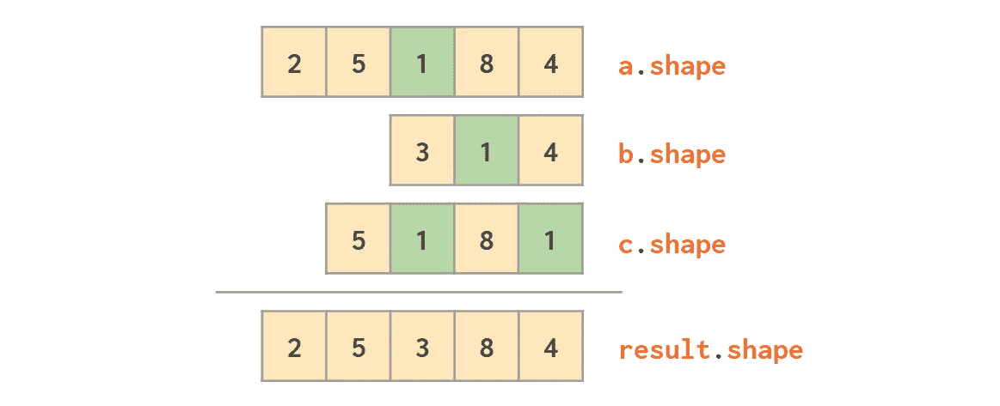
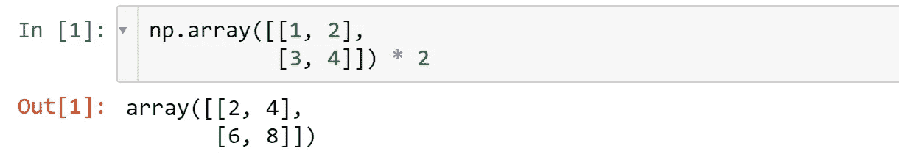
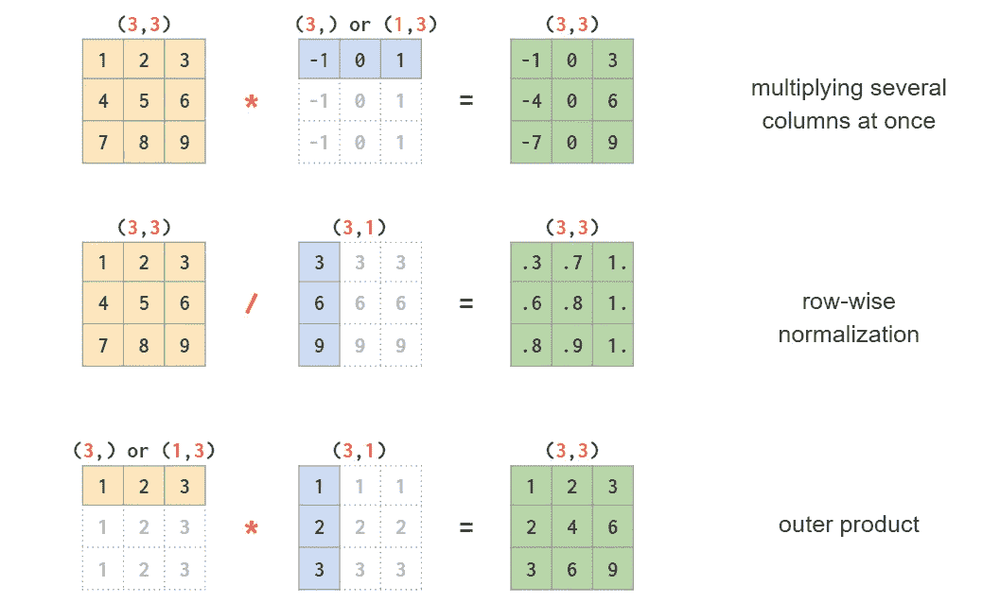
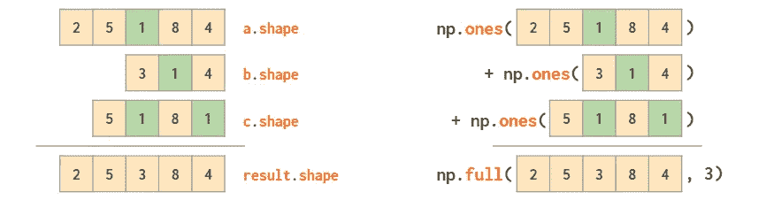
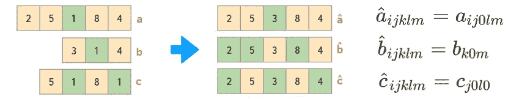
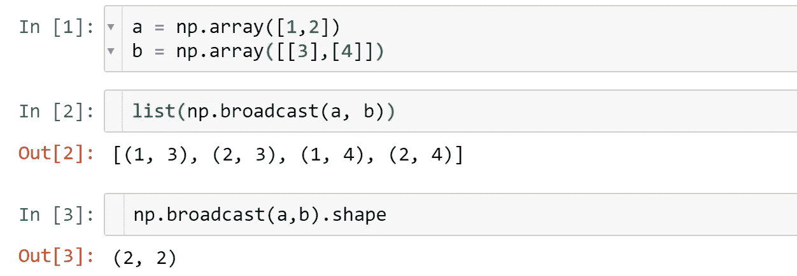

# 数字广播

> 原文：<https://towardsdatascience.com/broadcasting-in-numpy-58856f926d73?source=collection_archive---------28----------------------->

## 理解 NumPy、PyTorch 和 TensorFlow 的关键概念之一

图片来源:作者

广播是一种匹配不同形状的数组的维数的操作，以便能够对这些数组执行进一步的操作(例如每元素算术)。

一个非常强大的功能，但是文档有些不足。通常，当数组大小不匹配时，人们会从错误消息中了解到这一点。

最简单的广播示例是 n 维数组乘以标量，这显然意味着每个元素的元素乘以标量值:

广播类似于众所周知的“类型提升”:在大多数语言中，当添加一个整数和一个浮点时，整数首先被自动转换为浮点类型。

在 2D(例如用向量除一个矩阵)中，广播有点棘手，因为运算的结果取决于操作数的特定形状:

所有这些形状变化(灰色数字)都是动态发生的，不占用额外的内存(也称为视图)。

在 3D 及以上版本中，广播甚至更不直观，使用它需要了解广播规则的一般形式。它们在不同的来源中以略微不同的方式表述，确切的措辞也随着时间而改变。我发现来自 [*Python 数据科学手册*](http://shop.oreilly.com/product/0636920034919.do) 的三步法则是最全面的:

> 规则 1:如果两个数组在维数上不同，维数较少的那个数组的形状在它的前(左)侧用 1 填充*。*
> 
> 规则 2:如果两个数组的形状在任何维度上都不匹配，则在该维度中形状等于 1 的数组将被拉伸以匹配另一个形状。
> 
> 规则 3:如果在任何维度中，尺寸不一致并且都不等于 1，则产生错误。

拉伸意味着相应的层被复制:

将彩色图像转换为灰度图像是 3D 广播的一个很好的例子。根据 sRGB 颜色空间的公式，可以通过图像颜色通道的线性组合获得亮度:

使用广播，这可以简单地写成

其中`im`是具有标准索引顺序的图像，例如 if `im.shape == (1080, 1920, 3)` then `gray.shape == (1080, 1920)`其中 1080 是图像的高度，1920 是其宽度，3 是色彩平面(RGB)的数量。完整示例:

图片来源:[openastronomy.org](http://openastronomy.org/pyastro/logo/)

有一个专门的函数`np.[broadcast](https://numpy.org/doc/stable/user/basics.broadcasting.html)`返回一个生成器对象

虽然广播很少被明确地完成(因为循环将在 python 中执行，这比在 C 中慢)。通常它发生在“幕后”。

但是广播并不局限于算术运算。更多用法示例见我的文章“ [Numpy Illustrated](https://medium.com/better-programming/numpy-illustrated-the-visual-guide-to-numpy-3b1d4976de1d?source=friends_link&sk=57b908a77aa44075a49293fa1631dd9b) ⁴”

广播最初是在 1995-1999 年左右在 NumPy 的前身 Numeric⁵图书馆引入的，被 [PyTorch](https://pytorch.org/docs/stable/notes/broadcasting.html) 、 [TensorFlow](https://www.tensorflow.org/xla/broadcasting) 、 [Keras](https://www.kite.com/python/docs/keras.backend.ctc.sparse_ops.control_flow_ops.gen_array_ops.broadcast_to) 等采用。甚至 [Matlab](https://www.mathworks.com/help/parallel-computing/broadcast-variable.html) 在 2016b 中加了[感谢“这些年来要求这种行为”的用户。](https://blogs.mathworks.com/loren/2016/10/24/matlab-arithmetic-expands-in-r2016b/)

## 参考文献

1.  杰克·范德普拉斯。Python 数据科学手册，[数组计算:广播](https://jakevdp.github.io/PythonDataScienceHandbook/02.05-computation-on-arrays-broadcasting.html)
2.  维基百科。[灰度](https://en.wikipedia.org/wiki/Grayscale)
3.  NumPy 文档。[广播](https://numpy.org/doc/stable/user/basics.broadcasting.html)
4.  列夫·马克西莫夫(2020)。 [Numpy 图解:Numpy 视觉指南](https://medium.com/better-programming/numpy-illustrated-the-visual-guide-to-numpy-3b1d4976de1d?source=friends_link&sk=57b908a77aa44075a49293fa1631dd9b)
5.  大卫·阿谢尔；保罗·迪布瓦；康拉德·欣森；吉姆·胡古宁；特拉维斯·奥列芬特(1999)。[《数值 Python》](http://www.cs.mcgill.ca/~hv/articles/Numerical/numpy.pdf)