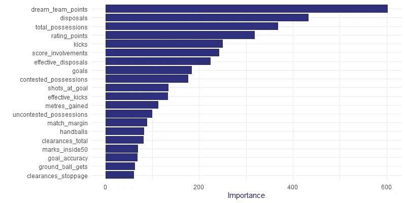
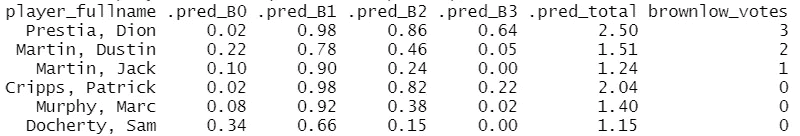
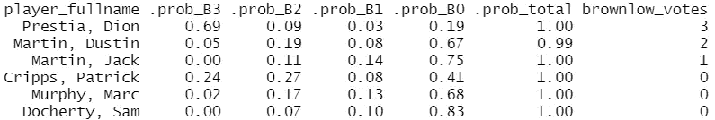
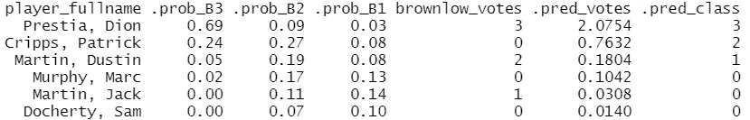
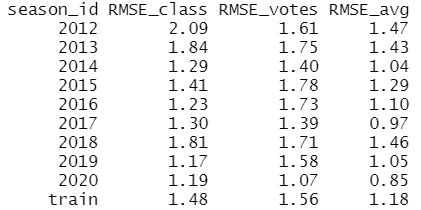
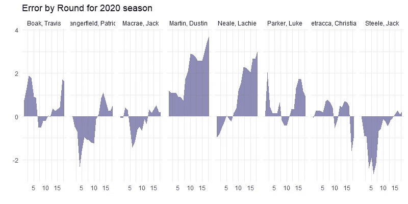
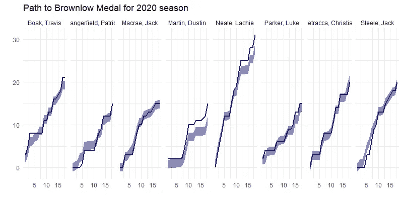
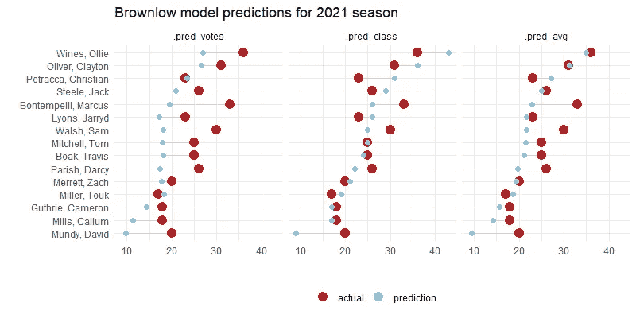
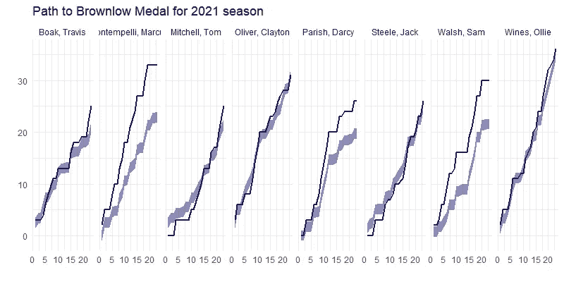
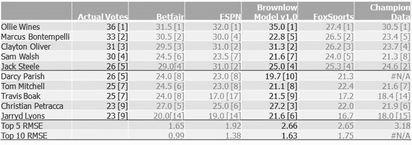

# 布朗洛奖章预测者

> 原文：<https://towardsdatascience.com/brownlow-medal-predictor-36586d535226?source=collection_archive---------28----------------------->

## *使用数据驱动方法预测美国橄榄球联盟布朗洛奖章投票数*

Ruck 竞赛。图片由[教皇](https://commons.wikimedia.org/wiki/File:FreoGeeRuckContestMarch2016.JPG)， [CC BY-SA 4.0](https://creativecommons.org/licenses/by-sa/4.0) ，通过维基共享

布朗洛奖章(Brownlow Medal)被授予由裁判决定的 AFL 在主客场赛季中“最佳和最公平”的球员。每场比赛结束后，三名现场裁判分别给比赛中第一、第二和第三名的选手 3、2 和 1 票。在颁奖之夜，每场比赛的投票都被记录下来，根据资格，获得最高票数的选手将被授予奖牌。

由于集体裁判意见中“最佳和最公平”定义的主观性，预测布朗洛奖牌获得者具有挑战性，这可能会受到公众舆论的影响。此外，一些球员更有可能在视野之内——中场球员在历史上赢得了绝大部分的选票。

此分析的目的是了解有助于布朗洛投票的玩家行为的关键可量化预测因素，并建立一个合理的预测模型，为整个赛季的下注策略奠定基础。

## **基线模型概述**

基线模型的目标是勾勒出一个框架，从这个框架中可以改进模型的未来迭代。

**性能测量**我们将基线模型的性能评估测量定义为实际投票与预测投票的均方根误差(RMSE );这种方法根据与实际观测的距离非线性地惩罚预测。

**数据**数据集包括来自[菲茨罗伊](https://cran.r-project.org/web/packages/fitzRoy/vignettes/fitzRoy.html)数据包的 2012-2021 赛季约 85，000 行球员比赛统计数据。2021 赛季的数据已经被预留出来作为预测的测试数据集。

**预处理**数据经历如下所述的一些转换。

*   玩家投票是基于每场比赛分配的——这需要对每场比赛的玩家统计数据进行标准化——因此可以根据天气、场地等因素的预期变化进行调整。这一过程也自然地为缩短了游戏时间的 2020 赛季进行了调整。
*   我们最初还以 4:1 的比例平衡职业，以确保训练数据不会过度偏向没有获得投票的玩家。

**学习算法**底层学习算法是一个基于树的分类框架(xgboost ),它在玩家匹配的基础上为投票计数生成概率和预期类别。该模型仅使用数字变量，并经过交叉验证。

每场比赛只能分配三张选票，这使得这成为一个分类问题，我们需要用概率来理解预测，并能够辨别 2 票对 3 票游戏之间的质量差异。

该模型是堆叠的，它依次计算 0-3 票的条件概率，而不是一个多类分类问题。为简单起见，我们将各个模型标记为概率 B1、概率 B2、概率 B3，以分别表示获得至少 1、2 和 3 票的概率。

这允许我们使用迁移学习——先前迭代的结果成为后续模型的输入。

## **模型结果:可变重要性**

可变重要性允许我们识别和解决可能降低模型预测质量的问题。有 50 多个可能的预测变量。

为了建立一个不会过度处理问题的稳健模型，我们希望在最终模型增加复杂性之前，先减少预测因子的数量。

prob_B1 模型的可变重要性(图片由作者提供)

上面的图表让我们第一次很好地了解了在 prob_B1 模型中，当玩家至少获得一票时，哪些变量的贡献最大。最初的想法-

*   前 4 个变量是其他统计数据的线性组合，特别是梦之队积分和排名积分是常用的衡量球员表现的综合统计数据。
*   处置比全部财产稍微重要一些；对投篮得分的贡献。
*   “有效”变量与原始总数非常相似，但是在变量重要性方面排名较低，这意味着裁判员在场上没有完全量化处理的质量。

因此，在模型的下一次迭代中，我们将从数据集中删除线性组合以及高度相关的变量。

最后一个条件模型(prob_B3)的变量重要性图表显示，先前模型的条件概率在对最终预测的贡献方面排名很高。

概率 B3 模型的可变重要性(图片由作者提供)

## **整体精度**

输出是一系列条件概率，其中整个数据集的分类精度在 2–5%的数量级。2020 年第一场比赛(RI v CA)的选定球员的原始条件概率如下。

2020 年第一轮选定球员的条件概率结果(里士满对卡尔顿)

*   初始模型结果是匹配不可知的，因此它们不认为给定匹配内的概率之和对于概率 B1、概率 B2、概率 B3 模型中的每一个应该分别等于 1、2、3；因此，我们需要在匹配的基础上使结果正常化。
*   此外，我们还想对结果进行归一化处理，使单个玩家级别上的概率总和等于 1。

归一化过程的结果如下所示(注意，由于四舍五入，一些总概率不完全是 1)。

2020 年第一轮(里士满对卡尔顿)选定球员的标准化概率

在纯概率基础上目测结果，我们看到该模型正确地建议了 Dion Prestia (3 票)的结果，但与 Dustin Martin、Jack Martin 和 Patrick Cripps 的 1 票和 2 票类别混淆了。

根据标准化的概率，我们将它们转换成预测的投票数。考虑了两种方法，一种是原始值，另一种是原始值的排序。在这两种情况下，我们确保每场比赛分配的总票数必须始终加起来正好是 6。

概率到投票的转换(加权和类别)

同样，Jack Martin 没有获得任何投票，而 Dustin Martin 在我们的模型中获得了 1 票(实际上是 2 票)，我们保留这个离群值的示例，作为在基线模型的后续迭代中进行改进的机会。

ESPN 的一篇文章描述了另一种分配投票的方法，该文章提出，3、2.5、1.5 或 0.5 的投票分配方法会导致更低的误差幅度。我们将在未来的研究中调查这种配置。

## **赛季末的准确性**

我们承认可能存在总体不准确，但这项工作的目标是在(1)季末水平和(2)逐轮汇总水平达到合理的准确性。

每种预测方法的准确性通过实际投票与按季节预测的投票以及整个训练集的均方根绝对误差(RMSE)来衡量。

不同季节的模型精确度

虽然分级分类法似乎比原始值法更好，但平均法更胜一筹。下图显示了 2020 赛季前 15 名竞争者的最终预测结果。

2020 赛季实际投票和预测投票(图片由作者提供)

在上面的图表中，有几件事很突出—

*   目测显示，pred-votes 方法通常会低估投票数，而 pred-class 方法则更加平衡。总的来说，平均模型在获得正确的最终预测顺序方面做得很好。
*   2020 年，拉奇·尼尔、扎克·梅里特和泰勒·亚当斯是一个典型的异类。

## **逐轮汇总的精确度**

下面的图表让我们可以更详细地分析每一轮比赛，并随着赛季的进行，对预期的误差有一些信心。对前 8 名竞争者的结果进行了更详细的分析。

2020 赛季绩效指标(图片由作者提供)

从表面上看，随着赛季的发展，基线模型通常可以在样本中产生合理的预测，误差在 1-2 票以内。

## **出样模型精度**

2021 年的数据是样本外的，因此预计预测不如 2020 年准确，因为 2020 年在训练集中。在训练集中，最后一轮的 RMSE 是 0.9，而在样本外的 2021 数据中，RMSE 是 3.3。

2021 赛季实际和预测投票(图片由作者提供)

*   2021 年值得注意的异常值是马库斯·邦滕佩里、达西·帕里什和萨姆·沃尔什，他们的结果都被模型低估了。
*   托克·米勒是一个因为赛季中的停赛而没有资格获得布朗洛的球员的例子——如果他在随后的比赛中被裁判无意地否决，那么调查他将会很有趣。

2021 赛季前 8 名布朗洛奖牌获得者的道路(作者图片)

对此可能的解释是我们最初的模型中没有考虑到的因素-

*   “可见性”因素，可见性可以通过身体特征来定义——纹身、发色、身高——这使得球员更容易被注意到或记住(被裁判)。
*   影响因子，一些球员对比赛结果的影响可能比原始统计数据(如处置)实际显示的影响更大。
*   “浮华”的因素，一些球员在包的外面走得更快，或者在包的里面更有统治力。
*   媒体对裁判判罚的影响；有些球员比其他人更“受人喜爱”。

现在，评估模型质量的框架已经到位，我们现在可以在迄今所学的基础上进一步改进预测模型。

## **反思和后续步骤**

我们可以通过将基线模型输出与 2021 年样本数据中的几个公共模型进行比较，对我们的结果质量进行基准测试——仍然需要砍伐，但肯定不是最不准确的！

专家同行的 2021 赛季基准模型-球员投票和最终排名

练习的下一阶段基于布朗洛预测器的结果构建成一种形式，该形式可用作逐轮投注策略的基础，从中我们可以监控 2022 赛季的实况结果。然后，我们将回到我们的关键学习，以提高预测模型的准确性。

## **参考文献**

1.  维基百科—布朗洛奖章([链接](https://en.wikipedia.org/wiki/Brownlow_Medal))
2.  ESPN 的布朗洛奖章获得者，每一票都投给 2021 ( [链接](https://www.espn.com.au/afl/story/_/id/30993511/afl-2021-brownlow-medal-predictor-tracker-leaderboard-odds-every-team-every-player-every-vote-2021))
3.  AFL.com.au:布朗洛的内幕:每个俱乐部的最爱，一票奇迹，前三名([链接](https://www.afl.com.au/news/675453/2021-brownlow-guide-every-clubs-favourite-one-vote-wonder-top-three))
4.  AFL.com.au:禁赛:34 名球员没有资格参加布朗洛([链接](https://www.afl.com.au/news/69338/banned-the-34-players-ineligible-for-the-brownlow))
5.  Foxsports.com.au:布朗洛奖牌预览:统计数据证明谁将赢得近年来最接近的比赛和价值选择([链接](https://www.foxsports.com.au/afl/brownlow-medal/brownlow-medal-2021-preview-analysis-stats-predictions-winner-favourites-clubbyclub-winners-tie-draw-guide-news/news-story/154a71e9d1b0ea9d8defd41c5c969965))
6.  先驱太阳报:冠军数据布朗洛追踪者:前 20 名选手揭晓([链接](https://www.heraldsun.com.au/sport/afl/news/champion-data-brownlow-tracker-top-20-finishers-revealed/news-story/7b79b2e53a885218a0f8051b6b0dbd8e))
7.  Betfair.com.au:2021 年布朗洛奖牌预测([链接](https://www.betfair.com.au/hub/brownlow-medal-predictor/))
8.  菲茨罗伊简介([链接](https://cran.r-project.org/web/packages/fitzRoy/vignettes/fitzRoy.html))