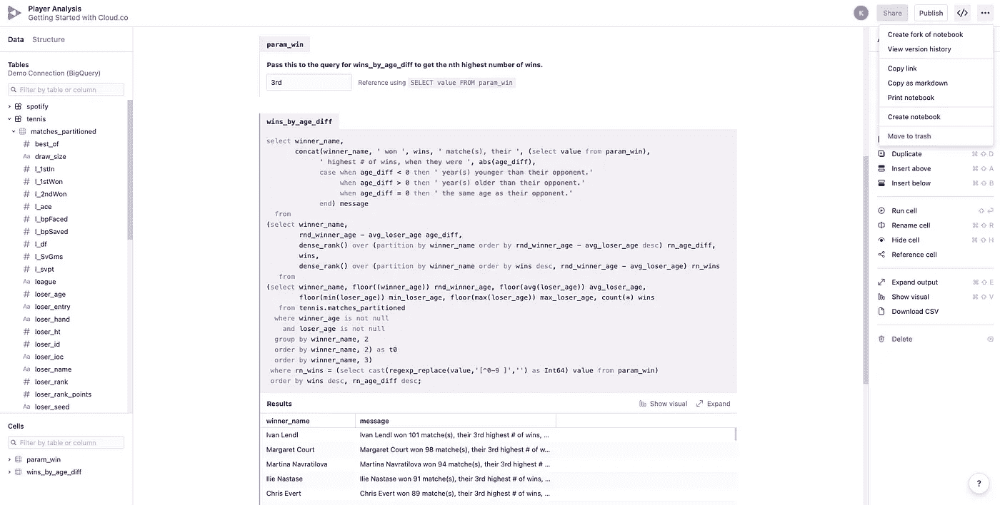
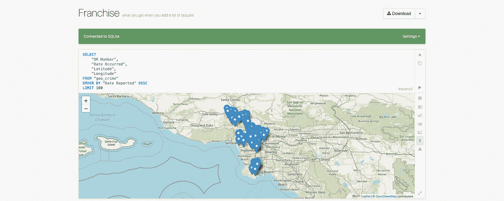

# 基于浏览器的数据库客户端

> 原文：<https://towardsdatascience.com/browser-based-database-clients-5ff927c4cb5d?source=collection_archive---------19----------------------->

照片由 [Fotis Fotopoulos](https://unsplash.com/@ffstop?utm_source=unsplash&utm_medium=referral&utm_content=creditCopyText) 在 [Unsplash](https://unsplash.com/s/photos/software?utm_source=unsplash&utm_medium=referral&utm_content=creditCopyText) 上拍摄

## 数据工程

## 远离基于桌面的数据库客户端

# 背景

从十多年前的大学时代，当我的数据库实验室讲师给了我一张 Oracle 11g 数据库的 CD，让我安装在系统上，到今天，当我可以用一个简单的 CLI 命令启动一个数据库实例，我们已经取得了很大的进步。随着数据库从内部迁移到云，数据库客户端也从桌面或 Mac 应用程序迁移到浏览器。这种转变不明显地与使用 Docker 等易于使用的虚拟化工具向平台独立性的转变完全一致。

随着数据工作成为后衰退十年科技繁荣的核心，数据库和数据仓库工具也经历了巨大的创新，导致了工程师现在日常使用的工具。这直接导致了 SaaS 上市的全面繁荣。虽然有点晚，但这种影响也影响到了数据库客户机，导致了基于浏览器的 SQL 客户机的上升趋势。本文将讨论一些流行的基于浏览器的数据库客户机，以及为什么它们在未来几年会越来越流行。

# 云服务集成客户端

基于云的数据库和数据仓库服务，比如 Amazon RDS、Azure Synapse、Google BigQuery、Snowflake 等等，提供了一个基于浏览器的客户端，可以用来与数据库进行交互。除了 Snowflake 之外，大多数集成的 SQL 客户端功能不够丰富，也不够成熟。例如，语法突出显示、命名实施、数据管理工具等。，受限于这些集成客户端。

由于这些集成客户机的有限特性所带来的不便，工程师们经常转向使用成熟的数据库客户机应用程序作为他们的 IDE。

> **T5 桌面客户端 **
> 
> *毫无疑问，DataGrip、MySQL Workbench、dBeaver、Oracle SQL Developer 等应用程序提供的功能比基于浏览器的客户端提供的功能更重要，但大多数高级功能(如逆向工程、备份和恢复等。)对数据库开发人员和数据仓库工程师更有用，而不是对数据分析师、ML 工程师、数据科学家和其他业务用户。*

# 基于浏览器的客户端

为了使工程师和业务用户的生活更加轻松，使用一个更全面、功能更丰富、基于浏览器的工具来实现一致的开发体验以及更好的 SQL 查询共享和协作功能更有意义。基于浏览器的数据库客户端经常会创新并演变成成熟的 BI 工具。许多基于浏览器的数据库客户端如 JackDB 是专有的 SaaS 工具，而其他如 Superset 是 OSS 项目，每个人都可以免费使用。

探索和可视化工具或数据库客户端的选择取决于目的。业务用户需要从数据库和仓库中获取数据，以探索和总结数据；他们还经常需要想象和讲述一个故事。根据需求，有几种不同类别的基于浏览器的数据库客户机。现在让我们简单看一下这些类别。

## 笔记本风格的数据库客户端

分析师和企业用户喜欢笔记本电脑。受 Jupyter 和 Zeppelin 的 Spark、Python 和 R 代码笔记本的启发，SQL 的神奇语法也在几年前随着 [CloudySQL](https://pypi.org/project/cloudy-sql/) 和 [iPython-sql](https://github.com/catherinedevlin/ipython-sql) 引入。像 Count.co[这样的产品已经开发了一个完全成熟的笔记本电脑，专门为 SQL 开发，并将其提升到一个新的水平。几个月前我试用了这款笔记本。界面看起来是这样的:](https://count.co/)

图片作者。请不要被触发，因为我没有使用大写的 SQL 关键字。谢谢大家！

正如您所看到的，它非常类似于 Jupyter 笔记本，只是它在视觉上更具吸引力，并且像普通的数据库客户端一样支持数据库连接。它还支持分叉和版本控制，如上所示。

 [## 面向数据工程师的 Git

### 数据工程师源代码控制的简短指南&为什么您的数据工程团队绝对有必要

towardsdatascience.com](/git-for-data-engineers-a8b979d8b2ab) 

像 Count.co 一样，市场上也有其他笔记本。选择通常取决于您使用的技术。例如，Databricks 的 [SQL 笔记本](https://docs.databricks.com/_static/notebooks/delta/quickstart-sql.html)集成了 charing 库。类似地，您可以在 Azure Data Studio 中使用 SQL 内核。让我留给你一个不太受欢迎的 SQL 笔记本，由 HVF 实验室制造。

图片作者。摘自这个[开源项目](https://github.com/hvf/franchise) (MIT 许可)。

 [## 数据科学笔记本

### Jupyter 是笔记本中受欢迎的选择——它是免费的、开源的，它建立了这一类工具…

datasciencenotebook.org](https://datasciencenotebook.org/) 

像 Count、Databricks 和 Franchise 这样的笔记本可以有一些集成的图表和可视化库。但是，它们对于构建报告和仪表板并不理想。这就是我们进入一个完全独立的领域。在您继续之前，请查看上面的链接。这是对当今市场上从 Jupyter 到 Deepnote 的所有数据科学笔记本的一个很好的总结。

## 具有 BI 功能的数据库客户端

大多数人不会把我将要谈到的三个工具看作数据库客户机。 [Redash](https://redash.io/) 、[元数据库](https://www.metabase.com/)和[超集](https://superset.apache.org/)。相反，他们将这些工具称为 BI 工具。虽然这些工具很少用于企业级 BI 报告和仪表板，但我认为将它们视为全面的 BI 工具是公平的，因为它们确实拥有 BI 工具中需要的所有东西。只是随着大量的钱流入到像 Tableau 或 Looker 这样的东西中，OSS 社区的进步并没有那么快。

 [## 元数据库 vs. Redash vs .超集|有什么区别？

### 这是一种简单的方式来生成图表和仪表板，询问简单的特别查询，而不使用 SQL，并查看详细的…

stackshare.io](https://stackshare.io/stackups/metabase-vs-redash-vs-superset) 

在过去的五年中，我广泛地使用了这三个工具，主要用于数据探索、查询编写和报告调度(读取 CSV 转储调度)。我目前正在为一个项目使用[超集](https://superset.apache.org/)，我喜欢它。访问[这个链接](https://superset.apache.org/gallery)，你会对这些工具的可视化能力有一个很好的了解。

## 其他数据库客户端

其他一些数据库客户机既不属于笔记本类，也不属于 BI 工具类，这意味着它们更适合 SQL 开发，而不是数据探索和可视化。 [SQLPad](https://getsqlpad.com/#/) 、 [PopSQL](https://cloud.popsql.com/) 、 [JackDB](https://www.jackdb.com/) 都是比较流行的。有时，当您的唯一目标是编写 SQL 查询并以表格格式、线形图或条形图查看结果时，您不需要一整套不必要的功能。

我需要单独提一下[修图](https://retool.com/)。这是另一个怪物。它不仅仅是一个数据库客户端，不仅仅是一个笔记本。这个要复杂得多，是为开发人员设计的，而不是数据科学家和分析师。不过，开发人员可以使用 Retool 来满足数据科学家和分析师的需求。

虽然 VSCode 是一个桌面应用程序，但我需要为它提供支持数据库客户端扩展的强大支持，不管它们可能多么基础。VSCode 很棒，因为您无论如何都会将它用于其他目的。如果它带有数据库客户端扩展。太好了。

# 结论

基于浏览器的数据库客户端、笔记本电脑和 BI 工具是未来的趋势。留意像 Superset 这样令人惊奇的 OSS 项目。您可能会在下一个数据作业中使用一个或多个这样的工具。

我很快会写我最常读的作品之一[的续集，其中我将涵盖数据工程师、数据科学家和数据分析师的基本堆栈。如果你觉得我的文章有用，请订阅并查看我的文章🌲](/cataloging-tools-for-data-teams-8d62d7a4cd95)[Linktree。你也可以考虑用我的推荐链接购买一个中级会员来支持我。干杯！](linktree.com/kovid)

 [## 通过我的推荐链接加入 Medium-Kovid Rathee

### 作为一个媒体会员，你的会员费的一部分会给你阅读的作家，你可以完全接触到每一个故事…

kovidrathee.medium.com\](https://kovidrathee.medium.com/membership)