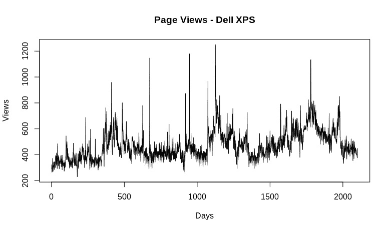
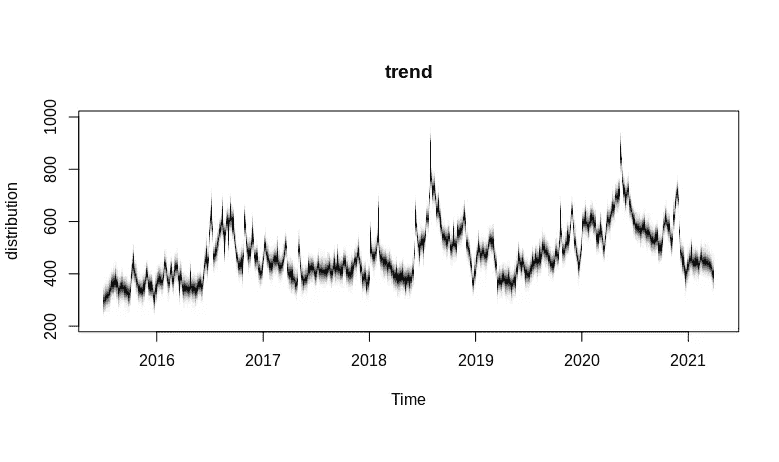
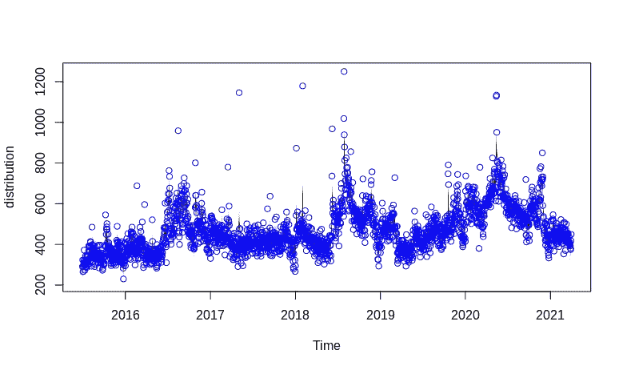
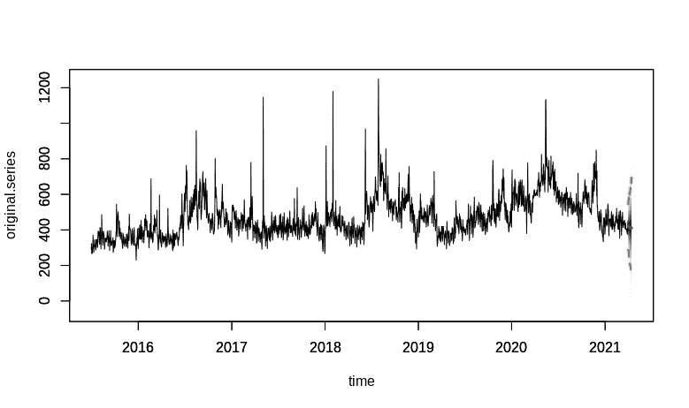

# BSTS 和因果影响:通过网页浏览量分析戴尔 XPS 笔记本电脑的受欢迎程度

> 原文：<https://towardsdatascience.com/bsts-and-causalimpact-analysing-dell-xps-laptop-popularity-by-web-page-views-30015c2456f?source=collection_archive---------26----------------------->

## 新冠肺炎消费者对 Dell XPS 笔记本电脑的兴趣如何？


来源:图片由[Clker-Free-Vector-Images/29580 Images](https://pixabay.com/users/clker-free-vector-images-3736/)来自 [Pixabay](https://pixabay.com/vectors/laptop-black-blue-screen-monitor-33521/)

*免责声明:本文是在“原样”的基础上编写的，没有担保。它旨在提供数据科学概念的概述，不应被解释为专业建议。本文中的发现和解释仅是作者的，不支持或隶属于本文中提到的任何第三方。这篇文章不是为了推销任何特定的公司或产品。*

# 背景

2020 年 2 月， [Forrester](https://go.forrester.com/blogs/new-forrester-forecast-shows-global-tech-market-growth-will-slip-to-3-in-2020-and-2021/) 预测，由于新冠肺炎，对包括计算机和通信设备在内的硬件的需求将非常疲软，因为在经济活动疲软期间，消费者往往会推迟对硬件的资本投资，而软件和云服务将继续蓬勃发展。

其中一个原因是，与软件和云服务相比，硬件通常需要更多的前期投资。因此，经济活动疲软的时期会诱使消费者和企业推迟购买硬件，直到经济状况再次好转。

确定消费者对特定产品范围的兴趣的一种方法是通过分析网页浏览量，例如，某个特定的硬件或软件产品在规定的时间内有多少网页浏览量？

# 业务场景

戴尔 XPS 是一个面向高端市场的高品质笔记本电脑品牌。笔记本电脑在数据科学家中也很受欢迎(我自己就用一台)。

**现在，让我们考虑一下这个场景。**假设戴尔希望确定消费者对 XPS 笔记本电脑的兴趣是否因疫情的经济影响而降低。

在这种情况下，我们如何衡量消费者的兴趣？除了查看销售数字，一种可能是查看搜索术语**“Dell XPS”**的网页浏览量。

事实上，这甚至可能是更可取的，因为人们应该考虑到消费者推迟支出但仍在考虑最终购买该品牌笔记本电脑的可能性，这将反映在页面浏览量保持在与以前类似的水平上。

虽然很容易简单地观察 2020 年 3 月前后网页浏览量的变化，但这并不一定能说明全部情况。

例如，如果没有发生疫情，我们无法确切知道页面浏览量会是什么样子。

在这方面，以下分析将利用以下方法:

1.  使用 [BSTS](https://www.rdocumentation.org/packages/bsts/versions/0.9.5/topics/bsts) (贝叶斯结构时间序列建模)包从 R 到样本从后验分布
2.  使用[因果影响](https://www.rdocumentation.org/packages/CausalImpact/versions/1.2.6/topics/CausalImpact)来尝试计算如果新冠肺炎事件没有发生，网页浏览水平会是什么样

网页浏览量数据来自 pageviews.toolforge.org，它允许对整个维基媒体基金会的特定搜索词的网页浏览量进行分析。

具体来说，从 2015 年 7 月到 2021 年 3 月，检查了搜索词[“戴尔 XPS”](https://pageviews.toolforge.org/?project=en.wikipedia.org&platform=all-access&agent=user&redirects=0&start=2015-07-01&end=2021-03-31&pages=Dell_XPS)的页面浏览量。当使用 CausalImpact 软件包建模时，还会在同一时间段内分析搜索词[“VMware Workstation”](https://pageviews.toolforge.org/?project=en.wikipedia.org&platform=all-access&agent=user&redirects=0&start=2015-07-01&end=2021-03-31&pages=VMware_Workstation)的页面浏览量，并将其用作控制序列— VMware Workstation 是一种虚拟机管理程序，允许在一台 Windows 或 Linux PC 上设置多个操作系统。

假设软件产品受疫情经济衰退的影响较小，如果经济因素没有显著变化，消费者对戴尔 XPS 和 VMware Workstation 的兴趣比较可能会更好地概括消费者对戴尔 XPS 产品的兴趣水平。

# BSTS

以下是指定时间段内“戴尔 XPS”页面浏览量的图示:



来源:RStudio 输出

我们可以看到，在第 1700 天之后——这大约是新冠肺炎疫情在 2020 年 3 月开始站稳脚跟的时候——我们可以看到页面浏览量呈下降趋势。然而，还不清楚这是最近事件的直接结果，还是随机波动的结果。

使用 BSTS 的目的是基于来自后验分布的 MCMC(马尔可夫链蒙特卡罗)采样来量化潜在页面浏览量水平的范围。与其直截了当地预测页面浏览量接下来会如何，我们可以根据后验分布观察到的潜在范围是什么？

页面视图数据以 CSV 格式加载到 R 中。为了让 BSTS 正确解释数据，数据帧随后被转换为 [xts](https://data-hacks.com/r-convert-data-frame-xts-zoo-time-series) 格式:

```
mydata<-read.csv("dellxps.csv")library("xts")
mydata$my_dates <- as.Date(mydata$Date)
mydata <- xts(mydata$Dell.XPS, mydata$my_dates)
```

现在，BSTS 模型被具体化了。在这种情况下，考虑到网页浏览数据固有的易失性，在这种情况下，只有**localineartrend**将被建模。

**执行 1000 次**迭代，并绘制模型组件。

```
library(bsts)
ss <- AddLocalLinearTrend(list(), mydata)model <- bsts(mydata, state.specification = ss, niter = 1000)plot(model)
plot(model, "components")
```

这是趋势和生成的分布，后者显示了在特定时间点可能观察到的潜在结果的范围:

## **趋势**



来源:RStudio 输出

## **分配**



来源:RStudio 输出

现在，让我们进行一些预测。对未来 15 个时间段进行预测，目的是生成一系列在此时间段内可以观察到的潜在页面浏览量。

```
pred <- predict(model, horizon = 15, burn = 100)
pred
plot(pred)
```



来源:RStudio 输出

从上面可以明显看出，BSTS 预测了在选定时期内网页浏览量的一系列结果。提供了平均值、中间值和区间预测。在这个范围的最极端，BSTS 模型预测页面浏览量可能低至 144 或高达 690。

```
> pred$mean
 [1] 418.5689 420.4969 419.4255 418.6695 415.5628
 [6] 413.9601 413.5601 414.8989 415.8069 416.0139
[11] 415.7935 413.9589 408.6109 410.5100 411.8946$median
 [1] 417.8570 417.9747 419.1763 418.3281 417.6503
 [6] 414.5861 418.8882 415.3306 417.3510 413.3739
[11] 417.3411 407.7334 411.0777 411.6520 411.1981$interval
          [,1]     [,2]     [,3]     [,4]     [,5]
2.5%  288.8354 285.9850 275.0117 254.0120 248.9270
97.5% 542.8098 565.5993 567.6804 591.9176 580.5002
          [,6]     [,7]     [,8]     [,9]    [,10]
2.5%  221.8867 208.5441 210.8201 198.3210 195.1280
97.5% 596.5839 608.9127 613.7725 615.1689 640.2005
         [,11]    [,12]    [,13]    [,14]    [,15]
2.5%  182.5640 174.2203 141.7563 143.3177 144.2848
97.5% 648.4422 650.0539 642.7709 694.1793 690.8501
```

在整个时间序列中观察到的每天 471 次页面浏览的总体平均值，预测平均值明显低于平均值。然而，由于页面浏览量中存在大量“峰值”,平均值出现了明显的偏差。如果没有这些异常值，平均水平可能更接近于 BSTS 计算的水平。

# 因果影响

如前所述，时间序列分析的一个缺点是，在没有干预的情况下，不可能分析时间序列的变动。

换句话说，假设新冠肺炎的经济衰退导致硬件更换周期延长，那么如果新冠肺炎事件没有发生，消费者对戴尔 XPS 系列**的兴趣**会有多大是不可能的。

我们最接近这样做的方法是通过分析时间序列和没有受到干预影响的控制序列。同样，假设软件的更换周期不会受到最近事件的影响，VMware Workstation 的网页浏览量用作控制系列。

为了消除异常，两个系列都用对数格式表示。

因果影响用于分析前期和后期，如下所示:

```
pre.period <- c(1, 1705)
post.period <- c(1706, 2101)impact <- CausalImpact(data, pre.period, post.period)
plot(impact)summary(impact)
summary(impact, "report")impact$summary
```

以下是后验推断结果:

```
> summary(impact)
Posterior inference {CausalImpact}Average     
Actual                   6.3         
Prediction (s.d.)        6.1 (0.45)  
95% CI                   [5.2, 6.9]  

Absolute effect (s.d.)   0.19 (0.45) 
95% CI                   [-0.63, 1.1]

Relative effect (s.d.)   3.1% (7.4%) 
95% CI                   [-10%, 17%] 
                         Cumulative      
Actual                   2495.5          
Prediction (s.d.)        2421.4 (178.46) 
95% CI                   [2078.2, 2745.2]

Absolute effect (s.d.)   74.13 (178.46)  
95% CI                   [-249.67, 417.3]

Relative effect (s.d.)   3.1% (7.4%)     
95% CI                   [-10%, 17%]Posterior tail-area probability p:   0.34393
Posterior prob. of a causal effect:  66%For more details, type: summary(impact, "report")
```

在这种情况下，与预测的 **6.1** 相比，戴尔 XPS 的实际网页浏览量在 **6.3** 时实际高于预期(均以对数格式表示)。因果效应的后验概率为 66%。

让我们阅读由 CausalImpact 生成的扩展摘要。

```
> summary(impact, "report")
Analysis report {CausalImpact}During the post-intervention period, the response variable had an average value of approx. 6.30\. In the absence of an intervention, we would have expected an average response of 6.11\. The 95% interval of this counterfactual prediction is [5.25, 6.93]. Subtracting this prediction from the observed response yields an estimate of the causal effect the intervention had on the response variable. This effect is 0.19 with a 95% interval of [-0.63, 1.05]. For a discussion of the significance of this effect, see below.Summing up the individual data points during the post-intervention period (which can only sometimes be meaningfully interpreted), the response variable had an overall value of 2.50K. Had the intervention not taken place, we would have expected a sum of 2.42K. The 95% interval of this prediction is [2.08K, 2.75K].The above results are given in terms of absolute numbers. In relative terms, the response variable showed an increase of +3%. The 95% interval of this percentage is [-10%, +17%].This means that, although the intervention appears to have caused a positive effect, this effect is not statistically significant when considering the entire post-intervention period as a whole. Individual days or shorter stretches within the intervention period may of course still have had a significant effect, as indicated whenever the lower limit of the impact time series (lower plot) was above zero. The apparent effect could be the result of random fluctuations that are unrelated to the intervention. This is often the case when the intervention period is very long and includes much of the time when the effect has already worn off. It can also be the case when the intervention period is too short to distinguish the signal from the noise. Finally, failing to find a significant effect can happen when there are not enough control variables or when these variables do not correlate well with the response variable during the learning period.The probability of obtaining this effect by chance is p = 0.344\. This means the effect may be spurious and would generally not be considered statistically significant.
```

最终，分析得出的平均值高于预测值，但不具有统计学意义，即可能是偶然获得的。

这也可能意味着干预期比预期的要短——即新冠肺炎对硬件市场的任何可能的经济影响都是短暂的。

最终，BSTS 和 CausalImpact 的分析未能证明过去一年对戴尔 XPS 的兴趣受到了负面影响。

# 限制

当然，以上分析带有局限性。首先，它只是在考虑硬件市场无数产品中的一种。对其他硬件产品的兴趣可能相对下降，但对戴尔 XPS 的兴趣仍然很强。

此外，我们无法确定消费者对某个特定软件产品(在本例中为 VMware Workstation)的兴趣是否代表了整个软件市场。如果使用 CausalImpact 来比较戴尔 XPS 与另一款软件产品的页面浏览量，结果可能会有所不同。

此外，只考虑了一个干预点。2020 年 3 月—新冠肺炎被宣布为全球疫情。可能有其他重要的干预点没有被考虑，但可能仍然是重要的，例如，那些与新产品的发布、市场的新进入者等相一致的干预点。

最后，只有一个来源的网页浏览量被用作基准。有很多方法可以衡量消费者对产品的潜在兴趣，这里没有讨论。

# 结论

这是贝叶斯方法如何用于分析时间序列中的干预的一个例子。具体来说，您看到了如何使用 BSTS 和因果影响:

*   分析网页浏览
*   后验分布样本
*   生成后验预测
*   使用干预分析预测时间序列

在进行分析时，我们也看到了一些与贝叶斯时间序列建模相关的局限性，以及如何谨慎解释结果。

非常感谢您的宝贵时间，非常感谢您的任何问题或反馈。你也可以在 michael-grogan.com[的](https://www.michael-grogan.com/)找到更多我的数据科学内容。

# 参考

*   [bsts 功能—r 文档](https://www.rdocumentation.org/packages/bsts/versions/0.9.5/topics/bsts)
*   [因果影响函数—记录](https://www.rdocumentation.org/packages/CausalImpact/versions/1.2.6/topics/CausalImpact)
*   [数据黑客:R 如何将数据帧转换为 xts &动物园时间序列](https://data-hacks.com/r-convert-data-frame-xts-zoo-time-series)
*   [Toolforge —浏览量分析(戴尔 XPS)](https://pageviews.toolforge.org/?project=en.wikipedia.org&platform=all-access&agent=user&redirects=0&start=2015-07-01&end=2021-03-31&pages=Dell_XPS)
*   [Toolforge —浏览量分析(VMware 工作站)](https://pageviews.toolforge.org/?project=en.wikipedia.org&platform=all-access&agent=user&redirects=0&start=2015-07-01&end=2021-03-31&pages=VMware_Workstation)