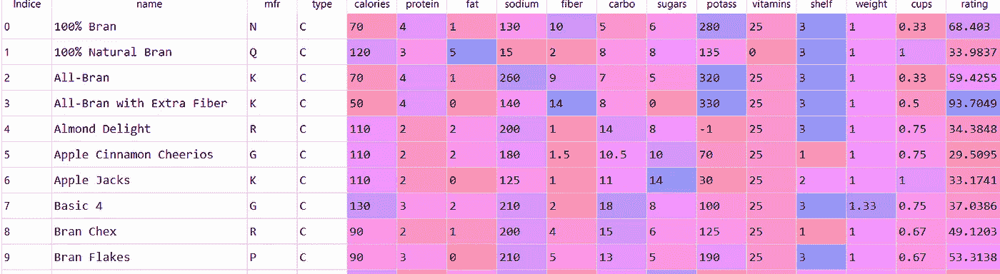
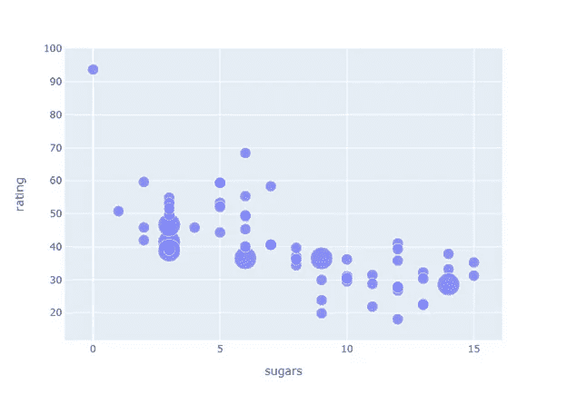
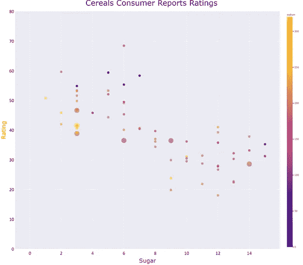
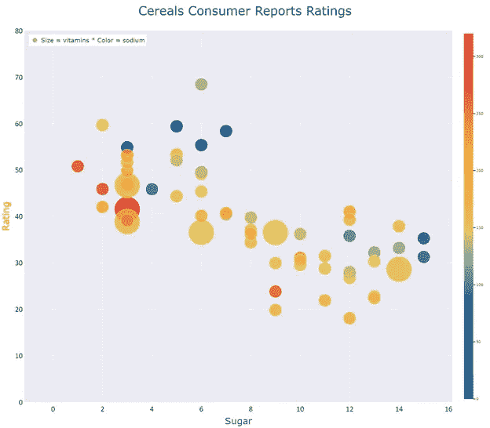

# 气泡图

> 原文：<https://towardsdatascience.com/bubble-charts-70ef7485c51e?source=collection_archive---------27----------------------->

## plotly Express vs . plotly . graph _ objects


安德鲁·伍尔夫在 [Unsplash](https://unsplash.com/s/photos/bubbles?utm_source=unsplash&utm_medium=referral&utm_content=creditCopyText) 上的照片

# **数据可视化**

数据可视化讲故事是人类最原始的交流形式。有可追溯到公元前 44000 年的洞穴绘画，远早于公元前 3000 年的文字交流。

根据进化论，**我们是视觉物种**:我们进化的方式使得大量的精神资源被用于视觉感知和知识获取。比起文字，我们更注重视觉元素。

我们的大脑是一个带宽非常宽的并行图像处理器。一些数据证实了上面的说法:传输到我们大脑的信息 90%是视觉的；视觉信息传递到大脑的速度比同样的信息以文本形式传递要快 6 万倍；65%的学生是视觉学习者。

数据可视化是一种交流工具。这是讲述我们数据中的故事并将其传达给适当受众的最有力方式。但在一个充满屏幕和视觉元素的世界里，我们必须防止观众出现视觉疲劳的症状。

所以我们的图表和数字应该:视觉上有趣；展示一个清晰的故事；有可以利用的信息；有一个信息丰富的标题，清晰标注的轴，适当的图例，最好是没有不必要元素的二维图表。

当信息的本质是显示三个或更多数字变量之间的**联系或相关性时，**一个好的图表应该帮助我们找到模式，确定相关性的存在或不存在，识别异常值，并显示集群和缺口的存在。**气泡图**非常适合这种用途。

# **气泡图**

气泡图用于确定至少**三个数值变量** **是否相关**或共享某种模式。在笛卡尔坐标系中，为一对数值变量( **A，B** )的每次观察绘制一个气泡或圆盘，圆盘根据变量 A 的值水平放置，根据变量 B 垂直放置。第三个数值变量(C)通过气泡的**区域表示。你甚至可以在不同的泡泡中使用不同的颜色加入第四个变量( **D** :数字或分类)。**

通过这些数据点产生的形状以及气泡或圆盘相对大小的差异，讲述了三个或四个变量之间的关系，而不是它们的确切值。

在特殊情况下，它们可以用来显示一段时间内的趋势或比较分类变量。它们被认为是[散点图](https://medium.com/analytics-vidhya/scatter-plots-why-how-3de6e1e32645)的自然延伸，其中的点被气泡或**圆盘所取代。**

# **带有 Plotly Express 的气泡图**

**Plotly Express (PE)是 Plotly.py 的高级包装器，与 Plotly 生态系统的其余部分完全兼容**，简单、强大，有点类似 Seaborn。它是免费的，可以用于商业应用和产品。该库包括绘制趋势线和地图的函数，以及执行**刻面**和动画的函数。有了 PE，你可以在线制作交互式图形，也可以离线保存。

我们使用了从 Kaggle [1]下载的数据集。它属于 80 种谷类产品的营养数据。这些数据是由康奈尔大学的学生于 20 世纪 90 年代早期在当地的威格曼斯超市收集的。我们想知道《消费者报告》的评级和一些特定的营养数据(糖、钠、维生素)之间是否有关联。

首先，我们导入 Plotly Express 为 *px，*熊猫库为 *pd* ，并将我们的 *csv 文件*转换成**数据帧**:

```
import pandas as pd
import plotly.express as pxdf = pd.read_csv(path + 'cereals.csv', index_col = False,
                 header = 0,   sep = ';', engine='python')
```

下面的屏幕截图显示了数据集的前十条记录:



实际的数据探索表明，我们只需使用`*df.dropna(inplace = True)*` 消除一些具有 N/A 值的行，数据集就可以绘制图形了。

对于本文中的气泡图，Plotly Express 函数为 `*px.scatter*`，对应的参数为:`*data_frame*`； `x=`代表一个数值变量的*数据帧*中的列名；`*y=*`表示另一个数值变量的*数据帧*中的列名；`*size=*`通过气泡的**区域表示第三个数值变量的*数据帧*中的列名。**

```
df.dropna(inplace = True)fig0 = px.scatter(df, x = 'sugars', y = 'rating',size = 'vitamins')fig0.write_image(path + "figbubble0.png")fig0.show()
```



图 0:气泡图。作者用 Plotly Express 制作的图表。

毫无疑问，这不是一个有用的讲故事的合适图表。

我们认为 0 糖和 93 等级的泡沫是异常值。我们没有删除该点，而是在范围[0–80]内建立了 y 轴。此外，我们使用`*px.scatter*.`中的 `*color*` 参数合并了第四个数值变量

我们用 `*update.layout*`更新了图表:设置标题、字体大小、 [*模板*、](/histograms-with-plotly-express-e9e134ae37ad)以及带有宽度和高度的图形尺寸。然后我们更新了 x 轴和 y 轴(文本、字体、tickfont)。我们将图表保存为静态的 *png* 文件，最后，我们绘制了图表。

```
fig1 = px.scatter(df, x = 'sugars', y = 'rating',
                  size = 'vitamins',   color = 'sodium')fig1.update_layout(
                   title = "Cereals Consumer Reports Ratings ",
                   "title_font_size = 40,    
                   template = 'seaborn',
                   width = 1600, height = 1400)fig1.update_xaxes(
                  title_text = 'Sugar',
                  title_font=dict(size=30, family='Verdana',  
                                  color='purple'),
                  tickfont=dict(family='Calibri', color='black', 
                                size=25))fig1.update_yaxes(
                  title_text = "Rating", range = (0,80),
                  title_font=dict(size=30, family='Verdana', 
                                  color='orange'),
                  tickfont=dict(family='Calibri', color='black', 
                                size=25)fig1.write_image(path + "figbubble1.png")
fig1.show()
```



图 1:一个合适的气泡图。作者用 Plotly Express 制作的图表。

图 1 清楚地显示了消费者评价和谷物含糖量之间的负相关关系。右侧的彩色垂直刻度表示钠的量(`color = ‘sodium’`)。由于图表上的彩色气泡分布均匀，我们可以得出结论，钠的含量不会显著影响消费者的鉴赏能力。最后，气泡的大小与谷物中维生素的数量有关。该图显示了评级和维生素之间的零关系。

# **气泡图与 Plotly.graph_objects**

`*plotly.graph_objects*` 模块包含了 Python 类的层次结构。`*Figure*` 是初级类。`*Figure*` 具有数据属性和布局属性。数据属性有 40 多个对象，每个对象引用一个特定类型的图表( **trace** )及其相应的参数。布局属性指定图形的整体属性(轴、标题、形状、图例等。).

使用 *plotly.graph_objects* 的概念是使用 `.*add_trace(go.Scatter())*` 创建图形，然后添加`.update_layout(), .update_xaxes, .update_yaxes`等方法来操作图形。最后，我们用`.write_image()` 导出图形，并用`.show().`渲染

注意，我们键入了带有颜色、色彩空间、不透明度、大小和其他大小参数的`mode = ‘markers’`和*字典*。特别是，`*sizeref*` 属性允许缩放气泡的大小，而`*colorscale*` 允许显示特定的调色板。图例的文本由`*name*` 属性表示。

```
import plotly.graph_objects as go
fig2 = go.Figure()sizeref = 2.*max(df['sodium'])/(150**2)fig2.add_trace(go.Scatter(
                          x = df['sugars'], y = df['rating'],
                          mode = 'markers',
                          name = 'Size = vitamins * Color = sodium',
                          marker = dict(color = df['sodium'],
                          colorscale = 'portland',
                          opacity = 0.8,size = df['vitamins'],
                          sizemode = 'area', sizeref= sizeref,
                          sizemin= 4, showscale = True
                          )))fig2.update_layout(title = "Cereals Consumer Reports Ratings ",
                   title_font_size = 40, template = 'seaborn',
                   width = 1600, height = 1400)fig2.update_layout(legend=dict(
                               yanchor="top", y=0.99,
                               xanchor="left",x=0.01),
                               legend_font_size= 20,
                               showlegend = True)fig2.update_xaxes(title_text = 'Sugar',
                  title_font=dict(size=30, family='Verdana', 
                                  color='purple'),
                  tickfont=dict(family='Calibri', color='black', 
                                 size=25))fig2.update_yaxes(title_text = "Rating", range = (0,80),
                  title_font=dict(size=30, family='Verdana', 
                                  color='orange'),
                  tickfont=dict(family='Calibri', color='black', 
                                size=25))fig2.write_image(path + "figbubble2.png")
fig2.show()
```



图 2:带有 Plotly.graph_objects 的气泡图。作者使用与上图相同的数据集制作的图表。

**总结一下:**

当我们想要显示三个或四个变量之间的关系而不是它们的确切值时，气泡图是合适的。Plotly Express 和 Plotly.graph_objects 允许您使用少量且一致的代码行创建高质量的静态图像。

但是您必须注意以下警告:

*   请记住，气泡的面积与其半径不成正比，而是与其平方成正比；
*   与散点图不同，气泡图不会随着数据点数量的增加而改善；
*   它们不应用于表示零或负值，因为没有负或零区域；
*   要用气泡图显示一段时间内的趋势，你必须把时间变量放在横轴上。

如果你对这篇文章感兴趣，请阅读我以前的([https://medium.com/@dar.wtz](https://medium.com/@dar.wtz)):

带 Plotly Express、跟踪和布局的面积图

</area-charts-with-plotly-express-510a1f12ac11>  

带有 Plotly Express、主题和模板的直方图

</histograms-with-plotly-express-e9e134ae37ad>  

**参考文献**

[1]:[https://www.kaggle.com/crawford/80-cereals](https://www.kaggle.com/crawford/80-cereals)

[2]:[https://www . ka ggle . com/Crawford/80-麦片/discussion/154053](https://www.kaggle.com/crawford/80-cereals/discussion/154053)