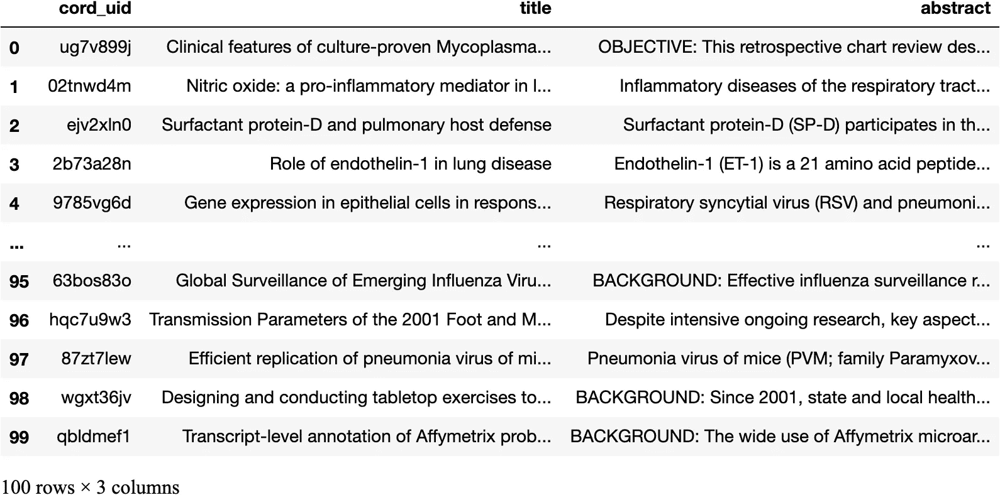

# 用 Vespa 从 python 构建一个基本的文本搜索应用程序

> 原文：<https://towardsdatascience.com/build-a-basic-text-search-application-from-python-with-vespa-b0a4f77dcbb4?source=collection_archive---------21----------------------->

> pyvespa 简化 API 简介。用几行代码从 python 构建 Vespa 应用程序。

这篇文章将向您介绍简化的`pyvespa` API，*允许我们用 python* 的几行代码从头开始构建一个基本的文本搜索应用程序。后续的帖子将通过在这里描述的基础应用之上逐步构建来增加复杂性。


莎拉·多维勒在 [Unsplash](https://unsplash.com/s/photos/simple?utm_source=unsplash&utm_medium=referral&utm_content=creditCopyText) 上拍摄的照片

`pyvespa`在 python 中公开了 [Vespa](https://vespa.ai/) API 的子集。该库的主要目标是允许更快的原型开发，并促进 Vespa 应用程序的机器学习实验。我曾经写过我们如何使用它来[连接正在运行的 Vespa 应用并与之交互](/how-to-connect-and-interact-with-search-applications-from-python-520118139f69)和[评估 python](/how-to-evaluate-vespa-ranking-functions-from-python-7749650f6e1a) 的 Vespa 排名函数。*这一次，我们重点关注从零开始构建和部署应用程序。*

## 安装

这里介绍的 pyvespa 简化 API 发布于版本`0.2.0`

`pip3 install pyvespa>=0.2.0`

## 定义应用程序

例如，我们将构建一个应用程序来搜索 [CORD19 样本数据](https://ir.nist.gov/covidSubmit/data.html)。

## 创建应用程序包

第一步是创建一个 Vespa [应用包](https://pyvespa.readthedocs.io/en/latest/reference-api.html#vespa.package.ApplicationPackage):

```
from vespa.package import ApplicationPackage

app_package = ApplicationPackage(name="cord19")
```

## 向架构中添加字段

然后我们可以将[字段](https://pyvespa.readthedocs.io/en/latest/reference-api.html#vespa.package.Field)添加到在`app_package`中默认创建的应用程序的[模式](https://pyvespa.readthedocs.io/en/latest/reference-api.html#vespa.package.Schema)中。

```
from vespa.package import Field

app_package.schema.add_fields(
    Field(
        name = "cord_uid", 
        type = "string", 
        indexing = ["attribute", "summary"]
    ),
    Field(
        name = "title", 
        type = "string", 
        indexing = ["index", "summary"], 
        index = "enable-bm25"
    ),
    Field(
        name = "abstract", 
        type = "string", 
        indexing = ["index", "summary"], 
        index = "enable-bm25"
    )
)
```

*   `cord_uid`将存储 cord19 文档 id，而`title`和`abstract`不言自明。
*   在这种情况下，所有字段都是类型`string`。
*   将`"index"`列入`indexing`列表意味着 Vespa 将为`title`和`abstract`创建一个可搜索的索引。你可以在 [Vespa 文档](https://docs.vespa.ai/documentation/reference/schema-reference.html#indexing)中了解更多关于`indexing`可用选项的信息。
*   设置`index = "enable-bm25"`使 Vespa 预先计算数量，以便快速计算 bm25 分数。我们将使用 BM25 对检索到的文档进行排序。

## 查询时搜索多个字段

字段集将字段组合在一起进行搜索。例如，下面定义的`default`字段集将`title`和`abstract`组合在一起。

```
from vespa.package import FieldSet

app_package.schema.add_field_set(
    FieldSet(name = "default", fields = ["title", "abstract"])
)
```

## 定义如何对匹配的文档进行排序

我们可以通过定义一个 [RankProfile](https://pyvespa.readthedocs.io/en/latest/reference-api.html#vespa.package.RankProfile) 来指定如何对匹配的文档进行排序。在这种情况下，我们定义了`bm25`等级配置文件，它结合了在`title`和`abstract`字段上计算的 BM25 分数。

```
from vespa.package import RankProfile

app_package.schema.add_rank_profile(
    RankProfile(
        name = "bm25", 
        first_phase = "bm25(title) + bm25(abstract)"
    )
)
```

## 部署应用程序

我们现在已经定义了一个包含相关字段的基本文本搜索应用程序，一个将字段分组在一起的字段集，以及一个对匹配文档进行排名的排名配置文件。是时候部署我们的应用程序了。我们可以通过创建 [VespaDocker](https://pyvespa.readthedocs.io/en/latest/reference-api.html#vespa.package.VespaDocker) 的实例，使用 Docker 在本地部署我们的`app_package`，而无需离开笔记本，如下所示:

```
from vespa.package import VespaDocker

vespa_docker = VespaDocker(
    disk_folder="/Users/username/cord19_app",
    port=8080
)

app = vespa_docker.deploy(
    application_package = app_package,
)Waiting for configuration server.
Waiting for configuration server.
Waiting for configuration server.
Waiting for configuration server.
Waiting for configuration server.
Waiting for configuration server.
Waiting for application status.
Finished deployment.
```

`app`现在拥有一个 [Vespa](https://pyvespa.readthedocs.io/en/latest/reference-api.html#vespa.application.Vespa) 实例，我们将使用它与我们的应用程序进行交互。恭喜，您现在已经有了一个可以运行的 Vespa 应用程序。

要知道`pyvespa`提供了一个方便的 API 来定义来自 python 的 Vespa 应用包，这一点很重要。`vespa_docker.deploy`将 Vespa 配置文件导出到上面定义的`disk_folder`。浏览这些文件是开始学习 Vespa 语法的一个很好的方法。

## 输入一些数据

部署 Vespa 应用程序后，我们的第一个动作通常是向它提供一些数据。为了更容易理解，我们准备了一个包含 100 行的`DataFrame`，以及模式定义所需的`cord_uid`、`title`和`abstract`列。

```
from pandas import read_csv

parsed_feed = read_csv(
    "https://thigm85.github.io/data/cord19/parsed_feed_100.csv"
)parsed_feed
```



然后我们可以遍历上面的`DataFrame`并通过使用 [app.feed_data_point](https://pyvespa.readthedocs.io/en/latest/reference-api.html#vespa.application.Vespa.feed_data_point) 方法来填充每一行:

*   默认情况下，模式名被设置为等于应用程序名，在本例中为`cord19`。
*   当向 Vespa 提供数据时，我们必须为每个数据点提供一个唯一的 id。这里我们用`cord_uid`。

```
for idx, row in parsed_feed.iterrows():
    fields = {
        "cord_uid": str(row["cord_uid"]),
        "title": str(row["title"]),
        "abstract": str(row["abstract"])
    }
    response = app.feed_data_point(
        schema = "cord19",
        data_id = str(row["cord_uid"]),
        fields = fields,
    )
```

如果需要，您还可以检查对每个请求的响应。

```
response.json(){'pathId': '/document/v1/cord19/cord19/docid/qbldmef1',
 'id': 'id:cord19:cord19::qbldmef1'}
```

## 查询您的应用程序

有了数据，我们可以开始查询我们的文本搜索应用程序。我们可以通过向 [app.query](https://pyvespa.readthedocs.io/en/latest/reference-api.html#vespa.application.Vespa.query) 方法的主体参数发送所需的参数，直接使用 [Vespa 查询语言](https://docs.vespa.ai/en/query-language.html)。

```
query = {
    'yql': 'select * from sources * where userQuery();',
    'query': 'What is the role of endothelin-1',
    'ranking': 'bm25',
    'type': 'any',
    'presentation.timing': True,
    'hits': 3
}res = app.query(body=query)
res.hits[0]{'id': 'id:cord19:cord19::2b73a28n',
 'relevance': 20.79338929607865,
 'source': 'cord19_content',
 'fields': {'sddocname': 'cord19',
  'documentid': 'id:cord19:cord19::2b73a28n',
  'cord_uid': '2b73a28n',
  'title': 'Role of endothelin-1 in lung disease',
  'abstract': 'Endothelin-1 (ET-1) is a 21 amino acid peptide with diverse biological activity that has been implicated in numerous diseases. ET-1 is a potent mitogen regulator of smooth muscle tone, and inflammatory mediator that may play a key role in diseases of the airways, pulmonary circulation, and inflammatory lung diseases, both acute and chronic. This review will focus on the biology of ET-1 and its role in lung disease.'}}
```

我们还可以通过使用 [QueryModel](https://pyvespa.readthedocs.io/en/latest/reference-api.html#vespa.query.QueryModel) 抽象来定义相同的查询，它允许我们指定我们希望如何匹配和排列我们的文档。在这种情况下，我们定义我们想要:

*   使用`OR`操作符匹配我们的文档，该操作符匹配与查询至少共享一个术语的所有文档。
*   使用我们的应用程序包中定义的`bm25`等级配置文件对匹配的文档进行分级。

```
from vespa.query import QueryModel, RankProfile as Ranking, OR

res = app.query(
    query="What is the role of endothelin-1", 
    query_model=QueryModel(
        match_phase = OR(),
        rank_profile = Ranking(name="bm25")
    )

)
res.hits[0]{'id': 'id:cord19:cord19::2b73a28n',
 'relevance': 20.79338929607865,
 'source': 'cord19_content',
 'fields': {'sddocname': 'cord19',
  'documentid': 'id:cord19:cord19::2b73a28n',
  'cord_uid': '2b73a28n',
  'title': 'Role of endothelin-1 in lung disease',
  'abstract': 'Endothelin-1 (ET-1) is a 21 amino acid peptide with diverse biological activity that has been implicated in numerous diseases. ET-1 is a potent mitogen regulator of smooth muscle tone, and inflammatory mediator that may play a key role in diseases of the airways, pulmonary circulation, and inflammatory lung diseases, both acute and chronic. This review will focus on the biology of ET-1 and its role in lung disease.'}}
```

使用 Vespa 查询语言作为我们的第一个示例，可以为您提供 Vespa 所能提供的全部功能和灵活性。相比之下，QueryModel 抽象侧重于特定的用例，对于 ML 实验可能更有用，但这是以后的主题。