# 用 Facebook Messenger 在 60 分钟内创建一个聊天机器人

> 原文：<https://towardsdatascience.com/build-a-chatbot-with-facebook-messenger-in-under-60-minutes-f4c8b8046a91?source=collection_archive---------12----------------------->

## 使用 Rasa 部署一个人工智能助手——从构思到脸书——只需一小时。


[沃洛德梅尔·赫里先科](https://unsplash.com/@lunarts?utm_source=medium&utm_medium=referral)在 [Unsplash](https://unsplash.com?utm_source=medium&utm_medium=referral) 上的照片

[Rasa](https://rasa.com/) 是一个开源的对话式 AI 框架，使用机器学习来构建聊天机器人和 AI 助手。今天，我将向您展示如何使用 Rasa 构建您自己的简单聊天机器人，并将其作为机器人部署到脸书信使——所有这一切都在一个小时内完成。你所需要的只是一些简单的 Python 编程和一个有效的互联网连接。

**完整代码可以在这里找到:**[**GitHub Repo**](https://github.com/happilyeverafter95/demo-bot)

代码是用 Python 3.7 开发和测试的。Rasa 目前只支持 Python 到 3.8(更新见[此处](https://rasa.com/docs/rasa/installation/))。

我们今天构建的机器人将非常简单，不会深入到任何高级 NLP 应用程序中。然而，该框架确实为更复杂的应用程序提供了充分的支持。

我推荐 DeepLearning 提供的这个 Coursera 课程。人工智能学习更多自然语言处理。

[](https://click.linksynergy.com/link?id=J2RDo*Rlzkk&offerid=759505.16188218824&type=2&murl=https%3A%2F%2Fwww.coursera.org%2Flearn%2Fsequence-models-in-nlp) [## 基于序列模型的自然语言处理

### 在 deeplearning.ai 提供的自然语言处理专业化的课程 3 中，你将:a)训练一个神经…

click.linksynergy.com](https://click.linksynergy.com/link?id=J2RDo*Rlzkk&offerid=759505.16188218824&type=2&murl=https%3A%2F%2Fwww.coursera.org%2Flearn%2Fsequence-models-in-nlp) 

# 我们开始吧！

克隆我的[回购](https://github.com/happilyeverafter95/demo-bot)的完整代码。

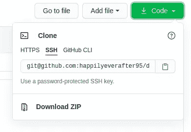

# 属国

确保安装了所有依赖项。我们的简单机器人只需要两个库:

```
rasa==2.2.0
spacy==2.2.4
```

如果您克隆了我的库，您可以运行`pip install -r requirements.txt`从根目录安装这两个库。

spacy 语言模型需要在单独的步骤中安装。

```
python3 -m spacy download en_core_web_md
python3 -m spacy link en_core_web_md en
```

# 知识库演练

在我向您展示如何培训和部署我们的助手之前，让我们来看一下每个组件，了解它们是如何组合在一起的。

这些文件中的大部分可以通过运行`rasa init`来生成，这将创建一个包含示例训练数据、动作和配置文件的新项目。

我们将从配置文件开始。

# 配置文件

## endpoints.yml

这是助手的所有端点所在的位置。为了支持[自定义动作](https://rasa.com/docs/rasa/next/custom-actions)(基本上是您可以编写的用于调用其他 API、查询数据库或访问您构建的其他服务的自定义代码)，我们需要创建动作服务器。为此，将`action_endpoint`包含在该文件中。

这里还可以定义其他端点，例如，使用 Kafka 发送事件，或者将对话存储在 Redis 中，而不是存储在内存中。

这是我们的端点文件的样子。

```
action_endpoint:
  url: "http://localhost:5055/webhook"
```

## config.yml

配置文件定义了模型将如何被训练——这是你可以真正发挥创造力的地方。第一行用于指定聊天机器人语言。在这里，它将是英语。

```
language: "en"
```

下一个组件配置 NLU 管道。我们正在使用 Rasa 推荐的“合理的”启动管道之一。

```
pipeline:  
  - name: SpacyNLP
  - name: SpacyTokenizer
  - name: SpacyFeaturizer
...
```

接下来是`policies`。这些是 Rasa 回应用户信息时将遵循的政策。

```
policies:  
  - name: MemoizationPolicy
  - name: RulePolicy
  core_fallback_threshold: 0.3
  core_fallback_action_name: action_default_fallback       
...
```

MemoizationPolicy 会记住训练故事中的最后 X 个事件。可以通过将`max_history`添加到策略配置中来指定 x。

RulePolicy 利用我们为机器人编写的硬规则(我们将在后面讨论)来形成响应。尽管 RulePolicy 是第二个指定的，但它将优先于其他策略。这是因为默认情况下，RulePolicy 具有最高优先级，这些优先级也可以配置。通过我们的策略配置，机器人将首先检查适用的规则，如果没有，则转向训练故事。

我们的策略还配置了默认的回退机制。当动作置信度低于我们的`core_fallback_threshold`0.3 时，它将发送一个预定义的响应，称为`utter_default`，并恢复到触发回退之前的状态。当用户说一些完全没有意义的事情时，这非常有用。

## credentials.yml

如果你的代码托管在 GitHub 之类的地方，在发布这个文件之前你应该三思。该文件是身份验证所必需的。我们将利用它来连接到我们的 Facebook Messenger 机器人。我暂时隐藏了这些秘密，但是我们也将介绍如何从脸书生成它们。

**注意:**这个文件不包含在我的 GitHub repo 中。您需要创建这个文件，并用稍后生成的令牌填充它。

```
facebook: verify: "[this is your custom verification token]" secret: "[this is generated from facebook]" page-access-token: "[this is generated from facebook]"
```

## domain.yml

来自官方 [RASA 文档](https://rasa.com/docs/rasa/domain/):

> 域定义了您的助手在其中工作的领域。它指定了你的机器人应该知道的意图、实体、插槽、响应、形式和动作。它还定义了对话会话的配置。

domain.yml 文件分为意图、实体、槽、响应、动作和会话配置。

*   这个机器人被训练成能识别你定义的意图，并根据检测到的意图做出不同的行为
*   如果您在管道中指定了实体提取器，它将提取您在该文件中定义的所有实体；实体可用于进一步调节对话流
*   插槽是机器人将信息存储到内存中的键值对；在对话过程中，可以随时设置、重置和检索插槽
*   响应是预定义的响应模板，供机器人发送消息；我们的默认回退将总是在到达那个状态时发送与`utter_default`相关的消息
*   操作包括已经定义的任何自定义操作

在会话配置中，我们可以定义会话到期时间，以及是否应该将时隙转移到新会话。

# 培训用数据

我们将训练数据分成三个文件夹:nlu、规则和故事。在 nlu 文件夹中，我们定义了我们的意图和实体。在 rules 文件夹中，我们定义了通过 RulePolicy 执行的规则。stories 文件夹包含模拟对话，用作如何管理对话的附加培训数据。

## nlu.yml

在我们的 NLU 设置中，我们定义了一些非常基本的意图。以下是我们的“问候”意图示例，它使用了以下培训数据:

```
nlu:
  - intent: greet  
    examples: |    
      - hey    
      - hello    
      - hiya
...
```

官方文档更加详细地介绍了如何改进 NLU 组件，例如通过包含实体、同义词和查找表。

## rules.yml

规则定义了机器人应该始终遵循的小型对话模式。RulePolicy 利用这些规则管理对话流。

这里，我们定义了一个简单的规则“总是问候用户”。当机器人遇到“问候”意图时(它根据上面提供的数据学习识别问候意图)，它将继续执行自定义操作`action_greet`。

```
- rule: always greet the user 
  steps:    
    - intent: greet    
    - action: action_greet
```

## stories.yml

故事是“真实”对话的例子，用于进一步训练机器人的对话管理模型。它们被写成用户和机器人之间的对话。

我们将包括一个非常简单的故事。

```
version: "2.0"stories: - story: generic happy pathsteps: - intent: greet - action: action_greet - intent: select_price - action: action_select_upper_price - intent: select_purpose - action: action_select_purpose - intent: select_brand - action: action_select_brand
```

# 自定义操作

自定义操作对于更复杂的机器人来说非常有用——它们可以用来调用其他内部 NLP 服务或公共 API 来改善对话体验。

自定义动作存储在`actions/actions.py`

这里有一个我们的自定义动作`action_greet`的例子，它问候用户。

每个自定义操作都遵循非常标准的格式。有一个`name`方法返回定制动作的名称——这个名称必须与 domain.yml 中提供的名称相匹配

`run`方法需要接受一个分派器、跟踪器和域。

*   调度程序用于生成响应(这里它发出两条消息)
*   追踪器指的是会话追踪器，并且可以被利用来获取槽值、当前和过去的状态

返回值是在操作结束时执行的事件列表。下面是一些我们可以包括在内的常用事件:

*   插槽集-用于设置插槽值
*   后续操作—触发后续操作
*   重新启动—结束当前对话

# 培训和启动机器人

一旦你有了以上所有的文件，你就可以训练机器人了。在根目录下运行`rasa train`开始这个过程。根据您拥有的数据量和管道的复杂程度，这可能需要一段时间。

如果您看到此消息，这意味着模型已成功训练并保存。

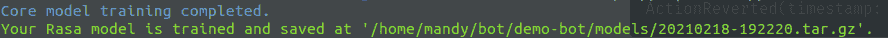

您需要运行两个命令来启动 bot——一个用于操作服务器，一个用于 bot 本身。我在这里把它合并成一行。

**注意:**这将在本地启动机器人。稍后，我们需要用脸书生成的令牌填充我们的凭证文件，以将其部署到 Messenger。

```
rasa run -m models --enable-api --cors "*" --debug & rasa run actions
```

这是我的终端在该命令运行完毕后的样子。每次服务器参与对话时，都会有额外的日志。

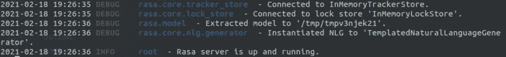

当上述程序运行时，操作服务器将占用端口 5055，而机器人将占用端口 5005。

您可以通过 ping[http://localhost:5005](http://localhost:5005)来测试服务器是否正在运行。

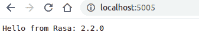

# 与机器人互动

有几种方法可以开始与机器人互动。

## REST API

您可以通过 REST API 与 bot 进行交互。当 RASA 服务器运行时，以用户身份发送此请求以发送消息:

```
curl --request POST \
  --url [http://localhost:5005](http://localhost:5005)/webhooks/rest/webhook \
  --header 'content-type: application/json' \
  --data '{"sender": "sender_id", "message": "hi"}'
```

发件人字段是会话的唯一 ID。当您在同一个发件人字段下按顺序发送邮件时，服务器会识别出这些邮件都是一个会话的一部分。消息字段是您要发送的文本。

## RASA shell

你可以通过命令行运行`rasa shell`与机器人开始对话。

# Facebook Messenger 设置

我倾向于通过 [ngrok](https://ngrok.com/) 来部署 Rasa 服务器，这将把您的本地端口暴露给公共互联网。或者，你可以使用 Heroku 之类的服务，但 Rasa 映像的大小使得应用程序很难在大多数空闲层上运行。

## ngrok 设置

1.  创建一个 [ngrok](https://ngrok.com/) 账户
2.  按照以下说明在您的电脑上设置 ngrok:[https://ngrok.com/download](https://ngrok.com/download)
3.  通过在单独的终端中运行`./ngrok http 5005`,在端口 5005 上启动 HTTP 隧道

确保你保持终端运行——任何时候终端停止运行，你的隧道将停止，你的机器人将在 Messenger 上没有响应。

记下生成的 url。安全的网址(与 https)将需要提供给脸书。

## 在脸书上创建应用程序

脸书机器人需要链接到脸书网页。你需要一个脸书账户来创建一个页面。

一旦你的页面创建好了，去[https://developers.facebook.com/apps](https://developers.facebook.com/apps)。点击绿色的“创建应用程序”按钮创建一个新的应用程序。

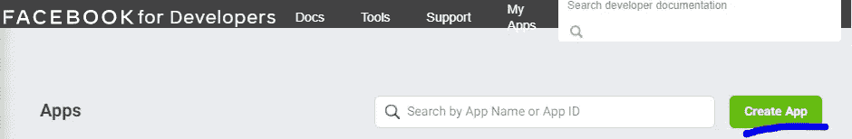

选择第一个选项，并按照说明创建您的应用程序。

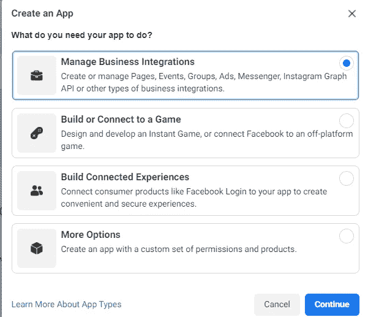

点击下方的“设置”按钮，将“Messenger”添加到您的应用程序中。

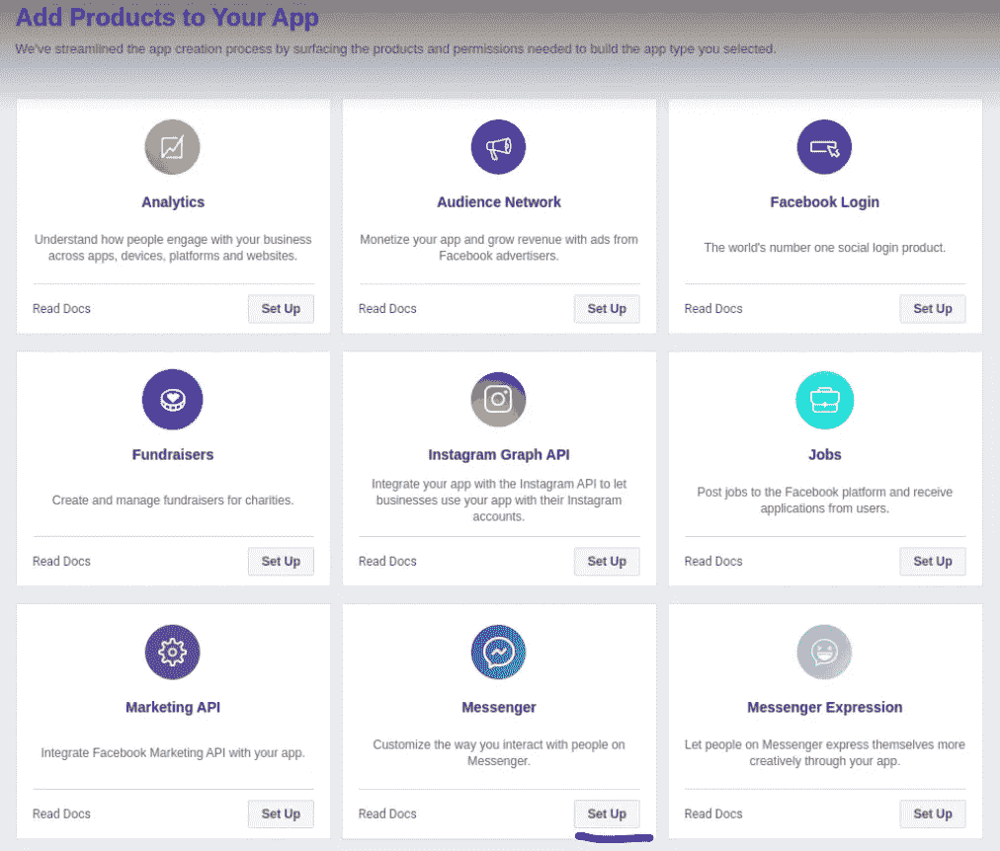

## 在脸书上设置应用程序

一旦创建了应用程序，它会引导你进入 Messenger 下的“设置”页面。如果您没有被自动带到那里，请导航到您的应用仪表板，然后进入“信使”>“设置”:

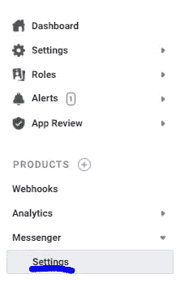

首先，将你的脸书页面链接到应用程序。

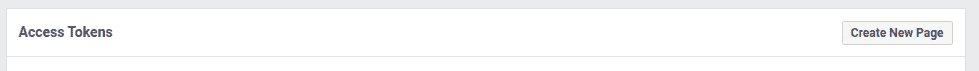

在链接页面旁边，添加订阅以允许邮件。

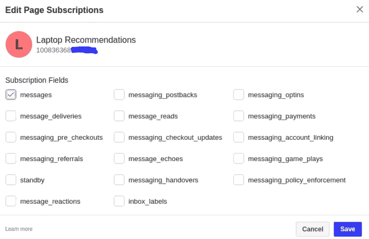

一旦你的页面被链接，点击页面旁边的“生成令牌”。跟踪这个令牌，因为它需要包含在您的 Rasa 项目中。我们将这个令牌称为“页面访问令牌”。

接下来，导航到仪表板上的设置>基本，找到您的应用程序密码。

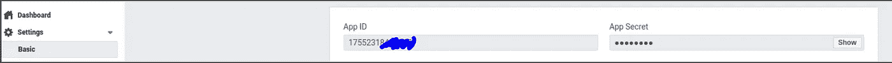

然后，向下滚动到“webhooks”添加一个新的回调 URL。

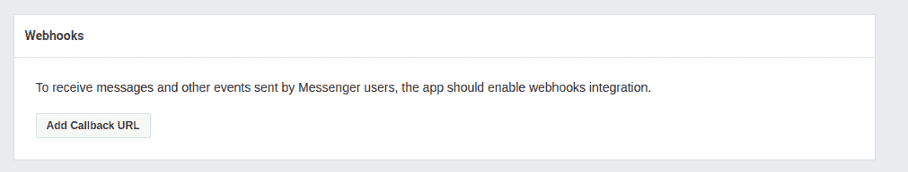

在填写回调细节之前，在 Rasa 项目中创建 credentials.yml。该文件应该如下所示:

以下是填充字段的方法:

*   **验证:**创建您选择的安全验证令牌
*   **秘密:**这是从基本设置中获取的应用程序秘密
*   **页面访问令牌:**使用您之前为页面生成的页面访问令牌

通过运行以下命令再次启动 Rasa 服务器。这与前面的命令略有不同，因为我们现在利用了凭据标志。

```
rasa run -m models --enable-api --cors "*" --debug --credentials credentials.yml & rasa run actions
```

获取作为 credentials.yml 的一部分创建的 verify 标记，并在 Webhooks 部分的回调 URL 旁边输入它。

*   回调 URL 为[https://{ ngrok _ URL }/web hooks/Facebook/web hook](https://{ngrok_url}/webhooks/facebook/rest)

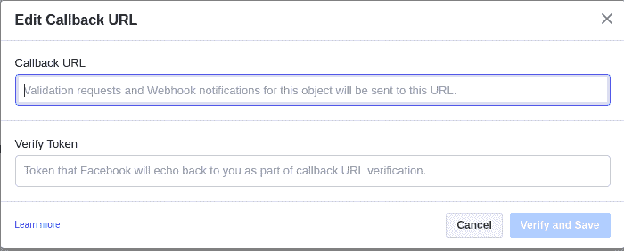

**注意:**在你的 ngrok 隧道停止的任何时候，你都必须重启它，并在脸书上更新你的回拨 URL

# 验证您的应用程序已启动并正在运行

导航到您的页面并尝试向机器人发送消息。

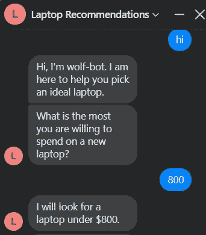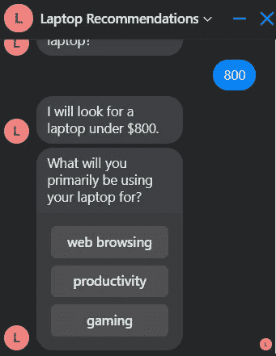

太棒了，都准备好了！目前状态下的机器人实际上不会提供有意义的笔记本电脑推荐——也许有一天会的:)

# 感谢您的阅读！

[通过 Medium](https://medium.com/@mandygu) 关注我的最新动态。😃

作为一个业余爱好项目，我还在 www.dscrashcourse.com[建立了一套全面的**免费**数据科学课程和练习题。](http://www.dscrashcourse.com/)

再次感谢您的阅读！📕