# 为实际用例建立分类模型

> 原文：<https://towardsdatascience.com/build-a-classification-model-for-a-practical-use-case-670a1bb8dd11?source=collection_archive---------21----------------------->

## 具有核心技巧和松弛变量支持向量机深度挖掘


在 [Unsplash](https://unsplash.com/s/photos/night-sky?utm_source=unsplash&utm_medium=referral&utm_content=creditCopyText) 上由 [Ameer Basheer](https://unsplash.com/@24ameer?utm_source=unsplash&utm_medium=referral&utm_content=creditCopyText) 拍摄的照片

数据科学家你好！我希望你们都过得很好。上次我们讨论了如何用核心概念从零开始构建一个回归模型到一个实际用例。今天，我计划向您提供对分类模型的高级理解，并通过实践经验深入了解实际场景。

在本文中，您将了解到:

*   支持向量机
*   拉格朗日乘数
*   松弛变量
*   内核技巧
*   超参数调谐
*   类别不平衡处理
*   准确度测量

> ***用例:*** *银行营销数据集:与一家葡萄牙银行机构的直接营销活动(电话)相关。目标是预测客户是否会认购定期存款。*

我在这里使用的数据集来自 [UCI 机器学习库](http://archive.ics.uci.edu/ml/datasets/Bank+Marketing)，它可以公开用于研究。

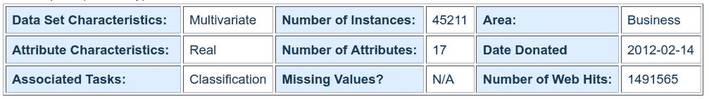

数据集来源:[https://archive.ics.uci.edu/ml/datasets/bank+marketing#](https://archive.ics.uci.edu/ml/datasets/bank+marketing#)

# 1.问题定义

在我们着手做任何事情之前，我们需要了解问题和影响决策的事实。所以根据给定的用例，这是一个分类问题。我们需要预测特定的客户是否愿意将他/她的钱存入银行。

作为数据科学家，我们的总体目标应该是，通过识别影响营销活动成功的主要因素并预测营销活动对特定客户是否会成功，来提高营销活动的效率。

因此，作为第一步，我们需要找出我们在数据集中有什么(+它的复杂性)以及可以直接或间接影响我们预测的特定事实。然后我们需要像往常一样做预处理。

我假设你已经熟悉了我之前的[文章](/build-a-machine-learning-model-to-a-practical-use-case-from-scratch-3a8dc65ab6f1?gi=313b9d219b09)中的预处理步骤。我已经更深入地解释过了。因此，您将能够轻松地对该数据集进行预处理，直至添加 PCA。

此外，您可以参考我在**资源部分**下的 python 笔记本，一步一步地了解这个过程。

预处理完成后，我们需要拟合一个模型。所以根据给定的用例，这是一个分类问题。有如此多的分类技术可用。一些非常受欢迎的是:

1.  k-最近邻(KNN)-通过具有最小距离的多数表决原则确定数据点的类别。
2.  朴素贝叶斯——基于贝叶斯定理的概率算法。
3.  决策树—遵循一组决策规则(if-then-else 条件)来可视化数据并根据条件对其进行分类。

但是你不能盲目地将任何模型应用于给定的数据集。在应用模型之前，您需要了解问题环境、数据集复杂性、每个模型的特点和缺点，以及许多额外的东西。如果您用一些领域级别的理解(+您的经验)正确地分析它，您将能够为您的数据集找到一个更好的适合模型。

在这里，我选择了 SVM 模式。我将用一些数学概念在更深的层次上解释 SVM。如果你赶时间，跳过下面的解释，直接跳到实际的实现(第 6 节)。

# 2.支持向量机解释

支持向量机是机器学习中最流行的分类技术之一，它直接受到一个叫做统计学习理论的数学概念的启发。

它是一种监督学习技术，主要应用于**线性可分的**数据集(特征)。同样，目标(y)应该是明确的。当 y 是连续的，我们可以使用支持向量回归。

线性可分的意思是，我们应该能够找到一条线性直线或者一个线性超平面，能够把数据点完全分成两类。

关键思想是找到尽可能广泛地将一个类与另一个类分开的**最优超平面**。

> 注意——我们只能讨论两类的线性可分性。但是如何处理多类分类呢？等到最后！

如果数据集不是线性可分的，您应该使用非线性转换或松弛变量使它们可分(至少在某种程度上)。我将在几分钟后解释什么是松弛变量。

SVM 的主要直觉是识别边界向量。那么什么是边界呢？我用图表来解释一下。

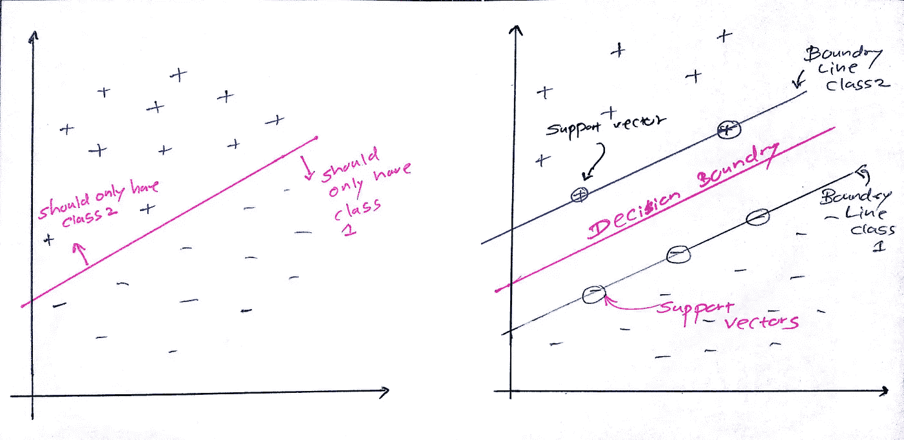

对 SVM 的主要直觉(图片由作者提供)

在线性可分离的数据集中，我们可以找到分隔两个类的边界。(这里我取正和负)这些位于边界线上的向量称为支持向量。

SVM 总能找到线性可分模式的最佳超平面。这个边界被称为决策边界。(在神经网络中，这个判定边界是任意选择的。但是在 SVM，它是以一种最佳的方式被挑选出来的。)

在 SVM，我们讨论如何绘制这些线条，使它们具有最宽的宽度，将阳性样本与阴性样本分开。

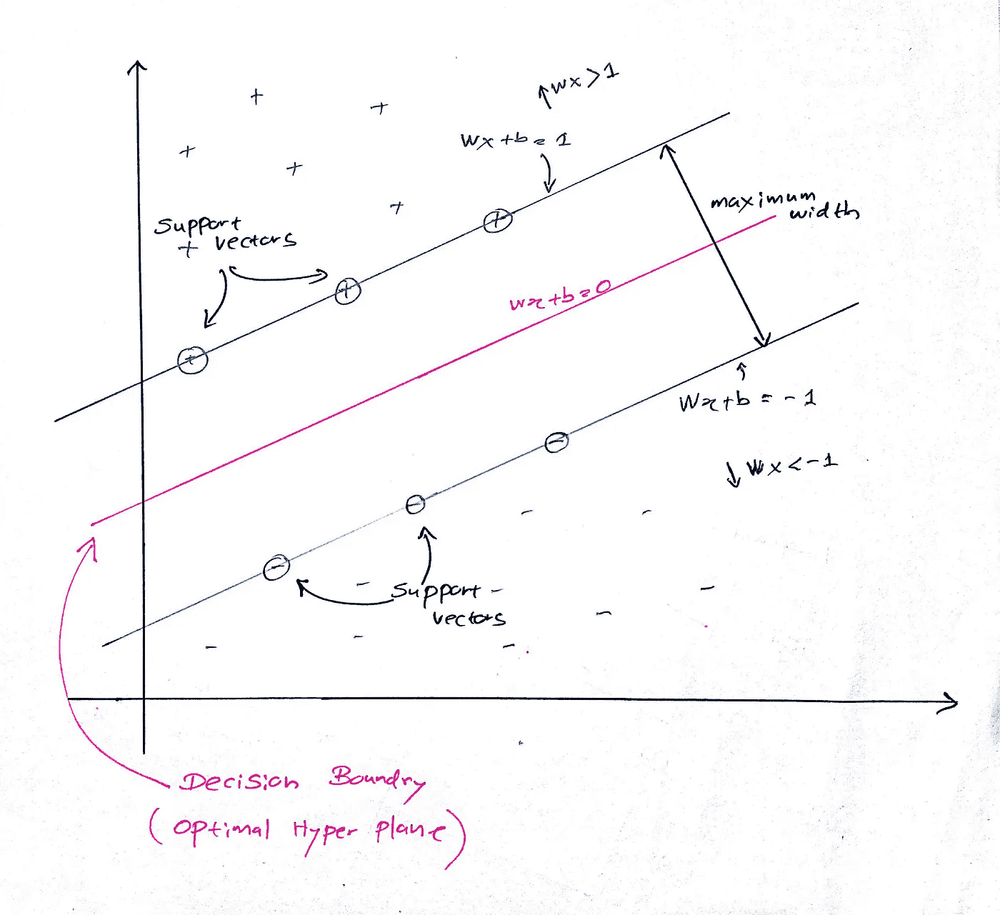

通过最大化宽度来绘制决策边界(图片由作者提供)

所以这 3 条线可以用下面的等式来表示。

*   wx+b = 0——用于决策边界
*   Wx+b=-1 —适用于 1 级边界
*   Wx+b=+1 —用于 2 级边界

阳性样本位于 **Wx+b≥ +1** 侧，阴性样本位于 **Wx+b≤ -1** 侧。

如果我们为正样本引入变量 y=+1，为负样本引入变量 y=-1，那么我们可以得到该条件的一般形式。

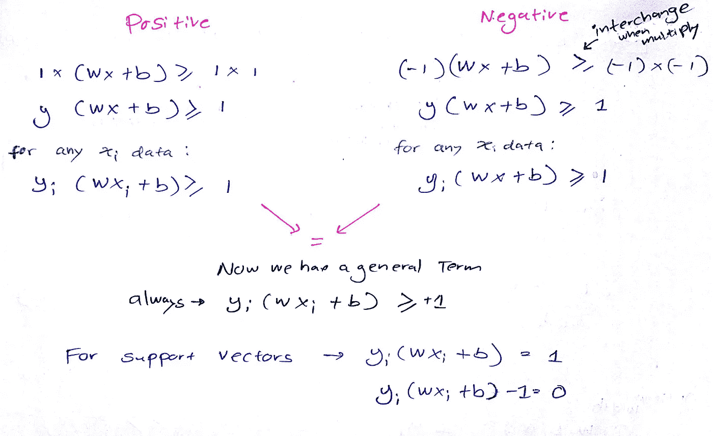

条件的一般形式(作者提供的图片)

如果满足这个条件，所有正负数据点都将在边界线后面。(完美区分两个类别)

当我们确定 w 和 b 时，我们应该考虑最大宽度。让我们找出宽度。

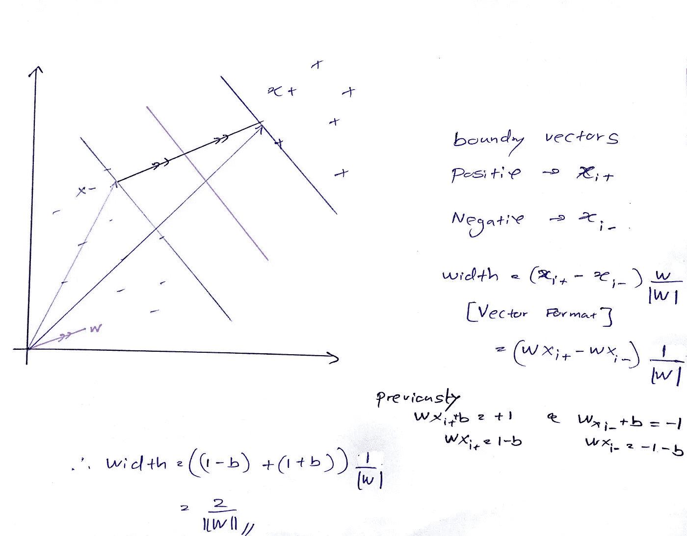

寻找宽度(作者图片)

我们想最大化宽度。为了最大化宽度，我们需要最小化|W|或 1/2|W|(这不会改变优化函数，但在计算梯度时只会导致更整洁的解决方案)

所以最终我们需要在`y(Wx+b)-1=0`的约束下最小化 1/2|W|

如果根据给定的条件，我们需要最小化某个东西，我们拥有的唯一定理是**拉格朗日定理**。所以还是来应用一下吧。

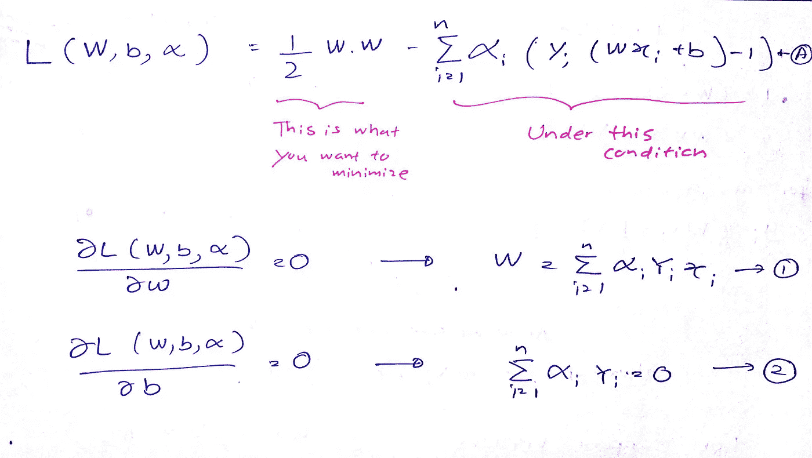

拉格朗日定理的应用(图片由作者提供)

在解完方程并将数值代入前面的方程 A 后，我们可以找到最佳宽度。

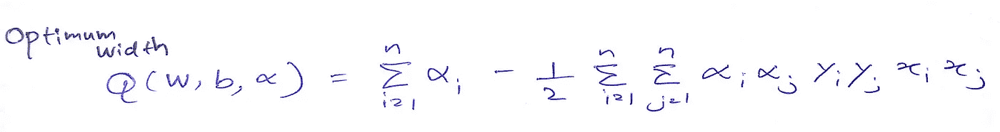

最佳宽度(图片由作者提供)

最佳权重向量和偏差可以这样导出。

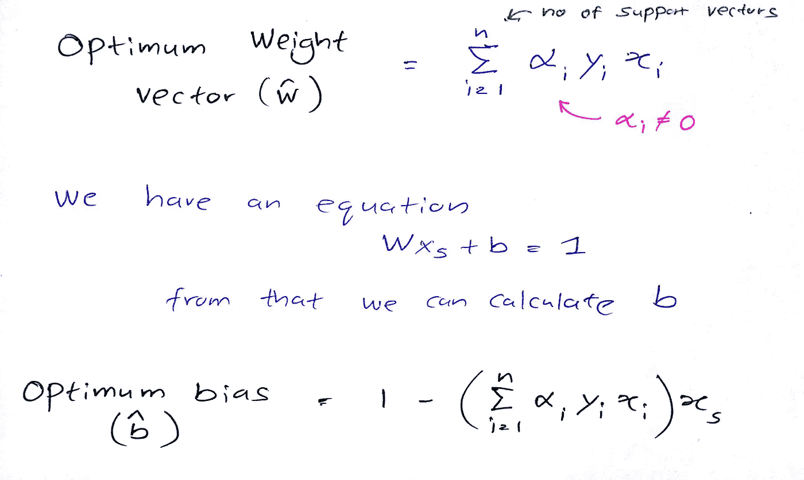

最佳权重向量和偏差(图片由作者提供)

现在我们知道了最佳权重向量和偏差。我们可以用它来预测给定的数据点。

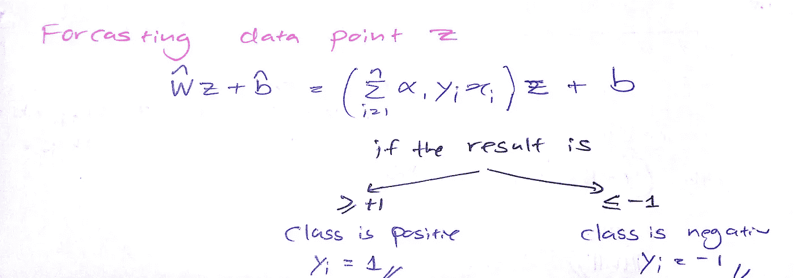

给定数据点的预测(图片由作者提供)

所以到现在为止，我们一直在讨论线性可分数据。如果我们找不到数据之间的线性分离，我们要么将它们转换成线性可分离状态，要么我们需要使用松弛变量技术对这个非线性可分离数据应用 SVM 模型。

# 3.松弛变量的使用

实际上，大多数数据集不会是线性可分的。结果，将没有办法满足我们先前导出的约束。缓解这个问题的一个方法是通过引入松弛变量来放松一些约束。

因此，我们在这里做的是，计算与决策裕度不同的数据点之间的距离，并定义一个罚函数。该罚函数控制对误分类的支持。(由于违反了某些约束，这将导致多少数量被错误地分类。)

我们对落在边界之外的数据点施加惩罚。惩罚参数的实际作用是，它温和地惩罚位于决策边界错误一侧的点。这个损失(ξ)被称为**松弛变量**。

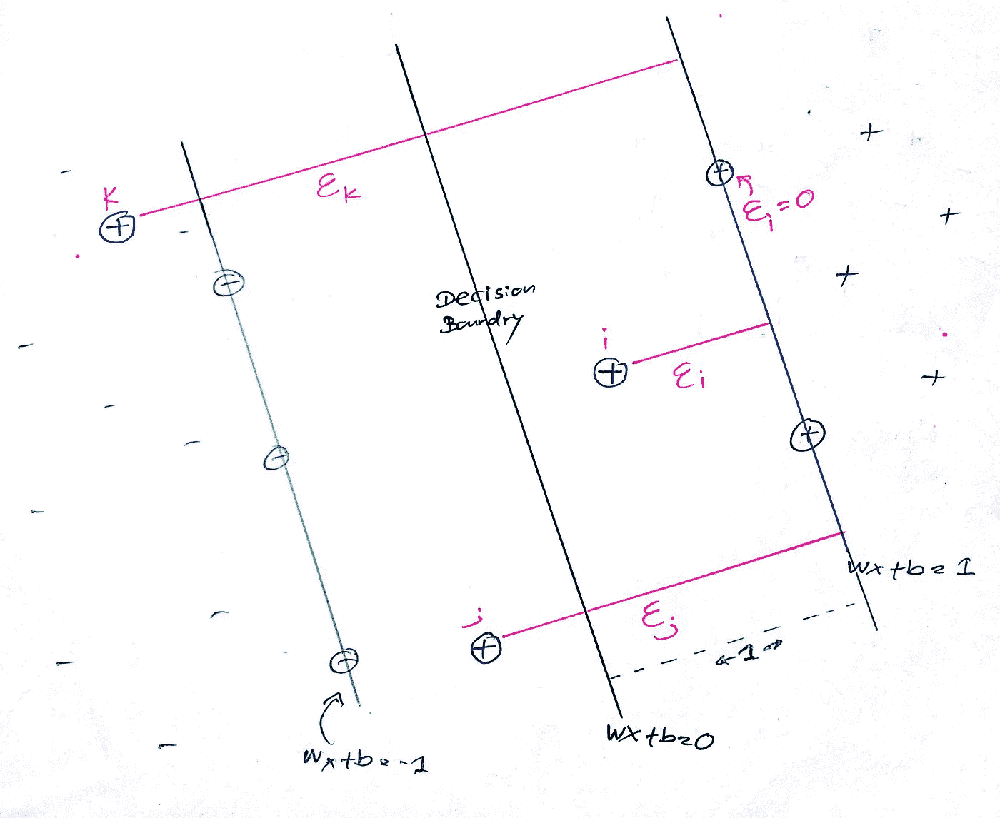

引入惩罚(图片由作者提供)

ξ = 0 表示数据点在正确的边界上或边界内。
对于决策边界上的数据点，ξ = 1。
落在错误一侧的数据点ξ ≥ 1。(j 和 k 被错误分类)

现在我们必须最小化:


最小化新目标(图片由作者提供)

参数 *C* 是*惩罚强度*，它指定了我们有多在乎错误。它也被称为正则化参数，我们用它来调整我们的模型。

如果 C 很小，SVM 就变得很松散，可能会牺牲一些点来获得一个简单的解。这将导致未命中分类的增加。如果 C 非常大，SVM 会变得非常严格(强),并试图获得超平面右侧的所有数据点。这将导致模型过拟合。所以在选择 C 的值时，你应该更加关注。

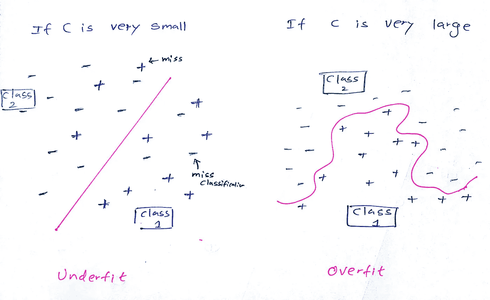

*惩罚*力量 C vs 分类行为(图片由作者提供)

# 4.用于多类分类的 SVM

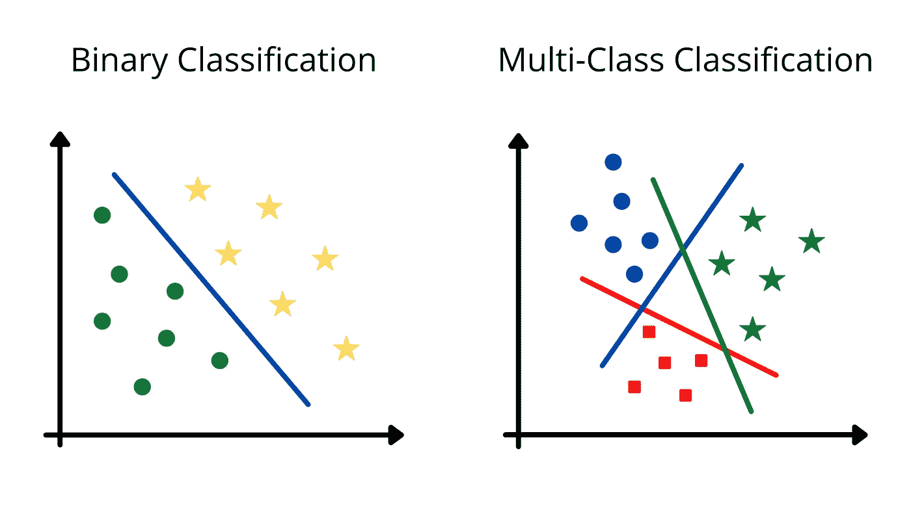

二元对多类分类(图片由作者提供)

SVM 通常用于二元分类。它本身不支持多类分类。因此相同的二元分类原理被用于多类分类。可以看到有两种方法。

1.  ***一对一*方法—** 将多类问题分解为多个二元分类案例。
2.  ***一对多*方法 *—*** 细分设置为每个类一个二元分类器。连续地，某一类与所有其他类相区别。

让我们举一个简单的例子来进一步说明。这里，目标是四个可能的类中的一个:{红色、绿色、蓝色、黄色}。

在**一对一**方法中，我们创建了一组二元分类器，每个分类器代表一个对:

*   OvO 二元分类器 1:红色对绿色
*   OvO 二元分类器 2:红色对蓝色
*   OvO 二元分类器 3:红色 vs 黄色
*   OvO 二元分类器 4:绿色对蓝色
*   OvO 二元分类器 5:绿色对黄色
*   OvO 二元分类器 6:蓝色 vs 黄色

一对一多类分类所需的分类器数量可以用下面的公式(n 为类的数量)来检索:`n*(n-1)/2`

在**一对一**分类器中，仅涉及创建四个二元分类器:

*   OvR 二元分类器 1:红色对{绿色、蓝色、黄色}
*   OvR 二元分类器 2:绿色 vs {红色、蓝色、黄色}
*   OvR 二元分类器 3:蓝色 vs {红色、绿色、黄色}
*   OvR 二元分类器 4:黄色 vs {红色、绿色、蓝色}

因此所需的分类器等于类别的数量。这两者都可以通过使用 scikit-learn 库轻松实现。

```
from sklearn.svm import SVC
from sklearn.multiclass import OneVsOneClassifier
from sklearn.multiclass import OneVsRestClassifier# define model one-vs-one
clf1 = OneVsOneClassifier(SVC());# define model one-vs-rest
clf2 = OneVsRestClassifier(SVC());
```

最好的是什么？最好的方法是根据问题的具体情况而定。所以要明智地使用它。尽管如此，我还是会给出一些赞成和反对的意见。

**一对一**

*   pro 不容易在数据集中造成不平衡。
*   con 仅对每对类将主数据集分割成一个二元分类。

**一比一休息**

*   pro 需要更少的分类器，使其成为更快的选项。
*   con——由于大量的类实例，处理大型数据集具有挑战性。

# 5.内核技巧

内核是适用于所有 SVM 氏症的窍门。这是一种优化技术，使 SVM 更快，并导致高度的普遍性。这是一个非常简单但更强大的概念。

核函数的思想是使操作能够在输入空间中执行，而不是在潜在的高维特征空间中执行。因此，内积不需要在特征空间中计算。

迷茫？让我用图表来解释一下。

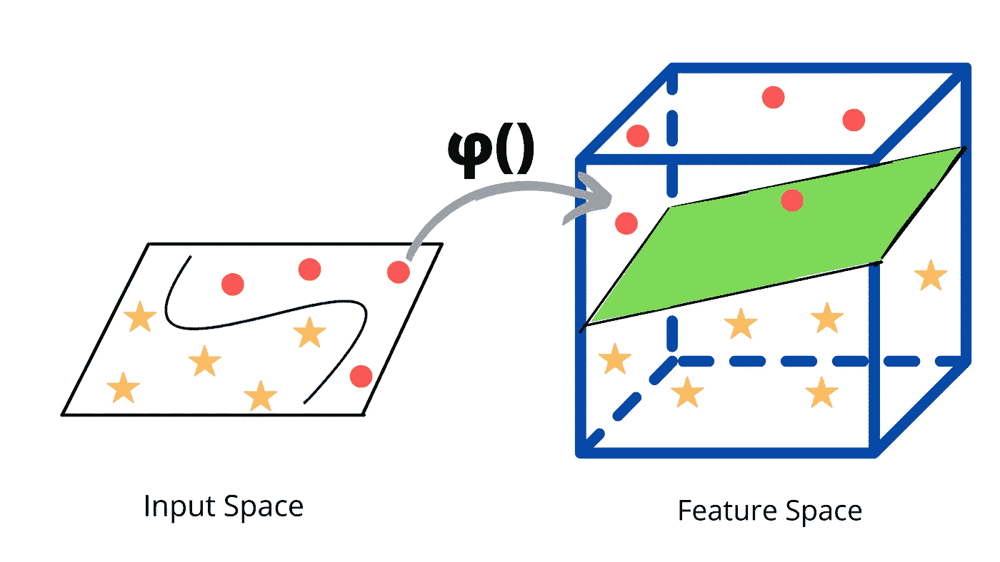

从输入空间到特征空间的数据转换(图片由作者提供)

我们使用函数(φ)将非线性可分数据转换到高维空间，在该空间中我们可以找到线性可分的决策状态。

对于线性可分数据，我们已经推导出宽度为 W =σαy x
,但是现在使用变换函数，它变成 W =σαyφ(x ),最终我们的 Q 最优宽度函数将是:

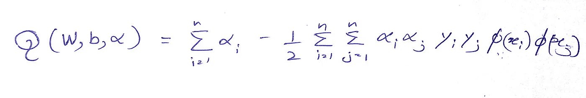

新的最佳宽度函数(图片由作者提供)

这里的问题是我们需要分别计算事物的数量。

*   φ(xi)
*   φ(xj)
*   两者的点积[φ(xi).φ(xj)]

为了降低计算复杂度，我们可以引入另一个函数为:

```
k(xi,xj) =φ(xi)*φ(xj)
```

该函数接受原始低维空间中的输入，并返回高维空间中已转换向量的点积。(直接进行转换，而不是显式地将转换应用于**x** i 和 **xj** 并获得点积)

这就是所谓的**内核技巧**。因此，该函数通过大幅降低计算复杂度，在 SVM 及其性能中起着关键作用。

对于大型数据集(如-10k、1M……)，您不需要对所有数据点逐一进行转换并获得点积，但您可以简单地将此核函数应用于所选数据点，以获得相同的结果，这将有助于降低复杂性。

> **重要提示—核函数应该是对称的。**

最常用的内核类型列表如下所示。

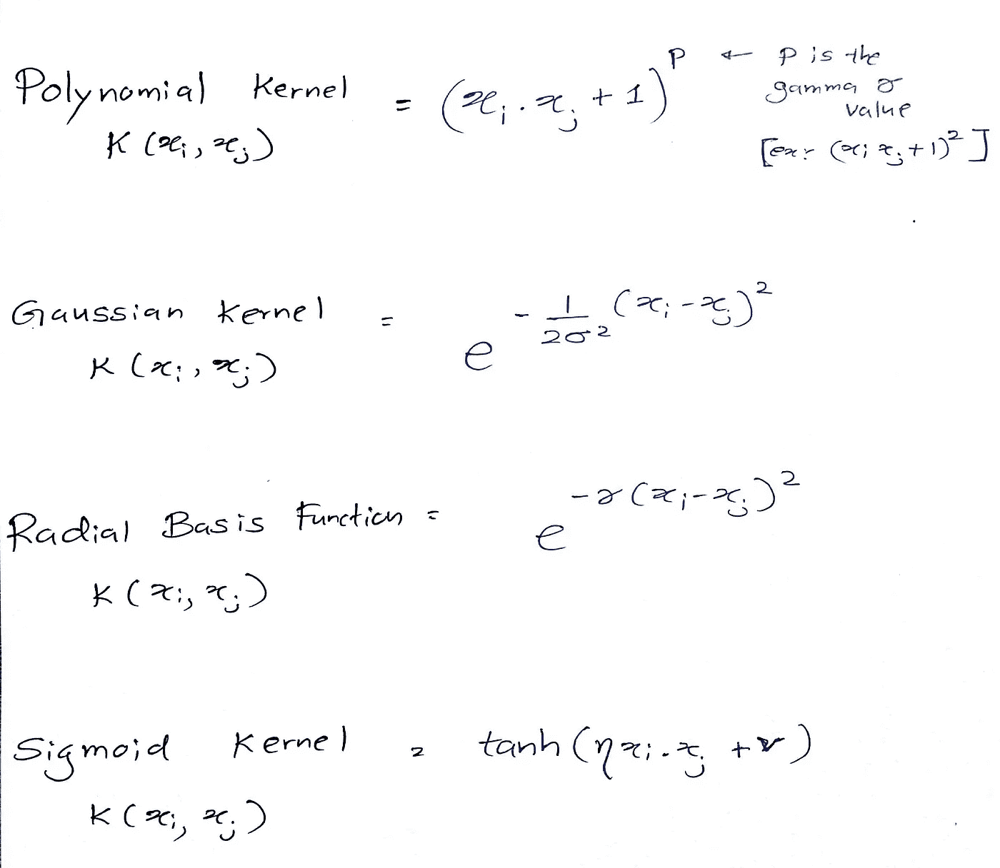

内核类型(图片由作者提供)

最流行的核函数类型是 **RBF。**因为它具有沿整个 x 轴的局部和有限响应。然而，需要记住的一个关键点是，当我们将数据映射到一个更高维度时，我们很有可能会过度拟合模型。因此，选择正确的核函数(+选择正确的参数)和正则化非常重要。

# 6.将 SVM 应用于预处理数据集

好吧！我希望我已经涵盖了 SVM 中的大部分核心概念。让我们回到我们的问题。现在我们需要将 SVM 模型应用到我们的数据集。编写代码比理解概念要容易得多。但是如果你盲目地应用它，那只是一种浪费。在实现任何模型之前，您需要更好地理解基本概念。我打算写更多关于不同模型的文章，并将它们应用于实际用例。希望它也有助于提高你的知识。

拿够了。来做实现吧。

> 我假设您已经在我上一篇文章的帮助下完成了 PCA 之前的所有预处理。

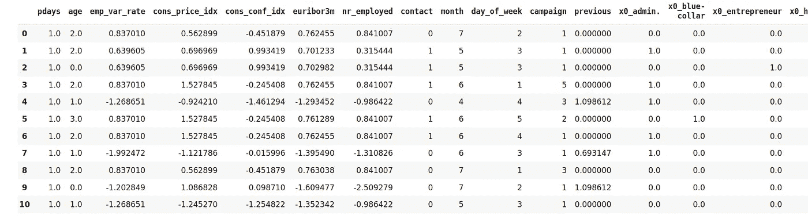

预处理数据集到 PCA(图片由作者提供)

scikit-learn 库提供了支持向量分类器来实现 SVM 模型。

```
from sklearn import svm
svc = svm.SVC(kernel='rbf', C=1.2, gamma=0.5)
```

你可以像往常一样得到预测。

```
predictions = svc.predict(X_test_pca)
y_hat = pd.DataFrame(predictions, columns=["predicted"])
```

# 7.准确性测量和评估

在回归分析中，我们有像均方误差、R 值这样的精度指标..等等。但是在分类问题中，分数在某些情况下可能是误导的(例如不平衡的分类问题)

我们用总预测中的正确预测来衡量准确性。可能会有这样的情况，一些类完全没有被识别(忽略)，但由于其他类的影响，给出了超过 90%的准确率。它们在少数类中占主导地位，并使准确性成为衡量模型性能的不可靠指标。

因此，建议使用以下一些技术，因为它们为所有类别提供了良好的度量，并且是分类任务中最常用的指标。

*   混淆矩阵
*   精确召回和 **F1 得分**
*   AUC - ROC 曲线

## 混淆矩阵

混淆矩阵提供了一个更有洞察力的图像，显示了哪些类被正确和错误地预测，最重要的是，显示了正在犯的错误的类型。它克服了单独使用分类精度的局限性。

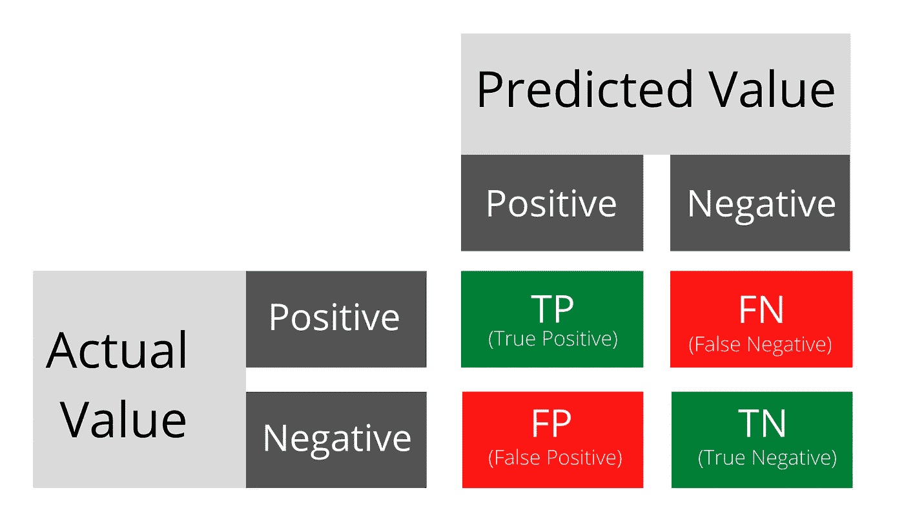

困惑矩阵(图片由作者提供)

以下是需要记住的重要术语。(**真**更好，因为模型正确预测了它们)如果这两个类是正和负:

1.  **真正值(TP):** 实际值是正值，它们被预测为正值
2.  **真负值(TN):** 实际值是负值，它们被预测为负值
3.  **误报(FP):** 实际值为负值，预测值为正值。(也称为 I 型错误)
4.  **假阴性(FN):** 实际值为正，预测值为负。(也称为第二类错误)

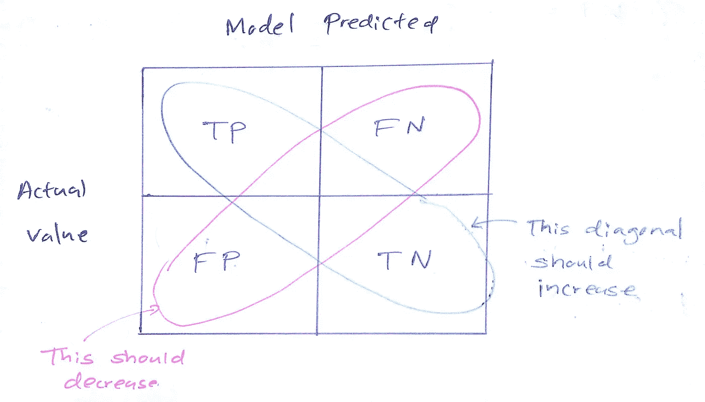

解读困惑矩阵(图片由作者提供)

让我们看看实现。

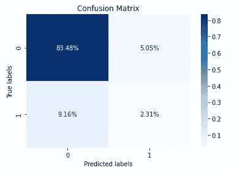

混淆矩阵实现(图片由作者提供)

如您所见，一个类(0)得到了非常好的预测，而另一个却没有。这是因为阶级不平衡。将在几分钟后看到如何克服这一点。

## F1 分数

F1 分数是精确度和召回率的调和平均值。(传达了精准和召回之间的平衡。)我们先来看看什么是精准和召回。

*   精确度—从预测的阳性中，有多少是实际阳性
*   回忆—从实际阳性中，有多少被正确分类

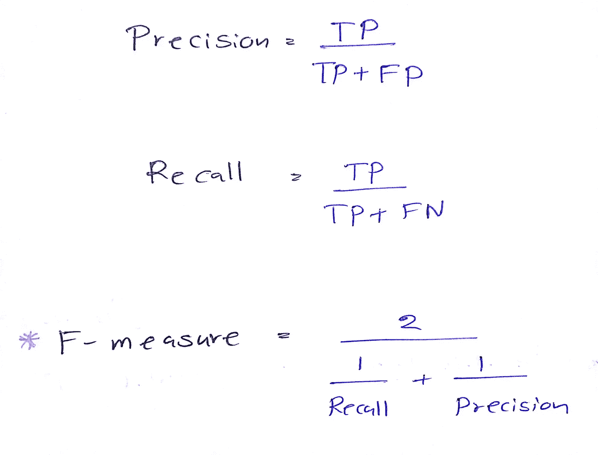

方程式(图片由作者提供)

F1 分数通常比准确性更有用，尤其是如果你的班级分布不均匀。如果假阳性和假阴性具有相似的成本，则准确性最好。如果误报和漏报的代价相差很大，最好同时看精度和召回率。这就是为什么我们使用 F1 的分数。

```
from sklearn.metrics import f1_scoref1_score(y_test,y_hat)
```

F1 的分数为 1 时被认为是完美的，而当分数为 0 时，这个模型就是一个彻底的失败。Scikit-learn 的分类报告精确地提供了所有的分数。

```
from sklearn.metrics import classification_reportprint(classification_report(y_test,y_hat))
```

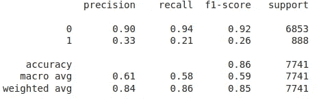

分类报告(图片由作者提供)

> 对于 AUC-ROC 曲线，我将单独写一篇文章，因为它需要更深入地解释。(+带有成本函数)但是如果你好奇，你可以参考我的 Colab 笔记本，因为我把所有代码都放在里面了。

# 8.处理阶级不平衡

你可能会注意到有一个类在预测中占主导地位。那是因为阶级不平衡。我们将类不平衡定义为分类数据集类的比例不均衡。

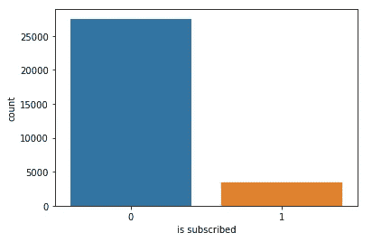

目标中的类不平衡(图片由作者提供)

如果我们检查数据集，我们可以发现这两个类之间的巨大差异。这在大多数实际情况下都会发生，如垃圾邮件检测、欺诈分析等。为了避免这种情况，我们可以使用不同的技术。我将简单解释两种不同的方法。如果你想进一步了解它，请告诉我，我也会就此写一篇单独的文章。

> 请记住，我们需要将这些技术应用于预处理过的数据集，因为它们也被视为模型。另一件事是，我们只对训练数据进行采样。

## 过采样

通过这样做，它将按照多数类比例对少数类比例进行重新采样。

SMOTE 是一种非常著名的过采样技术。(合成少数过采样技术。)它通过利用**k-最近邻**算法来创建合成数据。这就是为什么我们需要在数据预处理之后使用它。

SMOTE 最初从少数类中选取随机数据开始，然后设置数据的 k 个最近邻。然后在随机数据和随机选择的 k-最近邻之间产生合成数据。

SMOTE 有不同的变体/形式，例如边界 SMOTE、SVM SMOTE(使用 SVM 算法)、自适应合成采样(ADASYN)…等等。让我们应用默认形式的 SMOTE。

```
from imblearn.over_sampling import SMOTEsm = SMOTE(random_state=101)
X_train2, y_train2 = sm.fit_resample(X_train_pca, y_train)
```

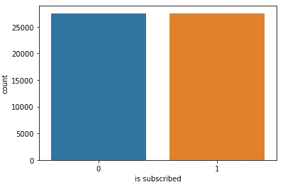

应用 SMOTE 后(图片由作者提供)

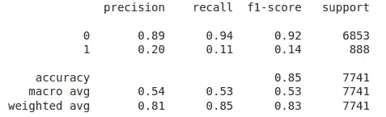

应用 SMOTE 后的分类报告(图片由作者提供)

它为少数民族班级带来了一点进步，但是我对结果有点担心，因为我期望得到更高的结果。没关系！总有改进的余地。如果你有时间，尝试一些不同的方法，如 SVM SMOTE，并把结果放在评论部分。

## 欠采样

通过这样做，它将减少多数阶级的比例，直到人数与少数阶级相似。

最流行的欠采样技术之一是侥幸成功。它也是基于 k-NN 算法。它所做的是当属于不同类别的两个点在分布中彼此非常接近时，该算法消除较大类别的数据点，从而试图平衡分布。

这项技术有三个版本。

*   **接近失误 1 —** 通过计算较大分布和三个最接近的较小分布之间的平均最小距离来平衡数据。
*   **接近失误 2 —** 通过计算较大分布和三个最远的较小分布之间的平均最小距离来选择示例。
*   **接近未命中 3 —** 考虑较小的类实例，并存储 m 个邻居。然后取该分布与较大分布之间的距离，并消除最大距离。

您可以尝试一些不同的方法/排序，并找出最适合您的数据集和模型的方法。这里我使用了版本 3 和两个最近的邻居。

```
# Undersample imbalanced dataset with NearMiss-3
from imblearn.under_sampling import NearMissundersample = NearMiss(version=3, n_neighbors_ver3=2)
# transform the datasetX_train_undermiss, y_train_undermiss  = undersample.fit_resample(X_train_pca, y_train)
```

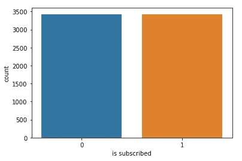

应用未遂事故后(图片由作者提供)

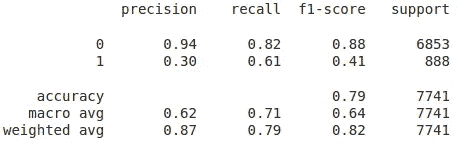

应用未遂事件后的分类报告(图片由作者提供)

虽然精确度下降了，但它为两个类别提供了相当好的分类。

另一种良好的欠采样技术是 Tomek 链接(T-Links ),它是压缩最近邻或简称 CNN 的一种改进。(不要与卷积神经网络混淆)它寻找样本集合的子集，这不会导致模型性能的损失。这种方法比 k-最近邻算法更有效，因为它减少了内存需求。

```
from imblearn.under_sampling import TomekLinks
undersample = TomekLinks()
X_train_under, y_train_under  = undersample.fit_resample(X_train_pca, y_train)
```

# 9.超参数调谐

为了找到超参数的最佳配置，我们可以使用 **GridSerch** 。这是一种调整技术，用于确定给定模型的最佳值。如你所知，在我们的 SVM 模型中，我们使用了两个超参数 C 和γ。但是没有办法预先知道这些超参数的最佳值是什么。

所以，我们需要尝试所有可能的值，才能知道最优值。手动完成这项工作需要大量的时间和精力，因此我们使用网格搜索来自动完成这项工作，它会为我们找到最佳参数。

```
from sklearn.model_selection import GridSearchCV
from sklearn.svm import SVC# defining parameter range
param_grid = {'C': [0.1, 1, 10, 100, 1000], 
              'gamma': [1, 0.1, 0.01, 0.001, 0.0001],
              'kernel': ['rbf']}#grid search
grid = GridSearchCV(SVC(),param_grid,n_jobs=-1,verbose=3,refit = True)# fitting the model for grid search
grid.fit(X_train_pca, y_train.values.ravel())
```

n_jobs 参数允许 GridSearch 在幕后使用 Python 的多处理模块。设置 n_jobs = -1 会导致使用机器上所有可用的内核，这将提高网格搜索性能。

> 注意—在联合实验室中，我们只有 2 个内核。所以还需要一些时间。在我的情况下，它会持续 1 个半小时。

这里将测试不同的参数组合，并最终找到最佳参数。

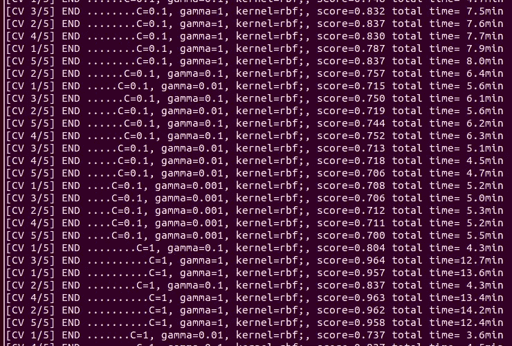

不同网格的性能+时间分析(图片由作者提供)

```
# print best parameter after tuning
print(grid.best_params_)

# print how our model looks after hyper-parameter tuning
print(grid.best_estimator_)
```

微调 T-连锁 SVM 后的结果如下所示。它在所有实例中提供了最好的准确性，但是在识别第二(1)类时仍然有一些缺点。

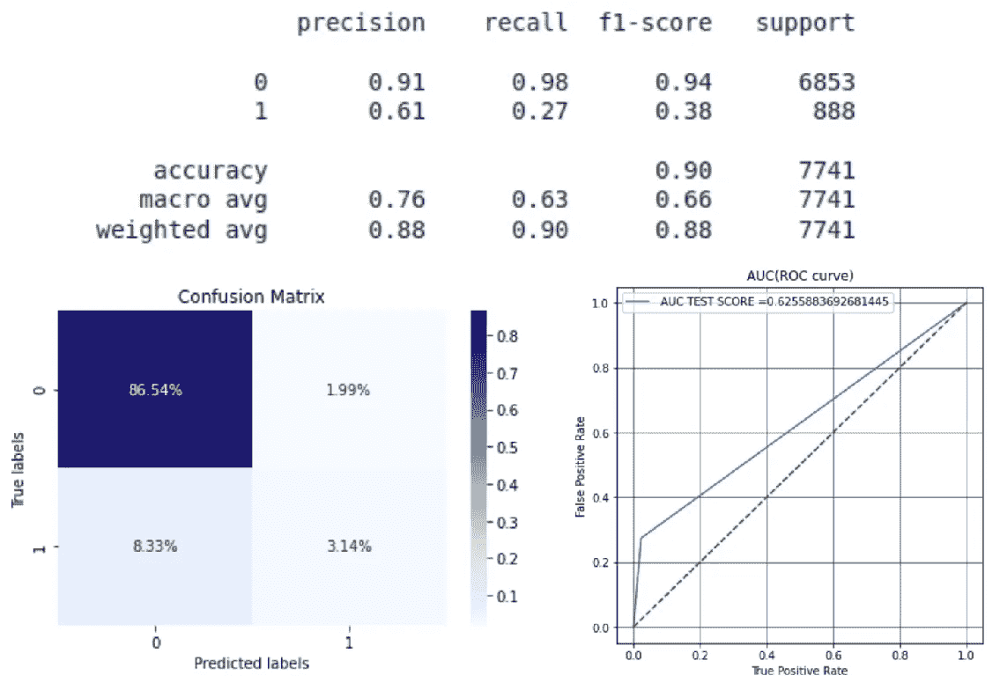

T 型链接的网格搜索优化 SVM(图片由作者提供)

最后，我将向您展示这种情况下两种最佳技术的准确性比较。

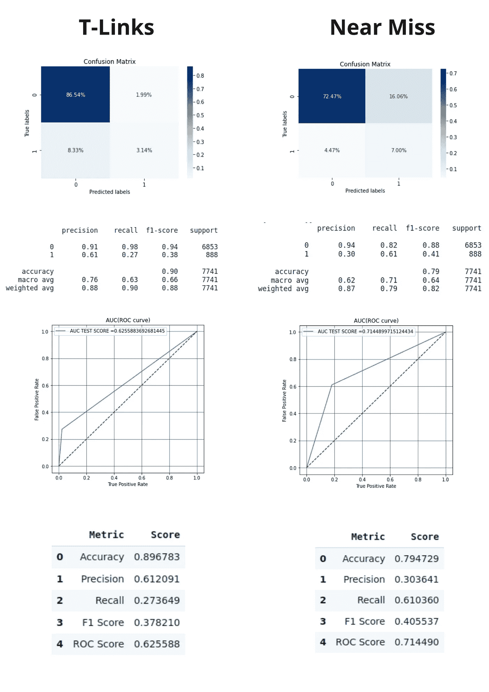

最终对比(图片由作者提供)

# 10.资源

*   完整的合作实验室 Python 笔记本

[](https://colab.research.google.com/drive/1EcVY0jQsO6uKzTMlCPK1wt-T6eEYNDzA?usp=sharing) [## 基于 SVM 的银行营销数据集分类

### 由 Yasas Sandeepa 创作

colab.research.google.com](https://colab.research.google.com/drive/1EcVY0jQsO6uKzTMlCPK1wt-T6eEYNDzA?usp=sharing) 

*   前一篇文章

[](/build-a-machine-learning-model-to-a-practical-use-case-from-scratch-3a8dc65ab6f1) [## 从零开始建立一个机器学习模型到实际使用案例

towardsdatascience.com](/build-a-machine-learning-model-to-a-practical-use-case-from-scratch-3a8dc65ab6f1) 

# 结论

我们在这里讨论了支持向量机背后的原理的深层解释。我们学习了**松弛变量**和**内核技巧**，它们帮助我们高效地解决非线性问题。此外，我们还探索了如何使用这个 SVM 模型处理**多类分类**。

我们通过理解如何从零开始实现 SVM 和**正确评估模型的准确性度量**来掩盖实际场景。不仅如此，我们还通过修复**类不平衡**和使用**网格搜索**微调我们的模型来增加我们模型的准确性。我们已经看到了许多视觉表现，这有助于我们更好地理解所有的核心概念。

所以我希望你对 SVM 模式及其实施有一个清晰的了解。我会在另一篇有趣的文章中再见到你。在那之前，注意安全！快乐学习！❤️