# 使用 Rasa 构建强大的对话助手

> 原文：<https://towardsdatascience.com/build-a-conversational-assistant-with-rasa-b410a809572d?source=collection_archive---------11----------------------->

## 用你的私人助理回复重复的信息

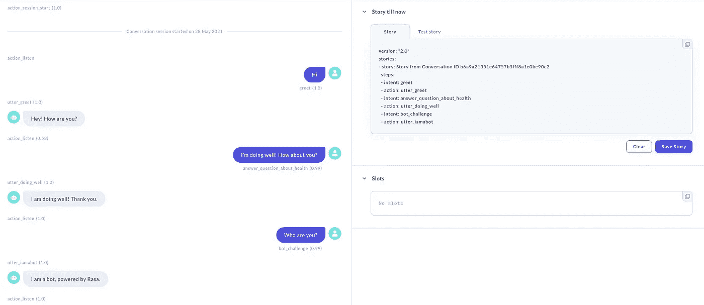

作者图片

# 动机

你曾经希望有一个私人助理来回答重复的信息吗？你可能会犹豫这样做，因为你不知道从哪里开始。

事实证明，创建一个对话助手并不困难。在本文中，我将向您展示如何使用 Rasa 为自己创建一个。

# 什么是 Rasa？

[Rasa](https://github.com/rasahq/rasa) 是一个开源的机器学习框架，用于自动化对话。使用 Rasa，您可以创建一个健壮的模型，并使用几个命令行来部署它。

要安装 Rasa，请键入:

```
pip install rasa
```

现在，您可以通过键入以下命令来创建一个新项目:

```
rasa init
```

您可以训练一个初始模型，并在命令行上与您训练有素的助手聊天，如下所示。

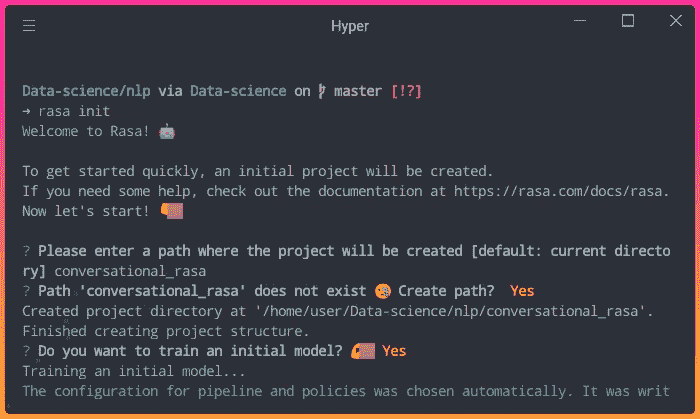

作者图片

看到问题`Do you want to speak to the trained assistant on the command line?`，输入`Y`。你现在可以像下面这样和你的助手交谈。

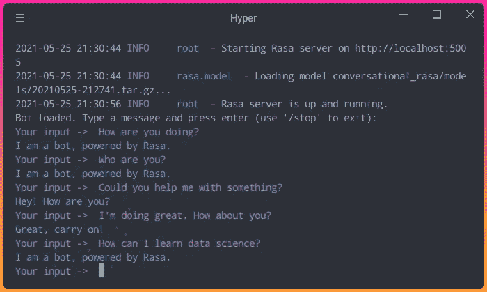

作者图片

你与训练有素的助手的最初对话可能不太好。但是不用担心。你可以训练你的助手，让他明白你以后想要什么。

按 Ctrl + C 停止对话并完成项目目录的创建。项目的结构如下所示:

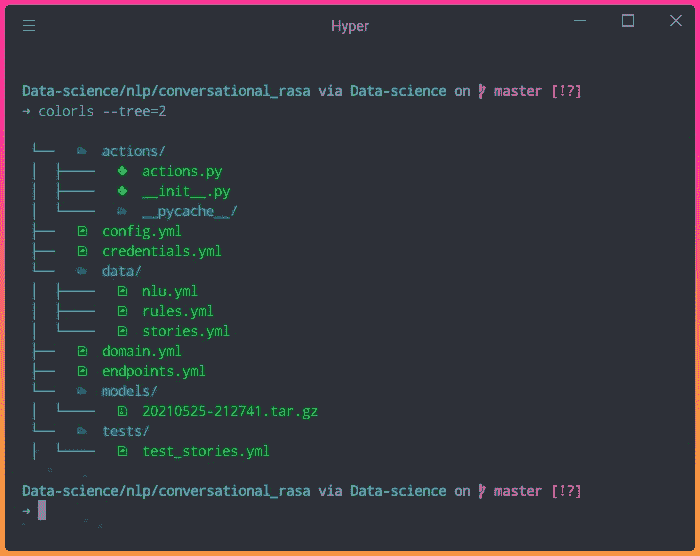

作者图片

现在你有了一个项目，让我们来学习如何提高你的助手。

# 基本概念

## 目的

首先，训练有素的助理**如何理解**你的消息？

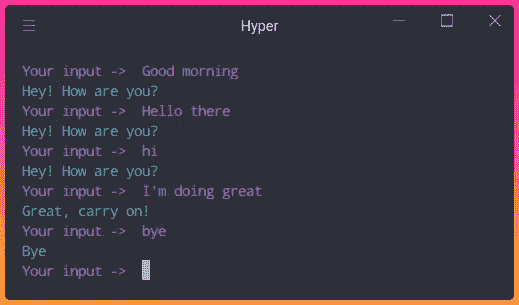

作者图片

如果你打开`data/nlu.yml`文件，你会看到如下内容:

因此，当我们键入`Good morning`、`hi`或`hello there`时，该模型将检测这些句子的意图为`greet`。而当我们键入`bye`时，模型会检测到它的意图是`goodbye`。

到目前为止一切顺利。但是你的助手如何知道如何**响应**检测到的意图，比如`greet`？

## 故事

我们可以通过创建故事来指定我们的助手将如何响应每个意图。故事由用户和机器人之间的对话组成。

要查看故事，请打开`data/stories.yml`文件。

`intent`参数指定用户的意图，而`action`参数指定机器人的响应。我们可以创造不同的故事来应对不同的场景。

让我们试着根据上面列出的`sad path 1`故事与我们的助理聊天。

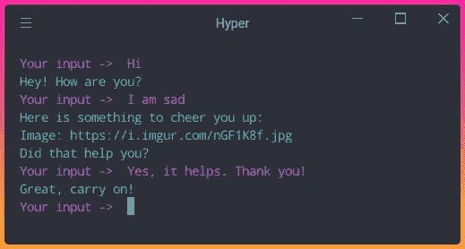

作者图片

酷！我们的助手对这个故事的反应类似。我们来分解一下为什么我们的助手会像上面这样回答我们:

*   `Hi`:意图`greet`
*   `Hey! How are you?`:动作`utter_greet`
*   `I am sad`:意图`mood_unhappy`
*   `Here is something to cheer you up`:动作`utter_cheer_up`
*   `Did that help you?`:动作`utter_did_that_help`
*   `Yes, it helps. Thank you!`:意图`affirm`
*   `Great, carry on!`:动作`utter_happy`

厉害！但是对于`utter_greet`这样的动作，我们怎么能指定**具体答案**？

## 领域

您可以通过更改`domain.yml`中的`text`来指定每个响应的答案。

请注意，这些文本与我们在之前的对话中看到的答案相似。

厉害！现在你知道一些基本概念了。让我们训练你的助手乐于助人。

# 创建列车数据

使用 Rasa 创建列车数据有多种方式。您可以使用交互模式、YAML 文件或 Rasa X 进行训练

## 相互作用的

如果你不知道从哪里开始，我建议你通过和你的助手聊天来创建新的训练数据。

要开始交互式会话，请键入:

```
rasa interactive
```

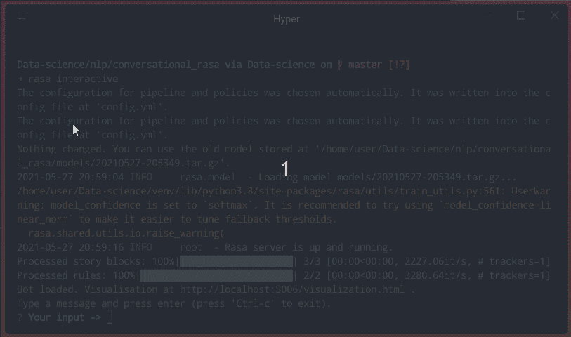

作者 GIF

正如你在上面看到的，在和你的助手交谈时，你可以标记你的问题的意图，并根据你的意图选择正确的回答！请注意，每个响应都应该以单词`utter_`开头。

还可以在运行`rasa interactive`的同时，在[http://localhost:5006/visualization . html](http://localhost:5006/visualization.html)可视化交互对话。

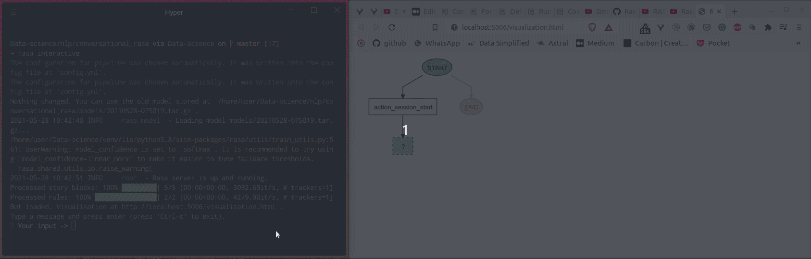

作者 GIF

要停止交互式会话，请键入 Control + C。

现在你应该会在`nlu.yml`文件中看到新的意图，在`stories.yml`中看到新的故事，在`domain.yml`文件中看到新的回应

## YAML 文件

您也可以将数据直接添加到 YAML 文件中，或者更改任何您不喜欢的信息。您可以按照上面的格式添加新的故事、意图和回应。

不要害怕犯错误。要确保不同文件中的数据一致，请键入:

```
rasa data validate
```

如果有任何不一致，您应该会看到如下警告消息:

```
UserWarning: Issue found in 'data/stories.yml': 
Found intent 'answer_question_about_health' in stories which is not part of the domain.
```

# 火车

添加更多训练数据后，您可以通过运行以下命令开始训练您的数据:

```
rasa train
```

# 和你的助手谈谈

现在，让我们通过运行来测试我们刚刚训练的模型:

```
rasa shell
```

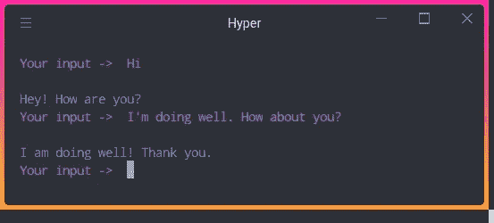

作者图片

酷！现在问题`"How are you?"`的答案更相关了。

# 想象你的故事

您还可以通过运行以下命令来可视化创建的故事:

```
rasa visualize
```

并且一个`graph.html`文件将在您的当前目录中生成。在浏览器上查看该文件时，您应该会看到类似下面的内容。

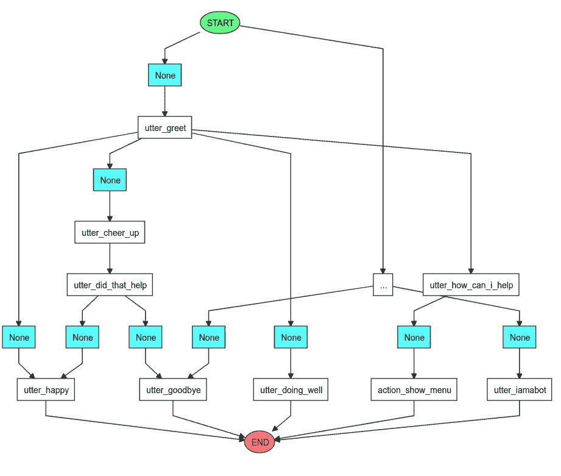

作者图片

# 在浏览器上训练并与你的助手交谈

如果你喜欢在浏览器上训练和与你的助手交谈，使用 Rasa X。在这里找到安装 Rasa X [的说明](https://rasa.com/docs/rasa-x/installation-and-setup/installation-guide)。

安装 Rasa 后，您可以通过运行以下命令开始使用它:

```
rasa x
```

您应该能够在浏览器上与您的助手聊天，如下所示:


作者图片

您还可以通过单击对话右下角的铅笔图标，在与模型对话的同时训练模型。


作者图片

在与你的助手交谈时，你可以创造如下新的意图和行动:

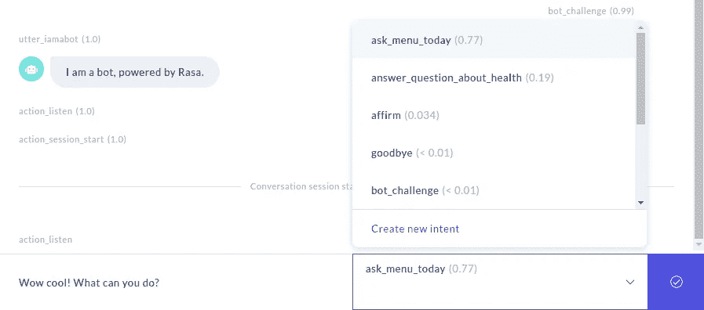

作者图片

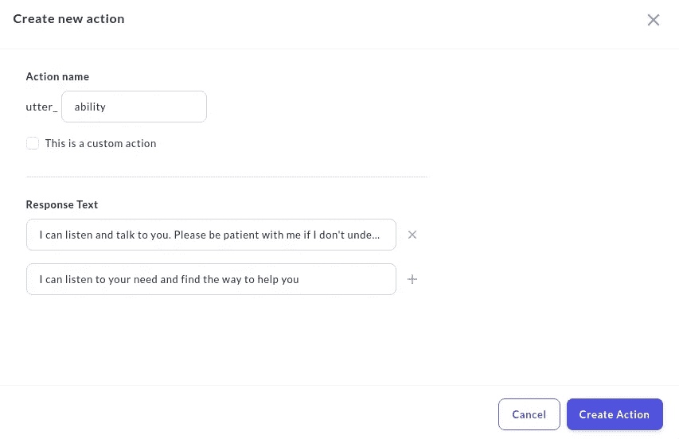

作者图片

对新的培训数据及其标签感到满意后，单击屏幕右下角的“保存故事”。

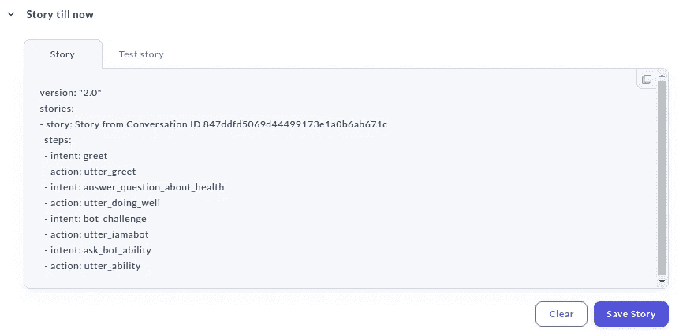

作者图片

您的新训练数据应该添加到您的 YAML 文件中，如下所示！

# 共享您的助手

您也可以通过点击左上角的共享按钮，然后点击生成链接，与其他测试人员共享您的助手。

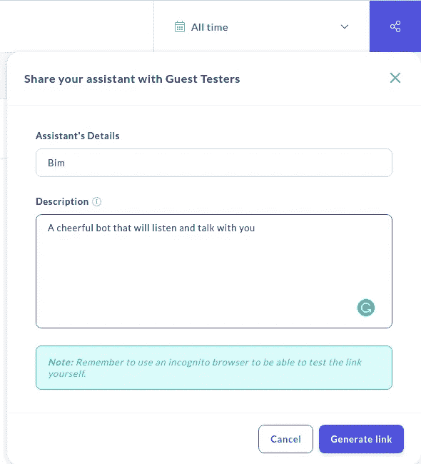

作者图片

应该会为您生成一个链接！如果你在本地模式下使用 Rasa X，你可以使用 [ngrok](https://ngrok.com/product) 让你的机器人对其他机器上的用户可用。

安装 ngrok 后，打开一个新的终端并键入:

```
ngrok http 5002
```

将生成如下所示的链接:

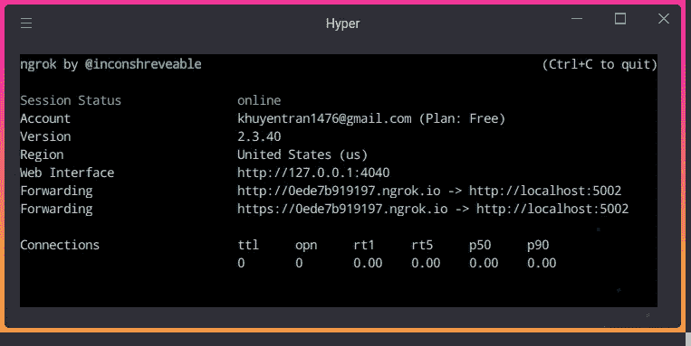

作者图片

现在，将此链接发送给你的同事，让他们在你的应用仍在运行时尝试一下。他们现在应该可以和你的助手互动了！

## 部署您的助手

如果您想要部署您的助手并使其对您的客户端可用，请遵循本说明。

# 结论

恭喜你！您刚刚了解了使用 Rasa 创建和部署聊天机器人是多么容易。我希望这篇文章能激励你创建自己的助手来帮助回答客户的问题。

这篇文章的源代码可以在[这里](https://github.com/khuyentran1401/Data-science/tree/master/nlp/conversational_rasa)找到。

本文只涉及了这个不可思议的库所能做的事情的表面。我建议你看看 Rasa 的[文档](https://rasa.com/docs/rasa/)或者他们的 [Youtube 视频](https://www.youtube.com/channel/UCJ0V6493mLvqdiVwOKWBODQ)。

我喜欢写一些基本的数据科学概念，并尝试不同的算法和数据科学工具。你可以在 [LinkedIn](https://www.linkedin.com/in/khuyen-tran-1ab926151/) 和 [Twitter](https://twitter.com/KhuyenTran16) 上和我联系。

如果你想查看我写的所有文章的代码，请点击这里。在 Medium 上关注我，了解我的最新数据科学文章，例如:

[](/streamlit-and-spacy-create-an-app-to-predict-sentiment-and-word-similarities-with-minimal-domain-14085085a5d4) [## Streamlit 和 spaCy:创建一个应用程序来预测情绪和单词的相似性，最小域…

### 只需要 10 行代码！

towardsdatascience.com](/streamlit-and-spacy-create-an-app-to-predict-sentiment-and-word-similarities-with-minimal-domain-14085085a5d4) [](/supercharge-your-python-string-with-textblob-2d9c08a8da05) [## 使用 TextBlob 增强您的 Python 字符串

### 在一行代码中获得更多关于文本的见解！

towardsdatascience.com](/supercharge-your-python-string-with-textblob-2d9c08a8da05) [](/sentiment-analysis-of-linkedin-messages-3bb152307f84) [## 使用 Python 和情感分析探索和可视化您的 LinkedIn 网络

### 希望优化您的 LinkedIn 个人资料？为什么不让数据为你服务呢？

towardsdatascience.com](/sentiment-analysis-of-linkedin-messages-3bb152307f84) [](/pywebio-write-interactive-web-app-in-script-way-using-python-14f50155af4e) [## PyWebIO:使用 Python 以脚本方式编写交互式 Web 应用

### 在没有 HTML 和 JS 知识的情况下，用几行 Python 代码构建 Web 应用程序！

towardsdatascience.com](/pywebio-write-interactive-web-app-in-script-way-using-python-14f50155af4e)