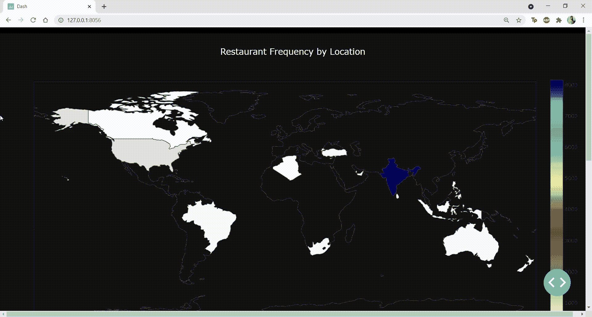
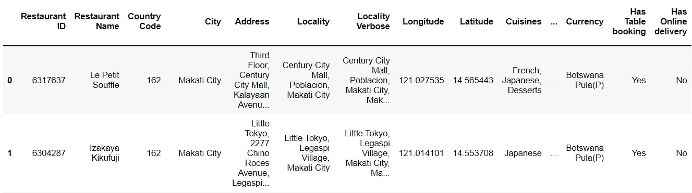
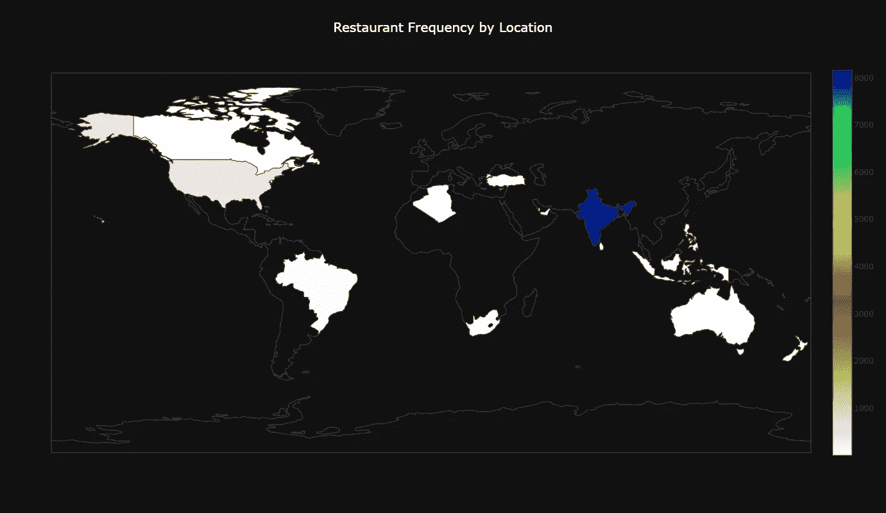
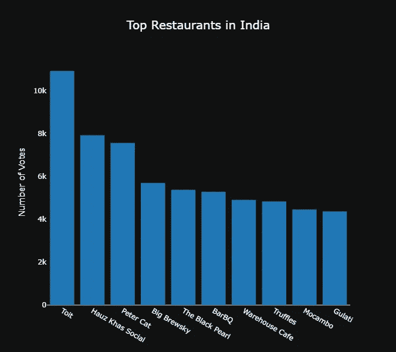
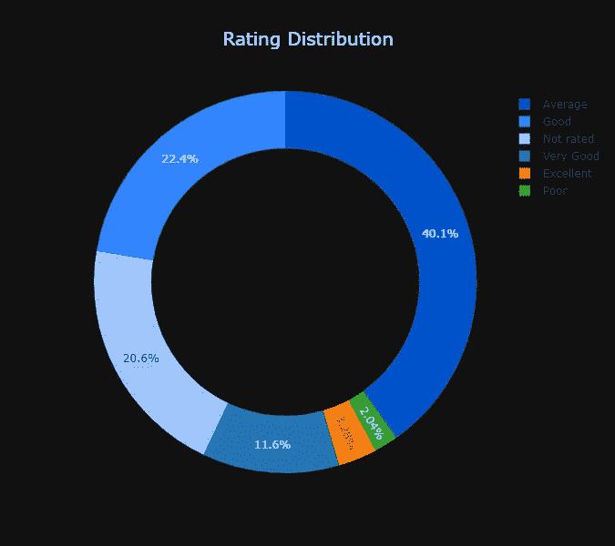
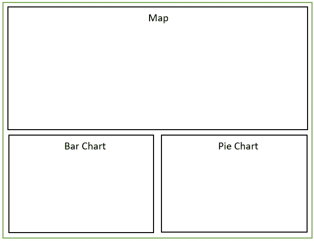

# 用 Python 在 7 分钟内构建一个 Dash 应用程序

> 原文：<https://towardsdatascience.com/build-a-dash-app-with-python-in-7-minutes-72b6cca7d268?source=collection_archive---------4----------------------->

## 使用 Python 从头开始创建一个漂亮的可视化应用程序


卢克·切瑟在 [Unsplash](https://unsplash.com/s/photos/visualization?utm_source=unsplash&utm_medium=referral&utm_content=creditCopyText) 上的照片

当我几个月前开始我的顶点项目时，我想为我的机器学习模型创建一个交互式仪表板。

我希望这个仪表板是 web 应用程序的形式，并在新数据进入系统时显示实时更新。

在探索了许多可视化工具之后，我决定使用 Dash。

Dash 是一个开源库，允许您用 Python 创建交互式 web 应用程序。

如果您经常使用 Python 来构建数据可视化，Dash 是您的理想工具。您可以围绕您的数据分析创建一个 GUI，并允许用户使用您的仪表板应用程序。

Dash 最棒的地方在于它允许你纯粹用 Python 来构建这些东西。您可以创建 web 组件，而无需编写任何 HTML 或 Javascript 代码。

在本教程中，我将展示如何用 Dash 创建一个简单的数据可视化应用程序。

最终产品将如下所示:



作者图片

# 步骤 1:先决条件

在我们开始构建应用程序之前，您需要具备:

*   Python IDE:我使用 Visual Studio 代码进行分析，但是任何 Python IDE 都可以使用(*除了 Jupyter 笔记本)。*
*   库:安装 Dash、Pycountry、Plotly 和 Pandas
*   数据:我使用 Zomato Kaggle 数据集来构建 web 应用程序。我对数据集做了一些修改，使其适合这个分析，你可以在这里找到预处理版本。

# 步骤 2:构建仪表板

首先，让我们导入构建应用程序所需的所有库:

```
import dash
import dash_core_components as dcc
import dash_html_components as html
import dash_bootstrap_components as dbc
from dash.dependencies import Input, Output, State
import plotly.graph_objs as go
import plotly.express as px
import numpy as np
import pandas as pd
```

如果上面几行代码执行成功，干得好！所有的装置都工作正常。

就在导入的下面，添加这行代码以在 Dash 应用程序中包含 CSS 样式表:

```
external_stylesheets = ['https://codepen.io/chriddyp/pen/bWLwgP.css']
```

然后，让我们初始化 Dash:

```
app = dash.Dash(__name__, external_stylesheets=external_stylesheets)
server = app.server
```

现在，我们可以用下面几行代码将数据帧读入 Pandas:

```
df = pd.read_csv('restaurants_zomato.csv',encoding="ISO-8859-1")
```

数据帧的头看起来像这样:



作者图片

该数据框由餐厅数据组成，即每家餐厅的名称、位置、评级和受欢迎程度。

我们将在 Dash 应用程序中可视化这些数据。

我们将创建三个图表显示在我们的 Dash 应用程序上——一个**地图**，一个**条形图**，以及一个**饼图**。

先说地图。

我们将按国家显示数据集中的餐馆数量。最终产品将如下所示:



作者图片

为此，我们将使用数据集中的' *country_iso'* '列。我们需要计算每个国家的餐馆数量，并创建一个新的“ *count* ”列，这可以用下面几行代码来完成:

```
# country iso with counts
col_label = "country_code"
col_values = "count"

v = df[col_label].value_counts()
new = pd.DataFrame({
    col_label: v.index,
    col_values: v.values
})
```

太好了！现在，我们可以创建包含*【国家/地区 _ iso】*和*计数*列的地图:

```
hexcode = 0

borders = [hexcode for x in range(len(new))],
map = dcc.Graph(

            id='8',
            figure = {
            'data': [{
            'locations':new['country_code'],
            'z':new['count'],
            'colorscale': 'Earth',
            'reversescale':True,
            'hover-name':new['final_country'],
            'type': 'choropleth'

            }],

            'layout':{'title':dict(

                text = 'Restaurant Frequency by Location',
                font = dict(size=20,
                color = 'white')),
                "paper_bgcolor":"#111111",
                "plot_bgcolor":"#111111",
                "height": 800,
                "geo":dict(bgcolor= 'rgba(0,0,0,0)') } 

                })
```

上面几行代码将创建地图，并根据列出的餐馆数量给每个区域着色。

现在，我们可以开始创建条形图了。

如果您查看上面显示的地图，印度在数据框中拥有最多的餐厅。数据框中列出的 8，155 家餐厅位于印度。

让我们用下面几行代码来看看印度最受欢迎的餐馆:

```
df2 = pd.DataFrame(df.groupby(by='Restaurant Name')['Votes'].mean())
df2 = df2.reset_index()
df2 = df2.sort_values(['Votes'],ascending=False)
df3 = df2.head(10)

bar1 =  dcc.Graph(id='bar1',
              figure={
        'data': [go.Bar(x=df3['Restaurant Name'],
                        y=df3['Votes'])],
        'layout': {'title':dict(
            text = 'Top Restaurants in India',
            font = dict(size=20,
            color = 'white')),
        "paper_bgcolor":"#111111",
        "plot_bgcolor":"#111111",
        'height':600,
        "line":dict(
                color="white",
                width=4,
                dash="dash",
            ),
        'xaxis' : dict(tickfont=dict(
            color='white'),showgrid=False,title='',color='white'),
        'yaxis' : dict(tickfont=dict(
            color='white'),showgrid=False,title='Number of Votes',color='white')
    }})
```

上面的代码将呈现一个如下所示的条形图:

(*注意，在完成所有组件的创建和显示之前，您还不能运行代码)*



作者图片

让我们创建最终的图表。

我们将查看数据集中的总体评分分布:

```
col_label = "Rating text"
col_values = "Count"

v = df[col_label].value_counts()
new2 = pd.DataFrame({
    col_label: v.index,
    col_values: v.values
})

pie3 = dcc.Graph(
        id = "pie3",
        figure = {
          "data": [
            {
            "labels":new2['Rating text'],
            "values":new2['Count'],
              "hoverinfo":"label+percent",
              "hole": .7,
              "type": "pie",
                 'marker': {'colors': [
                                                   '#0052cc',  
                                                   '#3385ff',
                                                   '#99c2ff'
                                                  ]
                                       },
             "showlegend": True
}],
          "layout": {
                "title" : dict(text ="Rating Distribution",
                               font =dict(
                               size=20,
                               color = 'white')),
                "paper_bgcolor":"#111111",
                "showlegend":True,
                'height':600,
                'marker': {'colors': [
                                                 '#0052cc',  
                                                 '#3385ff',
                                                 '#99c2ff'
                                                ]
                                     },
                "annotations": [
                    {
                        "font": {
                            "size": 20
                        },
                        "showarrow": False,
                        "text": "",
                        "x": 0.2,
                        "y": 0.2
                    }
                ],
                "showlegend": True,
                "legend":dict(fontColor="white",tickfont={'color':'white' }),
                "legenditem": {
    "textfont": {
       'color':'white'
     }
              }
        } }
)
```

由上述代码创建的饼图将如下所示:



作者图片

现在我们已经创建了所有三个图表，让我们在网页上显示它们并运行 Dash 应用程序。

我们首先需要想出我们的 web 应用程序的页面布局和结构。

Dash 组件遵循网格结构(类似于 CSS 网格布局)。Dash 有三个核心组件——行、列和容器。

您可以以任何方式排列这些组件，以适合页面上的元素。

因为我们只有三张图表，所以我想出了这个简单的布局:



作者图片

对于这些图表，我们将只使用两行，第二行将有两列来容纳条形图和饼图。

下面是在 Dash 中创建这样的布局的一些代码:

```
graphRow1 = dbc.Row([dbc.Col(map,md=12)])
graphRow2 = dbc.Row([dbc.Col(bar1, md=6), dbc.Col(pie3, md=6)])
```

我们现在需要做的就是定义我们的应用程序布局并运行服务器:

```
app.layout = html.Div([navbar,html.Br(),graphRow1,html.Br(),graphRow2], style={'backgroundColor':'black'})

if __name__ == '__main__':
    app.run_server(debug=True,port=8056)
```

默认情况下，Dash 在端口 8050 上运行。如果正在使用，您可以手动指定要运行它的端口。

我们已经完成了仪表板应用程序的编码。

只需运行 Python 应用程序并导航至仪表盘位置，您将看到您的可视化效果:


作者图片

下面是这个 Dash 项目的**完整代码**:

```
import dash
import dash_core_components as dcc
import dash_html_components as html
import dash_bootstrap_components as dbc
from dash.dependencies import Input, Output, State
import chart_studio.plotly as py
import plotly.graph_objs as go
import plotly.express as px
external_stylesheets =['https://codepen.io/chriddyp/pen/bWLwgP.css', dbc.themes.BOOTSTRAP, 'style.css']
import numpy as np
import pandas as pd 

app = dash.Dash(__name__, external_stylesheets=external_stylesheets)
server = app.server 

df = pd.read_csv('restaurants_zomato.csv',encoding="ISO-8859-1")

navbar = dbc.Nav()

# country iso with counts
col_label = "country_code"
col_values = "count"

v = df[col_label].value_counts()
new = pd.DataFrame({
    col_label: v.index,
    col_values: v.values
})

hexcode = 0
borders = [hexcode for x in range(len(new))],
map = dcc.Graph(
            id='8',
            figure = {
            'data': [{
            'locations':new['country_code'],
            'z':new['count'],
            'colorscale': 'Earth',
            'reversescale':True,
            'hover-name':new['country_code'],
            'type': 'choropleth'
            }],
            'layout':{'title':dict(
                text = 'Restaurant Frequency by Location',
                font = dict(size=20,
                color = 'white')),
                "paper_bgcolor":"#111111",
                "plot_bgcolor":"#111111",
                "height": 800,
                "geo":dict(bgcolor= 'rgba(0,0,0,0)') } })

# groupby country code/city and count rating
df2 = pd.DataFrame(df.groupby(by='Restaurant Name')['Votes'].mean())
df2 = df2.reset_index()
df2 = df2.sort_values(['Votes'],ascending=False)
df3 = df2.head(10)

bar1 =  dcc.Graph(id='bar1',
              figure={
        'data': [go.Bar(x=df3['Restaurant Name'],
                        y=df3['Votes'])],
        'layout': {'title':dict(
            text = 'Top Restaurants in India',
            font = dict(size=20,
            color = 'white')),
        "paper_bgcolor":"#111111",
        "plot_bgcolor":"#111111",
        'height':600,
        "line":dict(
                color="white",
                width=4,
                dash="dash",
            ),
        'xaxis' : dict(tickfont=dict(
            color='white'),showgrid=False,title='',color='white'),
        'yaxis' : dict(tickfont=dict(
            color='white'),showgrid=False,title='Number of Votes',color='white')
    }})

# pie chart - rating

col_label = "Rating text"
col_values = "Count"

v = df[col_label].value_counts()
new2 = pd.DataFrame({
    col_label: v.index,
    col_values: v.values
})

pie3 = dcc.Graph(
        id = "pie3",
        figure = {
          "data": [
            {
            "labels":new2['Rating text'],
            "values":new2['Count'],
              "hoverinfo":"label+percent",
              "hole": .7,
              "type": "pie",
                 'marker': {'colors': [
                                                   '#0052cc',  
                                                   '#3385ff',
                                                   '#99c2ff'
                                                  ]
                                       },
             "showlegend": True
}],
          "layout": {
                "title" : dict(text ="Rating Distribution",
                               font =dict(
                               size=20,
                               color = 'white')),
                "paper_bgcolor":"#111111",
                "showlegend":True,
                'height':600,
                'marker': {'colors': [
                                                 '#0052cc',  
                                                 '#3385ff',
                                                 '#99c2ff'
                                                ]
                                     },
                "annotations": [
                    {
                        "font": {
                            "size": 20
                        },
                        "showarrow": False,
                        "text": "",
                        "x": 0.2,
                        "y": 0.2
                    }
                ],
                "showlegend": True,
                "legend":dict(fontColor="white",tickfont={'color':'white' }),
                "legenditem": {
    "textfont": {
       'color':'white'
     }
              }
        } }
)

graphRow1 = dbc.Row([dbc.Col(map,md=12)])
graphRow2 = dbc.Row([dbc.Col(bar1, md=6), dbc.Col(pie3, md=6)])

app.layout = html.Div([navbar,html.Br(),graphRow1,html.Br(),graphRow2], style={'backgroundColor':'black'})

if __name__ == '__main__':
    app.run_server(debug=True,port=8056)
```

您可以摆弄代码，尝试改变图表的颜色和布局。您甚至可以尝试使用上面的数据集创建新行和添加更多图表。

Dash 有比我在本教程中提到的更多的功能。您可以创建过滤器、卡片，并添加实时更新数据。如果你喜欢这篇教程，我会写另一篇介绍 Dash 更多特性和功能的文章。

感谢您的阅读，祝您有美好的一天:)

本文原载[此处](https://www.natasshaselvaraj.com/)。