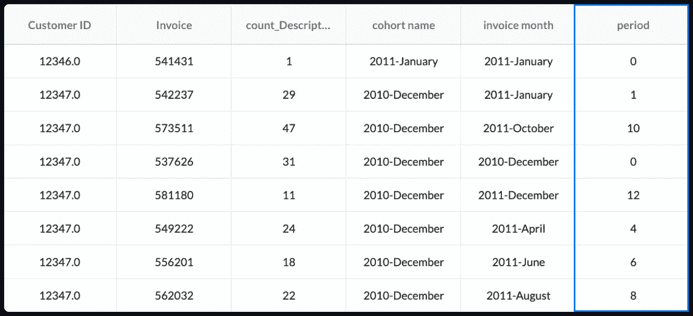

# 构建群组分析的数据应用程序

> 原文：<https://towardsdatascience.com/build-a-data-app-for-cohort-analysis-5d4e3161a988?source=collection_archive---------19----------------------->

## 进行群组分析的分步指南，关注技术而不是代码

作者图片

群组分析是一个强大的工具，它使公司能够更好地了解客户的需求和习惯。我们可以通过将具有相似属性(例如，注册日期、首次购买日期、潜在客户来源等)的用户或客户分组来收集有价值的见解。)然后观察关键绩效指标(KPI 例如，参与度、产生的收入、留存)。

下面是一个消费者应用留存的群组分析热图示例。该应用程序的用户被分组到注册月的队列中，他们的保留率是按周观察的。

作者图片

每一个水平行代表一个不同的用户群体，每一个方块代表该群体在注册后一周内的留存率。例如，我们可以看到，在注册 4 周后，该应用对 2018 年 2 月注册的用户有 49%的保留率，而对 2018 年 7 月注册的用户来说，同样的 4 周保留率只有 20%。

研究这种模式有助于发现与业务相关的系统问题，或者反过来，有助于验证随着时间的推移所做的更改。

虽然有许多文章谈到用 python 或 R 或 FORTRAN 执行群组分析，但没有一篇文章关注实际技术。

***注意:在这里，虽然所有的分析都发生在*** [***【交集】***](https://intersectlabs.io) ***(一个让你构建*** [***数据应用***](https://www.intersectlabs.io/post/what-is-a-data-app) ***来自动化重复数据任务的平台)，你可以用你喜欢的工具或语言来重复这些步骤。***

**数据描述**

***所用数据****:*[*https://archive.ics.uci.edu/ml/datasets/Online+Retail+II*](https://archive.ics.uci.edu/ml/datasets/Online+Retail+II)

该零售数据集包含一家英国在线零售店在 2009 年 12 月 1 日至 2012 年 12 月 9 日之间的所有交易。该公司主要销售独特的、适合各种场合的礼品。

数据集中的每一行都是客户订购的单独行项目。具有相同发票号(第一列)的行项目是同一订单的一部分。InvoiceDate 是购买的日期/时间，Customer ID 是每个客户的唯一标识符。

数据快照:

作者图片

我们主要感兴趣的是跟踪按月分组的客户保持率，换句话说，对于每个客户分组(按首次购买的月份分组)，在首次购买后的每个月中重复下单的百分比是多少？

# 数据准备

## **缺少客户 id**

数据集包含一些缺少客户 ID 的行。如果我们有办法知道它们代表什么，我们会[估算值](/a-comprehensive-guide-to-data-imputation-e82eadc22609)，但不幸的是，在不了解更多业务的情况下，我们所能做的就是删除这些行。

作者图片

## **负量**

一些订单的数量为负；这样的订单最有可能是退货。返回并不是真正的约定，所以我们也删除了这些行。有人可能会说，我们还应该删除这些最终退货所附带的原始订单。然而:

*   我们不知道如何识别这些订单
*   即使我们这样做了，导致退货的订单仍然是客户的约定，因此对我们的目的有意义

为了减轻这种情况，我们筛选数量> 0 的行的数据。

作者图片

## **汇总成订单**

如上所述，每张发票可以有多行，因为每一行对应一个单独的项目。但是，对于合约，我们感兴趣的是分析订单，而不是订单中的单个项目。我们汇总这些项目来管理不同订单的列表。

作者图片

# 断代分析

## 计算每个用户所属的群组

在这一部分中，我们确定了每位客户下第一笔订单的月份(即他们的群体)。

首先，我们按发票日期的升序排序，并计算第一个订单的日期:

作者图片

接下来，我们从该日期中提取月份名称和年份，并连接这些列以形成“群组名称”列。

作者图片

最后，我们将得到的数据集连接到上面的“Orders”数据集，以向其中添加“cohort name”列。

作者图片

## 生成群组分析表

接下来，对于每个订单，我们计算下订单的周期(订单月份—同期月份)。

作者图片

生成的输出如下所示(注意末尾的 period 列):

作者图片

最后，我们透视我们的表以生成群组分析报告，其中每行是一个单独的群组，每列显示随后几个月的保留情况。

作者图片

在对列和行进行快速排序后，我们得到了群组分析表

作者图片

这向我们展示了每个月每个群体中的回头客数量。但是，为了将这些值转换成百分比，我们将每一列除以第一列，然后乘以 100。

# 生成热图

最后，我们将表格转换成热图，以快速识别模式。右边的图例告诉我们，盒子越接近红色，保留值越高(越热)，反之亦然，保留值越低的盒子越接近蓝色。

大约一半的方块是蓝色的，因为我们还没有这些群体的数据。

作者图片

# 有趣的见解

马上，我们注意到 2010 年 12 月的队列包含了第 11 个月的高回报(大概对应于第二年的假期)。我们在每个队列中都看到类似的峰值，但是没有一个像第一个队列那么高。这批人有什么特别之处吗？也许，这群人本质上由假日购物者组成，他们更倾向于在每个假日季节回来！

如果你想让用户/顾客再次光顾你的生意，你必须定期研究他们的群体和习惯。