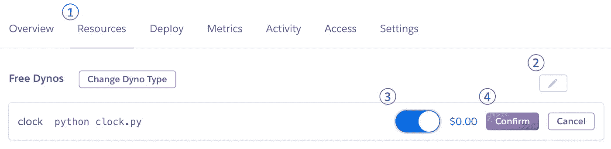

# 为你的下一个时间序列数据科学项目在云上构建一个数据收集应用

> 原文：<https://towardsdatascience.com/build-a-data-collection-app-on-the-cloud-for-your-next-time-series-data-science-project-71e6d6291a70?source=collection_archive---------38----------------------->

## 使用 Python 和 PostgreSQL 在 Heroku 上构建和部署数据收集应用程序的分步指南

*注:本帖代码可在* [*这里*](https://github.com/kevinclee26/data_collection_demo) 找到


计划的数据收集应用程序工作流(图片由作者提供)

尽管近年来观察到数据激增，但我们经常发现自己被项目数据的缺乏所阻碍。在典型的一天网页浏览中，我们会遇到无数的信息(数据)，这些信息可能会产生伟大的数据科学想法，如当前天气、交通、灾难预警、股票价格、投票计数、covid 计数、浏览量计数、社交媒体评论等等。我们知道数据得到维护并可供公众使用，但很少有方便的汇编。在本文中，我们将一步一步地介绍使用 Python 中的 **RDMS** ( **关系数据库管理系统**)开发和部署数据收集应用程序。意识到根据收集的数据不同，各个脚本可能会有很大的不同，我们采用的方法是遍历一个简单的示例，同时为每个步骤提供充分的推理:


开发步骤

这个演示应用程序将由一个收集公共可用数据快照的脚本和一个定期调用收集脚本的调度程序组成。应用程序可以选择性地部署在云上，这提供了**可靠性**和**可用性**(以及其他好处)。我们选择了 [**Heroku**](https://www.heroku.com/) 进行部署，这是一个平台即服务( **PaaS** )，使开发者能够完全在云端构建、运行和操作应用。

## 定义目标和目的

有许多不同的方式来获取数据:API 请求、web 抓取以及介于两者之间的任何方式。项目的第一步是确定可靠的数据源。我们的灵感来自于[开放数据](https://en.wikipedia.org/wiki/Open_data)，这是一个想法，即**一些**数据应该免费提供给每个人，让他们随心所欲地使用。它的目标类似于其他“开放(源代码)”运动，如开源软件。有趣的是，美国联邦和地方层面的[公共部门](https://en.wikipedia.org/wiki/Public_sector)在数据透明方面取得了巨大进步。我们使用来自 511.org[](https://511.org/open-data/traffic)**的数据进行演示。它们为**当前交通事件**提供了一个方便的 API(参见[文档](https://511.org/open-data/traffic))。 **API 密钥**需要注册，请求受发行方的费率限制。一旦接收到，响应就会以 JSON 格式出现，我们可以用它来提取有用的数据。我们感兴趣的是捕捉仅具有以下属性的单个交通事件。通过开发一个自动化脚本，我们希望收集所有交通事件的汇编。**

```
one_record={'**id**': '511.org/721616'
            '**headline**': 'Caltrans Bridge work...', 
            '**event_type**': 'CONSTRUCTION', 
            '**severity**': 'Unknown', 
            '**lat**': -122.241176, 
            '**lon**': 38.483586}
```

## **创建 GitHub 存储库并设置虚拟环境**

**[**Git**](https://en.wikipedia.org/wiki/Git) 是一个免费开源的分布式版本控制系统。它跟踪对项目所在的**存储库**中的文件所做的所有更改。GitHub 是一个 Git 存储库托管平台，允许开发者为开源和私有项目构建软件。包括 Heroku 在内的许多平台都支持与 GitHub 的集成，从而简化了代码部署。**

**更多关于 Git 和基本用法的信息可以在 [**这里**](https://medium.com/swlh/git-with-the-program-quick-guide-to-collaboration-using-git-3039ebba1bff) 找到。我们将在 GitHub 上为这个项目创建一个远程存储库，并使用`$ **git clone "**[**https://github.com/[github_name]/[repo_name].git**](https://github.com/[github_user_name]/[repo_name].git)**”**`将其克隆到我们的本地机器上。使用`$ **cd [repo_name]**`更改目录，以确保命令是针对作为根的新存储库执行的。**

**接下来，我们将为项目创建一个**虚拟环境**。虚拟环境的主要目的是为项目创建隔离的环境。这意味着每个项目都可以有自己的依赖项，不管其他项目有什么依赖项。同样，在开发具有特定需求的应用程序时，虚拟环境也很重要。**

****

**虚拟环境**

**用`$ **conda create --name env_name python=3.6**`创建一个新环境，用`$ **conda activate env_name**`激活。注意，我们用`**python=3.6**`指定了新环境，以包括 **pip** (在 3.4 中添加了**Python**的包安装程序)和 **f 字符串**(在 3.6 中添加了**格式化字符串文字**)。在此项目目录/存储库中安装应用程序和运行命令时，应该激活此环境。由于这是一个新环境，所有的依赖项都需要通过`$ **pip install**`安装，然后才能导入。使用`$ **conda deactivate**`停用虚拟环境。**

**我们还需要为应用程序设置**环境变量**。环境变量被认为是 [**操作系统**](https://devcenter.heroku.com/articles/config-vars) 的一部分，存在于任何特定脚本之外。我们可以使用环境变量来隐藏敏感的凭证，比如 511 API 密钥。它们可以在我们部署时在主机上设置，但也需要在本地可用以进行开发。这些变量应该被限制在项目的范围内，所以我们真正需要的是“临时的”环境变量。幸运的是，我们可以使用[**python-dotenv**](https://pypi.org/project/python-dotenv/)从`.env`文件中读入键值对，并在运行时将它们设置为环境变量。这允许我们开发我们的脚本，就像环境变量已经设置好了一样。应该将`.env`文件添加到`.gitignore`中，这样它就不会包含在本地或远程的 git 提交中。**

```
$ **echo "FIVEONEONE_TOKEN=[api_key]" > .env** $ **echo ".env" >> .gitignore**
```

****

**环境变量比脚本更安全**

## **开发数据收集脚本和数据库**

**在这一步中，我们将创建一个脚本来从数据源获取一次数据。在本演示中，我们使用分配的 api_key 向指定的端点发出请求。**

**fetch.py**

**我们实现了对请求成功与否的条件检查。一旦收到，响应包含 [JSON](https://en.wikipedia.org/wiki/JSON) 格式的数据。具体来说，我们对 JSON 的`events`键中的活动交通事件的**列表**感兴趣。在安装必要的依赖项后，我们可以用`$ **python fetch.py**`测试这个脚本:**

```
$ **pip install requests**
$ **pip install python-dotenv**
```

**接下来我们想把数据保存在数据库中，但是我们必须先做一点数据库工程。在这一步中，我们要充分考虑数据的大小以及如何使用数据。一般有两种类型的数据库: **SQL** 和 **NoSQL** 。相比之下，SQL 数据库需要更多的工作来建立，但当数据有一个定义的模式时是合适的。因为它与我们的数据相关——假设我们已经确定了想要收集的属性子集，那么使用 SQL 数据库是有意义的。我们将得到一个“事件”表，其中每个**行**代表一个事件，每个**列**代表一个感兴趣的属性。**

****

**SQL 数据库上的示例事件表**

**换句话说，从我们收到的 JSON 中的交通事件列表**开始，我们将**遍历每个元素**并解析出我们感兴趣的属性。我们可以使用 [**SQLAlchemy**](https://www.sqlalchemy.org/) 库在 Python 中使用 SQL。SQLAlchemy 是一个 **Python SQL toolkit** 和**对象关系映射器**，可以实现 SQL 的全部功能。****

**在将记录存储到数据库之前，我们必须定义表模式。使用 [**声明性**](https://docs.sqlalchemy.org/en/14/orm/declarative_mapping.html) 将该模式映射到一个 Python 类，因此每个记录将被表示为其实例。**

**models.py**

**我们在一个单独的脚本`models.py`中布置数据库表的模式，稍后我们可以调用这个脚本来创建表和记录。请注意，SQLAlchemy ORM 要求每个表都有一个主键。**

**将`fetch.py`脚本修改为`fetch_insert.py`到 **1)** 连接到数据库， **2)** 基于`models.py`创建表， **3)** 遍历响应中的每个元素/解析出感兴趣的属性，并且 **4)** 创建要插入到数据库中的映射 Python 类的实例。**

**获取 _ 插入. py**

**我们使`models.py`成为**依赖**(如`from models import *`)来加载模式以创建表和记录。**

**使用 SQLAlchemy 从在[数据库 url](https://docs.sqlalchemy.org/en/14/core/engines.html#database-urls) 建立连接开始。当没有`DATABASE_URL`环境变量存在时，我们编写脚本来连接到单个文件 [**SQLite**](https://en.wikipedia.org/wiki/SQLite) 数据库。我们将 SQLite 用于开发和备份目的，因为它是独立的、功能齐全的。像 **Postgres** 这样的 **DB 服务器**通常是首选，因为它支持**可用性**和**可靠性**。一旦我们将生产数据库 url 作为一个环境变量添加，它将优先建立数据库连接。我们应该将数据库 url 视为环境变量，因为它包括用户名、密码、主机名和数据库名。**

**`[sqlalchemy.create_engine()](https://docs.sqlalchemy.org/en/14/core/engines.html#sqlalchemy.create_engine)`和`Base.metadata.create_all()`的典型用法是每个特定的数据库 URL 使用一次，在单个应用程序进程的生命周期内全局保存。单个`[Engine](https://docs.sqlalchemy.org/en/14/core/connections.html#sqlalchemy.engine.Engine)`代表流程管理许多单独的 [DBAPI](https://docs.sqlalchemy.org/en/14/glossary.html#term-DBAPI) 连接，并且旨在以并发方式被调用。如果表已经存在，SQLAlchemy 不会尝试重新创建它们。**

**一旦请求返回了响应，我们就遍历事件列表来收集表记录的数据。在 SQLAlchemy 中，记录作为映射到 SQL 表的 Python 类的实例被添加和操作。`**`操作符允许我们获取一个键值对字典，并将其解包为`Events()`构造函数的关键字参数。**

**一旦记录被添加和提交，我们使用`session.close()`将资源交还给引擎的连接池。这不应该与`engine.dispose()`混淆，后者关闭连接池的所有连接。**

**至此，我们已经构建了一个脚本来收集数据并将记录存储到 SQL 数据库中。我们可以使用`$ **python fetch_insert.py**` (在安装完依赖项之后)测试应用程序，这将创建一个新的 SQLite 文件作为数据库，如果它还不存在的话。**

```
$ **pip install sqlalchemy**
$ **pip install psycopg2**
```

## **添加调度程序**

**我们可以安排数据获取过程按时间间隔运行，从而使我们能够持续收集数据。[**APS Scheduler**](https://apscheduler.readthedocs.io/en/stable/)(**高级 Python 调度器**)是一个 Python 库，它让用户调度 Python 代码稍后执行，要么只执行一次，要么定期执行**。它易于使用，并与其他有用的框架集成。****

********

****调度程序****

****很方便，Heroku 在他们的 [**自定义时钟进程**](https://devcenter.heroku.com/articles/scheduled-jobs-custom-clock-processes) 的实现中使用了 APScheduler。在他们的[文档](https://apscheduler.readthedocs.io/en/stable/userguide.html)中，他们解释说主要有四个组件来促进作业的调度。在主程序中，用户选择一个**调度器**和一个**作业存储器**。调度器负责根据**触发器**将作业添加到作业库中，而**执行器**处理作业的运行。****

****clock.py****

****使用 APScheduler 调度作业很容易——我们在`clock.py`中展示的基本实现从定义一个调度器和作业存储(默认为`BlockingScheduler()`和`MemoryJobStore()`)开始，它们充当运行应用程序的主要过程。接下来，使用包含调度逻辑的特定触发器添加作业。我们通过用`scheduled_job()`和调用数据收集脚本的`interval`触发器来装饰 函数来做到这一点。从技术上讲，该过程应该被描述为在计算的延迟之后重新执行。为了管理与数据库的连接，我们在主程序中创建引擎连接，并将其传递给收集脚本。我们必须再次将`fetch.py`脚本重构为`fetch_job.py`来适应这个实现。****

****fetch _ 作业. py****

****数据收集脚本被封装在函数`fetch_data`中，因此可以很容易地调用它，并接受数据库连接作为参数。对于每个计划的“获取”作业，在关闭之前，会与数据库建立一个会话，直到所有插入操作完成。在安装新的依赖项后，我们可以用`$ **python clock.py**`测试这个应用程序。****

```
**$ **pip install apscheduler****
```

## ****设置 Heroku 应用程序并添加配置文件****

****此时，数据收集应用程序以固定的时间间隔“自动”执行，但仅在应用程序处于本地活动状态时执行。我们可以将应用程序部署到 Heroku 来消除这种依赖性。****

****本次演示避免使用 **Heroku 命令行界面** ( **CLI** )以保持部署简单。首先，在 Heroku 上创建一个新的应用程序。登录( **#1** )后，转到“创建新应用”( **#3** )并给应用一个唯一的名称以完成创建。Heroku 提供了与 GitHub 的便捷集成，以无缝加载代码进行部署。一旦通过验证( **#5** )，开发人员就可以通过名称( **#7** )进行搜索，并将应用程序的源代码连接到相应的存储库( **#8** )。****

********

****设置 Heroku 应用程序****

****在部署之前，我们必须更新 GitHub 上的源代码，但我们必须首先配置几个设置: *Postgres 数据库*、*配置变量*、 *requirements.txt* 和 *Procfile* 。****

## ****Heroku 应用程序的 Postgres 数据库附件****

****Heroku 免费提供了一个 **Postgres 插件**(有限制)——一个单独的数据库比用于开发的 SQLite 本地数据库更好，因为它支持应用程序之外的访问。****

****在 Heroku 上，进入应用程序主页的资源部分( **#1** )。在附加组件下，搜索“Heroku Postgres”(**# 2**&**# 3**)。接下来选择适当的计划(Hobby Dev-Free 计划提供多达 10k 行的数据)并进行配置。****

********

****Heroku-Postgres 附加软件****

## ****Heroku 构型****

****我们必须将 API 键和数据库 URL 设置为环境变量，以防止它们被暴露。从仪表板页面，导航至设置( **#1** )并点击“显示配置变量”( **#2** )。数据库的连接字符串自动添加到`DATABASE_URL` ( **#3** )下。这可以用来连接到数据库(在这个项目之外)。我们必须手动添加 api_key ( **#4** )作为环境变量( **#5** )。****

********

****设置配置变量****

****要将应用程序部署到 Heroku，还需要两个文件:1) `requirements.txt`和 2) `[Procfile](https://devcenter.heroku.com/articles/procfile)`。这将有助于 Heroku 配置托管应用程序的服务器。我们必须在存储库中手动创建这些文件，它们必须位于根目录下，这样 Heroku 才能在部署过程中找到它们。****

1.  *****requirements . txt*—列出运行应用程序所需的所有依赖项和包。要创建 *requirements.txt* 文件，运行项目目录中的`$ **pip freeze > requirements.txt**` 命令。这将把活动环境中安装的所有库的列表写入 requirements.txt 文件。这有助于 Heroku 为应用程序安装相同的依赖项。****
2.  *****Procfile* —告诉 Heroku 如何运行应用程序，并声明启动应用程序应该执行什么命令。要创建 Procfile 文件，运行项目目录中的`$ **echo "clock: python clock.py" > Procfile**` 。请注意，Procfile 是一个没有文件扩展名的简单文本文件。****

****Procfile 在单独的行上声明应用程序进程类型，每一个都具有格式`<process type>: <command>`，其中`process type`是原型，从该原型实例化一个 [**dyno**](https://www.heroku.com/dynos) 。Dynos 是提供计算机、内存、操作系统和临时文件系统的容器，旨在根据用户指定的命令执行代码。****

****鉴于演示应用程序的简单性，一个时钟 dyno 就足够了。注意，对于我们的用例，在 Procfile 中，`clock`或`worker`流程类型声明都可以。选择使用`clock`进程类型是为了表明`clock.py`是一个调度应用程序，它是一个单独的进程，不应该扩展到多个进程，以防止任务重复。****

****另外，在我们的实现中，Dyno 负责调度和执行作业。根据数据收集脚本的复杂性和作业的频率，可能需要使用单独的 worker dynos(不在本项目范围内)。****

********

****对于简单的工作，一个时钟 Dyno 就足够了****

## ****正确的 Postgres 数据库 URL(3 月编辑)****

****由于 SQLAlchemy 在 2021 年 3 月弃用了`postgres`方言，我们不得不手动更新 Heroku 的 DATABASE_URL 环境变量。不幸的是，它不能在 Heroku 操作系统级别更新，因为它是由附加组件生成的。相反，我们可以给`clock.py`添加一个简单的`String.replace()`语句来适应这种变化。****

```
**SQLALCHEMY_DATABASE_URI=SQLALCHEMY_DATABASE_URI.replace('postgres://', 'postgresql://')**
```

## ****部署到 Heroku****

****一旦创建了两个配置文件( *Procfile* 和 *requirements.txt* )，将所有工作文件保存在存储库中，然后将它们添加/提交/推送至远程存储库。****

```
**$ **git add .**
$ **git commit -m 'ready to deploy'** $ **git push****
```

****一旦代码被推送到 GitHub，我们就可以在 Heroku 部署它。在部署页面( **#1** )中，选择要部署的分支(**# 2**)(**# 3**)。Heroku 将开始构建应用程序。****

********

****部署****

****我们要做的最后一件事是在 Heroku 对 dyno 进行缩放。回到资源页面( **#1** )，现在应用程序已经部署完毕，已经识别出了`clock` dyno。它需要扩大规模并保持扩大规模，以便保持运行并确定调度作业的合适时间( **#2** 、 **#3** 和 **#4** )。****

********

****将时钟动态缩放至 1****

## ****摘要****

****在本文中，我们逐步介绍了数据收集应用程序的创建。我们还使用 Heroku 将它部署到云中。我希望这对你有帮助。我的希望是激励更多的人分享他们的想法(和数据),这些想法和数据是他们努力为其他人合作策划的。****

> ****接下来，我们将创建一个监控工具，并为我们的应用程序构建一个时序机器学习模型。如果你喜欢这篇文章，我邀请你跟我来，这样你就可以得到这个项目继续的通知。****