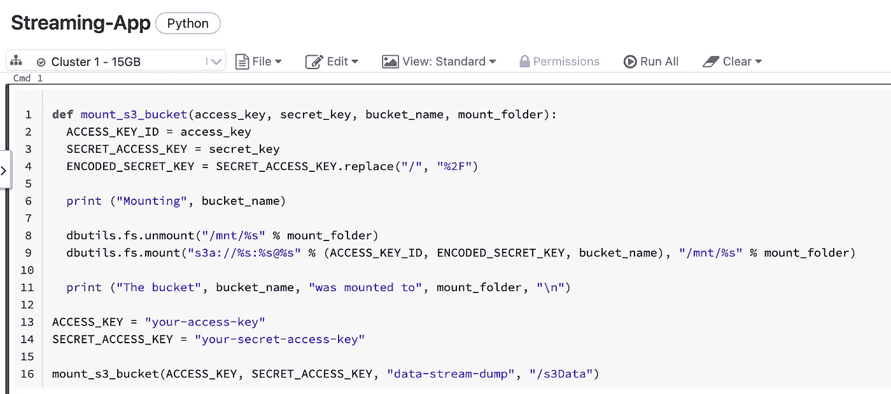
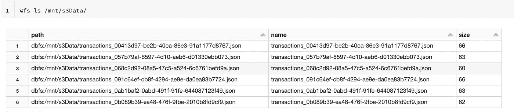
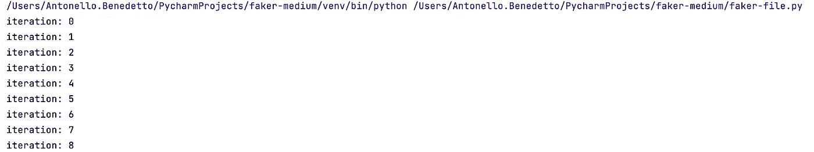
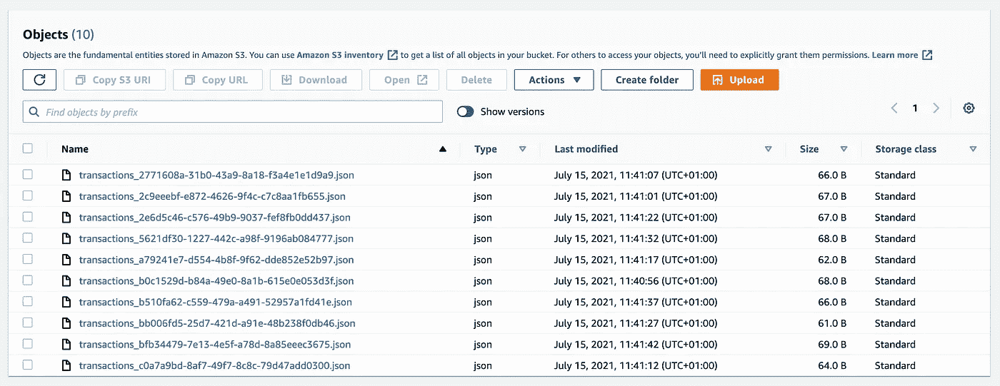
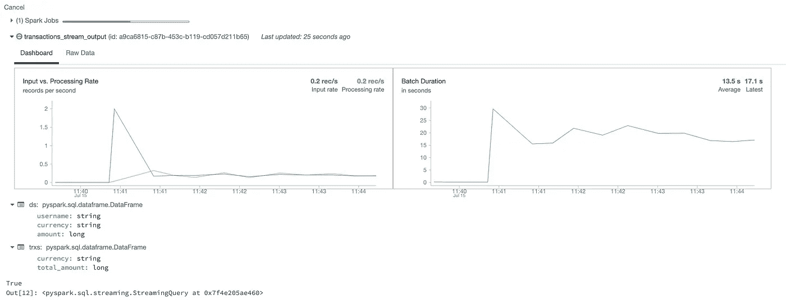
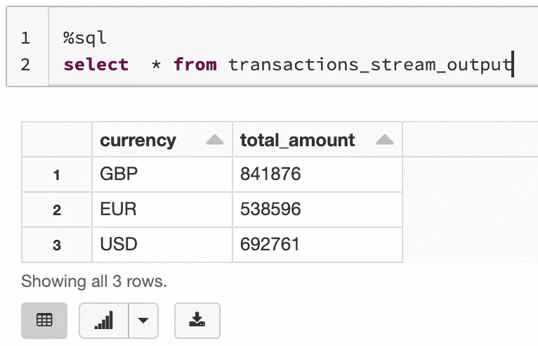
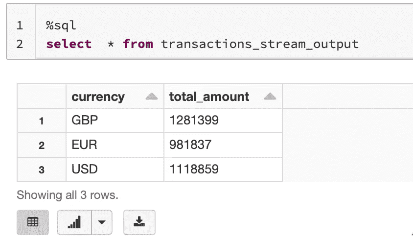

# 如何用 PySpark & Faker 创建 JSON 数据流

> 原文：<https://towardsdatascience.com/build-a-data-streaming-job-in-5-mins-with-pyspark-faker-a4f3d2420384?source=collection_archive---------11----------------------->

## 在本教程中，您将学习如何生成 JSON 格式的实时数据流，将文件存储在 AWS S3 桶中，以及使用 Python (Spark)动态聚合数据。


Evgeny [Tchebotarev](https://www.pexels.com/@evgeny-tchebotarev-1058775) 在[像素](https://www.pexels.com/@evgeny-tchebotarev-1058775)上拍摄的照片

## 建议的点播课程

*我的一些读者联系我，要求提供点播课程，以了解更多关于****Apache Spark****的信息。这是我推荐的 3 个很好的资源:*

*   [**用阿帕奇 Kafka 进行数据流&阿帕奇 Spark nano degree(uda city)**](https://imp.i115008.net/zaX10r)
*   [**数据工程纳米学位(Udacity)**](https://imp.i115008.net/zaX10r)

# 问题:生成流数据集

如果您熟悉 PySpark 及其结构化流 API，您就会知道将流作业表示为标准批处理作业是多么容易，不同之处在于数据流可以被视为一个不断追加的表。

尽管以简单明了的方式编写了一个流处理模型，但是寻找流数据源可能是一项具有挑战性的任务，尤其是在部署应用程序之前测试应用程序，或者在学习 PySpark 时设置第一个流作业。

为了让你的工作生活更轻松，学习过程更快，在本教程中，我将向你展示如何使用 Python 的`faker`和`random`包产生一个模拟数据流，以 JSON 格式序列化。

此外，您将学习如何将数据流保存在 S3 桶中(免费)，然后使用 PySpark 动态读取和聚合数据流。所有这些步骤只需要 5 分钟。

# 先决条件和安装

为了快速完成这一过程，在您进一步阅读之前，我建议您:

1.  在 [AWS](https://aws.amazon.com/) 上创建一个免费账户以及一个 [IAM 用户。记得把`ACCESS KEY ID`和`SECRET ACCESS KEY`都留着以后用。设置您的 IAM 用户，使其拥有一个`AmazonS3FullAccess`。](https://docs.aws.amazon.com/rekognition/latest/dg/setting-up.html)
2.  安装`boto3`包并创建一个配置文件，以编程方式使用上面生成的两个密钥。
3.  访问 [Databricks 的社区版](https://community.cloud.databricks.com/login.html)，然后[配置一个标准集群](https://docs.databricks.com/clusters/configure.html)并将其连接到您将运行 PySpark 代码的笔记本上。即使您以前没有使用该平台的经验，这项任务也应该相当直观。
4.  安装剩余的软件包，其中有`faker`、`random`、`uuid`和`json`。

如果是第一次在`S3`创建 IAM 用户，以及`config`文件，建议先看一下[本教程](https://realpython.com/python-boto3-aws-s3/)的第一段。

一旦你完成了这些安装(*大约需要 30-45 分钟*)，你就可以开始生成一个模拟数据流了！

# 创建您的数据生产者

第一步是使用以下命令创建一个带有`boto3`(在本例中为`data-stream-dump`)的`S3`桶:

然后，我创建一个名为`Transaction`的`data class` ( *如果数据类和装饰器对你来说是一个新概念，请看* [*本教程*](https://realpython.com/python-data-classes/) )，它由 3 个字段组成:

*   `username`是一个字符串，将通过调用`faker.user_name`随机生成；
*   `currency`是一个字符串，在属于`currencies`列表的字符串中取一个随机值。我将货币限制为 3 种，以使稍后在 PySpark 中执行的聚合更加明显，但是您也可以使用`faker.currency`生成随机货币。
*   `amount`也是一个字符串，被定义为介于`100`和`200,000`之间的随机整数。

我现在可以使用`Transaction`来定义一个`serialize(self)`方法(*是的，您可以将方法定义为数据类*的一部分)，它有效地用于将这 3 个字段格式化为一个字典:

现在每次我打电话:

```
print(Transaction().serialize())
```

我得到一个假的*银行交易*，由一个假的`username`在一个假的`currency`和一个假的`amount`中创建:

```
{‘username’: ‘jjohnson’, ‘currency’: ‘GBP’, ‘amount’: 102884}
```

使用数据类和 faker 包很酷的一点是，您可以不断增加或改变字段的数量和类型，以满足您的特定需求。

> 使用数据类和 faker 包很酷的一点是，您可以不断增加或改变字段的数量和类型，以满足您的特定需求。

我终于准备好定义一个`Producer()`函数，并将其传递给一个运行 100 次的循环:

每次调用`Producer()`函数时，它都会以`json`格式将单个事务写入一个文件(*上传到 S3* )，该文件的名称采用标准根`transaction_`加上一个`uuid`代码，以使其唯一。

在这种情况下，**循环将生成 100 个文件，每个文件之间的间隔为 3 秒**，以模拟真实的数据流，其中流应用程序监听外部微服务。

完整的代码，直到这一点是可用的[在这里](https://gist.github.com/anbento0490/05f718cf4797a8d9536d00cb2e9704cb)。我将很快编译它，但在此之前，我需要先创建一个流作业。

## 在数据砖的 FS 中安装你的 S3 桶

我的流作业将写在 DataBrick CE 笔记本中，如下所示:



如果您希望您的流作业监听 S3 存储桶中发生的事情，您需要将您的亚马逊 S3 存储桶作为文件系统“挂载”。

挂载是指你可以使用 Databricks 的平台“ [*”与亚马逊 S3 桶进行交互，对文件和文件夹*](https://cloud.netapp.com/blog/amazon-s3-as-a-file-system) 进行读写操作。

有一些关于如何在 Databricks 中挂载文件系统的文档，但是它们让您相信只有获得高级许可才有可能。原来，在这篇伟大的文章 [中，Sneha Mehrin](https://medium.com/u/758d96208dd7?source=post_page-----a4f3d2420384--------------------------------) 找到了一个非常简单的方法来解决这个问题。

你需要做的一切，就是在你的笔记本上运行下面的代码(*记住使用你在本教程开始时保存的 2 个键*):

如果您没有得到任何错误，这意味着您的 S3 文件系统已经正确挂载，但是，因为您的 bucket 仍然是空的，所以您不会通过运行以下命令看到任何文件:

```
%fs ls /mnt/s3Data/ # --> where /s3Data is the folder name
```

相反，如果您很好奇并且已经运行了`Producer()`函数(*希望少于 100 次迭代:D* )，您将会看到这种类型的文件结构:



一旦生成器运行，您将看到装载的 bucket 的文件结构。

最后，用 PySpark 写一些代码就都设置好了！

## 创建 Spark 会话并定义模式

首先，我定义了一个`SparkSession` ( *在 Databricks CE 中不是必需的，但是很好的实践*)，然后我手动声明了在使用`readStream`读取文件时必须提供的数据流模式(`JSONschema`):

请注意，`Producer()`函数已经将字典转换为 JSON 文件，因此在 PySpark 中，金额类型现在被读取为`LongType()`整数。

## 消耗数据流并在内存中输出

下面我要做的是读取挂载文件夹中以`transactions`根目录开始的所有文件，然后将它们保存到`ds` DataFrame:

如果`ds.isStreaming`为`True`,则表示流处理处于活动状态。

然后，我希望通过`currency`计算总数`amount`，因此我只从`ds`中选择这两个字段，并执行简单的聚合(将其保存到`trxs`

最终，我只需要开始将`trxs`写成一个流，并保存在`memory`(对于本教程的范围来说*已经足够了*)。因为我正在执行聚合，所以我必须使用`complete`作为`outputMode`。注意，写入存储器的流被命名为`transactions_stream_output:`

现在，我要做的第一个操作是运行 PySpark 代码，开始读写一个流。这是因为它可能需要 30 秒，所以在此期间你可以跳到别的东西上。

我要执行的第二个操作是运行第一个生成数据的 Python 脚本。当您这样做时，您会看到屏幕上出现编号的迭代:



您将看到每 3 秒钟出现一次迭代(PyCharm)

此外，如果您检查您的 S3 用户界面，您会看到文件被写入桶:



用事务文件填充的 S3 时段。

现在回到数据砖笔记本。希望您应该看到流处于活动状态，并且随着新文件写入 S3 并被流作业读取，图形会不断变化:



Databricks 的数据流仪表板。

PySpark 的一个很酷的特性是，您可以使用 SQL 轻松查询由流作业创建的内存表。如您所见，每次在 S3 写入新文件并由流式作业处理时，表中保存的聚合都会更新:



查询 1:在执行了 10 次迭代之后。



查询 2:在执行了 20 次迭代之后。total_amount 持续增长！

# 结论

恭喜你！如果您已经做到了这一点，那么您已经成功地在 PySpark 中构建了一个工作数据流作业，该作业从一个 S3 桶中读取 JSON 文件(*，每个文件包含一个模拟银行事务*，并将它们写入内存表中。

既然您已经知道如何构建一个动态数据类(使用`field()`和`defaulty_factory`参数),那么您可以扩展这个概念并创建自己的流数据集。极限只是你的创意！

如果你觉得这个教程有用，请留下一些掌声，或者如果你想阅读更多类似主题的教程，请跟我来:D