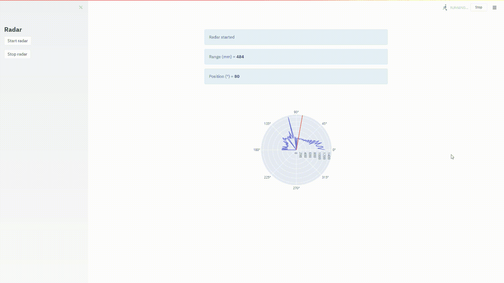
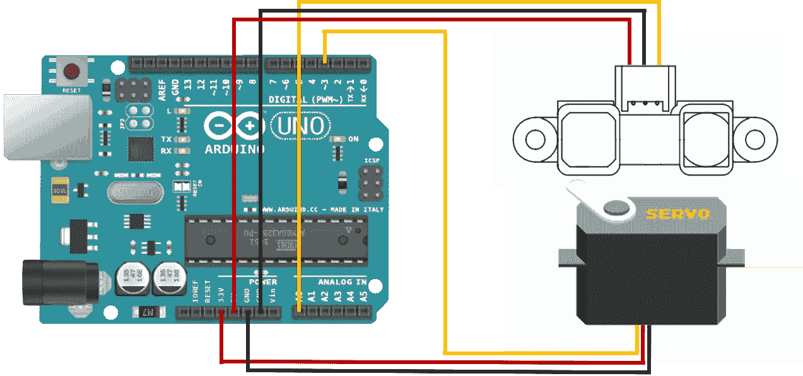
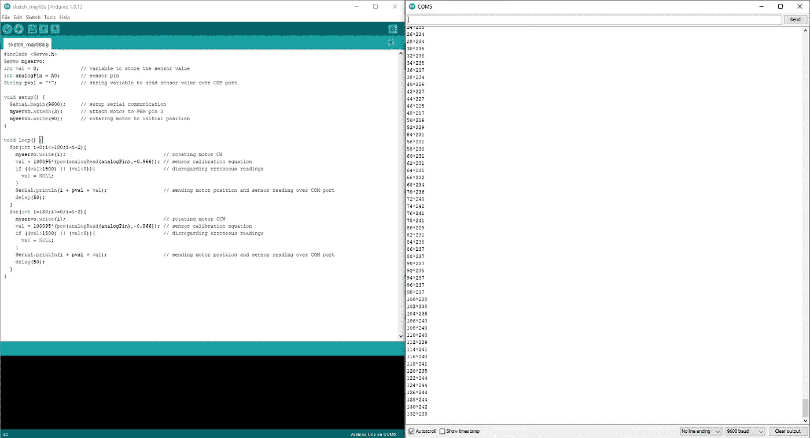

# 使用 Arduino、Python 和 Streamlit 构建一个 DIY 迷你雷达

> 原文：<https://towardsdatascience.com/build-a-diy-mini-radar-using-arduino-python-and-streamlit-c333006681d7?source=collection_archive---------28----------------------->

## 如何建立一个廉价的迷你雷达系统与现场仪表板



迷你雷达仪表板。作者视觉。

## 介绍

对于我们这些从事机器人行业的人来说，特别是像相扑和机器人足球机器人这样的竞争型机器人，我们知道检测物体以避免碰撞是不可能被夸大的。虽然你经常会用大量的红外传感器来探测周围的物体，但事实上，你可以用更少的资源建造自己的迷你雷达来达到同样的效果。在这里，我将向您展示如何使用红外测距传感器与伺服电机耦合来创建一个 DIY 迷你雷达，以及如何通过令人眼花缭乱的仪表盘实时显示结果。

## 1.阿尔杜伊诺

首先，我们将使用 Arduino Uno 板从锐距离测量传感器[读取距离值。随后，我们将使用双面胶带将传感器安装到伺服电机的臂上，并如下所示连接电线。](https://www.sparkfun.com/datasheets/Sensors/Infrared/gp2y0a02yk_e.pdf)



Arduino，红外测距传感器和伺服电机—图片由作者提供。

一旦您连接了传感器和伺服系统，请继续将以下程序上传到 Arduino。

请注意，根据您使用的传感器和电源电压，您可能需要重新校准传感器。电流传感器可以读取 20-150 厘米之间的值，如有必要，通过读取已知距离的传感器测量值，并使用该测量值推导出一个新的公式，实验性地重新校准电机。

要验证 Arduino 和传感器是否按预期工作，请打开串行监视器(“工具”>“串行监视器”)，确保记录值并通过串行端口发送，如下所示。



Arduino 串行监视器—图片由作者提供。

## 2.计算机编程语言

既然 Arduino、传感器和伺服系统正在工作并将值发送到串行端口，我们需要获取 Python 中的读数来生成我们的雷达仪表板。要通过串行 USB 连接将 Python 脚本与 Arduino 接口，我们需要下载并安装 Pyserial。继续启动 Anaconda 或您选择的任何其他 Python IDE，并键入以下命令:

```
pip install pyserial
```

为了生成一个图形用户界面，我们可以可视化我们的仪表板并与之交互，我们将使用 [Streamlit](https://www.streamlit.io/) 。这个高度通用的 web 框架允许您快速开发应用程序并将其部署到 web 服务器上，或者在您的浏览器上本地运行它们。为了显示传感器读数的雷达图，我们将使用 [Plotly](https://plotly.com/python/) 。这是 JavaScript 的高度交互式数据可视化框架的 Python 绑定，允许您在指尖渲染令人眼花缭乱的视觉效果。

继续将以下源代码保存在本地目录中:

上述代码将启动到 Arduino 的连接，然后将从串行端口连续读取雷达位置和传感器值，直到被提示停止。它还会不断渲染和更新雷达图。

要运行上述脚本，请在 Anaconda 提示符下键入以下命令:

```
cd C:/Users/.../local_directory
streamlit run python_radar.py
```

## 结果

这就是你要的，一个自己动手做的迷你雷达！

如果您想了解更多关于数据可视化和 Python 的知识，请随时查看以下(附属链接)课程:

## 使用 Streamlit 开发 Web 应用程序:

[](https://www.amazon.com/Web-Application-Development-Streamlit-Applications/dp/1484281101?&linkCode=ll1&tag=mkhorasani09-20&linkId=a0cb2bc17df598006fd9029c58792a6b&language=en_US&ref_=as_li_ss_tl) [## 使用 Streamlit 开发 Web 应用程序:开发和部署安全且可伸缩的 Web 应用程序…

### 使用 Streamlit 开发 Web 应用程序:使用……开发安全且可扩展的 Web 应用程序并将其部署到云中

www.amazon.com](https://www.amazon.com/Web-Application-Development-Streamlit-Applications/dp/1484281101?&linkCode=ll1&tag=mkhorasani09-20&linkId=a0cb2bc17df598006fd9029c58792a6b&language=en_US&ref_=as_li_ss_tl) 

## 使用 Python 实现数据可视化:

[](https://www.coursera.org/learn/python-for-data-visualization?irclickid=xgMQ4KWb%3AxyIWO7Uo7Vva0OcUkGQgW2aEwvr1c0&irgwc=1&utm_medium=partners&utm_source=impact&utm_campaign=3308031&utm_content=b2c) [## 用 Python 实现数据可视化

### “一图胜千言”。我们都熟悉这个表达。它尤其适用于试图…

www.coursera.org](https://www.coursera.org/learn/python-for-data-visualization?irclickid=xgMQ4KWb%3AxyIWO7Uo7Vva0OcUkGQgW2aEwvr1c0&irgwc=1&utm_medium=partners&utm_source=impact&utm_campaign=3308031&utm_content=b2c) 

## 面向所有人的 Python 专业化:

[](https://www.coursera.org/specializations/python?irclickid=xgMQ4KWb%3AxyIWO7Uo7Vva0OcUkGQgW16Ewvr1c0&irgwc=1&utm_medium=partners&utm_source=impact&utm_campaign=3308031&utm_content=b2c) [## 面向所有人的 Python

### 学习用 Python 编程和分析数据。开发收集、清理、分析和可视化数据的程序…

www.coursera.org](https://www.coursera.org/specializations/python?irclickid=xgMQ4KWb%3AxyIWO7Uo7Vva0OcUkGQgW16Ewvr1c0&irgwc=1&utm_medium=partners&utm_source=impact&utm_campaign=3308031&utm_content=b2c) 

## 物联网专业化编程简介:

[](https://www.coursera.org/specializations/iot?irclickid=xgMQ4KWb%3AxyIWO7Uo7Vva0OcUkGQgQzrEwvr1c0&irgwc=1&utm_medium=partners&utm_source=impact&utm_campaign=3308031&utm_content=b2c) [## 物联网编程介绍(IOT)

### 创建自己的物联网(IoT)设备。只需六门课程，即可设计并创建一个简单的物联网设备。设计…

www.coursera.org](https://www.coursera.org/specializations/iot?irclickid=xgMQ4KWb%3AxyIWO7Uo7Vva0OcUkGQgQzrEwvr1c0&irgwc=1&utm_medium=partners&utm_source=impact&utm_campaign=3308031&utm_content=b2c) 

## GitHub 资源库:

[](https://github.com/mkhorasani/arduino_python_radar) [## mkhorasani/arduino _ python _ radar

### 如何建立一个廉价的迷你雷达系统与现场仪表板

Github.com](https://github.com/mkhorasani/arduino_python_radar) 

# 新到中？您可以在此订阅并解锁无限文章[。](https://khorasani.medium.com/membership)