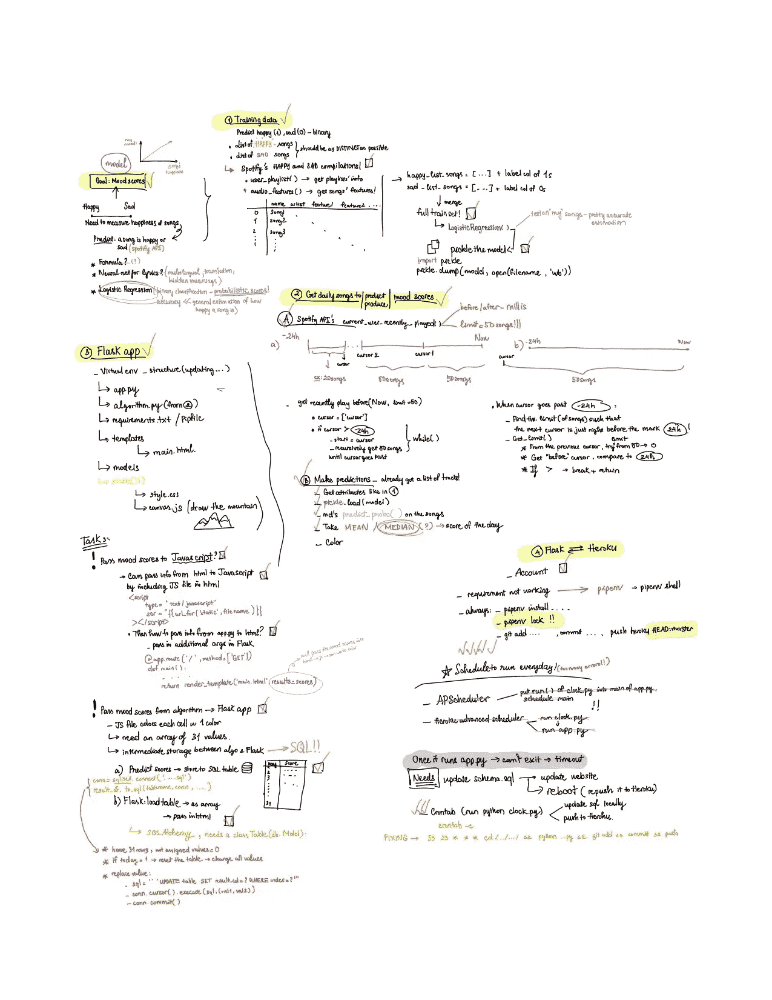
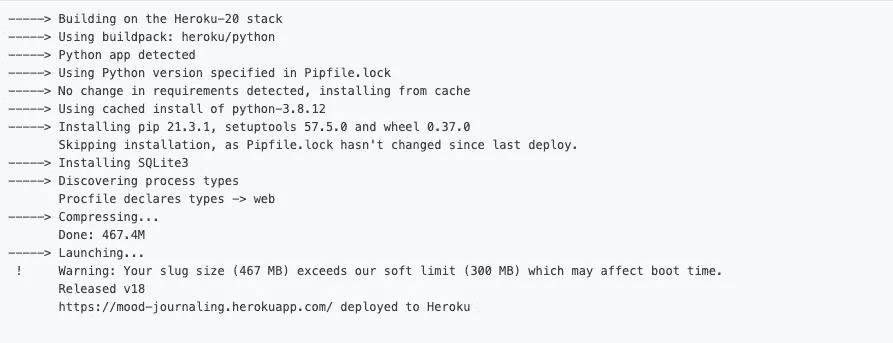
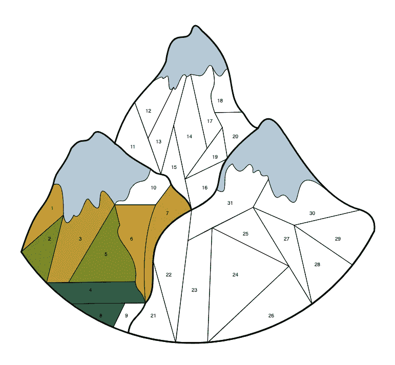

# 使用 Spotify API 构建一个 Flask-Heroku 情绪跟踪器 Web 应用程序

> 原文：<https://towardsdatascience.com/build-a-flask-heroku-mood-tracker-web-app-using-the-spotify-api-14b3b5c92ac9?source=collection_archive---------15----------------------->

## [实践教程](https://towardsdatascience.com/tagged/hands-on-tutorials)

## A-Z 项目根据我每天听的歌曲生成情绪得分，并相应地给我的在线情绪跟踪器着色


[埃斯特扬森斯](https://unsplash.com/@esteejanssens?utm_source=medium&utm_medium=referral)在 [Unsplash](https://unsplash.com?utm_source=medium&utm_medium=referral) 上拍摄的照片

*下面先睹为快的* [*最终结果*](https://mood-journaling.herokuapp.com/) ！

子弹日记是我的主要爱好之一。浏览上百个 Instagram bujo 账号，每个月我最期待的一件事就是 bujo 艺术家的情绪追踪器模板。这些色彩缤纷的情绪拼贴画奠定了我这个项目的基础。当我在设计下个月的情绪跟踪器时，我的脑海中闪过一个想法，如果有一个系统可以自动检测我们的情绪，并帮助我们每天填充单元格，那将是非常棒的。


照片由[拍摄那是她的事](https://unsplash.com/@thatsherbusiness?utm_source=medium&utm_medium=referral)在 [Unsplash](https://unsplash.com?utm_source=medium&utm_medium=referral)

## 好的，数据呢？

音乐一直是我日常生活的重要组成部分。我的音乐和我的情绪之间的关系通常是线性的:当我开心的时候，我会听欢快的歌曲；当我悲伤的时候，我会听民谣；当我压力过大的时候，我会听治愈的节奏。因此，我决定使用我在 Spotify 上听的歌曲，特别是它们通过 API 提供的属性，如声音、舞蹈性等，作为歌曲快乐水平的指标，以及随后我的整体情绪。

头脑风暴出了一个总体的项目想法后，我开始起草一份管道组件的清单，确定任务应该完成的顺序以及我应该如何处理每一项任务。下图记录了我的思考过程和每个阶段的发展计划/进度:



帮助我跟踪项目进度的工作流程——按作者分类的图片

# 赫罗库

Heroku 是一个云平台，为 Webapp 的基本托管提供免费选项，因此它适用于小规模的个人项目。我们只需要一个账户！

注册后，导航到你的个人仪表盘，点击“新建”创建一个新的应用程序(我的应用程序叫做心情日志)。转到您的应用程序，在“部署”下，选择 Heroku Git 作为您的“部署方法”,并按照下面列出的步骤将您的项目(目前为空)克隆到您的本地工作环境。我们将在此文件夹中添加文件，然后推送更改。就这样，让我们开始这个项目吧！

# 决定模型

首先，我需要一个模型来根据我的音乐列表产生上述情绪得分。确定合适的模型需要后退一步，关注最终的结果。我相信好的模型来自于专注于你的最终目标；一个更复杂的模型不一定能为一个人的问题提供最好的解决方案。

如上所述，我的快乐程度是由一首歌听起来有多快乐来定义的。因此，我需要一种算法，给有快乐氛围的歌曲分配较高的分数，否则分配较低的分数。K-Means 是一种经常用于歌曲分析的无监督方法，它根据歌曲的相似性对歌曲进行分组，但这对我的任务没有帮助，因为我已经记住了两个类别。用于歌词分析的深度学习模型也是一种选择，但歌曲中的句子通常很短，重复且有隐藏的含义。另外，歌词不是我听歌的主要因素，节奏才是。

通过不同选项的循环，我得出结论，我可以用二元逻辑回归模型获得想要的结果。如果我使用两个非常不同的列表来拟合模型，一个是乐观快乐的歌曲，另一个是民谣式的忧郁旋律，那么我可以产生一个概率预测，任何给定的歌曲离快乐歌曲有多近。这个概率可以作为我的*情绪得分。*取一天中所有歌曲的所有情绪得分的中间值，我将准备好最终得分！

# 训练逻辑回归模型

## 从训练数据来看…


由[este 扬森斯](https://unsplash.com/@esteejanssens?utm_source=medium&utm_medium=referral)在 [Unsplash](https://unsplash.com?utm_source=medium&utm_medium=referral) 上拍摄

特别感谢 [Sejal Dua](https://medium.com/u/e353ddb0c125?source=post_page-----14b3b5c92ac9--------------------------------) 的详细[指南](/k-means-clustering-and-pca-to-categorize-music-by-similar-audio-features-df09c93e8b64)使用 Spotify API 抓取歌曲，使这项任务变得前所未有的简单！Sejal 的程序接受 Spotify 的播放列表 id 列表，并返回所有歌曲属性的数据帧，准备用于训练模型。我将 Spotify 制作的快乐合辑(情绪助推器、快乐节拍等)和悲伤合辑(悲伤时刻、生活糟透了等)输入到这个功能中，这些合辑包含了这个类别中非常有代表性的歌曲。全套大约有 1000 首歌曲。

我用交叉验证训练了这个模型，它的准确率达到了 0.89！我还在包含悲伤和快乐歌曲的个人播放列表上使用了 *predict_proba* ，分配给歌曲的概率估计模型很好地反映了每首歌曲的快乐水平。然后，该模型被处理以用于我们的应用程序。

```
import picklepickle.dump(lr, open("deploy_model.sav", 'wb'))
```

## …预测

为了进行预测，我需要收集一天中我听的所有歌曲。在 Spotify API 提供的所有功能中，*current _ user _ recent _ played*是最接近我们的目标结果的功能。然而，它仅限于在一次调用中返回最近的 50 首歌曲。因此，我不得不编写一个小程序来收集过去 24 小时内的所有歌曲(在我的手写笔记上也可以找到如何工作的说明)。

每当我调用这个函数的时候，在所有曲目旁边，它还会返回一个 ***光标*** ，告诉我我听的第 50 首歌的时间戳(以毫秒为单位)。例如，如果我在过去 24 小时内听了 120 首歌曲，那么第 50 首最近的歌曲是，比如说，5 小时前。这个想法是一次获取一批 50 首歌曲，提取这个光标，将起点设置到这个光标，然后重新开始获取接下来的 50 首歌曲。一旦我得到的批次的光标超过 24 小时标记，该过程就停止了。在这一点上，我必须调用一个 *get_right_limit()* 函数，该函数确定从最后一个光标开始我听了多少首没有超过 24 小时的歌曲。代码片段如下:

get limit 函数如下:

一旦我得到了所有的歌曲，剩下的就是提取这些歌曲的特征，就像我在上一节中所做的那样。之后，我用 *pickle.load()* 加载 pickle 模型，并使用 *predict_proba* 生成分数，我将把它作为一个名为“prediction”的列添加到我们的数据帧中:

```
mixed = get_features_for_playlist2(mixed, curr_time, curr_time - 86400000) # 86400000 is 1 day in millislr = pickle.load(open('models/deploy_model.sav', 'rb'))vnpred = lr.predict_proba(mixed.drop(['name', 'artist','track_URI'], axis=1))[:,1]mixed.insert(3, 'prediction', vnpred)# take the median score
day_median = float(median(mixed['prediction']))
```

# 存储结果

我还需要一种存储方式，当上面的程序运行时，它会得到更新，Flask 应用程序可以很容易地从中检索和使用结果。这里我使用了一个 SQL 表。每天存储和更新结果的代码是:

将我的结果存储在 schema.sql 中

值得注意的是，我必须创建一个 31 行的表，因为 Flask 应用程序将检索所有 31 个值来查找图形的颜色。表中的所有值都被初始化为 0。每当我们转向一个新的月份，该表将被重置:所有旧的值将被清除并替换为 0。

# 去弗拉斯克和赫罗库！


在 [Unsplash](https://unsplash.com?utm_source=medium&utm_medium=referral) 上由[埃斯特·扬森斯](https://unsplash.com/@esteejanssens?utm_source=medium&utm_medium=referral)拍摄的照片

## 烧瓶环境

如果你以前没有用过 Flask，这里的是一个快速而有用的安装和入门指南！我们的 flask 应用程序的所有必要文件的列表可以在上面的我的计划器中找到。

此外，为了将您的应用程序推送到 Heroku，我建议使用 pipenv——一种创建虚拟环境的工具——因为它很好地锁定了您的应用程序的所有必要的依赖库(并且比使用 requirements.txt 文件给我带来的麻烦更少！).为了使用它，使用 *pip install pipenv* ，然后键入 *pipenv shell* 来激活环境。在这种环境下，请执行*pipenv install[list of package _ name]*来安装您的程序所需的软件包。最后， *pipenv lock* 完成安装后，将所有这些需求锁定到您的应用程序。在将应用程序推送到 Heroku 之前，如果你安装了任何额外的包，你需要再次键入这个命令，否则部署会给你错误，说没有这样的模块。

## SQL 烧瓶(app.py)

现在我已经将现成的结果存储在 schema.sql 中，我继续将它加载到我的 Flask 应用程序中。在 app.py 中，为了方便地从表中提取信息，我使用了一个名为 [Flask-SQLAlchemy](https://flask-sqlalchemy.palletsprojects.com/en/2.x/quickstart/) 的包。首先，我必须用下面的语法[创建引擎](https://flask-sqlalchemy.palletsprojects.com/en/2.x/config/)和[声明模型](https://flask-sqlalchemy.palletsprojects.com/en/2.x/models/):

## main.htmlJavaScript

“模板”文件夹中的 main.html 文件被我们的 Flask 应用程序用来创建网站的界面。但是为了绘制图形和定制颜色，我们需要 Javascript 和 CSS。烧瓶要求我们把。js 和。css 文件放在另一个名为 static 的文件夹中。我使用 Javascript 的 [Canvas API](https://developer.mozilla.org/en-US/docs/Web/API/Canvas_API/Tutorial) 和 R [ainbowVis](https://github.com/anomal/RainbowVis-JS) 包来制作图纸。这一阶段需要大量的试验和错误，然后才能得到最终产品，但这也是最有趣的部分。 **RainbowVis** 包提供了一个工具来生成一个十六进制数字数组，表示从蓝色(=悲伤)到绿色(=中性)到黄色(=快乐)的 1000 种颜色的渐变。这个想法是将情绪分数四舍五入到小数点后 3 位，乘以 1000，并得到该指数处的十六进制颜色。

因此，我必须将分数从 app.py 传递到 html 文件，再传递到 javascript 文件。经过一轮谷歌搜索，我想到了解决方案:

*   为了**将分数从 app.py 传递给 main.html**，我使用 Flask-SQLAlchemy 函数来查询分数，或者“结果”列，并通过 *render_template()将其作为数组传递给 html。我把这个函数放在默认路径下，因为我希望当我们访问首页时，这些图形能够正确地呈现。*

```
[@app](http://twitter.com/app).route('/', methods=['GET'])
def main():
    table = Mood.query.with_entities(Mood.results).all()
    table = [r for r, in table]
    # table is currently storing the mood scores
    return render_template('main.html', results = table)
```

*   分数现在存储在 html 中一个名为 results 的数组中。为了获得数组中的信息，我们必须使用双花括号。我们可以使用***console . log({ { results } })***来确认数组成功传入。
*   为了**将分数从 main.html 传递到 canvas.js** ，我将 canvas.js 中的代码包装在一个名为 *draw()* 的函数中，该函数接受一个参数:值数组。在 HTML 内部，我调用 draw()并将情绪得分表传入。代码如下。注意，Flask 的 HTML 文件在语法上与普通的 HTML 文件略有不同，包括 src 和 href。

*   现在在 canvas.js 中，您可以使用普通的数组索引来访问结果中的值！

至此，我们已经完成了应用程序中不同组件之间的链接设置！如果你输入 ***flask run*** 我们可以看到我们的应用程序在本地主机上运行。现在剩下的，就是把它推到 Heroku 身上，让其他人也能看到！

## 烧瓶 Heroku

按照 Deploy 下的后续步骤，添加、提交和推送我们的文件到 Heroku(记住在执行这个步骤之前要 pipenv lock)。您的终端应该显示如下内容:



如果你访问这个网址，当你运行 *flask 时，它会显示出你在本地电脑上的 Flask 应用程序上看到的准确状态。*瞧！

## 计划每天运行:

最后一步是使程序自动化，以便它在每天结束时运行并相应地更新图表。为此，我编写了一个 [crontab](https://ole.michelsen.dk/blog/schedule-jobs-with-crontab-on-mac-osx/) 脚本，它在每晚 11:59 运行 clock.py，用当天的新分数更新 SQL 表，然后将整个项目重新推送到 Heroku。

注意，为了让 crontab 在 macOS 上正常工作，您必须授权它使用您的本地文件夹。进入系统偏好设置->安全和隐私->全磁盘访问。单击下面的锁图标可以进行更改。单击“+”号，然后转到路径“/usr/sbin/cron”。选中 cron 的复选框，再次点击锁以锁定更改。我们都准备好了。

键入 *crontab -e* 开始编写 crontab 脚本:

```
59 23 * * * cd /Users/irenechang/Desktop/PORTFOLIO/Fall2021/mood-journaling && /opt/anaconda3/bin/python /Users/irenechang/Desktop/PORTFOLIO/Fall2021/mood-journaling/clock.py && /usr/local/bin/git add /Users/irenechang/Desktop/PORTFOLIO/Fall2021/mood-journaling/. && /usr/local/bin/git commit -m "commits" && /usr/local/bin/git push heroku HEAD:master
```

搞定了。我们的程序每天都会更新！



最终结果—作者提供的图片

## 结论:

这是一个有趣的从想法到部署的 ML 项目，我开始这个项目的目的是获得使用 Heroku 和 Flask 的实践经验，并让自己熟悉数据科学模型的 A-Z 管道。希望你会像我一样喜欢这篇在线子弹日志揭示的对你日常情绪的洞察。此外，我希望这能为您的个人项目提供有益的指导，尤其是在部署模型和找出多个不同元素之间的联系时。

非常感谢您的阅读！我的代码可以在这个 [repo](https://github.com/irenechang1510/mood-journaling) 中找到！如果您有任何进一步的想法或反馈，请随时通过我的 [LinkedIn](https://www.linkedin.com/in/irene-chang-4356a013a/) 联系我，我很乐意与您联系！

# 参考资料:

[](/k-means-clustering-and-pca-to-categorize-music-by-similar-audio-features-df09c93e8b64) [## K-Means 聚类和 PCA 通过相似的音频特征对音乐进行分类

### 一个无人监督的机器学习项目来组织我的音乐

towardsdatascience.com](/k-means-clustering-and-pca-to-categorize-music-by-similar-audio-features-df09c93e8b64) [](/end-to-end-deployment-of-a-machine-learning-model-using-flask-dc456abcc6da) [## 使用 Flask 的机器学习模型的端到端部署

### 使用 Flask 设计和构建利用机器学习的端到端 Web 应用程序

towardsdatascience.com](/end-to-end-deployment-of-a-machine-learning-model-using-flask-dc456abcc6da) [](/pipenv-to-heroku-easy-app-deployment-1c60b0e50996) [## Pipenv 到 Heroku:轻松部署应用程序

### 使用 Pipenv 将应用程序从 GitHub 部署到 Heroku 的指南

towardsdatascience.com](/pipenv-to-heroku-easy-app-deployment-1c60b0e50996) 

*   [https://python-adv-we b-apps . readthedocs . io/en/latest/flask _ DB2 . html](https://python-adv-web-apps.readthedocs.io/en/latest/flask_db2.html)