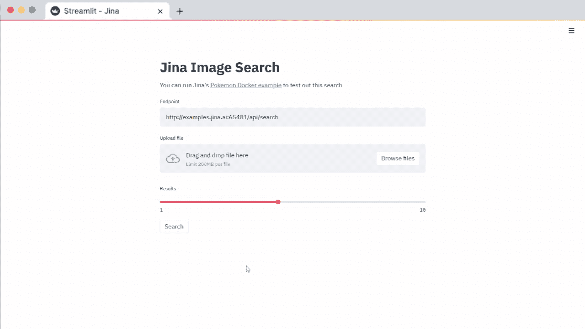
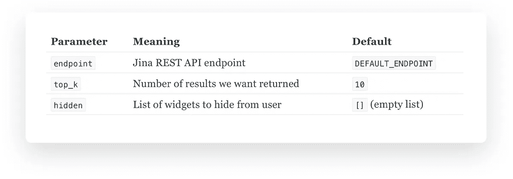

# 用 Streamlit 构建纪娜神经搜索

> 原文：<https://towardsdatascience.com/build-a-jina-neural-search-with-streamlit-a2b5c323cd45?source=collection_archive---------24----------------------->

## 借助深度学习的力量，使用纪娜搜索文本或图像



通过[流线](https://blog.streamlit.io/streamlit-jina-neural-search/)

你有没有想过，“该死的云。为什么不能有更简单的方法在上面建立一个神经搜索？”

如果你有，这篇文章是给你的。我将介绍如何使用[纪娜的](https://github.com/jina-ai/jina/)新 Streamlit 组件来搜索文本或图像，以构建一个神经搜索前端。

想直接跳进去吗？查看我们的[文本搜索应用](http://examples.jina.ai:8501/)或[图片搜索应用](http://examples.jina.ai:8502/)，这里是[组件的回购](https://github.com/jina-ai/streamlit-jina)。

# 为什么要用纪娜来建立一个神经搜索？

纪娜是一个开源的深度学习搜索框架，用于在云上构建跨/多模态搜索系统(例如，文本、图像、视频、音频)。本质上，它让你用任何类型的数据为任何类型的数据构建一个搜索引擎。

所以你可以建立自己的文本到文本的搜索引擎，比如谷歌，文本到图像的搜索引擎，视频到视频的搜索引擎等等。脸书、谷歌和 Spotify 等公司通过最先进的人工智能模型(如 FAISS、DistilBERT 和 Annoy)来构建这些搜索。

# 为什么将 Streamlit 与纪娜一起使用？

在我加入纪娜之前，我就已经是 Streamlit 的忠实粉丝了。我在一个项目中使用它来创建可怕的《星际迷航》脚本，后来变成了《变形金刚文本生成的[前端。所以我非常高兴能使用这个很酷的框架为我们的用户构建一些东西。](https://github.com/alexcg1/easy_text_generator)

构建 Streamlit 组件有助于数据科学家、机器学习爱好者和 Streamlit 社区中的所有其他开发人员构建由神经搜索驱动的酷东西。它提供了灵活性，并且由于是用 Python 编写的，数据科学家可以更容易地跟上速度。

开箱即用，streamlit-jina 组件有文本到文本和图像到图像的搜索，但纪娜提供了丰富的搜索体验*为*任何类型的数据*与*任何类型的数据，所以有更多的添加到组件！

# 它是如何工作的？

每个纪娜项目包括两个[流程](https://docs.jina.ai/chapters/101/index.html#flow):

**索引:**用于使用神经网络模型从数据集中分解和提取丰富的含义

**查询:**接受用户输入并查找匹配结果

我们的 Streamlit 组件是终端用户的前端，所以它不用担心索引部分。

1.  管理员旋转出一个纪娜码头工人的图像:`docker run -p 45678:45678 jinahub/app.example.wikipedia-sentences-30k:0.2.9-1.0.1`
2.  用户在 Streamlit 组件中输入一个查询(当前为文本输入或图片上传)并点击“搜索”
3.  输入查询被封装在 JSON 中，并发送给纪娜的查询 API
4.  查询流完成它的工作，并以 JSON 格式返回结果(以及大量元数据)
5.  该组件解析出有用的信息(例如文本或图像匹配)并将它们显示给用户

# 示例代码

让我们来看看我们的[文本搜索示例](https://github.com/jina-ai/streamlit-jina/blob/main/examples/jina_text.py)，因为这样更容易看到那里发生了什么:

可以看到，上面的代码:

*   进口`streamlit`和`streamlit_jina`
*   设置搜索的 REST 端点
*   设置页面标题
*   显示一些说明性文本
*   显示定义了`endpoint`的纪娜文本搜索小部件

对于纪娜的 Streamlit 小部件，你也可以传入[其他参数](https://github.com/jina-ai/streamlit-jina#parameters)来定义你想要返回的结果数量或者你是否想要隐藏某些小部件。

# 在幕后

我们模块的源代码只有一个文件。现在让我们来看看文本搜索示例的高级功能:

## 设置配置变量

## 渲染组件

简而言之，`jina.text_search()`法:

*   创建一个 Streamlit 容器来保存所有内容，如果没有指定，则使用默认设置
*   如果小部件没有设置为隐藏，则向用户显示它们
*   [用户类型查询]
*   [用户点击按钮]
*   向纪娜 API 发送查询并返回结果
*   显示组件中的结果

我们方法的参数是:



`jina.text_search()`调用其他几种方法，这些方法都可以在`__init__.py`中找到。对于图像搜索，还有一些附加功能:

*   将查询图像编码为 base64，并在传递给纪娜 API 之前将其包装在 JSON 中
*   纪娜的 API 返回 base64 格式的匹配。`image.render.html()`方法将它们包装在``标签中，这样它们就能很好地显示

# 在您的项目中使用它

**在你的终端:**

创建一个包含虚拟环境的新文件夹并激活它。这将防止系统库和单个项目库之间的冲突:

```
mkdir my_project
virtualenv env
source env/bin/activate
```

安装[细流](https://pypi.org/project/streamlit/)和[细流-纪娜](https://pypi.org/project/streamlit-jina/)包:

```
pip install streamlit streamlit-jina
```

[索引您在纪娜的数据并启动查询流程](https://docs.jina.ai/chapters/my_first_jina_app)。或者，使用预先索引的 Docker 图像:

```
docker run -p 45678:45678 jinahub/app.example.wikipedia-sentences-30k:0.2.9-1.0.1
```

创建您的`app.py`:

运行 Streamlit:

```
streamlit run app.py
```

这就是你自己的文本搜索！

对于图像搜索，只需将上面的文本代码替换为我们的[图像示例代码](https://github.com/jina-ai/streamlit-jina/blob/main/examples/jina_image.py)，并运行一个纪娜图像(就像我们的[口袋妖怪示例](https://github.com/jina-ai/examples/tree/master/pokedex-with-bit))。

# 下一步做什么

感谢您阅读本文，并期待听到您对该组件的看法！如果你想了解更多关于纪娜和 Streamlit 的信息，这里有一些有用的资源:

## 纪娜

*   [流线型纪娜组件](https://github.com/jina-ai/streamlit-jina)
*   [纪娜 101](https://docs.jina.ai/chapters/101/index.html) :纪娜的基本部件
*   纪娜 102 :纪娜组件如何协同工作
*   我的第一个纪娜应用程序:为维基百科句子建立一个简单的文本搜索应用程序
*   我们的示例 repo:文本、图像、音频、视频和多模态搜索后端的示例，更不用说查询语言、增量索引、QA 搜索等等

## 细流

*   [精简文档](https://docs.streamlit.io/en/stable/)
*   [组件图库](https://streamlit.io/gallery?type=components&category=featured)
*   [应用程序库](https://streamlit.io/gallery?type=apps&category=featured)
*   [社区论坛](https://discuss.streamlit.io/)

# 非常感谢你！

主要感谢 Randy Zwitch，TC Ricks 和 Amanda Kelly，感谢他们的帮助，让组件上线。感谢我在纪娜的所有同事，是他们构建了后端让这一切成为可能！

*原载于 2021 年 4 月 15 日*[*https://blog . streamlit . io*](https://blog.streamlit.io/streamlit-jina-neural-search/)*。*