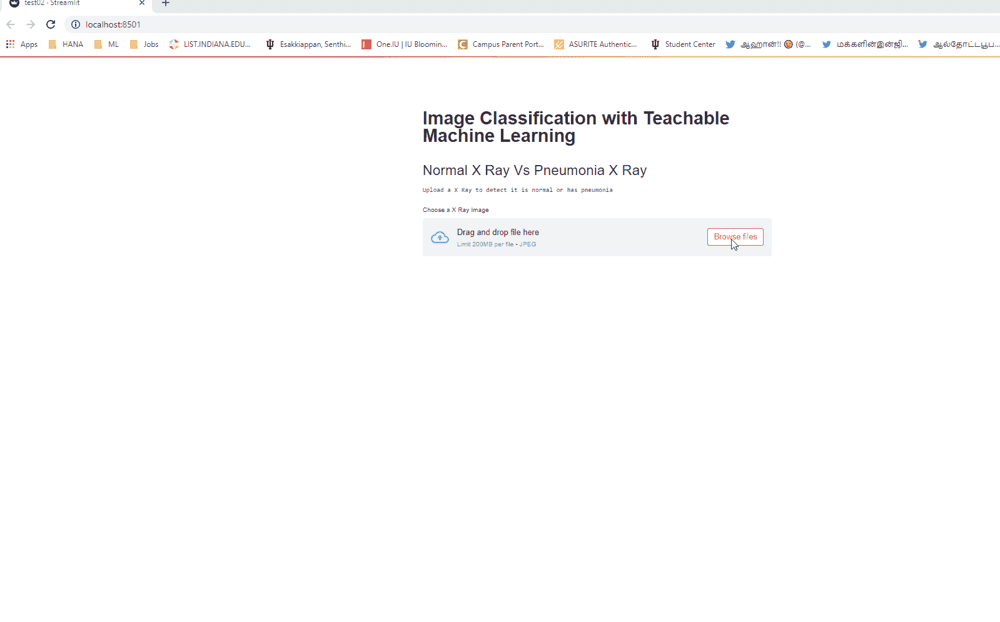
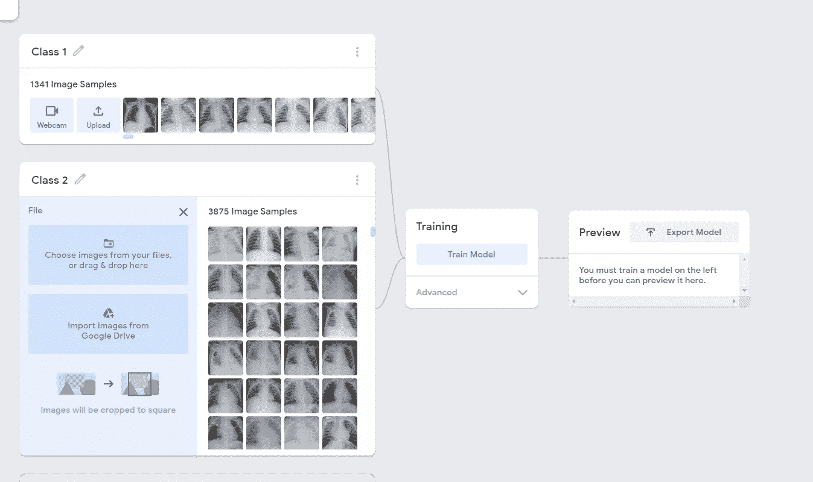
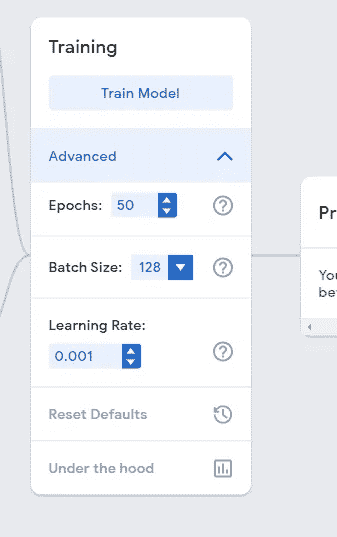
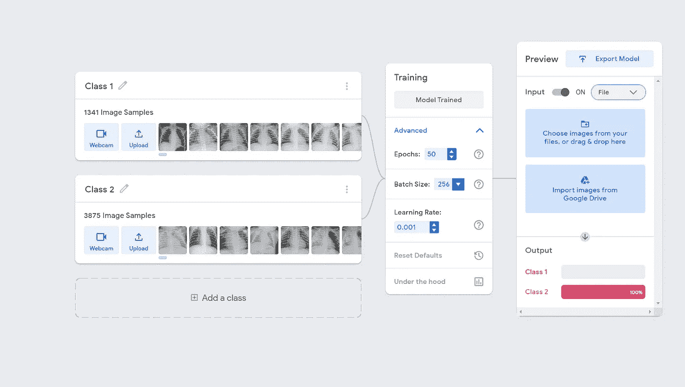
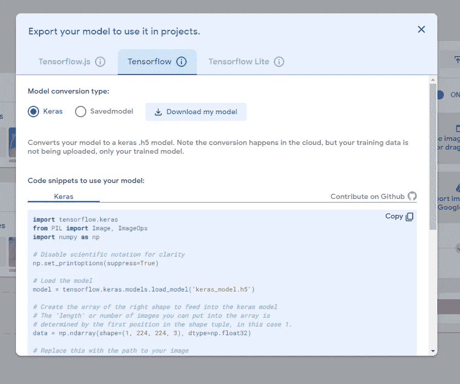
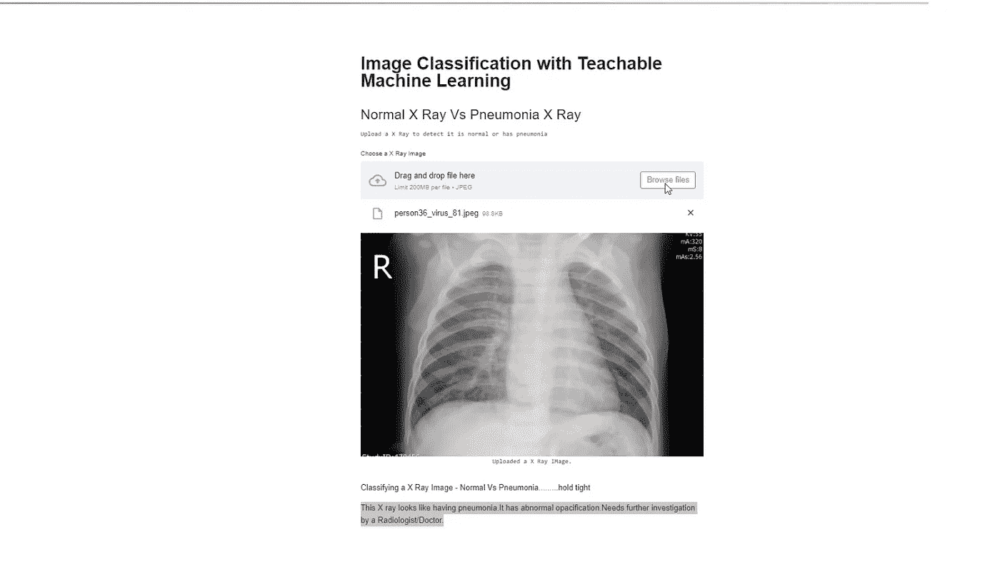
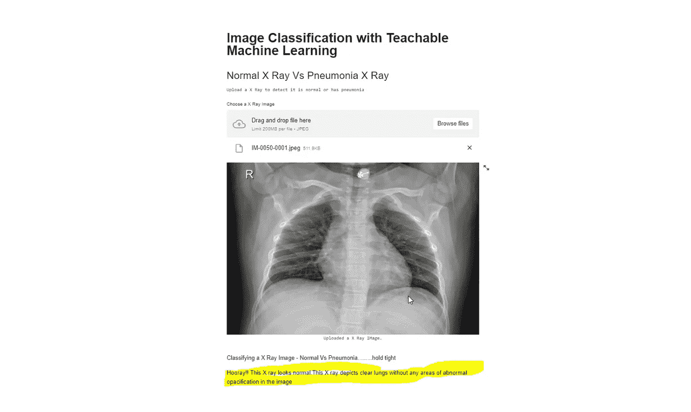

# 不到一个小时就能构建一个机器学习应用

> 原文：<https://towardsdatascience.com/build-a-machine-learning-app-in-less-than-an-hour-300d97f0b620?source=collection_archive---------11----------------------->

迈克尔·泽兹奇在 [Unsplash](https://unsplash.com?utm_source=medium&utm_medium=referral) 上的照片

## 无需编写一行代码

# 简介:

机器学习在过去的几年里取得了很多成功，并且发展得非常快。然而，它也依赖于机器学习专家来开发机器学习模型，如进行预处理、特征工程、构建模型、超参数调整等。在本文中，我们将看到如何开发一个卷积神经网络模型，而无需编写一行代码。此外，使用 Streamlit 框架创建一个机器学习应用程序，只需最少的代码。我们也可以在 Heroku 免费部署应用程序。这篇文章的目的是吸引很多对机器学习感兴趣但没有编码经验的人来尝试机器学习。

# 内容:

*   什么是自动 ML
*   开发一个图像分类模型，无需编写一行代码
*   使用 Stremlit 开发机器学习应用程序
*   如何在 Heroku 部署 app

# 什么是自动 ML？

根据谷歌文档

> **AutoML 使机器学习专业知识有限的开发人员能够针对他们的业务需求训练高质量的模型。在几分钟内构建您自己的定制机器学习模型。**

有很多来自 GCP、AWS 和 Azure 的自动 ML 工具。

例如，以 GCP 为例，我们有以下 AutoML 工具

*   ***汽车视觉***
*   ***汽车视频智能***
*   ***AutoML 自然语言***
*   ***汽车翻译***
*   ***AutoML 表格***

此外，他们有

*   ***大查询 AutoML***
*   ***预建型号可用***

如果有兴趣了解更多关于 AutoML 的信息，请参考谷歌文档[https://cloud.google.com/automl/docs.](https://cloud.google.com/automl/docs.)

**AWS AutoML:**

*   ****自动驾驶****

*AWS 表示，其目标之一是将机器学习(ML)放在每个开发者的手中。通过使用[亚马逊 SageMaker](https://aws.amazon.com/sagemaker/) 和 [AWS Lambda](https://aws.amazon.com/lambda/) 部署的开源 AutoML 库 [AutoGluon](https://autogluon.mxnet.io/) ，它可以更进一步，将 ML 交给任何想要基于数据进行预测的人——无需事先编程或数据科学专业知识。*

*请查看更多细节*

*[https://auto.gluon.ai/stable/index.html](https://auto.gluon.ai/stable/index.html)*

***Azure AutoML:***

*根据 Azure 文档，什么是 Auto ML？*

*自动化机器学习，也称为自动化 ML 或 AutoML，是将机器学习模型开发的耗时、迭代任务自动化的过程。它允许数据科学家、分析师和开发人员构建具有高规模、高效率和高生产率的 ML 模型，同时保持模型质量。传统的机器学习模型开发是资源密集型的，需要大量的领域知识和时间来产生和比较几十个模型。借助自动化机器学习，您可以轻松高效地加快生产就绪型 ML 模型的速度。*

*查看他们的文档以获得更多关于 AutoML 的信息*

*[https://docs . Microsoft . com/en-us/azure/machine-learning/concept-automated-ml](https://docs.microsoft.com/en-us/azure/machine-learning/concept-automated-ml)*

*因此，几乎所有的主要参与者都在将他们的研究转向 AutoML，以吸引非程序员进入机器学习学科。*

# *开发图像分类模型，无需编写任何代码:*

1.  ****teachablemachine.withgoogle.com****
2.  ****Kaggle X 射线数据集****

*让我们选择[https://teachablemachine.withgoogle.com/](https://teachablemachine.withgoogle.com/)来创建我们的神经网络模型。Teachable Machine 是一个基于网络的工具，它使创建机器学习模型变得快速、简单，并且每个人都可以访问。这是谷歌的一个自动化工具。*

*我选择了 Kaggle 的 x 光数据集。*

> *[https://www . ka ggle . com/paultimothymooney/胸部 x 光-肺炎](https://www.kaggle.com/paultimothymooney/chest-xray-pneumonia)*

***关于数据集:**胸部 X 线图像(前-后)选自广州市妇女儿童医疗中心的 1-5 岁儿科患者的回顾性队列。所有的胸部 x 光成像都是作为患者常规临床护理的一部分进行的。对于胸部 x 射线图像的分析，最初通过去除所有低质量或不可读的扫描对所有胸部射线照片进行质量控制筛选。图像的诊断然后由两名专家医生进行评级，然后被批准用于训练人工智能系统。为了解决任何评分错误，评估集也由第三方专家检查。*

***X 光图像分类 App** :最终结果 App 如下。用上述数据集训练模型。当你上传一张 x 光照片到应用程序，然后它会对 x 光照片进行分类，看它是正常的还是有肺炎症状。*

**

*作者提供的图片-创建的应用程序的 Gif 文件*

***创建模型和 app 的步骤:***

1.  *从 Kaggle 下载数据集。链接是[https://www . ka ggle . com/paultimothymooney/chest-Xray-pneumonia](https://www.kaggle.com/paultimothymooney/chest-xray-pneumonia)*

*数据集的大小为 **1.15 GB** ，包含大约 **5856 张图像**。*

*2.转到 teachablemachine，网址是*

*[https://teachablemachine.withgoogle.com/train/image](https://teachablemachine.withgoogle.com/train/image)*

*3.不需要对数据进行任何预处理。将所有正常图像上传到 Class1。将所有肺炎图像上传到 2 班。我只考虑了训练图像文件夹。请参考下面的截图。*

**

*作者提供的图片—在可示教机器中上传文件时拍摄的屏幕截图*

*3.上传完所有图片后，选择火车模型。我只是在高级设置中将批量大小从 16 改为 128。我保持了相同的默认 50 个纪元和默认学习速率。*

**

*图片由作者提供——在可教机器培训期间拍摄的截图*

*4.模型训练完成后，导出模型。此外，您可以测试模型。尝试从验证文件夹或测试文件夹上传图像。我只上传了训练文件夹图片，训练了模型。*

**

*图片由作者提供—截图是在可教机器训练后拍摄的*

*5.导出模型-选择张量流并选择 Keras。然后点击下载我的模型。*

**

*图片由作者提供—导出可示教机器时拍摄的截图*

*现在，模型已经创建并下载完毕。您还可以将您的模型导出为 TensorFlow.js 模型，并将其免费托管在可教学的机器上，这样您就可以在任何网站或应用程序中调用它。也可以转换成 TensorFlow 和 TensorFlow Lite 下载本地使用。*

*让我们更进一步，使用 Stremlit 创建一个应用程序并测试模型。*

# *使用 Stremlit 开发机器学习应用程序:*

*通过最少的代码，您可以使用 Streamlit 创建一个应用程序。检验*

*[https://streamlit.io/](https://streamlit.io/)*

1.  *安装 Streamlit。*
2.  *teachbalemachine 中提供了测试 Keras 模型的代码片段，它是*

*作者图片*

*3.现在，您使用 Streamlit 文件上传并添加一些标题*

*作者图片*

*4.要执行应用程序，请调用文件—参考下面的代码。文件名为 xray.py*

*作者图片*

*5.完整的代码如下*

*作者图片*

*5.使用正常类别的 x 光图像和肺炎类别的 x 光图像测试应用程序。*

***肺炎图片:***

*根据您显示的消息类别，在这种情况下，将显示以下消息"**这张 x 光片看起来像患了肺炎。它有异常的平静。需要放射学家/医生的进一步调查”。***

**

*作者图片*

***正常图像:***

*在正常的 x 光下，显示信息“**万岁！！这张 x 光片看起来很正常。这张 x 光片描绘了清晰的肺部，图像中没有任何异常浑浊区域”。***

**

*作者图片*

*最后一步是在 Heroku 部署 app。如果你对托管你的应用感兴趣，那就继续学习吧。*

# *如何在 Heroku 部署 app*

*按照步骤在 Heroku 中部署应用程序。Heroku 里面有很多关于如何部署一个 app 的文章。请查看下面的文章，其中有在 Heroku 部署应用程序的步骤*

*[https://towards data science . com/from-streamlit-to-heroku-62a 655 b 7319](/from-streamlit-to-heroku-62a655b7319)*

*此外，请查看 youtube 视频，了解整个部署过程*

*视频来源于 Data Professor Youtube 频道*

*部署所需的文件*

*   ****Python 脚本(上面的 Python 文件带有逻辑)****
*   ****Procfile****
*   ****setup.sh****
*   ****requirements . txt****

# *结论:*

*我们刚刚看到创建一个卷积神经网络来进行图像分类是多么容易，而无需编写一行代码。此外，我们还看到了使用 Streamlit 创建应用程序是多么容易。我们只是使用了 Streamlid 文件上传器命令和 Google 提供的 Keras 代码片段。同样，创建这个应用程序只需要很少几行代码。要在 Heroku 中部署应用程序，我们需要 4 个文件，然后按照文档中提供的步骤操作。同样，AutoML 的目标是吸引非程序员进入机器学习领域。请尝试使用 Kaggle 的数据集或您自己的数据集。希望你喜欢这篇文章。*

*请随时在 [**LinkedIn**](http://linkedin.com/in/esenthil) 与我联系*

# *参考资料:*

*[1]【https://cloud.google.com/automl/docs
【2】[https://blog.google/technology/ai/teachable-machine/](https://blog.google/technology/ai/teachable-machine/)
【3】[https://streamlit.io/](https://streamlit.io/)
【4】[https://www . cell . com/cell/full text/s 0092-8674(18)30154-5](https://www.cell.com/cell/fulltext/S0092-8674(18)30154-5)
【5】[https://AWS . Amazon . com/blogs/machine-learning/code-free-machine-learning-automl-with](https://aws.amazon.com/blogs/machine-learning/code-free-machine-learning-automl-with-autogluon-amazon-sagemaker-and-aws-lambda/)*