# 从零开始建立一个机器学习模型到实际使用案例

> 原文：<https://towardsdatascience.com/build-a-machine-learning-model-to-a-practical-use-case-from-scratch-3a8dc65ab6f1?source=collection_archive---------4----------------------->

## [实践教程](https://towardsdatascience.com/tagged/hands-on-tutorials)

## 从预处理、特征工程、PCA 到模型创建、预测和核心概念的准确性测试


[亚历山大·奈特](https://unsplash.com/@agk42?utm_source=unsplash&utm_medium=referral&utm_content=creditCopyText)在 [Unsplash](https://unsplash.com/s/photos/quotes--technology?utm_source=unsplash&utm_medium=referral&utm_content=creditCopyText) 上拍照

机器学习是一个巨大的领域。它是一项强大的技术，使我们能够比以前更快地开发软件解决方案，并且是目前解决各种问题的最先进的解决方案。我们可以把它应用到几乎每个领域。在本文中，我们将深入研究如何将开发机器学习模型的过程转化为实际用例。

在文章中，我们将讨论:

*   问题定义和数据收集
*   数据预处理
*   数据转换
*   特征编码
*   缩放和标准化
*   特征工程
*   主成分分析降维
*   回归
*   准确性测量和评估技术

> 假设:-我相信你有 python 编程以及与机器学习相关的基本库的先验知识。

**用例:-湿度和温度之间有关系吗？湿度和表观温度之间呢？给定湿度，你能预测表观温度吗？**

# 1.问题定义

首先，我们必须了解问题、问题所在的环境，并收集与场景相关的领域知识。

该问题主要要求在给定湿度的情况下预测表观温度。这个表观温度是多少？

> 表观温度是人类感知的温度当量，由空气温度、相对湿度和风速的综合影响引起。-维基百科

这揭示了一个重要因素。不仅是湿度，气温和风速也在影响表观温度。因此，对于一个给定的场景，我们需要找出哪些直接和间接(隐藏)的事实会影响我们的问题。

银行业就是一个很好的例子。假设您需要确定一个客户是否有资格获得贷款。(执行者或非执行者)你不能只通过查看以前的银行交易来预测它。你需要分析，他工作的领域是什么，如果他是一个合作客户，其他给他带来利润的行业是什么(虽然他在一个领域失败了，但他可能会在另一个领域崛起)，他是否有任何政治支持，例如一个广泛的领域(间接的)，你可能需要覆盖以提供一个良好的预测。记住这一点，让我们来解决我们的问题。

那么我们需要一个数据集来解决这个问题。 [Kaggle](https://www.kaggle.com/) 网站为任何人提供了大量的数据资源，我们可以很容易地从那里找到一个数据集。最重要的是，在 Kaggle 上，你可以在各种问题情境中向他人学习。我将使用 [Kaggle —天气历史数据集](https://www.kaggle.com/budincsevity/szeged-weather?select=weatherHistory.csv)来分析这个问题。

[](https://www.kaggle.com/budincsevity/szeged-weather?select=weatherHistory.csv) [## 塞格德 2006-2016 年的天气

### 每小时/每天汇总温度、压力、风速等信息

www.kaggle.com](https://www.kaggle.com/budincsevity/szeged-weather?select=weatherHistory.csv) 

> 注意:所有的编码都是在 Google Colab python 笔记本中完成的，您可以在参考资料部分找到它。

# 2.数据集的结构

作为一名数据科学家，你需要对你的数据集和数据的复杂性有一个清晰的认识。让我们首先将数据可视化，以便获得一些见解。

下面的代码片段将把天气数据 CSV 文件加载到 pandas 数据框中，并显示前 5 行。

```
weatherDataframe = pd.read_csv(‘weatherHistory.csv’);
weatherDataframe.head();
```

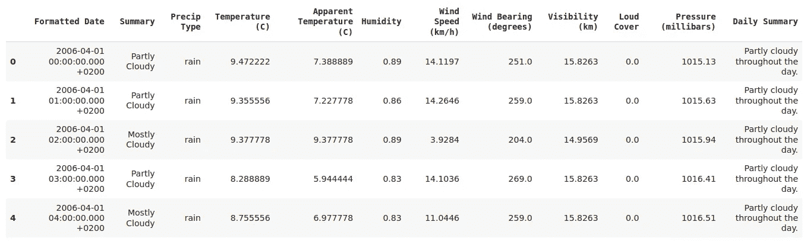

数据集结构

您可以通过`weatherDataframe.info()`方法进一步分析数据集，然后您将看到 12 列中有 96453 个条目。

我们可以将目标列标识为表观温度，将其余列标识为特征。

# 3.预处理数据集

预处理是机器学习中最重要的部分。我们模型的成功高度依赖于输入机器学习模型的数据质量。真实世界的数据通常是脏的。它包含重复缺失值异常值、不相关的特征、非标准化数据..等等。因此，我们需要以适当的方式清理数据集。让我们一步一步来看，我们将如何实现它。

首先，我们需要在数据集中找到任何唯一的字段。如果发现了，我们应该丢弃它们，因为它们在识别模式时没有用。如果数据集包含的列只有很少的唯一值，这将为数据清理提供良好的基础。此外，如果列有太多的唯一值，比如 ID 号、电子邮件(对于每个数据点都是唯一的)，我们应该删除它们。

```
# summarize the number of unique values in each column
print(weatherDataframe.nunique())
```

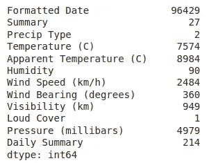

标识包含单个值的列

正如您在结果中看到的， **Loud cover** 列只有一个值(0)。所以我们可以完全放弃那个专栏。此外，我们还需要分析行中有哪些唯一的值。为了进行分析，我们可以计算每个变量的唯一值的数量占数据集中总行数的百分比。这是为此定制的函数。

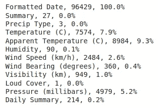

每列中唯一值的摘要

**格式化日期**给总数据帧 100%唯一比率。所以我们可以放弃那个专栏。此外，通过查看数据集，我们可以得出结论，每日摘要和摘要列有很大的相似性。所以我们可以移除其中一个。所以我会保留摘要。

## 3.1.删除重复项

接下来，可能会有重复的行。所以我们需要识别包含重复数据的行并删除它们。

有一件**重要的事情**要记住。当我们删除行时，这将导致索引不同。例如，如果从数据框中删除第 18 行，现在索引将是..16,17,19,20..像这样。这最终会在实际行数和最后一个索引之间产生差异。为了避免这种情况，我们需要**重置索引**。然后它会更正顺序。

## 3.2.处理缺失值

数据集中可能有许多缺失值。对于缺失值，我们主要可以做两件事，要么丢弃，要么进行插补来替换它们。插补是用平均值或中间值代替缺失值。但这种插补的问题是，它会导致数据集出现偏差。因此，建议谨慎操作插补。

如果缺失值的情况非常少，最好的选择是删除它们。(如果案例的数量少于样本的 5%,您可以更安全地删除它们)

```
# Check for any missing values
weatherDataframe.isnull().values.any()
# This gives - True#Getting the summary of what are missing value columns
weatherDataframe.isnull().sum()
```

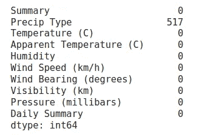

识别缺失值

如您所见，Precip 类型列中有 517 个缺失值。因此，让我们检查一下总体概率，看看是否可以删除这些列。

```
weatherDataframe['Precip Type'].isna().sum()/(len(weatherDataframe))*100
```

这将返回 0.536 的结果，与整个数据集相比，这是一个非常低的百分比。所以我们可以放弃他们。它将确保没有偏差或差异被添加或删除，并最终导致一个稳健和准确的模型。

```
# make copy to avoid changing original data
new_weatherDf = weatherDataframe.copy()# removing missing values
new_weatherDf=new_weatherDf.dropna(axis=0)# Resetting Indexes
new_weatherDf=new_weatherDf.reset_index(drop=True)
```

## 3.3.移除异常值

离群值是明显远离主流的数据点(或者可以是少量数据点)。

但是，如果您看到许多点远离主流，它们不会被视为异常值，它们可能是某种聚类模式或与异常相关的东西。在这种情况下，我们需要分别对待。

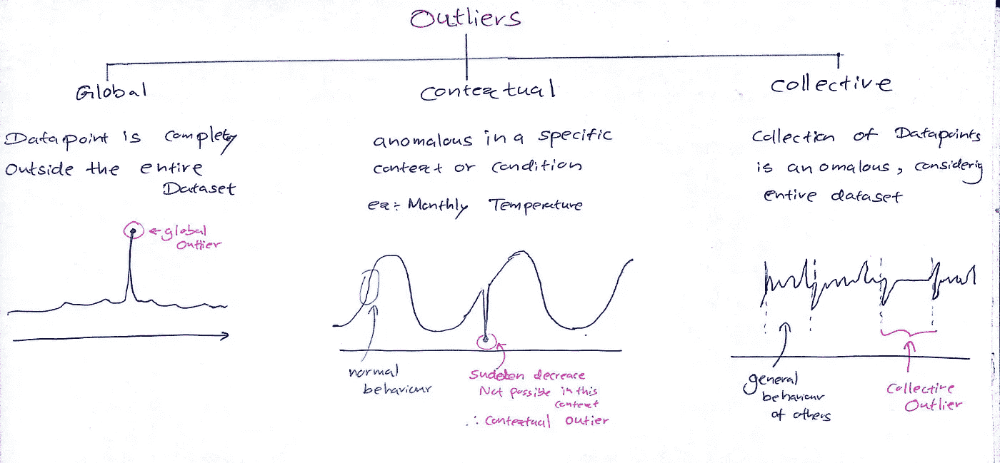

异常值识别

有许多方法可以发现异常值。

*   箱线图——扫视上下四分位数之外的可变性
*   散点图-使用两个数据列的笛卡尔坐标
*   z 得分-使用数学函数

我将使用方框图方法来直观地检测它们。

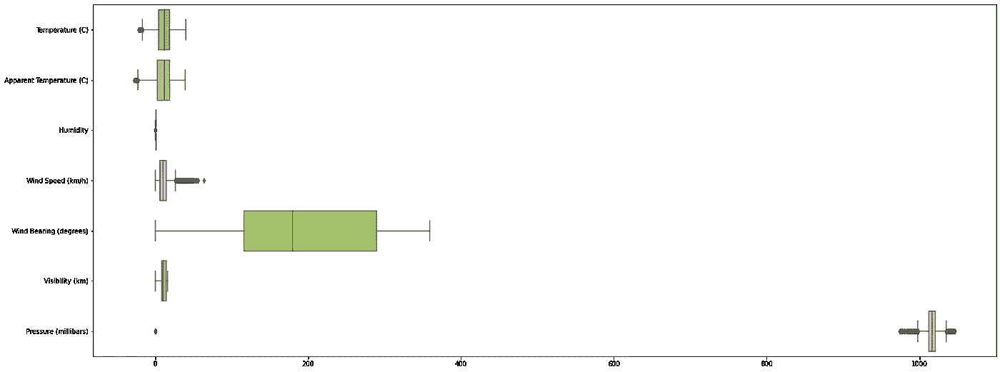

所有数字数据列的箱线图

您可以看到数据集中存在一些异常值。所以要逐个检查，分别对待。最好的选择是移除它们。考虑到数据分布，您可以应用平均值和中值。但存在使数据集产生偏差的高风险。所以如果你想这么做，就要非常精确地处理它。

我将在一篇专栏文章中演示如何去除异常值。你可以在我的 python 笔记本里看到剩下的东西。正如您在图中看到的，压力列中有一个异常值。这是一个压强，在正常情况下不会变成零。这可能是由于数据输入错误或收集的设备有问题。所以我们应该移除它们。

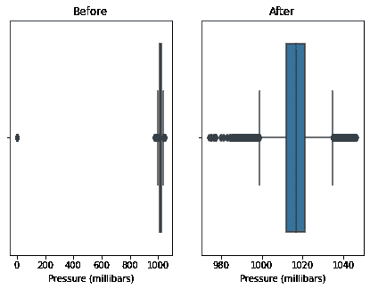

移除异常值-之前和之后

# 4.列车测试分离程序

在进行转换之前，我们需要记住一件事。那就是**数据泄露**。为了评估我们的模型，我们需要保留一个测试数据集。但是，如果我们对数据集中的所有数据执行以下转换步骤，然后将其拆分出来(作为训练集和测试集)，我们就犯了数据泄漏的罪。

不要忘记测试数据点代表真实世界的数据。所以模型不应该看到这些数据。如果是这样，后果将是过度拟合您的训练数据，并对您的模型在看不见的数据上的表现做出过于乐观的评估。

为了避免这种情况，我们现在应该将数据集分成训练集和测试集，并执行转换步骤。这将确保前方没有窥视。否则，来自测试集的信息将“泄露”到您的训练数据中。

首先，我们需要定义我们的特征和目标(我们要预测什么。)用例告诉我们预测表观温度。所以这将是我们的目标。其余的栏目我们可以作为特写。

```
features_df= new_weatherDf.drop('Apparent Temperature (C)', 1)
target = pd.DataFrame(new_weatherDf['Apparent Temperature (C)'], columns=["Apparent Temperature (C)"])
```

现在，我们可以将它们分成 80% — 20%比例的培训和测试。`random_state`确保您生成的分割是可重复的。它总是以相同的随机顺序分裂，并且每次运行都不会改变。

```
from sklearn.model_selection import train_test_splitX_train, X_test, y_train, y_test = train_test_split(features_df, target, test_size = 0.2, random_state = 101)
```

此外，请记住重置索引，因为这可能会导致后面部分的混乱。

```
X_train=X_train.reset_index(drop=True)
X_test=X_test.reset_index(drop=True)
y_train=y_train.reset_index(drop=True)
y_test=y_test.reset_index(drop=True)
```

好吧。我们都为转变做好了准备！

# 5.数据转换

您之前清理的数据可能没有正确的格式或正确的比例，并且对于模型来说很难理解。因此，我们需要进行数据转换。

## 5.1.处理偏斜度

偏斜度是偏离正态分布的一组数据的不对称性。它也可以定义为对称钟形曲线的变形。如果曲线向左移动(尾部在右边)，它是右斜的，如果曲线向右移动(尾部在左边)，它是左斜的。为了使它成为对称的形状，我们应该进行适当的变换。这将导致增加我们模型的准确性。

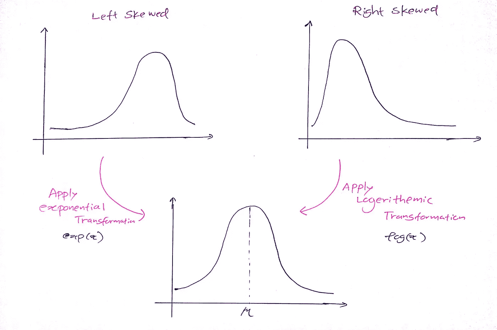

处理偏斜度

如上图所示，我们需要对右偏的数据应用对数变换，对左偏的数据应用指数变换，以使数据集对称。

但是我们如何检测偏斜度呢？为此，我们有 Q-Q 图(分位数-分位数图)和直方图。让我们用我们的数据集来分析。

```
import scipy.stats as stats# Temperature (C). - Training
stats.probplot(X_train["Temperature (C)"], dist="norm", plot=plt);plt.show();
X_train["Temperature (C)"].hist();
```

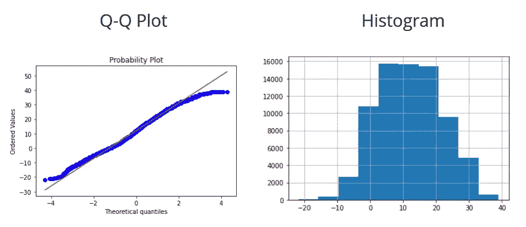

Q-Q 图和温度直方图

正如你在 Q-Q 图中看到的，大部分数据位于红线内。此外，直方图没有显示任何偏斜，它是对称的。所以我们不需要变换这个列。

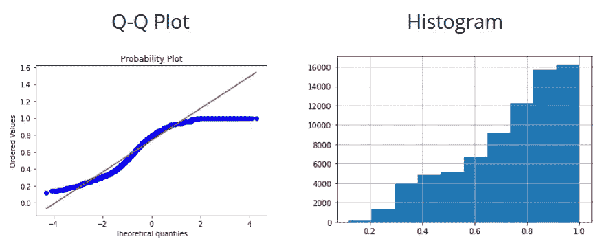

湿度的 Q-Q 图和直方图

如果你分析湿度柱，你会注意到一个左偏的分布。所以我们需要应用指数变换使其对称。

```
# create columns variables to hold the columns that need transformation
columns = ['Humidity']# create the function transformer object with exponential transformation
exp_transformer = FunctionTransformer(lambda x:x**3, validate=True)# apply the transformation 
data_new = exp_transformer.transform(X_train[columns])
df_new = pd.DataFrame(data_new, columns=columns)# replace new values with previous data frame
X_train.Humidity=df_new['Humidity']
```

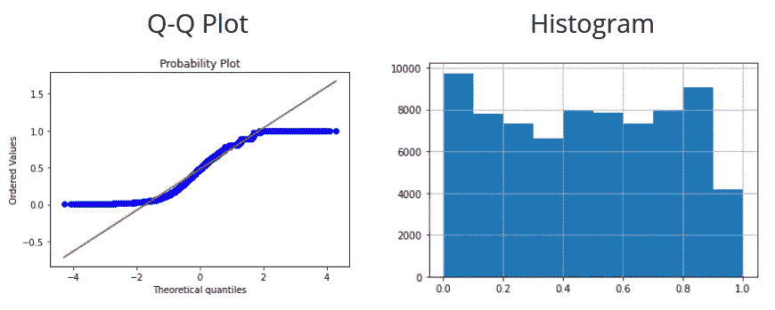

转换后湿度的 Q-Q 图和直方图

现在你会看到一个漂亮的对称分布。同样，我们可以对所有必要的列进行转换。我将向大家展示另一个重要的转变。所有的转换在我的 python 笔记本里都有解释。参考它以获得更多的澄清。

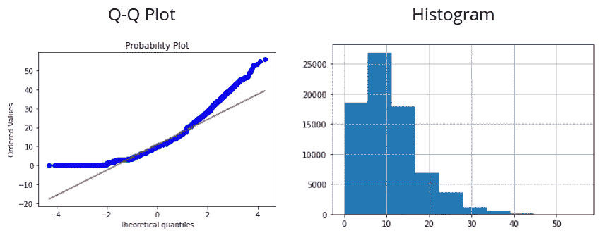

风速的 Q-Q 图和直方图

如果你分析风速柱，你会看到一个右偏分布。为了使它对称，我们需要应用对数变换。但是这里有一个特例，列中有 0 值数据点可以看到。如果我们应用对数变换，0 值数据点将被替换为**减去无穷大**。为了避免这种情况，我们可以应用 log(x+1)变换。

```
# create columns variables to hold the columns that need transformation
columns = ['Wind Speed (km/h)']# create the function transformer object with logarithm transformation
logarithm_transformer = FunctionTransformer(np.log1p, validate=True)# apply the transformation 
data_new = logarithm_transformer.transform(X_train[columns])
df_new = pd.DataFrame(data_new, columns=columns)# replace new values with previous data frame
X_train['Wind Speed (km/h)']=df_new['Wind Speed (km/h)']
```

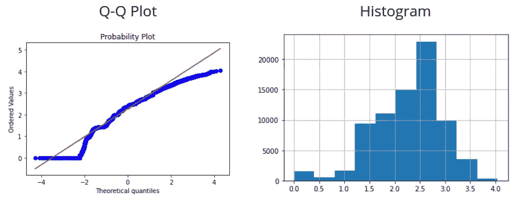

Q-Q 图和变换后的风速直方图

## 5.2.特征编码技术

我们的数据集中有分类数据(文本)和数值数据。但是大多数模型只接受数字数据。因此，我们需要将这些分类数据或文本数据列转换成数字。为此，我们可以使用两个编码器。

1.  标签编码器
2.  一个热编码器(OHE)

> 注意—一些算法可以直接处理分类数据，如决策树。但是它们中的大多数不能直接对标签数据进行操作。

标签编码器使用 0 到 n-1 之间的值对类进行编码，其中 n 是不同类(标签)的数量。如果一个类被复制，它将分配与之前相同的值。

让我们举一个简单的例子来澄清事情。有一个关于不同国家的专栏。如果我们应用一个标签编码器，它将提供下面的输出。

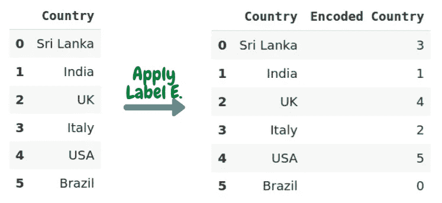

例如，将标签编码器应用于国家/地区列

它将分配一个从 0 到 n 类的唯一值。正如你在这里看到的，标签编码使用字母排序。因此，巴西被编码为 0，I **n** dia 被编码为 1，I **t** aly 被编码为 2。如果相同的类出现在不同的行中，它将分配与前面分配的值相同的值。

但是标签编码的问题是，它会导致查找编码值之间的关系。举例来说，如果国家标记为 1、2、3、4..类别，模型可以创建一种模式，如标签 2 国家比标签 1 国家更强大，标签 3 国家比标签 1 和标签 2 更强大。但实际上，这两个国家之间没有任何关系。

因此，通过标签编码，它会使模型误以为某列中的数据具有某种顺序或层次结构。为了克服这个问题，我们使用一种热编码。

一种热编码采用包含分类数据的列，然后将该列拆分为多个列。这些类被二进制文件(1 和 0)替换，这取决于哪一列有特定的类。

看下面的例子。首先，它将为每个类创建单独的列，然后它将为所显示的类分配一个二进制值 1，为其他类按行分配 0。第一排代表斯里兰卡。因此，值 1 仅适用于斯里兰卡列，第一行中的其余列将获得值 0。

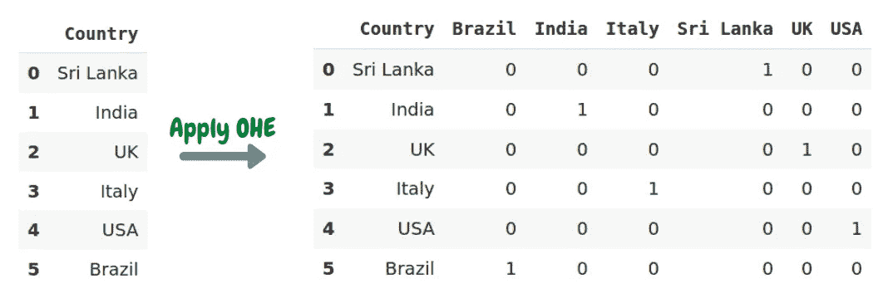

例如，对国家/地区列应用一个热编码

这不会在类之间产生一个模式，因为结果是二进制的而不是顺序的，所有的东西都在一个正交的向量空间中。但是它会导致大量的列，并最终导致维数灾难。但是如果我们应用像 PCA 这样的降维技术，它将解决这个问题。此外，建议使用 OHE 标签编码器。

在我们的数据集中，现在我们有两个分类列，Precip Type 和 Summary。所以我们可以对两列都进行编码。

我们正在处理一个训练和测试集。所以我们需要记住一件**重要的**事情。在训练模型时，您将使用训练数据集。对于经过训练的模型，我们需要输入与训练中使用的数据规模相同的数据。那么我们如何得到之前的比例呢？有趣的部分来了。为了解决这个问题，大多数图书馆有两种方法。也就是`fit()`和`transform()`

您需要首先对您的训练数据集应用`fit()`方法，以便只计算规模并将其作为对象保存在内部。然后，您可以调用`transform()`方法将转换应用于训练和测试数据集。这将确保数据在相同的规模上进行转换。

我对摘要列应用了一次性编码。对于 precip 类型列，我们可以应用分类编码(类似于标签编码)，因为只有两个类。

```
X_train['Precip Type']=X_train['Precip Type'].astype('category')
X_train['Precip Type']=X_train['Precip Type'].cat.codes
```

我们最终的训练数据框架将如下所示。

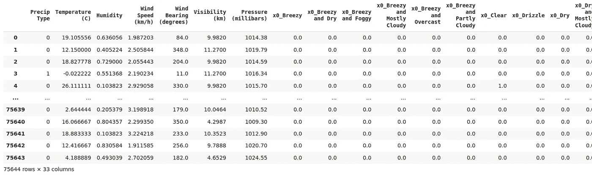

特征编码训练数据帧

## 5.3.标准化的特征

我们用标准化使数据居中(使其具有零均值和单位标准差)。这样做的实际效果是，数据将减去平均值，然后将结果除以标准差。(*x*' =*(x*-*μ)/σ)*

正如我们之前所做的，我们需要对训练和测试数据应用标准化。我希望您已经记住了我在特性编码部分提到的重要事实。

> 您必须使用完全相同的两个参数 *μ* 和 *σ* (值)，这两个参数用于对训练集进行居中。

所以在 sklearn 的 [StandardScaler](http://scikit-learn.org/stable/modules/generated/sklearn.preprocessing.StandardScaler.html) 中提供了两种方法来实现这一点。因此，每个 sklearn 的变换的`fit()`只是计算参数(例如，本例中的 *μ* 和 *σ* )并将它们保存为内部对象的状态。之后，您可以调用它的`transform()`方法将转换应用于任何特定的数据集。

另一个**非常重要的**事情是，我们没有对先前编码的分类变量做任何标准化。所以在应用标准化之前，先把它们放在一边。

```
to_standardize_train = X_train[['Temperature (C)', 'Humidity','Wind Speed (km/h)','Visibility (km)','Pressure (millibars)']].copy()
```

> 注意:我故意留下了风向柱，因为它显示了数据点的巨大变化。(0-360 度)我将在标准化后的下一步对该列进行离散化。

在我们进行标准化之前，我们可以检查一下直方图的外观，以便理解 x 标度。

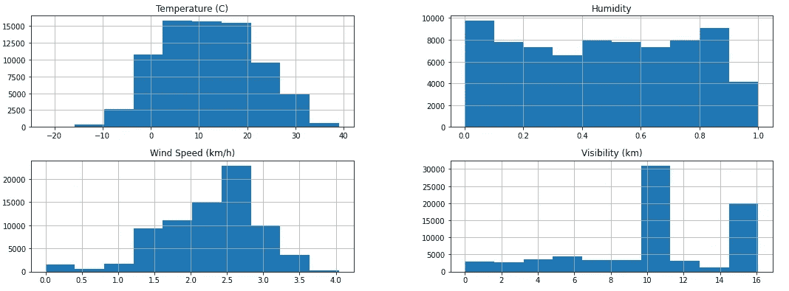

标准化之前

如你所见，它们处于不同的 x 刻度。现在让我们做标准化。

```
# create the scaler object
scaler = StandardScaler()# Same as previous -  we only fit the training data to scaler
scaler.fit(to_standardize_train)train_scaled = scaler.transform(to_standardize_train)
test_scaled = scaler.transform(to_standardize_test)standardized_df_train = pd.DataFrame(train_scaled, columns = to_standardize_train.columns)
standardized_df_test = pd.DataFrame(test_scaled, columns = to_standardize_test.columns)
```

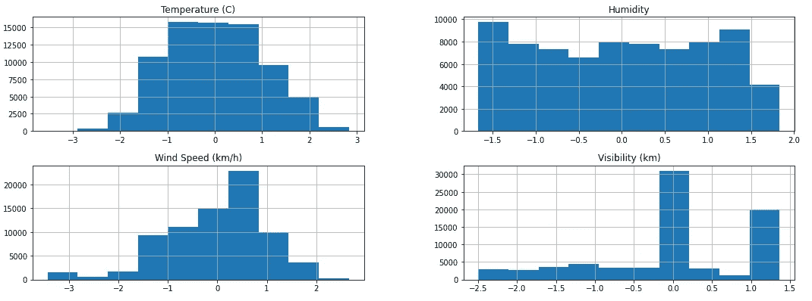

标准化后

现在你可以看到所有的 x 轴都变成了一个标准的缩放器。您也可以对目标变量应用标准化。

## 5.4.特征离散化(宁滨)

通过数据离散化，我们可以将连续值转换为离散形式。这一过程可用于将数据集的大范围缩小到小范围，从而消除观察值之间的关系。

举个例子，如果我们拿年龄来说，它可能会有 1 到 100 年的变化。这是一个大范围的数据，数据点之间的差距也会很大。为了减少这种情况，我们可以将该列离散化为有意义的类别或组，如下所示:12 岁以下的
***【小孩】* ***在 12-18 岁之间的*** *【青少年】* ***在 18-55 岁之间的*** *【成人】* ***在 55 岁以上的*****

***因此，离散化有助于模型更容易理解数据。有各种方法来进行离散化。(决策树，等宽，等频..等等)这里我使用的是 K 均值离散化。***

***在数据集中，我们有一个特征叫做测风。如果你还记得的话，因为这个原因，我之前一直把这个专栏放在一边。它提供 0-360 度的风向覆盖范围。范围很大。我们可以将其离散为八个代表实际风向的箱。(北部，东北部..等等)***

***`n_bins`参数控制将要创建的容器的数量。我们可以使用直方图来查看输出。***

***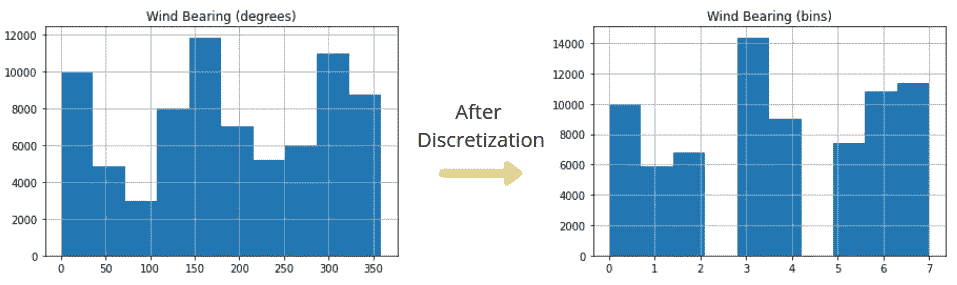***

***离散化前后***

***这样就完成了所有的预处理和转换步骤。现在我们需要使用特征工程来进一步改进它。***

# ***6.执行特征工程***

***事实上，我们已经在转换中完成了一些功能工程流程。但是最重要的部分来了。这里，我们必须手动决定特征之间的关系，以及如何选择最佳特征集来训练模型。我们需要找到最重要的特征，因为不相关或部分相关的特征会对我们的模型性能产生负面影响。***

***如果我们举一个像银行业这样的实际例子，将有数百万个特征需要分析，并且数据点也将是巨大的。想象一下数据会有多复杂，数据处理会有多困难。随着数据维度的增加，这将导致数据分析任务变得更加困难。这种现象被称为维数灾难。***

***此外，它还会导致另一个问题，即它可能会导致机器学习模型过度拟合，使模型过于复杂。这个模型将不能很好地概括看不见的数据。更高的维度导致高计算/训练时间以及可视化的困难。所以降维是很有必要的。***

***在降维之前，我们应该记住两件事。
1。原始数据应该能够近似重建。
2。应该保留数据点之间的距离。***

***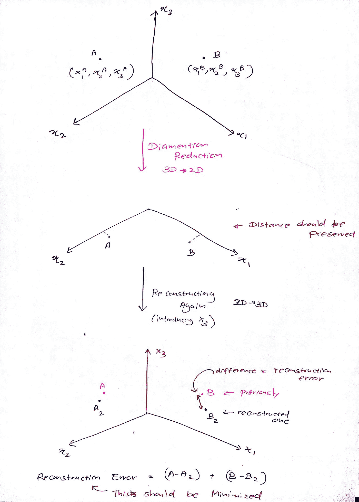***

***降维***

## ***6.1.识别重要特征***

***我们可以使用关联矩阵和热图来轻松识别重要特征。它显示了这些特征之间或与目标变量之间的关系。***

***相关性可以成正比，也可以成反比。当它成反比时，它会显示一个(-)符号。让我们绘制热图，以确定哪些特征与我们的目标变量最相关，哪些特征具有高相关性。***

```
*correlation_mat = features_df.iloc[:,:6].corr()
plt.figure(figsize=(10,8))
sns.heatmap(correlation_mat, annot = True, cmap="RdYlGn")
plt.title("Correlation matrix for features")
plt.show()*
```

******

***特征的相关矩阵(截断)***

***正如你在热图中看到的，在:
*温度和湿度
*温度和能见度
*湿度和能见度之间有很高的相关性***

***任何两个特征(独立变量)如果高度相关，则被认为是冗余的。通常情况下，建议移除此类特征，因为这将稳定模型。但我们不能断定这些功能不够有价值。它应该在训练模型之后决定。此外，删除变量是非常主观的，应该始终牢记领域。***

***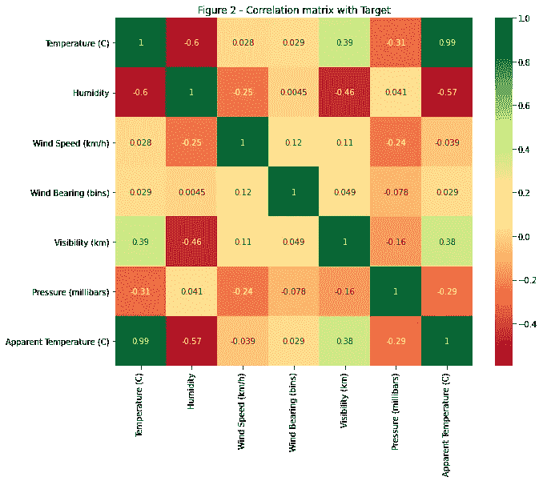***

***与目标的相关矩阵(截断)***

***看最后一栏。表观温度与湿度高度相关，其次是能见度和气压。所以我们可以说它们是最重要的特征。我们应该保留这些变量，因为这将使模型表现良好。***

***这里我们有一些矛盾。从图 1 中，我们确定了一些高度相关的特征，它们需要被删除。图 2 暗示了相同的特征集与目标变量高度相关，我们应该保留它们。因此，在得出结论之前，我们需要对该模型进行多次实验。但是不用担心！我们可以应用一种更好的方法叫做主成分分析来降低维数。***

## ***6.2.使用 PCA(主成分分析)的维数减少***

***PCA 是一种强大的降维算法，它基于特征之间的相关性来识别数据集中的模式。通过查看 PCA 对象解释的 variance_ratio，我们可以决定在不影响实际数据的情况下可以减少多少个要素(组件)。***

***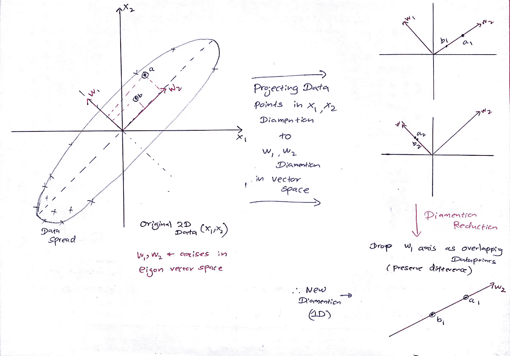***

***简要 PCA***

***主成分分析实际上是将数据投影到特征向量空间的维度中。然后，它将确定保存实际信息的最重要的维度。其他维度将被删除。所以这里重要的部分是，它**并没有删除整个特征**列，而是从其中提取大部分信息并投射到其他维度。最后，它将作为一组全新的维度(列)出现。***

***如果你有兴趣详细了解 PCA，我推荐 Matt Brems 写的一篇非常好的文章，发表在[towardsdatascience.com](https://towardsdatascience.com/)***

***[](/a-one-stop-shop-for-principal-component-analysis-5582fb7e0a9c) [## 主成分分析的一站式商店

### 在我用于研究生统计理论课的教科书的开始，作者(乔治·卡塞拉和罗杰…

towardsdatascience.com](/a-one-stop-shop-for-principal-component-analysis-5582fb7e0a9c) 

我们将在以后的文章中更深入地研究这种技术。因此，让我们将主成分分析应用于我们的数据集。

```
from sklearn.decomposition import PCA

pca = PCA()
pca.fit(X_train)
```

首先，我们必须确定可以减少的维度数量。为此，我们分析之前拟合的 PCA 对象中的`explained_variance_ratio_`。

```
pca.explained_variance_ratio_
```

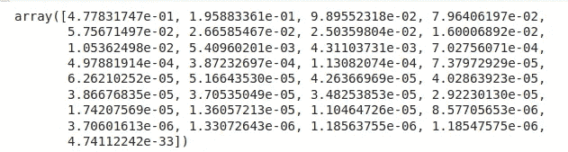

pca.explained_variance_ratio_

这里我们有一个由每个维度解释的方差的排序数组(向量)。我们必须保留高方差维度，删除其余维度。如果高方差维数(n_components)之和超过 95%，这将是一个好数字。

通过分析向量，我们可以确定前 7 个维度保留了数据集中 95%以上的信息。因此，我们可以将 33 维减少到 7 维，而只损失 5%的信息。

现在，我们可以通过添加需要保留的组件(尺寸)的数量来再次应用 PCA。

```
pca = PCA(n_components=7)
pca.fit(X_train)X_train_pca = pca.transform(X_train)
X_test_pca = pca.transform(X_test)
```

一切就绪！让我们进行建模，了解它在我们的数据集上的表现，同时牢记这些核心概念。

> 快速提醒-您可以比较带或不带 PCA 的模型，并检查精度值。如果 PCA 中的精度低于原来的精度，可以尝试逐个增加 n_components。

# 7.建模

在应用任何模型之前，您需要正确理解领域、领域的复杂性以及给定的数据集是否代表您的问题的实际复杂性。此外，如果问题与业务领域相关，您需要在某种程度上理解业务流程、原则和理论。

建模时，根据您的问题，有许多模型可供使用。我使用多元线性回归模型，因为我们需要在给定多个解释变量(特征)的情况下预测一个响应变量(目标)。这个模型基本上是用一个线性方程来拟合观察到的数据。这条线应该给原始点一个最小的偏差。

**形式上，模型为多元线性回归，给定 *n 个*观测值:**

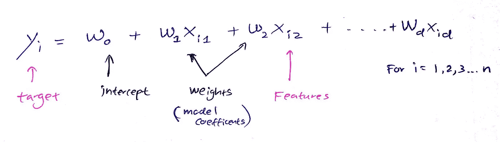

多元线性回归模型

让我们将模型应用到数据集。

```
from sklearn import linear_modellm = linear_model.LinearRegression()
model2 = lm.fit(X_train_pca,y_train)
```

# 8.预言；预测；预告

对于预测，我们已经准备了一个测试数据集。如果您想要预测整个新数据，您需要应用所有预处理和转换步骤(转换应该根据之前拟合的值进行)以及 PCA，以便获得正确的预测。

```
predictions = lm2.predict(X_test_pca)
y_hat_pca = pd.DataFrame(predictions, columns=["Predicted Temparature"])
```

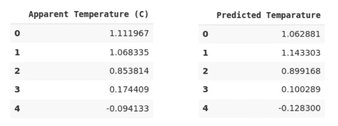

实际与预测

你可以看到，我们的模型对看不见的数据预测得很好。此外，这可以在图中可视化。

```
import matplotlib.pyplot as plt
plt.figure(figsize=(20, 10))# Limiting the data set to 100 rows for more clearance
plt.plot(y_hat_pca[:100], label = "Pred")
plt.plot(y_test[:100], label = "Actual")plt.title('Comparison of Prediction vs Actual - With PCA')
plt.legend()
plt.show()
```

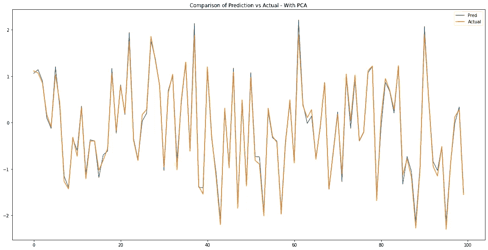

预测值与实际值的比较

# 9.精度测量和评估技术

正如我们前面讨论的，线性回归试图拟合一条使原始点偏差最小的直线。所以实际和预测之间有误差。通过测量这个误差(损失)，我们可以检查我们的模型的准确性。

我们用损失函数来衡量这一点。当损失最小时，我们可以判定该模型具有非常好的精度。有几种损失函数可用:

*   MSE —均方误差
*   平均绝对误差
*   RMSE —均方根误差

当记录模型的效率作为输出时，建议使用 MSE 上的 RMSE，因为 MSE 广泛用于消除训练阶段的误差。(对模型优化更好。)不建议用 MAE 来测试精度，因为它不能让我们知道误差的方向。

除此之外，还有各种评估技术，如 F1 分数、曲线下面积、混淆矩阵等来衡量模型的准确性。你可以多搜索一下这些东西来提高自己的知识。我也打算就此单独写一篇文章。

好吧。让我们为我们的模型检查 MSE 和 RMSE。

我们使用 **R 平方**值来评估线性模型的整体拟合度。介于 0 和 1 之间。值越高，性能越好。因为这意味着模型可以解释更多的方差。

```
#Percentage of explained variance of the predictions
score_pca=lm2.score(X_test_pca,y_test)
score_pca
#This has given - 0.9902083367554705
```

这些实际上是很好的价值观。但在得出结论之前，我们也来分析一下权重因素。

```
#W parameters of the model
print(lm2.coef_)
```

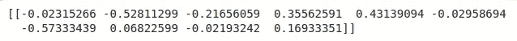

模型的 w 参数

权重也可用于评估模型。如果权重给出了更高的值，这表明您的模型过度拟合。如果是这样，你需要重新审视你的预处理和转换步骤，分析你是否做错了什么。

此外，另一个可能导致过度拟合的因素是模型的复杂性。如果对简单数据集应用多项式或高阶回归，可能会过度拟合。所以你可以试着简化模型。此外，你可以进一步研究如何做体重规律化。在我们的场景中，权重因子要小得多，而且不会过多。

您可以进一步进行 K-fold 交叉验证，以获得总体准确性得分。我已经在笔记本上做了。你也可以参考其他测试。

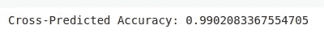

最终交叉验证分数

所以现在我们可以得出结论，我们的模型已经达到了 99%以上的准确率。

# 10.资源

*   完整的合作实验室笔记本。(带有预加载的数据集)

[](https://colab.research.google.com/drive/10sHxKg512G4v9d79Z3EI3ixZ_E1gs5Iq?usp=sharing) [## 谷歌联合实验室

### 从 scratch 建立机器学习模型到实际使用案例

colab.research.google.com](https://colab.research.google.com/drive/10sHxKg512G4v9d79Z3EI3ixZ_E1gs5Iq?usp=sharing) 

*   Kaggle 天气历史数据集

[](https://www.kaggle.com/budincsevity/szeged-weather?select=weatherHistory.csv) [## 塞格德 2006-2016 年的天气

### 每小时/每天汇总温度、压力、风速等信息

www.kaggle.com](https://www.kaggle.com/budincsevity/szeged-weather?select=weatherHistory.csv) 

# 结论

通过这篇文章，我们已经讨论了很多重要的概念。我希望现在您已经清楚了如何通过理解核心概念来从头开始训练和测试一个模型。

数据科学是一个非常广泛的领域，不可能什么都知道！但是有大量的文章可以探索这个神奇的世界。所以，学好基本概念，在提高知识的同时，用它们来解决实际问题。

我要特别感谢 Subha Fernando 博士(莫拉图瓦大学高级讲师)激励我写这篇文章。

非常感谢你坚持到最后！希望这篇文章能帮助你了解 ML。如果你有什么需要澄清或提及的，请留言。

快乐学习！❤️***