# 用 Python 构建机器学习 web 应用程序

> 原文：<https://towardsdatascience.com/build-a-machine-learning-web-app-in-python-683480acbd37?source=collection_archive---------6----------------------->

## 在 7 分钟内编写并部署您的第一个机器学习 web 应用程序


詹姆斯·亚雷马在 [Unsplash](https://unsplash.com/s/photos/application?utm_source=unsplash&utm_medium=referral&utm_content=creditCopyText) 上的照片

# 介绍

在过去的几年中，对数据相关工作的需求大幅增长。

大多数有抱负的数据科学家要么参加数据科学课程，获得硕士学位，要么参加训练营，开始他们的行业之旅。

这些地方教授的技能主要围绕机器学习。

当我第一次开始自学数据科学时，我在 Udemy 和 Coursera 上学习了多门在线课程。我学习了机器学习技能，并建立了一个主要围绕建模和算法的基础。

然而，在实践中，大多数建立机器学习模型的公司都需要部署它们。这些模型需要投入生产，以便最终用户可以访问它们。

这个旅程不会随着建立机器学习模型而结束。模型创建只是开始。对数据科学家来说，部署这些模型并对其进行扩展以便最终用户可以访问是一项非常重要的技能。

一些公司甚至为此雇佣 MLOps 工程师。这些人专门从事模型部署，他们的工作围绕着将机器学习模型投入生产。

然而，作为一名数据科学家，至少对模型部署有一个基本的了解仍然很重要。并不是所有的公司都有专门研究 MLOps 的团队，所以需要很多数据科学家来打理端到端的流程。

在本文中，我将带您了解机器学习模型的构建和部署。本教程将涵盖三个部分:

*   构建机器学习模型
*   用这个模型创建一个 web 应用程序
*   在谷歌云平台上部署这个模型

我们将构建一个简单的情感分析应用程序。这个应用程序将获得一个句子作为用户输入，并返回一个预测，这个句子是积极的，消极的，还是中性的。

这是最终产品的外观:


作者图片

# 第一步:设置

您可以使用任何 Python IDE 来构建和部署这个应用程序。我建议用 Atom，Visual Studio 代码，或者 Eclipse。您将无法使用 Jupyter 笔记本来构建 web 应用程序。Jupyter 笔记本主要用于数据分析，用 Jupyter 运行 web 服务器是不可行的。

一旦设置了编程 IDE，就需要安装以下库:Pandas、Nltk 和 Flask。

# 步骤 2:构建应用程序

为整个情感分析项目创建一个文件夹。在您的主文件夹下，您需要有以下文件:

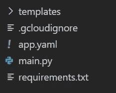

作者图片

让我们一个一个地检查这些文件:

首先，创建名为 *main.py* 的文件。这是包含所有机器学习代码的文件。

完成后，将下面几行代码复制并粘贴到您的 *main.py* 文件中:

```
import pandas as pd
import nltk
from flask import request
from flask import jsonify
from flask import Flask, render_templateapp = Flask(__name__) @app.route('/')
def my_form():
    return render_template('index.html')@app.route('/', methods=['POST'])
def my_form_post():
    text = request.form['text']
    nltk.download('vader_lexicon')
    from nltk.sentiment.vader import SentimentIntensityAnalyzer
    sid = SentimentIntensityAnalyzer()
    score = ((sid.polarity_scores(str(text)))['compound']) if(score>0):
        label = 'This sentence is positive'
    elif(score == 0):
        label = 'This sentence is neutral'
    else:
        label = 'This sentence is negative' return(render_template('index.html', variable=label))if __name__ == "__main__":
    app.run(port='8088',threaded=False)
```

我选择在端口 8088 上运行这个应用程序，但是任何空端口都可以。

在运行应用程序之前，在你的父目录下创建一个名为*模板*的文件夹。然后，在这个文件夹中创建一个名为 *index.html:* 的文件

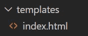

作者图片

在*index.html*文件中，键入以下代码行:

```
<!DOCTYPE html>
<html>
	<head>
  		<body> <link rel='stylesheet' href='bootstrap.min.css'></style>
    	<link rel='stylesheet' href='font-awesome.min.css'></style> <div class="container">
    	<div class = "centered">
           <header class="text-center text-white">
            	<title> sentiment analysis app </title> <h1 class = 'header'>
              Sentiment Analysis App
            </h1> <p class = 'desc'>
              Type a sentence, click on the submit button and wait for your 				prediction.
            </p> <form method="POST" onSubmit = 'return validate();' class='form'>
                <input name="text">
                <input type="submit" onclick = 'this.form.submit();'>
            </form>
            <br>
            <br> <p id='demo'>{{ variable }} </p>            
            </div>
            </div>
            </head>
            </body> <style> .container {
      position: relative;
      text-align: center;
      color: white;
    } .header {
      color: black
    } p { color: #111; font-family: 'Helvetica Neue', sans-serif; font-size: 14px; line-height: 24px; margin: 0 0 24px; text-justify: inter-word; } h1 { color: #111; font-family: 'Helvetica Neue', sans-serif; font-size: 36px; font-weight: bold; letter-spacing: -1px; line-height: 1; text-align: center; } #demo {
      color: #111; font-family: 'Helvetica Neue', sans-serif; font-size: 22px; line-height: 24px; margin: 0 0 24px; text-justify: inter-word;
    } input[type=submit] {
      background-color: #f06237; /* Green */
      border: none;
      color: white;
      padding: 15px 32px;
      text-align: center;
      text-decoration: none;
      display: inline-block;
      font-size: 0.95em;
    } input[type=submit]:hover {
      background-color: #b0540e;
    } </style>

    </html>
```

上面几行代码将创建我们的应用程序的前端:输入文本框、描述和提交按钮。

点击提交按钮后，Flask 应用程序的输出将显示在屏幕上。

在这种情况下，输出将是正的、负的或中性的，这取决于用户的输入。

太好了！

现在，我们已经拥有了在本地运行 Flask 应用程序所需的一切。

在 Python 上运行应用程序，然后转到应用程序所在的位置。以我为例，它将是 127.0.0.1:8088。

您应该会看到应用程序显示在屏幕上:

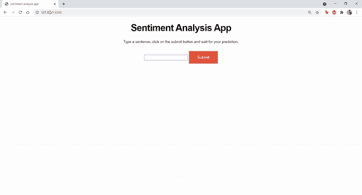

作者图片

你可以摆弄你的应用程序，输入随机的句子作为输入，以检查算法是否做出准确的预测。

# 步骤 3:应用程序部署

现在，是时候部署应用程序了。我们会在谷歌云平台上做这件事。

如果你不熟悉 GCP，下面是你需要做的开始:

1.  按照这个教程创建一个 GCP 账户。
2.  您将看到一个激活您的 GCP 帐户的选项。点击“激活”您将被要求输入您的信用卡信息。但是，您不会被起诉。一旦您创建了一个 GCP 帐户，您将获得 300 美元信用的免费试用，并且您使用的服务将不会被收费，除非您超过了这个限额。

现在，按照以下步骤在 GCP 上部署您的应用程序:

1.  首先，转到页面顶部，点击下拉菜单。你会看到一个像这样的屏幕，列出了你过去所有的项目。如果你刚到 GCP，这里是空的:

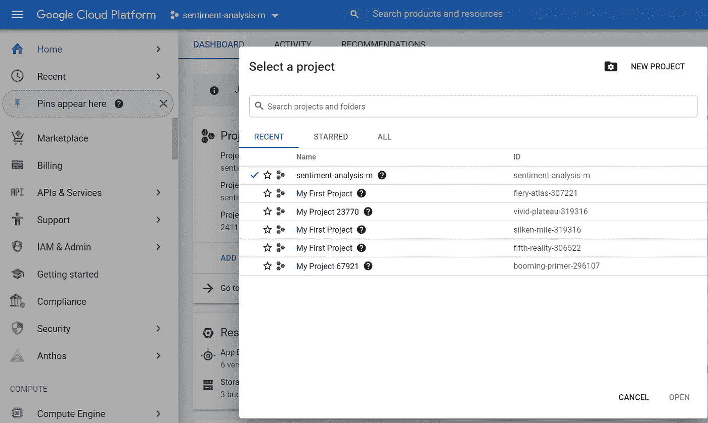

作者图片

点击新建项目。

2.将项目的名称更改为您喜欢的任何名称，然后单击 Create。

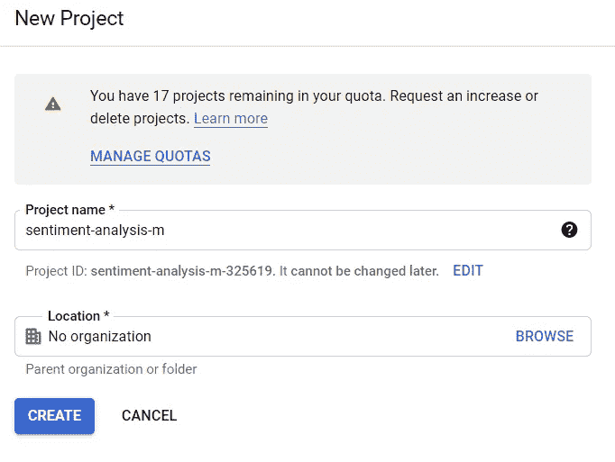

作者图片

3.转到主页->仪表板，检查您创建的项目是否列出:

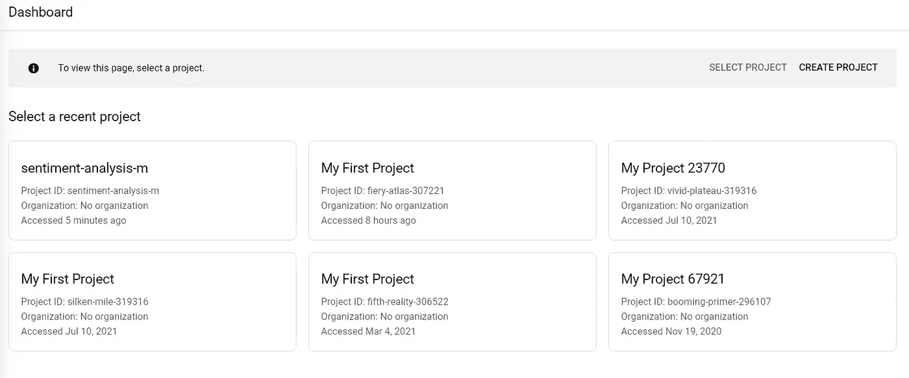

作者图片

4.现在，您需要安装 Google Cloud SDK。这将允许您通过本地命令行在 Google Cloud 上部署您的机器学习模型。只需点击[此](https://dl.google.com/dl/cloudsdk/channels/rapid/GoogleCloudSDKIns)链接并安装可执行文件，然后继续点击“下一步”直到安装完成。

5.在您的父文件夹中创建一个名为 *app.yaml* 的文件，并键入以下内容:

```
runtime: python37
```

6.现在，在父文件夹中创建一个名为 *requirements.txt* 的文件，并在其中键入以下内容:

```
pandas==1.3.2
nltk==3.6.2
Flask==2.0.1
```

7.一旦完成，检查以确保您的父目录中有以下文件: *main.py* 、 *app.yaml* 和 *requirements.txt* 。在模板文件夹中，你应该有一个*index.html*文件。

8.打开本地命令提示符，导航到 ML 应用程序所在的目录。然后，在命令提示符下键入 *gcloud init* :

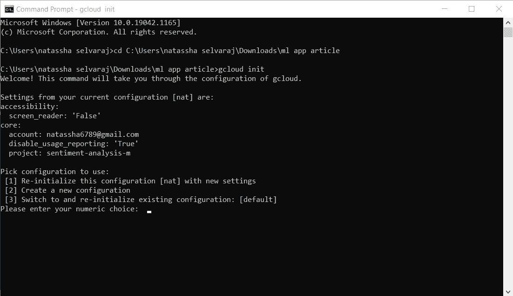

作者图片

9.为“*创建新配置*”选择数字选项对我来说，是 2。

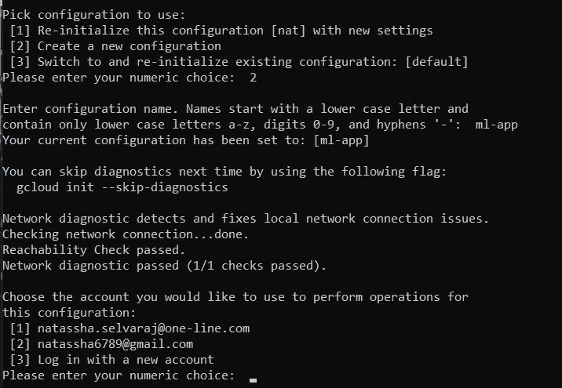

作者图片

10.然后，选择您想要使用的电子邮件地址。然后，选择您想要使用的项目。这将是您之前创建的项目。

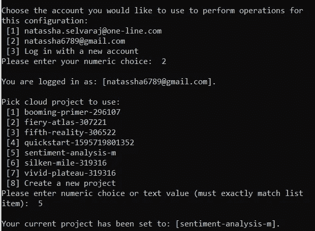

作者图片

11.之后，您将被要求为您的计算引擎虚拟机选择一个区域。任何地区都可以，只要选择一个。

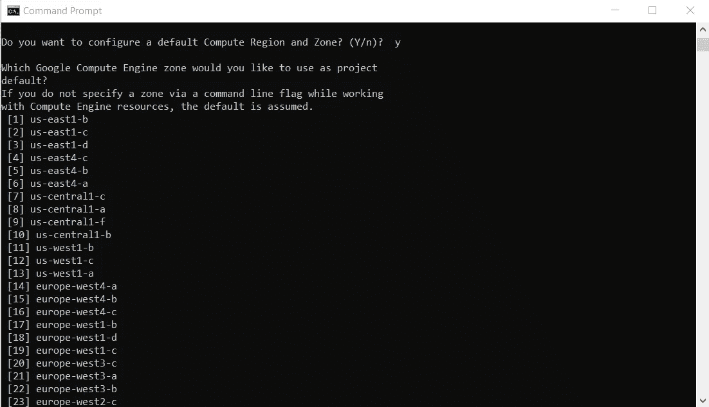

作者图片

12.现在，您可以输入命令在 Google Cloud 上部署您的应用程序。为此，请键入:

```
gcloud app deploy app.yaml --project *your_project_name*
```

例如:

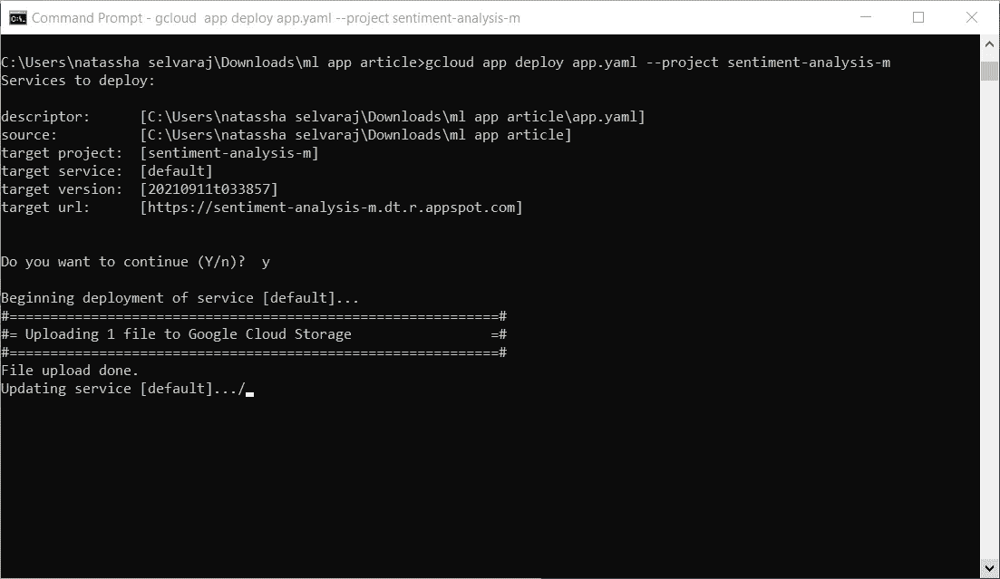

作者图片

现在，等待部署完成。这需要几分钟时间。

13.部署完成后，在终端中键入' *gcloud app browse'* 。您将被自动导航到您在 Google Cloud 上的应用位置。[这个](https://sentiment-analysis-m.dt.r.appspot.com/)是我的。

如果一切正常，您应该会看到您的应用程序部署在自定义的 URL 上，如下所示:

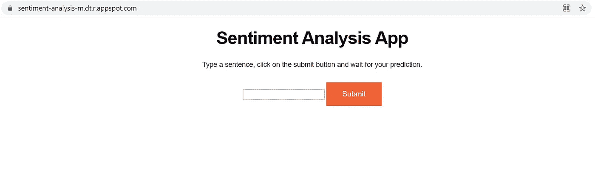

作者图片

如果你坚持到了最后，恭喜你！您已经成功地将您的第一个应用程序部署到 Google Cloud。

如果你对 GCP 要求输入信用卡信息进行免费试用感到不快，那么你可以尝试一个不同的平台。我将在未来创建更多教程，涵盖 AWS 和 Heroku 等平台上的模型部署。

本教程到此为止！

我希望你喜欢这篇文章，并能从中学到一些新的东西。

祝您的数据科学之旅好运，感谢您的阅读。