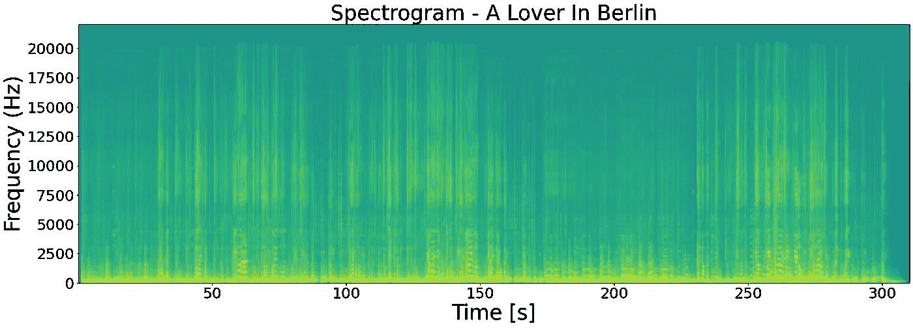

# 在云上建立一个基于 MFCC 的音乐推荐引擎

> 原文：<https://towardsdatascience.com/build-a-mfcc-based-music-recommendation-engine-on-cloud-3bf3cfbd594b?source=collection_archive---------26----------------------->


作者 GIF

## [实践教程](https://towardsdatascience.com/tagged/hands-on-tutorials)

## 在 Microsoft Azure 中创建非结构化数据驱动的创新应用程序的简单指南。

*在过去的十年里，移动技术和蜂窝网络的发展以无人能预测的方式前所未有地重塑了世界。我们生活在一个信息爆炸的时代，并且利用由越来越便宜的蜂窝数据驱动的花哨的移动应用。自从配备音乐流媒体应用程序(如 Spotify 和 Pandora)的智能手机问世以来，随身听和 iPods 已经不再放在我们的口袋里。如果你正在使用或曾经使用过其中的一个，你可能会知道音乐推荐列表，也就是流媒体播放音轨时的“猜你喜欢”功能。音乐推荐是一个大话题，现有的文章阐述和探索了背后运行的算法——流派的聚类分析、歌词的 NLP 建模、基于用户和基于内容的协作过滤等等。那么，有没有一种内在的方式可以基于音频信号本身来进行推荐呢？答案是肯定的，本文将介绍一些基本的声学知识，并探索基于轻量级音频特征的音乐推荐系统的可行性。*

# 1.声音音高

根据定义，声音是一种由振动产生的能量，振动通过空气等传输介质以一定的频率和振幅传播正弦波。一段音乐本质上是一系列不同频率和振幅的声波。“音高”一词广泛用于感知乐器的音频特性。虽然不完全等同，但频率被视为“音高”的代理。当人们说“高音乐器”时，它特指那些总是以更高频率产生声波的管弦乐队乐器，例如小号、短笛或小提琴。很明显，声音频率和人们的情绪之间有很强的相关性，有趣的事实之一是，有时人们声称调到 A432 的钢琴比调到 A440 的钢琴优越，因为所谓的 432 赫兹的“治疗频率”。


图片由 Alexyo 提供。维基共享资源网[https://commons . wikimedia . org/wiki/File:Estensione _ Strumenti _ musicale . jpg](https://commons.wikimedia.org/wiki/File:Estensione_Strumenti_Musicale.jpg)

# 2.振幅

声波的振幅决定了声音的响度，当声音产生时，振动产生的空气压缩会产生压力变化，这种压力变化可以被耳朵感知。感知到的压力变化(以 dB 为单位)也受到到声源的距离的影响。一般来说，每增加一倍距离，点声源的声压级衰减 6dB，线声源衰减 3dB。

# 3.数字录音

谈到数字音频，有一个关键概念是我们无法回避的——采样率。在数字录音中，样本是沿着声波以一定的间隔采集的，采集样本的频率就是我们所说的采样率。如果你喜欢音乐，你可能知道“44.1 千赫/16 位”标签印在你的 CD 封面背面。44.1kHz 是消费类 CD 的标准采样速率，有些可以达到 48kHz。为什么是这个数字？这是因为 20kHz 通常被认为是人耳能够感知的上限，根据**奈奎斯特–香农采样定理**，采样率必须是 **处的**至少是原始音频信号最大频率**的两倍，以避免意外失真或混叠。采样率越高越好吗？音质方面是的，经常看到高保真发烧友对“劣质”44.1kHz/16 位嗤之以鼻，并追求以 96kHz/24 位甚至 192kHz/24 位录制的优质音轨，这些音轨来自模拟介质，如任何基于线性 PCM 的无损音频格式(如 WAV、FLAC 或 APE)中的乙烯。**


作者的情节

好了，是时候进行一些音频分析了，让我来绘制一下我最喜欢的挪威歌手凯瑞·布莱妮丝演唱的配乐《柏林恋人》的音频样本。通常情况下，我们希望大多数声道都有两个声道，而且在大多数情况下，它们是相似的。振幅被标准化为从 0 到 1 的范围。

```
import matplotlib.pyplot as plt
from scipy.io import wavfile
import numpy as npfile = r"(01) [Kari Bremnes] A Lover in Berlin.wav"
sample_rate,data = wavfile.read(file)
length = data.shape[0]/sample_rate
fig,axes = plt.subplots(1,2,figsize=(20,7))
time = np.linspace(.0,length,data.shape[0])
for i,j,k in zip(range(axes.size),["Left Channel","Right Channel"],["b","y"]):
    axes[i].plot(time, data[:, i]/data[:, i].max(),color=k)
    axes[i].set_xlabel("Time [s]")
    axes[i].set_ylabel("Amplitude")
    axes[i].set_title(j)
plt.show()
```


作者的情节

# 4.频域信号

由于声波是时域信号，需要对频域响应进行快速傅立叶变换。

```
from scipy.fftpack import fft# Take the left channel
a = data.T[0]
# Normalised fast fourier transformation
c = fft(a)/len(a)
freqs = np.arange(0, (len(a)), 1.0) * (sample_rate*1.0/len(a))
plt.figure(figsize=(20,7))
y=c[:int(len(c))]
# Normalised the amplitude plt.plot(freqs/1000,abs(y)/max(abs(y)),'r') 
plt.xlabel("Frequency (kHz)")
plt.ylabel("Amplitude")
plt.show()
```


作者的情节

等等…为什么这个 FFT 图是镜像的？由于离散傅立叶变换的性质，在技术上它被称为**共轭对称**。DFT 公式写为:


*Xn* 这里是幅度输入，在这种情况下是实数， *k* 表示当前频率，而输出 *Xk* 是封装了**幅度和相位**信息的复数。根据**欧拉公式**，基本方程可以写成:


*Xk* 在某个 *n 处具有正或负的频率项。**Xk*的幅度实质上就是我们想要绘制的振幅，可以从其实部和虚部导出:


如你所见，正频率和负频率下的 *Xk* 具有相同的幅度，因此在幅度方面响应相同，换句话说，正频率下的 *Xk* 与负频率下的 *Xk* 共轭。也就是说，我们只需要用整个情节的前半部分来讲述故事，但考虑到大多数特征分布在低频带上，为了便于展示，我选择了前 1/20:


作者的情节

正如所料，该原声带的声学特征在以下意义上得到了很好的呈现:**丰富的尖峰信号遍布 200~600 Hz** ，这符合**典型的女性音域**。已经说过，FFT 响应在这里很有意义，但我们不能在建模时单独使用它，因为 FFT 不处理时间特性。音乐，在某种程度上，就像是按照一定顺序承载信息的语言。如果您熟悉 NLP，您可能知道像双向 LSTM 和 BERT 这样的算法通常比 TF-IDF 性能更好，因为输入顺序起着关键作用。类似地，我们想在这里捕捉这个特性。频谱图似乎是一个很好的方法，因为它显示了频率和振幅如何随时间变化。

```
plt.figure(figsize=(25,8))
plt.title('Spectrogram - A Lover In Berlin',fontsize=18)
spec, freqs, t, im = plt.specgram(data[:,0],Fs=sample_rate,NFFT=512)
plt.xlabel('Time [s]',fontsize=18)
plt.ylabel('Frequency',fontsize=18)
plt.show()
```



作者的情节

# 5.梅尔频率倒谱系数

如果我们选择在频谱上建模，就会出现一个新的问题——将原始频率作为输入似乎不现实，因为它太细了。有没有什么技巧可以根据我们现有的东西生成一个低基数的特性？ **MFCC** **(梅尔-倒谱系数)**就是要走的路之一！MFCC 广泛用于语音分析。虽然已有文章涉及这个主题，但我仍然想简单介绍一下倒谱的概念。cepsturm 是“规格”相反的频谱，从技术上讲，它是通过对原始 FFT 信号的对数进行傅里叶逆变换而得到的。它描述了不同光谱带的变化率。所得的倒谱是“倒频”域中的信号。


作者的情节

梅尔频率倒谱是通过将初始 FFT 响应传递给一组称为**梅尔滤波器组**的带通滤波器而获得的。在取对数之前，这些滤波器的工作方式与人耳相同。假设人耳天生是一个低通滤波器，这就是为什么我们大多数人无法感知 20kHz 以上的高频声音。Mel-frequency 通过以下公式将原始频率输入映射到 Mel-scale:


简而言之， **Mel-scale 针对人类听觉系统进行了优化**。得到的 MFC 有 13 个系数:

```
from python_speech_features import mfcc
from matplotlib import cmplt.figure(figsize=(25,8))
mfcc_feat = mfcc(a,sample_rate)
mfcc_data= mfcc_feat.T
plt.imshow(mfcc_data, cmap=plt.cm.jet, aspect='auto',origin='lower')
plt.title('MFC - A Lover In Berlin',fontsize=18)
plt.xlabel('Time [s]',fontsize=18)
plt.ylabel('MFCC',fontsize=18)
plt.show()
```


作者的情节

# 6.动态时间扭曲

鉴于我们的最终目标是开发一个音乐推荐引擎，可以根据歌曲之间这些系数的相似性进行推荐。嗯…相似度是怎么计算的？由于音轨长度可能因人而异，这是不太可能进行比较，是吗？动态时间缠绕(DTW)就是为了解决这个问题而设计的。根据定义， **DTW 是一种时间序列对齐算法，其目的是通过反复扭曲时间轴来对齐两个特征向量序列，直到最佳匹配。**这意味着我们可以使用它来计算任何两个输入向量之间的相似性或距离，而不用担心输入长度。


作者的情节

我创建了一个迷你音乐库，包含 151 首 MP3 格式的 190kbps 的音轨，涵盖了广泛的流派，如流行、爵士、民谣、金属、摇滚、R&B 等。让我们来看看我的音乐库中所有 13 个系数的分布情况。

```
from python_speech_features import mfcc
import seaborn as sns
import librosa
import ostracks = os.listdir(r"soundtracks")
L=[]
for i in tracks:
    data,sample_rate = librosa.load(r"soundtracks"+"\\"+i,sr=44100)
    # Cut off the first and the last 500 samples
    a = data.T[500:-500] 
    a = a/a.max()
    plt.figure(figsize=(20,7))
    mfcc_feat = mfcc(a,sample_rate)
    mfcc_data= mfcc_feat.T
    L.append(mfcc_data)
L2 = np.array([i.mean(axis=1) for i in L])
fig,axes = plt.subplots(5,3,figsize=(30,10))
for i in range(L2.shape[1]):
    sns.distplot(L2.T[i],ax=axes.ravel()[i])
    axes.ravel()[i].set_title("Coe "+str(i))
    plt.tight_layout()
```


作者的情节

看起来所有 13 个系数正态分布在我的音乐库中，因此我将对所有 13 个 coe 向量上计算的 DTW 距离求和，作为任何两个音轨的整体相似性的代理。让我们看看这个算法是否有效:

```
from fastdtw import fastdtw
import numpy as npc=[]
for i in range(len(L)):
    group = []
    for n in range(13):
        dis,path=fastdtw(L[2][n],L[i][n])
        group.append(dis)
    total_dis = np.sum(group)
    c.append([total_dis,i])
c.sort(key=lambda x:x[0])
fig,axes = plt.subplots(1,2,figsize=(25,8))
tracks = os.listdir("soundtracks")
for i,j in enumerate([tracks[2],tracks[c[1][1]]]):
    title = "MFC-"+j.replace(".mp3","")
    data,sample_rate = librosa.load(r"soundtracks"+"\\"+j,sr=44100)
    a = data.T[500:-500]
    a = a/a.max()
    mfcc_feat = mfcc(a,sample_rate)
    mfcc_data= mfcc_feat.T
    axes[i].set_title(title,fontsize=18)
    axes[i].set_xlabel('Time [s]',fontsize=18)
    axes[i].set_ylabel('MFCC',fontsize=18)
    axes[i].imshow(mfcc_data, cmap=plt.cm.jet, aspect='auto',origin='lower')
plt.tight_layout()
```


作者的情节

Ok…The result indicates that the closest soundtrack to “A Lover In Berlin” is “Samba De Verao” performed by Ono Lisa (小野リサ). Folk pop vs. Bossa nova, both are stylish female vocal music. Not too bad!


图片由 [J](https://commons.wikimedia.org/wiki/User:JesterWr) esterWr，Danniel Shen 在维基共享资源[https://commons . wikimedia . org/wiki/File:Lisa _ Ono _ 2005 _(已裁剪)。jpg](https://commons.wikimedia.org/wiki/File:Lisa_Ono_2005_(cropped).jpg)[https://commons . wikimedia . org/wiki/File:Kari-brem nes 2012 . jpg](https://commons.wikimedia.org/wiki/File:Kari-Bremnes2012.jpg)

# 7.云解决方案开发

现在让我们在 Microsoft Azure 上开发一个完整的解决方案来托管这项服务。这个解决方案采用了一个迷你的λ架构。速度层是提取并加载上传的配乐的元数据，我们要针对这些元数据向 Azure CosmosDB 提出建议。批处理层执行推荐逻辑，并将结果推荐列表加载到 SQL 数据库。所有服务组件都是用 Python 和 Spark 开发的。


作者的架构图

## 7.1 主要工作流程

1.  开发了一个 flask 应用程序，并将其部署到 Azure App Service，作为初始音频文件上传和后续推荐音乐流的主 UI。
2.  构建 Azure SQL 数据库来存储音乐库元数据，例如标题、艺术家、专辑、流派、发行年份、音轨路径和作品路径。
3.  在同一个 Azure 存储帐户中创建了 5 个 blob 容器。
4.  容器 A 捕获 blob 中的初始上传，并触发 Azure 函数通过第三方音乐识别 API 服务收集元数据，并将 json 中的结果加载到 CosmosDB，以供另一个 Azure 函数查询，该函数充当 web 应用程序使用的 API 端点。
5.  初始上传在 blob 中被复制到容器 B，因为它在容器 a 中着陆。该复制被视为由 Azure 事件网格捕获的 blob 更改事件，该事件随后触发放置在 Azure 数据工厂管道中的 Azure Databricks 笔记本。该笔记本将执行推荐逻辑，并将结果推荐列表加载到 Azure SQL 数据库中的另一个表中，以加入到包含 web 应用程序查询的所有元数据的视图中。
6.  容器 C 用于存储包含音乐库的梅尔频率倒谱的拼花文件。在步骤 5 中，parquet 文件被注册为一个 Hive 表，供 Azure Databricks 引用。
7.  构建容器 D 和 E 是为了存储音乐库音轨和艺术作品，以便通过 web 应用程序进行流式传输和显示。
8.  包括 CosmosDB 连接字符串、SQL 数据库连接字符串、Blob 存储连接字符串和第三方音乐识别 API 令牌在内的所有服务凭据都存储在 Azure Key Vault 中并受其保护。

## 7.2 主数据准备

将配乐和艺术品装入指定的容器。


作者图片

在 SQL 数据库中创建一个新表来存储音乐库元数据。


作者图片

从音频文件中提取元数据，并将它们加载到数据帧中。音轨路径和插图路径由共享访问签名( **SAS** )通过 blob 客户端 API 生成。

```
from mutagen.easyid3 import EasyID3
import pandas as pd
import os
from azure.storage.blob import generate_container_sas
from datetime import datetime,timedeltasongs = os.listdir("soundtracks")
l=[]
for song in songs:
    audio = EasyID3("soundtracks"+"\\"+song)
    meta=[]
    for e in ["title","album","artist","genre","date"]:
        try:
            if e=="date":
                attr = audio[e][0][:4]
            elif e=="title":
                attr = song.replace(".mp3","")
            else:
                attr = audio[e][0]
            meta.append(attr)
        except:
            meta.append(None)
    l.append(meta)df = pd.DataFrame(l,columns=["TITLE","ALBUM","ARTIST","GENRE","RELEASE_YEAR"])
key=my_key
sas_sound=generate_container_sas('xwstorage', 'soundtracks',key,expiry=datetime.utcnow()+timedelta(days=30),permission='r')
sas_art=generate_container_sas('xwstorage', 'artworks',key,expiry=datetime.utcnow()+timedelta(days=30),permission='r')
df["SOUNDTRACK_PATH"] = "[https://xwstorage.blob.core.windows.net/soundtracks/](https://xwstorage.blob.core.windows.net/soundtracks/)"+df["TITLE"]+".mp3"+"?"+sas_sound
df["ARTWORK_PATH"] = "[https://xwstorage.blob.core.windows.net/artworks/](https://xwstorage.blob.core.windows.net/artworks/)"+df["TITLE"]+".jpeg"+"?"+sas_art
```


作者图片

将生成的数据框加载到我们之前创建的 SQL 表中。

```
import sqlalchemy
import pyodbc
from sqlalchemy.engine import URLcnxn = my_odbc_connection_string
connection_url = URL.create("mssql+pyodbc", query={"odbc_connect": cnxn})
engine = sqlalchemy.create_engine(connection_url)
df.to_sql("SOUNDTRACKS", engine,if_exists="append",index=False)
```


作者图片

将音乐库 Mel 频率倒谱转储到拼花文件中，然后将拼花文件上传到指定的容器中。

```
import pandas as pd
from python_speech_features import mfcc
import matplotlib.pyplot as plt
import librosa
import ostracks = os.listdir(r"soundtracks")
L=[]
for i in tracks:
    print(i)
    data,sample_rate = librosa.load(r"soundtracks"+"\\"+i,sr=44100)
    a = data.T[500:-500] 
    a = a/a.max()
    plt.figure(figsize=(20,7))
    mfcc_feat = mfcc(a,sample_rate)
    mfcc_data= mfcc_feat.T
    L.append(mfcc_data)
columns = ["COE_"+str(i) for i in range(1,14)]
L2 = [pd.DataFrame(i.T,columns=columns) for i in L]
titles = [i.replace(".mp3","") for i in tracks]
for i,j in zip(L2,titles):
    i["Title"]=j
df=pd.concat(L2)
df.reset_index(drop=True).reset_index().to_parquet("soundtracks.parquet")
```


作者图片

## 7.3 加密

如前所述，所有服务凭据都存储在 Azure Key Vault 中，并由 Azure Key Vault 保护。


作者图片

## 7.4 速度层

创建一个 CosmosDB 实例来存储上传的音频文件的元数据。

创建一个 blob 触发器类型的 Azure 函数作为起点。该功能是从输入 blob 中剪切出 200KB 的样本，并将其发送到第三方音乐识别服务 API 以收集元数据。

**让该函数将输出路径绑定到 CosmosDB 和另一个 blob 容器，这样原始输入 blob 将被复制到批处理层处理所需的位置，同时 json 中的结果元数据将被加载到 CosmosDB 中。**


作者图片


作者图片

用 GET 方法创建一个 http-trigger 类型的 Azure 函数，只查询 CosmosDB 中的最新记录。这个函数**作为一个 API 端点**被 web 应用程序使用。


作者图片

一旦我们部署了两个 Azure 函数，我们可以简单地将一个 MP3 文件放到目标 blob 容器中，以快速测试 API 端点是否在浏览器中工作。


作者图片

## 7.5 批次层

为 Azure Databricks 创建一个群集实例。将倒谱拼花文件加载到 spark 数据框中，并将其注册为 Hive 表。假设倒谱表有将近 400 万行，而只有 14 列(13 个 MFCC +标题)，在这种情况下，像 parquet 这样的**列存储格式** **比像 CSV 这样的行存储格式更加优化**。

需要创建一个**秘密范围**来与 Azure Key Vault 交互。


作者图片

创建一个新的笔记本，重写基于 DTW 的 MFCC 相似性计算逻辑，从 Python 列表迭代触发数据框操作，并通过 JDBC 连接器将结果加载到 Azure SQL 数据库。

**鉴于相似性计算只需要大型表聚合，并且不涉及任何机器学习算法，多节点计算环境在这里绝对具有优势，这是我选择 Azure Databricks 而不是 Azure ML 服务进行此操作的根本原因。**


作者图片

如果操作成功，建议列表将被加载到 SQL 表中，以连接到视图中。

将笔记本放在 Azure 数据工厂管道中，并使其可被目标容器中发生的 blob 更改事件触发。在这种方式下，**笔记本将在初始上传从速度层容器复制到批处理层容器后立即被激活。**


作者图片

## 7.6 网络应用

开发并部署 flask 应用到 Azure 应用服务。该应用程序是用来渲染 2 个 html 页面。第一个用于音乐文件上传，第二个用于推荐音乐流。


作者图片

## 7.7 Web 应用程序测试

最后…演示环节。上传了玛丽莲·曼森表演的无信息配乐“午餐盒”。这首歌和前 5 首相似的歌曲被准确地识别出来，其中一首是由同一位歌手演唱的！


# **参考文献**

1.  [https://link . springer . com/content/pdf/bbm % 3a 978-3-319-49220-9% 2 f1 . pdf](https://link.springer.com/content/pdf/bbm%3A978-3-319-49220-9%2F1.pdf)
2.  [https://en.wikipedia.org/wiki/Dynamic_time_warping](https://en.wikipedia.org/wiki/Dynamic_time_warping)
3.  [https://en.wikipedia.org/wiki/Cepstrum](https://en.wikipedia.org/wiki/Cepstrum)