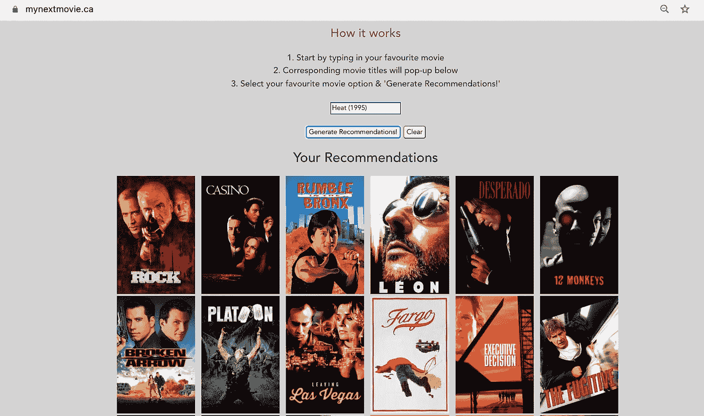
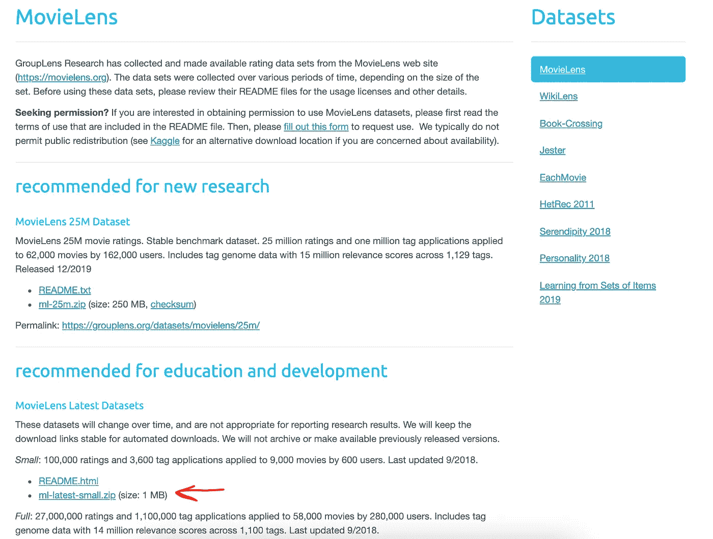
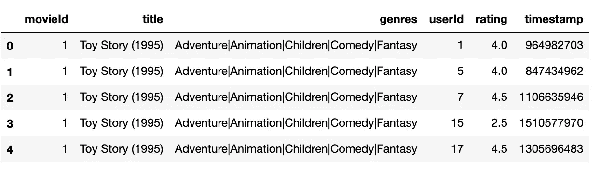
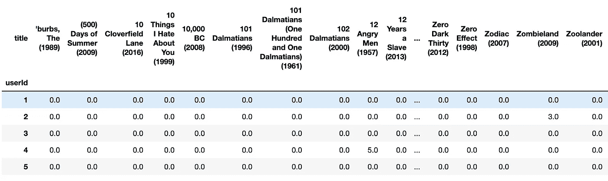
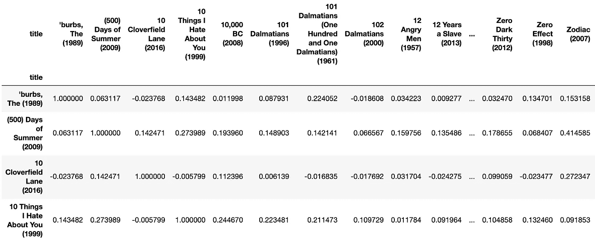
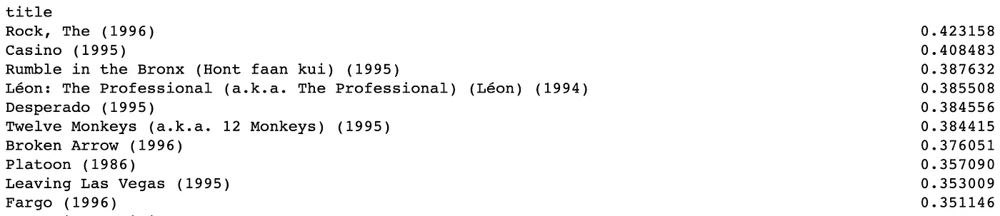
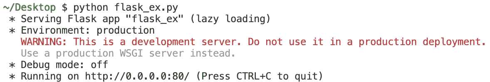
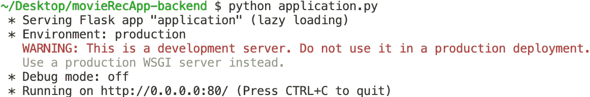

# 在 5 分钟内构建一个电影推荐引擎后端 API(第 2 部分)

> 原文：<https://towardsdatascience.com/build-a-movie-recommendation-engine-backend-api-in-5-minutes-part-2-851b840bc26d?source=collection_archive---------18----------------------->

## 为一个令人印象深刻的数据科学组合项目创建一个简单的后端 Flask API


劳伦·曼克在 [Unsplash](https://unsplash.com?utm_source=medium&utm_medium=referral) 上的照片

让自己成为一名数据科学家是一项挑战，因为每个人都上过机器学习课程，熟悉分类和回归等概念。要想真正脱颖而出，你需要展示一个真实世界的产品，让招聘人员能够很快抓住它。

在这篇文章中，我们将创建一个 Flask API，它根据其他人的评分向用户推荐电影。我们将使用开源的 MovieLens 数据集，并实现项目到项目的协作过滤方法。

本系列第 1-4 部分的目标是为您提供如何构建电影推荐引擎的分步指南，然后您可以将它放在您的 GitHub & Resume 上，以增加您获得梦想中的数据科学工作的机会。

在上一个教程中，

*   [通过简单的例子解释用户对用户与项目对项目的协同过滤(第一部分)](/user-to-user-vs-item-to-item-collaborative-filtering-explained-through-simple-examples-part-1-f133bec23a58)

我们讨论了什么是项目对项目的协同过滤，在以后的文章中，我们将讨论:

*   如何在 AWS &上部署 Flask API(我们将在本文中构建)
*   如何使用 Vue.js 创建前端？

您将通过本系列构建的最终产品可以在以下设备上试用:

*   [**mynextmovie.ca**](https://mynextmovie.ca/)

看起来会像这样



最终产品:电影推荐引擎

我们开始吧！

第一步是从以下位置下载数据:

```
[https://grouplens.org/datasets/movielens/](https://grouplens.org/datasets/movielens/)
```

我使用了来自 MovieLens 的以下数据集:“**教育&发展**”。



用户评分数据来源:MovieLens

下载并解压缩“ml-latest-small”文件夹后，让我们将相关文件加载到 Jupyter 笔记本中:

```
import pandas as pddf_movies = pd.read_csv('~/Downloads/ml-latest-small/movies.csv')
df_ratings = pd.read_csv('~/Downloads/ml-latest-small/ratings.csv')
df_merged = pd.merge(df_movies, df_ratings, on='movieId', how='inner')df_merged.head()
```



接下来，让我们创建一个 dataframe，该 data frame 将单个**用户评级**映射为行，将每个**电影**映射为列，并删除少于 8 个评级的电影。

```
df = df_merged.pivot_table(index='userId', columns='title', values='rating')# Keep only movies that had at least 8 ratings
df = df.dropna(thresh=8, axis=1)
df.fillna(0, inplace=True)
df.head()
```



现在我们可以使用皮尔逊相关来计算电影之间的相似性。皮尔逊方法将每个电影(即列)视为包含用户评级值的向量，并确定一部电影与其他电影的接近/相似程度。从下面的相似度矩阵可以看出，每部电影都与自己非常相似，要么与其他电影高度相关(~ **+1** )，要么高度不相似(~ **-1** )。

```
df_similarity = df.corr(method='pearson')#Store the data for later to be used in building the API
df_similarity.to_csv('movie_similarity.csv')df_similarity.head()
```



如果你像我一样喜欢电影“Heat (1995)”，让我们看看通过访问相应的电影列并从最高到最低排序相似性得分以获得前 50 名电影推荐，我们会得到什么推荐:

```
movieLiked = 'Heat (1995)'
similarityScores = df_similarity[movieLiked]
similarityScores.sort_values(ascending=False)[1:50]
```



看起来电影《摇滚》和《赌场》是我们的两大推荐。

是时候创建 Flask API 了，它可以被部署并用于实时推荐电影。

如果你熟悉 Flask，请跳过下面的“**Flask**入门”部分，直接进入“**电影推荐引擎 Flask API** 部分。

**烧瓶使用入门**

如果您没有 Flask，您可以使用 pip 安装它:

```
pip install Flask
```

让我们简单地从创建一个 python 文件开始: **flask_ex.py** ，代码如下:

在您的终端中，您可以运行这个文件，它实际上将运行一个 Flask 服务器:

```
python flask_ex.py
```

应该会看到以下显示内容:



在一个单独的终端中，您可以使用 curl 命令向您的默认" **/** " flask API 资源发送 HTTP 请求来测试它:

```
curl [http://0.0.0.0:80](http://0.0.0.0:80)
```

应该输出:


我们可以通过以下命令访问 **/find_friend** 资源，找出 Joey 最好的朋友是谁:

```
curl -X POST [http://0.0.0.0:80/find_friend](http://0.0.0.0:80/find_friend) -H 'Content-Type: application/json' -d '{"person":"Joey"}'
```

应该输出


**电影推荐引擎 Flask API**

现在让我们创建我们的 Flask API-**application . py**文件，它将提供电影推荐:

**注意**:确保你的 **application.py** 文件在你从 jupyter 笔记本输出 **movie_similarity.csv** 文件的同一个目录下。

如您所见，我们创建了一个名为 **/recms** 的资源，当向发出“POST”请求时，该资源将访问 **make_rec()** 函数，并获取用户最喜欢的电影的“movie_title ”,将其存储在“movie”变量中，并查找类似的电影作为推荐。

然后， **api_recommendations** 列表从 Flask API 发送到前端，并且包含电影推荐列表，然后可以向用户显示该列表。

让我们用电影《热度(1995)》再来测试一下。

首先，要运行 API，在终端中执行以下命令

```
python application.py
```



然后在单独的终端中执行以下命令:

```
curl -X POST http://0.0.0.0:80/recms -H 'Content-Type: application/json' -d '{"movie_title":"Heat (1995)"}'
```

如果一切正常，您应该会看到以下输出:


API 输出一个包含电影推荐的列表，然后可以被前端使用。

就这样，我们成功构建了我们的电影推荐引擎 Flask API！

**遗言**

在下一篇文章中，我们将介绍如何将这个 API dockerize 并将其部署在 AWS 上，供其他人使用。

**参考文献**

*   [电影镜头](https://grouplens.org/datasets/movielens/)
*   [https://medium . com/code-heroku/how-to-turn-your-machine-learning-scripts-into-projects-you-can-demo-CBC 5611 ca 442](https://medium.com/code-heroku/how-to-turn-your-machine-learning-scripts-into-projects-you-can-demo-cbc5611ca442)
*   [https://flask.palletsprojects.com/en/2.0.x/api/](https://flask.palletsprojects.com/en/2.0.x/api/)