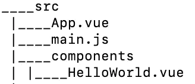
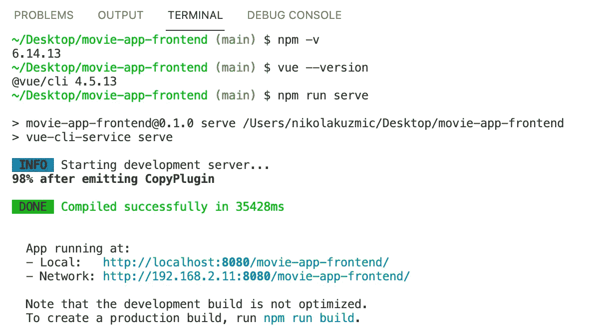

# 使用 Vue.js 构建电影推荐引擎前端(第 4 部分)

> 原文：<https://towardsdatascience.com/build-a-movie-recommendation-engine-frontend-using-vue-js-part-4-ac85280da670?source=collection_archive---------19----------------------->

## 本分步指南面向希望使用 Vue.js 为电影推荐引擎应用程序构建简单前端的数据科学家和 web 开发人员。


我们在这里构建的最终产品可以在 [**mynextmovie.ca**](https://mynextmovie.ca) 上试用

这是我们 4 部分系列的最后一部分！在前 3 篇文章中，我们介绍了协作过滤的理论，如何构建 Flask API，以及如何在 AWS ECS 上部署 API。以下是之前的帖子:

1.  [通过简单的例子解释用户对用户与项目对项目的协同过滤(第一部分)](/user-to-user-vs-item-to-item-collaborative-filtering-explained-through-simple-examples-part-1-f133bec23a58)
2.  [如何构建电影推荐引擎后端 Flask API(第二部分)](/build-a-movie-recommendation-engine-backend-api-in-5-minutes-part-2-851b840bc26d)
3.  [如何在 AWS ECS 上部署 Flask API(第 3 部分)](/how-to-deploy-a-flask-api-on-aws-ecs-part-3-c1ca552e65d)。

在这篇文章中，我们将构建一个简单的 Vue.js 前端，旨在尽可能简化电影推荐。因此，我们将只要求用户输入他们最喜欢的电影，并推荐与之相似的电影。

这个项目的关键功能是**自动搜索功能**，用于从 [MovieLens 数据集](https://grouplens.org/datasets/movielens/)中查找电影标题，并利用[开源的废弃电影海报](https://github.com/babu-thomas/movielens-posters)到**通过后端 API 显示推荐的电影**。

> 如果您熟悉 Vue.js，请跳过' [**建议，如果您是前端开发**](#05fd) 新手，请直接进入' [**使用 Vue.js**](#1a64) 构建前端'部分。

## **如果你是前端开发新手的建议**

如果你是 Vue.js 的新手(和我一样)，我建议你先浏览一下精彩的 [Khan Academy 资源](https://www.khanacademy.org/computing/computer-programming)，这些资源侧重于 HTML/CSS、JavaScript、DOM 和 jQuery，以便熟悉核心的前端概念。

Vue.js 是最新的 JavaScript 框架之一，它使我们能够在 10 到 100 行代码中构建交互式特性。在本文中，我们将使用 Vue 2。您需要了解的最重要的 Vue 基本概念是:

**i) Vue 项目结构**

如果您运行一个简单的命令

```
vue create vue_proj_ex
```

它将创建一个完整的项目，可以使用

```
npm run serve
```

创建的模板项目需要关注的关键方面如下:



主应用程序设置在 **App.vue** 中，我们在其中加载 ***组件*** 如 **HelloWorld.vue** 以及任何 **json 数据**子目录。在 **main.js** 中，我们加载必要的库，如 Bootstrap，以帮助我们利用现有的前端风格功能。

要做任何有用的事情，我们必须在 HellowWorld.vue 这样的组件中声明变量和函数，如下所示:

**ii)声明数据方法(即变量)**

```
data() {
  return{
     varX: '',
     varY: [] }}
```

**iii)声明函数**

```
methods: {
   fcnName(){ <Some Code>
}}
```

**iv)单向和双向数据绑定**

例如，无论你在哪里看到

```
v-bind:or shortly :
```

就是一个*单向*绑定的例子。这意味着存储在您的**数据**方法中的变量值将被发送到主应用程序组件。

*双向绑定*

是通过

```
v-model
```

这还使得在应用程序组件(如表单)中输入的变量值能够在数据方法变量中传输和存储。

一旦你对 JavaScript 和 DOM 概念如事件(即发生在 HTML 元素上的事情 **)** ，你可以通过利用像这样的优秀教程 [one](https://testdriven.io/blog/developing-a-single-page-app-with-flask-and-vuejs/) 继续使用 Vue 构建简单的项目。这将使你更容易理解我们将在下一部分做什么。

让我们开始吧！

## **使用 Vue.js 构建前端**

步伐

1.  克隆并设置 ***后端 API*** (我们已经构建好了)来推荐电影
2.  克隆前端存储库
3.  测试前端
4.  了解应用程序的主要组件

**先决条件设置**

**1。*后端 API***

为了让前端工作，你需要在你的计算机上本地运行 Flask 后端 API，就像我们在[第 2 部分](/build-a-movie-recommendation-engine-backend-api-in-5-minutes-part-2-851b840bc26d)中所做的那样，克隆这个项目。

**克隆后端烧瓶 API**

**a)** 克隆回购:

```
git clone [https://github.com/kuzmicni/movie-rec-engine-backend](https://github.com/kuzmicni/movie-rec-engine-backend)
```

**b)** 从[的 google drive](https://drive.google.com/drive/folders/1FH6bWCcw1OoRf4QJaFaf4gIegIGSEx9r?usp=sharing) &下载 **movie_similarity.csv** 文件，粘贴到克隆回购的根目录下。

您的代码结构应该如下所示:


**c)** 创建虚拟环境&安装必要的库

```
conda create --name py37_tut python=3.7
conda activate py37_tut
pip install Flask Flask-Cors pandas
```

运行应用程序

```
python application.py
```

**e)** 在一个单独的终端中运行测试 API

```
curl -X POST [http://0.0.0.0:80/recms](http://0.0.0.0:80/recms) -H 'Content-Type: application/json' -d '{"movie_title":"Heat (1995)"}'
```

应该从 API 获得以下输出:


现在，您可以让这个 API 在后台运行。

接下来，我们将下载已经构建好的整个前端项目，并浏览每个部分。

**2。克隆前端回购**

**克隆 Vue.js 前端回购&确保你已经安装了必要的库**

```
git clone [https://github.com/kuzmicni/movie-rec-engine-frontend](https://github.com/kuzmicni/movie-rec-engine-frontend)cd movie-rec-engine-frontend**#In terminal check that you have node & vue installed** npm --version
vue --version**#In case you don't have node, download it from:** [https://nodejs.org/en/](https://nodejs.org/en/)**#In case you don't have vue, run:**
npm install -g [@vue/cli](http://twitter.com/vue/cli)
```

现在让我们为这个项目安装必要的库:

jquery，axios，bootstrap & bootstrap-vue

在终端中运行以下命令:

```
npm install jquery axios bootstrap bootstrap-vue**Check that npm & vue/cli are installed properly**
npm -v
vue --version **Then run the app**
npm run serve
```

如果一切安装正确，您应该看到:



**3。测试前端**

然后，您可以在浏览器中打开本地链接并进行测试。如果你输入“Heat (1995)”你应该会得到以下推荐(因为我们的 API 是在[http://0 . 0 . 0 . 0:80/recms](http://0.0.0.0:80/recms)上后台运行的):


**4。了解 app 的主要组件**

从下面的片段中可以看出，我们的 Vue 应用程序主要由 **SearchAutocomplete** 组件组成，用户可以在其中输入他们最喜欢的电影标题。

更具体地说，我们有一个输入框，通过使用 **v-model** 的双向绑定，将输入的电影标题存储在 **"movieTitle"** 变量中。当用户在电影中输入时，它将触发 **onChange** 方法。

您可以看到 **onChange** 将依次触发 **filterResults** 方法，该方法将在包含 MovieLens 数据集中所有电影标题的**项目属性**中搜索相应的电影标题。

一旦用户选择了他们最喜欢的电影标题，我们需要通过“生成推荐”按钮将其发送到我们的 API:

这将触发**提交**方法，将输入的电影标题发送到后端 API

因此，我们可以解析提供的 API 响应，并将在 **rec_movie** 中找到的建议存储在一个数组中:

一旦填充了推荐数组，就会触发 **> 1** 条件，通过下面的代码显示与推荐电影相关的**海报**:

现在你知道了！这些是这个应用程序的关键成分。请随意使用它，并根据您的喜好进行修改。

**遗言**

下一步将是对应用程序进行 dockerize，并将其部署在 AWS(或您选择的任何其他云提供商)上，以便其他人可以像使用 [mynextmovie.ca](https://mynextmovie.ca/) 一样使用它。

为了创建 [mynextmovie.ca](https://mynextmovie.ca/) ，我利用了微服务架构，其中后端 API 与前端分开部署。将前端连接到您自己的域名将需要 Route 53 和负载平衡器等服务。也许我们可以在以后的文章中详细讨论这个问题。

**参考文献**

1.  [https://www.middlewareinventory.com/blog/docker-vuejs/](https://www.middlewareinventory.com/blog/docker-vuejs/)
2.  [https://medium . com/code-heroku/part-2-how-to-turn-your-machine-learning-scripts-into-projects-you-can-demo-467 B3 acff 041](https://medium.com/code-heroku/part-2-how-to-turn-your-machine-learning-scripts-into-projects-you-can-demo-467b3acff041)