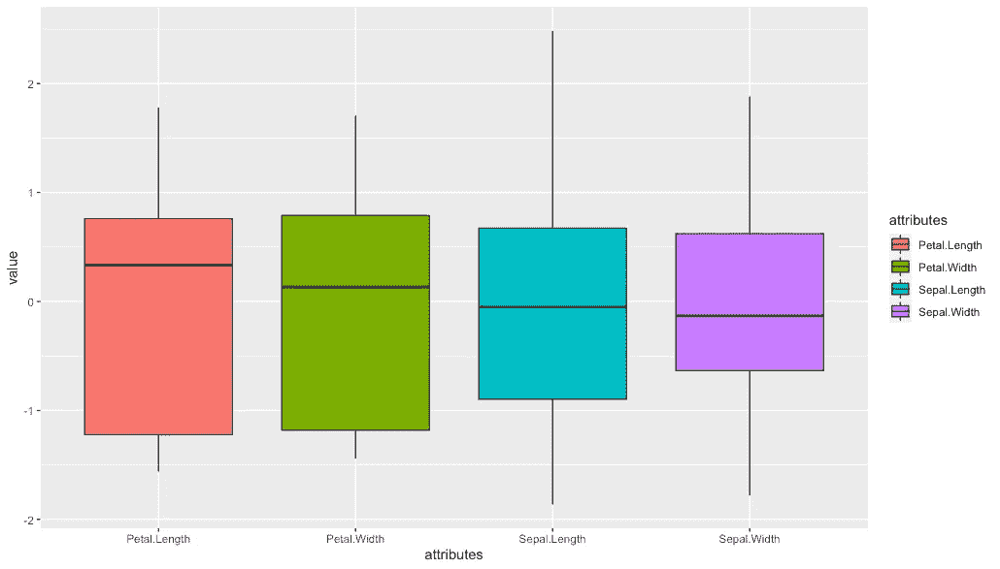
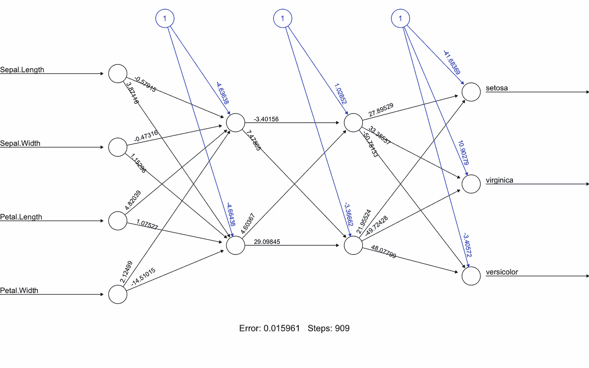

# 用 50 行代码在 R 中构建一个多类分类神经网络

> 原文：<https://towardsdatascience.com/build-a-multi-class-classification-neural-network-in-r-in-fifty-lines-of-code-88ba161297d3?source=collection_archive---------19----------------------->

## 人工神经网络

## R 语言允许我们快速建立神经网络模型的原型。在这里，我将向您展示如何构建一个神经网络来预测虹膜数据集。


R 语言允许机器学习和神经网络模型的快速原型化。学会使用 Python 创建神经网络后，我发现使用 R 构建神经网络原型既快速又简单。尽管由于 Python 作为编程语言所提供的灵活性和对算法的高级控制，我仍然倾向于使用 Python，但我认为自己在简单快速的项目中使用 R。

在本教程中，我将使用流行的虹膜数据集，通过一个简单的神经网络来预测花卉的种类。我将使用`neuralnet`包来创建一个神经网络，使用`tidyverse`包来创建一些方便的工具。

# 我们开始吧

首先，导入`tidyverse`和`neuralnet`包。

```
library(tidyverse) 
library(neuralnet)
```

现在，让我们来看看虹膜数据集。默认情况下，这个 iris 数据集在 R 中可用。因此，我们可以通过调用`iris`来直接使用它。

```
print(iris)
```

当您将数据集打印到控制台时，您将能够看到数据集有四个要素列和一个标注列，并且有 150 行数据。该数据集只包含三种花卉的数据。


虹膜数据集

由于标签列由分类变量组成，我们需要将标签列转换成一个因子。您可以通过使用`as_factor`方法来完成此操作。

```
iris <- iris %>% mutate(Species=as_factor(Species) )
```

这里，`%>%`操作符是由`tidyverse`包提供的管道操作符。我们可以使用`mutate`方法将“物种”列转换为因子列。

# 数据预处理

现在，让我们可视化数据集，看看我们是否需要做任何预处理。我将绘制一个箱线图，以查看数据集是否需要缩放，以及是否有任何异常值。为此，让我创建一个绘制箱线图的函数。

```
draw_boxplot <- function(){ 
  iris %>% 
    pivot_longer(1:4, names_to="attributes") %>%      
    ggplot(aes(attributes, value, fill=attributes)) +
    geom_boxplot() 
}
```

该方法将特性列转换为行，这样我们将得到一个包含特性列名称及其各自值的列。然后，我们将 name 列作为 x 轴传递，将 value 列作为 y 轴传递给`pivot_longerggplot`函数。最后，我们使用`geom_boxplot`方法绘制箱线图。然后，调用`draw_boxplot`方法绘制一个箱线图。


预处理前绘制的箱线图

我们可以观察到柱子有不同的鳞片和萼片。“宽度”列有异常值。首先，让我们剔除离群值。我将使用`squish`方法来删除离群值。这里，请注意，我不会删除无关的数据。相反，我将只把外围的数据行设置为最大值或最小值。

```
iris <- iris %>% 
  mutate(across(Sepal.Width, ~squish(.x, 
                                     quantile(.x, c(0.05,0.95)))))
```

这将把我的数据压缩在第 95 个百分点和第 5 个百分点之间。

现在，让我们也使用`scale`方法缩放列。R 中的 scale 方法使用 Z 分数归一化来归一化数据。

```
iris <- iris %>% mutate(across(1:4, scale))
```

让我们再次可视化数据集，看看是否有任何改进。



预处理后绘制的箱线图

我们可以看到这些列具有相似的比例，并且没有异常值。太好了！

# 分割数据集

现在我们已经完成了预处理任务，让我们将数据集分成训练数据和测试数据。我们将使用 70%的数据作为训练数据，其余的作为测试数据。

在分割数据集时，我们需要确保随机分配行。所以，让我们首先生成一个随机整数向量。整数的总数应该等于数据集中总行数的 70%。

```
training_data_rows <- floor(0.70 * nrow(iris)) set.seed(123) training_indices <- sample(c(1:nrow(iris)), training_data_rows)
```

我们将通过获得总行数的 70%来获得所需的整数个数。因为我们有 150 行，这个值将是 105。因此，我们的训练数据集将由 105 行组成。然后，我们生成一个由 1 到 150 之间的 105 个随机整数组成的向量。

现在，让我们使用`training_indices`来分割我们的数据集。

```
training_data <- iris[training_indices,] 
test_data <- iris[-training_indices,]
```

# 培养

你现在还在等什么？让我们根据训练数据训练一个神经网络。

为了创建一个神经网络，我将使用`neuralnet`包。我将使用默认设置，并将使用两个隐藏层，每个层上有两个神经元。默认情况下，`neuralnet`使用逻辑函数作为激活函数。要查看其他默认值是什么，[查看它的文档](https://www.rdocumentation.org/packages/neuralnet/versions/1.44.2/topics/neuralnet)。

```
nn=neuralnet(Species~Sepal.Length+Sepal.Width+Petal.Length+Petal.Width, 
data=training_data, 
hidden=c(2,2), 
linear.output = FALSE)
```

这里，第一个参数是指定 y 轴和 x 轴的公式。执行代码开始训练我们的模型。

完成后，我将调用`plot(nn)`来绘制网络的架构。



我的神经网络架构

你得到的权重值显然与我的不同，因为权重是随机初始化的。现在，让我们测试我们的神经网络模型。

# 测试

我将创建一个 predict 函数来获取我们的模型在测试数据和训练数据上的性能。

```
predict <- function(data){ 
  prediction <-data.frame(neuralnet::compute(nn,
                                  data.frame(data[,-5]))$net.result) labels <- c("setosa", "versicolor", "virginca")  prediction_label <- data.frame(max.col(prediction)) %>%      
    mutate(prediction=labels[max.col.prediction.]) %>% 
    select(2) %>% 
    unlist()   table(data$Species, prediction_label) 
}
```

我们将数据集作为参数传递，然后使用该方法生成混淆矩阵。要预测物种，可以使用`neuralnet`包提供的`compute`方法。因为计算方法给出了每个输出神经元的概率，所以我们使用`max.col`函数来得到最高的概率。沉淀的物种将是具有最高概率值的物种。

接下来，让我们检查训练数据的性能。

```
predict(training_data)
```


训练混淆矩阵

如你所见，准确率是 100%。但是坚持住！这只是训练数据。真正的考验在测试数据上。我们称之为测试数据是有原因的！

```
predict(test_data)
```


测试混淆矩阵

一点也不差。这个模型只错了一行。这给了我们 97.7%的准确率。现在，您可以试验超参数，如层数和每层上的神经元数量，看看是否可以获得更好的精度值。

你可以从[我的 GitHub repo](https://github.com/thivi/r_neuralnet_sample) 获得本教程中使用的完整代码。

*原载于 2021 年 6 月 11 日*[](https://www.thearmchaircritic.org/tech-journal/build-a-multi-class-classification-neural-network-in-r-in-fifty-lines-of-code)**。**