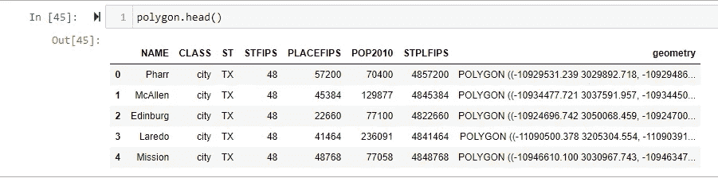
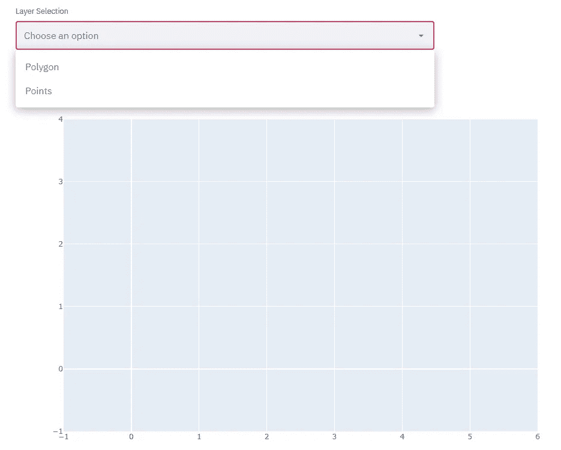
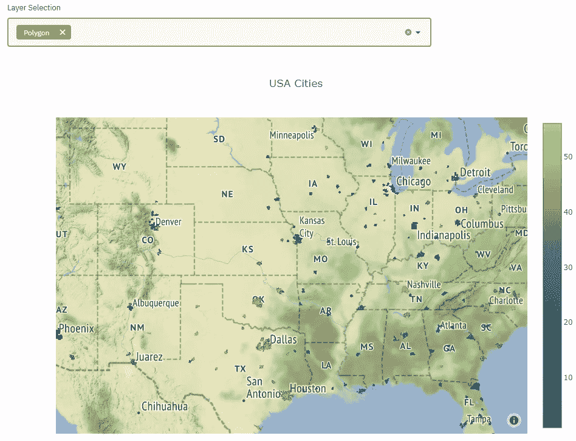
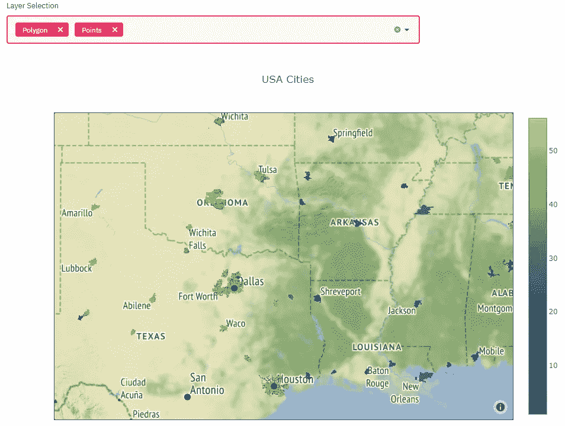

# 使用 Streamlit 构建多层地图

> 原文：<https://towardsdatascience.com/build-a-multi-layer-map-using-streamlit-2b4d44eb28f3?source=collection_archive---------3----------------------->

## 使用 Plotly 和 Geopandas 增强 Streamlit


**作者图片**

# “一张地图对你说，‘仔细阅读我，紧紧跟随我，不要怀疑我。’它说，“我是你手中的地球。”。没有我，你是孤独的，迷失的。"

― **柏瑞尔·马卡姆，夜色中的西方**

说到可视化数据，每个人都喜欢好的地图。我想这是因为地图让我们觉得我们是正在讲述的故事的一部分。它为我们提供了一个可以分享数据的空间，并带来了更丰富、更有力的信息。

令人欣慰的是，随着开源库扩展了 ArcMap 和 QGIS 等传统地理空间软件的应用范围，使用地图变得更加民主化。

此外，Streamlit 和 Dash 等网络应用程序库允许通过网络浏览器轻松显示地图。

**然而。。。**

# 虽然这些库非常有用，但是像图层选择这样的操作并不直接；尤其是如果你习惯了传统的地理空间软件。

本教程概述了向 Streamlit 项目添加可选点和面图层的简单过程。以我的经验来看，给用户增加和减少图层的能力会给他们的体验增加很多。

我们的地图将是一个简单的美国地图，主要城市表示为点，500 个美国城市的地图边界表示为多边形。

在我们开始之前，建立一些在本教程中遇到的词汇是有帮助的:

# 词汇

如果你来自 Plotly/Dash 的世界，这可以翻译成“痕迹”。图层是空间数据集，它们一个接一个地“分层”,从而使地图变得更加复杂

**矢量数据:**点、线或多边形。也称为“非栅格”数据

**点:**具有单一 x，y 坐标的空间特征

**线:**连接至少两个 x，y 坐标的空间特征

**多边形:**由至少三个相连的闭合顶点组成的空间特征

**CRS(坐标参考系统):**一组属性，告诉软件在空间中放置数据的位置，以及使用哪个数学模型将地球展平为 2D 表面。没有 CRS，空间数据就不是空间数据

# 导入库

```
import streamlit as st
import json
import geopandas as gpd
import pyproj
import plotly.graph_objs as go
```

简要说明:如果您正在使用 python 的 Anaconda 安装，我建议您创建一个新环境来导入 GeoPandas。这是一个非常有用的空间库，它有大量特定于版本的依赖项。我建议首先对其进行全新安装，然后将其余的包安装到该环境中。

# 密码

我们的第一步是读入数据。对于这个项目，我已经上传了点和多边形数据到项目 github 页面，你可以在这里本地下载:[https://github.com/wagneaj/mapLayers](https://github.com/wagneaj/mapLayers)。

让我们从多边形数据开始:

```
# reading in the polygon shapefile
polygon = gpd.read_file(r"\Downloads\CityBoundaries.shp")
```

在这里，我们使用 GeoPandas 来读取我们的第一位数据。这将把我们的数据保存为一个地理数据框架对象，您可以像调用熊猫数据框架对象一样调用和操作它。的’。“shp”文件类型表示 shapefile，它实际上是一组帮助定义数据的空间和表格信息的文件。现在，如果我们愿意，我们可以在 Jupyter 笔记本中查看表格数据:



**GeoPandas 数据帧**

现在，让我们创建一个新对象，并使用它将特定的坐标参考系统(CRS)应用于我们的数据:

```
# project GeoPandas dataframe
map_df = polygon 
map_df.to_crs(pyproj.CRS.from_epsg(4326), inplace=True)
```

epsg 4326 '是欧洲石油勘探组织(epsg)的一个编码 CRS。它映射到 WGS 84 CRS。

接下来，我们将对我们的点数据做同样的事情。

```
# reading in the points shapefile
points = gpd.read_file(r"\Downloads\USA_Major_Cities.shp")# project GeoPandas dataframe
points.to_crs(pyproj.CRS.from_epsg(4326), inplace=True)# define lat, long for points
Lat = points['Lat']
Long = points['Long']
```

一个关键的区别是额外的步骤，即指定数据集中的哪些列对应于点的纬度和经度。在这种情况下，列分别命名为“Lat”和“Long”。

一旦我们将所有数据读入正确的 CRS，我们需要将多边形数据集转换成 GeoJSON 文件。当我们调用 Plotly 图形对象库时，这个 GeoJSON 将被用作一个参数。

如果您不熟悉，GeoJSON 是一种开放的标准文件格式，专门用于表示空间数据。它基于 JSON 格式，是我们将如何与 Plotly 交流多边形数据的空间参考。

```
# set GeoJSON file path
path = r"C:\Users\project\geojson.json"# write GeoJSON to file
map_df.to_file(path, driver = "GeoJSON")
   with open(path) as geofile:
   j_file = json.load(geofile)# index geojson
i=1
for feature in j_file["features"]:
   feature ['id'] = str(i).zfill(2)
   i += 1
```

这里，我们设置了导出 GeoJSON 的路径；我们已经将文件回调到我们的分析中；然后我们给文件的每个记录编了索引。

在我们创建并索引 GeoJSON 之后，在我们把所有东西放在一起之前还有一个步骤，那就是生成一个 mapbox 令牌。

Mapbox 提供了在线地图，可以使用 mapbox 令牌通过 API 访问这些地图。我已经生成了自己的令牌，但这是一个相当无痛的过程，可以在这里找到说明:【https://docs.mapbox.com/help/glossary/access-token

随着地图框令牌的生成，我们现在可以开始把我们的地图层放在一起。

```
# mapbox token
mapboxt = 'MapBox Token'

# define layers and plot map
choro = go.Choroplethmapbox(z=map_df['STFIPS'], locations =  
        map_df.index, colorscale = 'Viridis', geojson = j_file, 
        text = map_df['NAME'], marker_line_width=0.1) scatt = go.Scattermapbox(lat=Lat, lon=Long,mode='markers+text',    
        below='False', marker=dict( size=12, color ='rgb(56, 44, 
        100)'))layout = go.Layout(title_text ='USA Cities', title_x =0.5,  
         width=950, height=700,mapbox = dict(center= dict(lat=37,  
         lon=-95),accesstoken= mapboxt, zoom=4,style="stamen-  
         terrain"))
```

在这里，我们已经定义了我们的 choropleth 地图层，我们的散点图地图层，我们的布局都使用 Plotly 图形对象。图形对象是类似字典的结构，可以用来方便地存储和调用不同的图形。

最后，我们为图层选择创建了一个 Streamlit multiselect 小部件；我们给我们的图形对象分配图形；我们调用 Streamlit 来显示最终的地图。

```
# streamlit multiselect widget
layer1 = st.multiselect('Layer Selection', [choro, scatt], 
         format_func=lambda x: 'Polygon' if x==choro else 'Points')# assign Graph Objects figure
fig = go.Figure(data=layer1, layout=layout)# display streamlit map
st.plotly_chart(fig)
```

就是这样！现在，您已经有了向多层 web 地图添加和减去图层的结构。成品截图如下。



**初始图层选择**



**多边形图层选择**



**多边形和点图层选择**

# 进一步探索

1.  **对 Streamlit 的精彩介绍:**

</streamlit-101-an-in-depth-introduction-fc8aad9492f2>  

2) **如果你更喜欢 Dash for web apps:**

<https://plotly.com/python/maps/>  

3) **是什么让空间数据变得特殊** l:

<https://escholarship.org/uc/item/3ph5k0d4> 