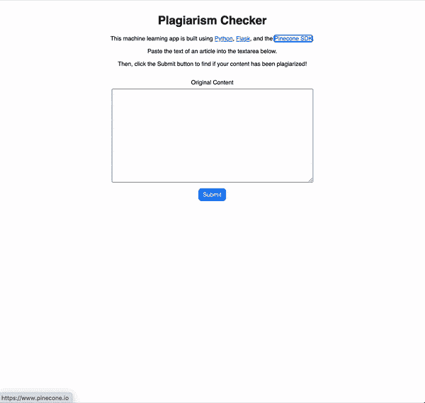
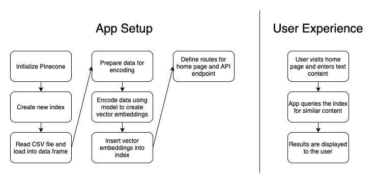

# 使用机器学习构建抄袭检查器

> 原文：<https://towardsdatascience.com/build-a-plagiarism-checker-using-machine-learning-6538110ce162?source=collection_archive---------9----------------------->

## Python、Flask、NLP、相似性搜索等等

克里斯多夫·伯恩斯在 [Unsplash](https://unsplash.com?utm_source=medium&utm_medium=referral) 上拍摄的照片

网络上、课堂上抄袭现象猖獗。有这么多的内容，有时很难知道什么时候被剽窃了。撰写博客文章的作者可能想要检查是否有人窃取了他们的作品并将其发布到其他地方。老师们可能想对照其他学术文章检查学生的论文是否抄袭。新闻媒体可能想要检查内容农场是否窃取了他们的新闻文章并声称内容是自己的。

那么，我们如何防范抄袭呢？如果我们能让软件为我们做这些繁重的工作，那不是很好吗？使用机器学习，我们可以构建自己的剽窃检查器，在庞大的数据库中搜索被盗内容。在本文中，我们将做到这一点。

我们将构建一个 Python Flask 应用程序，它使用[松果](https://www.pinecone.io/)——一个相似性搜索服务——来查找可能抄袭的内容。

# 演示应用概述

让我们来看看我们今天要构建的演示应用程序。下面，你可以看到一个应用程序运行的简短动画。

UI 提供了一个简单的 textarea 输入，用户可以在其中粘贴文章中的文本。当用户点击*提交*按钮时，该输入用于查询文章数据库。然后向用户显示结果及其匹配分数。为了帮助减少噪音，该应用程序还包括一个滑块输入，用户可以在其中指定一个相似性阈值，以便只显示非常强的匹配。

演示应用——剽窃检查器

正如你所看到的，当原始内容被用作搜索输入时，可能抄袭的文章的匹配分数相对较低。然而，如果我们从数据库中的一篇文章中复制并粘贴文本，抄袭文章的结果会有 99.99%的匹配！

那么，我们是怎么做到的呢？

在构建应用程序时，我们从 Kaggle 的新闻文章数据集开始。该数据集包含来自 15 个主要出版物的 143，000 篇新闻文章，但我们只使用了前 20，000 篇。(这个数据库的完整数据集包含超过 200 万篇文章！)

接下来，我们通过重命名几列并删除一些不必要的列来清理数据集。然后，我们通过嵌入模型运行文章，以创建[向量嵌入](https://www.pinecone.io/learn/vector-embeddings/)——这是机器学习算法的元数据，用于确定各种输入之间的相似性。我们使用[平均单词嵌入模型](https://nlp.stanford.edu/projects/glove/)。最后，我们将这些矢量嵌入插入到由松果管理的[矢量数据库](https://www.pinecone.io/learn/vector-database/)中。

将矢量嵌入添加到数据库并建立索引后，我们就可以开始寻找相似的内容了。当用户提交他们的文章文本作为输入时，会向一个 API 端点发出请求，该端点使用 Pinecone 的 SDK 来查询矢量嵌入的索引。端点返回 10 篇可能抄袭的类似文章，并在应用程序的 UI 中显示出来。就是这样！很简单，对吧？

如果你想自己尝试一下，你可以在 GitHub 上找到这个应用的代码。`README`包含如何在您自己的机器上本地运行应用程序的说明。

# 演示应用程序代码演练

我们已经了解了应用程序的内部工作原理，但是我们实际上是如何构建它的呢？如前所述，这是一个利用松果 SDK 的 Python Flask 应用程序。HTML 使用模板文件，前端的其余部分使用静态 CSS 和 JS 资产构建。为了简单起见，所有的后端代码都在`app.py`文件中，我们在下面完整地复制了它:

让我们检查一下`app.py`文件的重要部分，以便理解它。

在第 1–14 行，我们导入了应用程序的依赖项。我们的应用依赖于以下内容:

*   `dotenv`用于从`.env`文件中读取环境变量
*   `flask`用于网络应用程序设置
*   `json`用于使用 JSON
*   `os`也用于获取环境变量
*   `pandas`用于处理数据集
*   `pinecone`使用松果 SDK
*   `re`用于处理正则表达式(RegEx)
*   `requests`请求 API 下载我们的数据集
*   `statistics`获取一些方便的统计方法
*   `sentence_transformers`对于我们的嵌入模型
*   `swifter`用于处理熊猫数据框

在第 16 行，我们提供了一些样板代码来告诉 Flask 我们的应用程序的名称。

在第 18–20 行，我们定义了一些将在应用程序中使用的常量。其中包括松果索引的名称、数据集的文件名以及从 CSV 文件中读取的行数。

在第 22–25 行，我们的`initialize_pinecone`方法从`.env`文件中获取我们的 API 密匙，并用它来初始化松果。

在第 27–29 行，我们的`delete_existing_pinecone_index`方法在松果实例中搜索与我们正在使用的名称相同的索引(“剽窃检查器”)。如果找到一个现有的索引，我们就删除它。

在第 31–35 行，我们的`create_pinecone_index`方法使用我们选择的名称(“剽窃检查器”)、“余弦”邻近度度量和一个碎片创建了一个新的索引。

在第 37–40 行，我们的`create_model`方法使用`sentence_transformers`库来处理平均单词嵌入模型。稍后我们将使用这个模型对矢量嵌入进行编码。

在第 62–68 行，我们的`process_file`方法读取 CSV 文件，然后对其调用`prepare_data`和`upload_items`方法。接下来描述这两种方法。

在第 42–56 行，我们的`prepare_data`方法通过重命名第一个“id”列并删除“date”列来调整数据集。然后，它将文章标题和文章内容组合成一个字段。我们将在创建矢量嵌入时使用这个组合字段。

在第 58–60 行，我们的`upload_items`方法通过使用我们的模型对文章进行编码，为每篇文章创建一个矢量嵌入。然后，我们将矢量嵌入插入到松果索引中。

在第 70–74 行，我们的`map_titles`和`map_publications`方法创建了一些标题和出版物名称的字典，以便以后更容易通过它们的 id 找到文章。

到目前为止，当后端应用程序启动时，我们描述的每个方法都在第 95–101 行被调用。这项工作为我们基于用户输入实际查询松果索引的最后一步做准备。

在第 103–113 行，我们为我们的应用程序定义了两条路径:一条到主页，一条到 API 端点。主页提供了`index.html`模板文件以及 JS 和 CSS 资产，API 端点提供了查询松果索引的搜索功能。

最后，在第 76–93 行，我们的`query_pinecone`方法获取用户的文章内容输入，将其转换为矢量嵌入，然后查询松果索引来查找相似的文章。当点击`/api/search`端点时调用该方法，这发生在用户提交新的搜索查询的任何时候。

对于视觉学习者来说，这里有一个图表概述了该应用程序的工作原理:

应用架构和用户体验

# 示例场景

那么，把这些放在一起，用户体验是什么样的呢？让我们来看三个场景:原创内容、抄袭内容的精确副本和“补丁编写”的内容。

当提交原创内容时，应用程序会回复一些可能相关的文章，但匹配度很低。这是一个好迹象，因为内容没有抄袭，所以我们会期待低匹配分数。

当提交抄袭内容的精确副本时，应用程序会对一篇文章给出近乎完美的匹配分数。那是因为内容一模一样。不错的发现，抄袭检查！

现在，对于第三个场景，我们应该定义“补丁编写的”内容的含义。补丁写作是剽窃的一种形式，在这种形式中，有人复制并粘贴窃取的内容，然后试图通过更改一些文字来掩盖他们剽窃作品的事实。如果原始文章中的一句话是，“他为找到他丢失的狗而欣喜若狂”，有人可能会将内容改为“他很高兴找回他丢失的狗。”这与转述有些不同，因为在整篇抄袭的文章中，内容的主要句子结构通常保持不变。

有趣的是:我们的剽窃检查器在识别“补丁编写”内容方面也做得很好！如果您复制并粘贴数据库中的一篇文章，然后在这里或那里更改一些单词，甚至可能删除几个句子或段落，匹配分数仍然会以近乎完美的匹配返回！当我用一篇匹配率为 99.99%的复制粘贴的文章尝试这样做时，在我修改之后，“编写的补丁”内容仍然返回 99.88%的匹配率！

不算太寒酸！我们的剽窃检查器看起来运行良好。

# 结论和下一步措施

我们现在已经创建了一个简单的 Python 应用程序来解决现实世界中的问题。模仿可能是奉承的最高形式，但没有人喜欢自己的作品被偷。在一个不断增长的内容世界中，像这样的剽窃检查器对作者和老师都非常有用。

这个演示应用程序确实有一些限制，因为它毕竟只是一个演示。加载到我们索引中的文章数据库仅包含来自 15 个主要新闻出版物的 20，000 篇文章。然而，有数百万甚至数十亿的文章和博客文章。像这样的剽窃检查器只有在检查你的输入和所有你的作品可能被剽窃的地方时才有用。如果我们的索引中有更多的文章，如果我们不断地添加到它，这个应用程序会更好。

无论如何，在这一点上，我们已经展示了一个坚实的概念证明。松果作为一个管理相似性搜索服务，在机器学习方面为我们做了大量工作。有了它，我们能够相当容易地构建一个利用自然语言处理和语义搜索的有用应用程序，现在我们可以安心地知道我们的工作没有被剽窃。