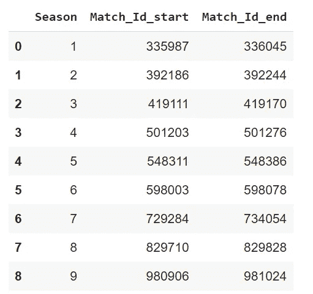
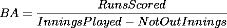
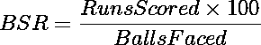
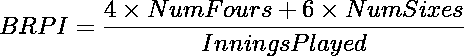
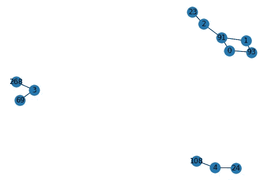
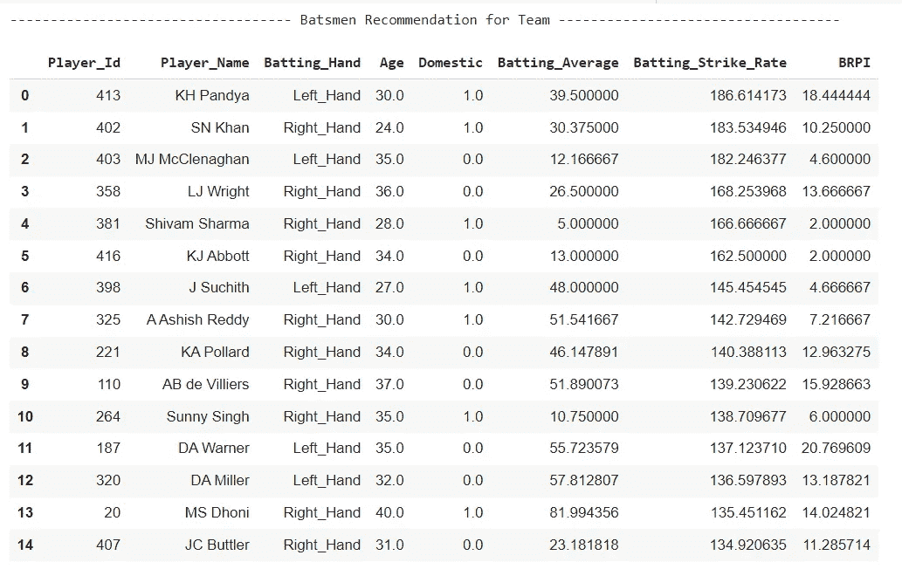

# 利用 K-最近邻算法构建板球运动员推荐系统

> 原文：<https://towardsdatascience.com/build-a-player-recommendation-system-for-cricket-using-k-nearest-neighbor-algorithm-3742d2bfc657?source=collection_archive---------13----------------------->

## 使用 k-最近邻算法构建简单推荐系统的初学者指南。


照片由[迈克尔·韦尔](https://unsplash.com/@bushmush?utm_source=medium&utm_medium=referral)在 [Unsplash](https://unsplash.com?utm_source=medium&utm_medium=referral) 拍摄

在本文中，我们将构建一个简单的板球运动员推荐系统，该系统将根据过去为该队打球的运动员的统计数据，为该队推荐击球手名单。

> 我们将只为击球手构建推荐系统，通过计算他们各自的指标，该系统可以扩展到投球手和其他类型的球员。

# k 近邻概述

简而言之，k-nearest neighbors (kNN)算法根据任何距离度量找出距离数据点最近的 k 个邻居。在计算数据点相似性的方式上，它与 k-means 非常相似。我们将使用 kNN 算法来推荐最接近当前团队成员的玩家。

# **数据采集**

用于该系统的数据集是从 Kaggle 上的[印度超级联赛 CSV 数据集](https://www.kaggle.com/harsha547/indian-premier-league-csv-dataset)下载的。它由 6 个 CSV 文件组成，总结了截至 IPL 第 9 赛季的 577 场 IPL 比赛的逐球信息。

## 理解数据

我们将使用 Pandas 来读取以下 CSV 文件。

1.  **Ball_by_Ball.csv —** 这个文件有比赛中每一个球的数据。我们可以提取前锋和非前锋球员的身份，得分等等。我们将使用这个文件来计算推荐系统的击球手统计数据。
2.  **Match.csv —** 该文件存储关于比赛的信息，如场地、球队、结果、裁判的详细信息等。我们将需要这个文件来提取一个`Match_Id`和`Season_Id`之间的关联。
3.  **Player.csv —** 该文件包含所有球员的数据，即他们的姓名、国家、出生日期等。这些字段将用于使用 k-最近邻算法构建我们的推荐系统。
4.  **Player_Match.csv —** 该文件将`Player_Id`与他们参加过的比赛相关联。我们会用这个文件来了解当前队伍中球员的特点。

# 数据清理

我们将创建另一个名为`player_data`的数据帧来存储击球手统计数据和来自现有`player`数据帧的其他相关特征。由于`player`数据帧有两列`Is_Umpire`和`unnamed:7`，这对我们的用例来说无关紧要，我们将删除它们并将其他列复制到`player_data`。

```
player_data = player.drop(["Is_Umpire", "Unnamed: 7"], axis = 1)
```

# 特征抽出

## 从 Match_Id 导出赛季

我们将得出每个赛季球员的表现统计。`match`数据帧具有字段`Match_Id`和`Season_Id`，可用于从`Match_Id`中导出季节编号。

```
NUMBER_OF_SEASONS = 9
season_info = pd.DataFrame(columns = ['Season', 'Match_Id_start', 'Match_Id_end'])for season in range(1, NUMBER_OF_SEASONS + 1):
    match_info = match.loc[match['Season_Id'] == season]['Match_Id']
    season_info = season_info.append({
        'Season' : season,
        'Match_Id_start' : match_info.min(), 
        'Match_Id_end' : match_info.max()
    }, ignore_index=True)
```

上面的代码片段会找到每个季节的`Match_Id`的范围。



每个赛季的 Match_Id 范围

基于以上结果，我们将创建一个函数，该函数将基于比赛的 id 返回正确的赛季号。

```
def get_season_from_match_id(match_id):
    season = season_info.loc[
        (season_info['Match_Id_start'] <= match_id) & 
        (season_info['Match_Id_end'] >= match_id)] ['Season']
    # Return the integer value of the season else return -1 if
      season is not found   
    return season.item() if not season.empty else -1
```

## 每个赛季击球成绩的计算

根据`ball_by_ball`数据，我们将计算每个赛季所有球员的以下特征:

1.  得分得分
2.  玩的局数
3.  玩家没有出局的局数
4.  面对球
5.  四的数量
6.  六的数量

计算得分、面对的球数、4 分和 6 分的数量非常简单。在`ball_by_ball`数据框中，我们可以简单地检查`Striker_Id`和`Batsman_Scored`列中的值，并相应地增加这些特征。

难点在于计算每个赛季打的局数和球员没有出局的局数。为此，我们不仅需要查看数据帧中的当前行，还需要查看前一行。在下列情况下，玩家的局数应该增加:

1.  `Match_Id`前一个球与当前球不同。这意味着当前行属于新的比赛，因此新的一局将开始。我们将增加射手和非射手的局数。
2.  `Match_Id`与前一个和当前焊球相同，但`Innings_Id`发生变化。这意味着这是同一场比赛的第二局。我们将增加射手和非射手的局数。
3.  前一个球和当前球中的`Match_Id`和`Innings_Id`相同，但当前的`Striker_Id`不等于前一个`Striker_Id`或`Non_Striker_Id`。这意味着有新的玩家来击球了，所以我们将只为 id 等于`Striker_Id`的玩家增加局数。类似的逻辑也适用于电流`Non_Striker_Id.`

我们还将跟踪`Player_dismissed`列，找出玩家是否在特定的一局中没有出局。

## 击球统计的计算

最后一步是计算击球统计数据，如**击球命中率(BSR)** 、**击球率(BA)** 和**每局边界得分(BRPI)** 。首先每个赛季计算 BSR、BA 和 BRPI，然后根据球员参加的赛季数计算这些值的平均值。在计算平均指标时，只考虑击球手实际打过的那些赛季。这消除了对过去所有赛季都参加过比赛的球员的偏见。



每个赛季平均击球率的计算



每季击球命中率的计算



每个赛季每局边界得分的计算

一旦我们计算了这些统计数据，我们还可以得出球员的年龄，以及他们是国内还是国际球员。这些属性很重要，因为假设目前超过 40 岁的球员不会参加下个赛季的比赛。此外，由于在 IPL 球队中选择国际球员的限制，国内球员的属性将很重要。

# K-最近邻的实现

对于 k-最近邻的实现，我们将使用 scikit learn 并构建一个 numpy 数组，其中只有那些特征有助于团队选择，即 BA、BSR、BRPI、年龄和国籍。

x 是代表这些特征的 numpy 数组。

```
from sklearn.neighbors import NearestNeighborsnbrs = NearestNeighbors(n_neighbors=3, algorithm='ball_tree').fit(X)
distances, indices = nbrs.kneighbors(X)
```

`indices`将给出 x 中每一行的最近邻的索引



前几个玩家和他们最近的邻居的可视化。节点号是玩家的 id

对于在当前赛季中在特定球队中比赛的所有球员，kNN 将返回与现有球员相似的 3 个最近邻居。

> 在建议的 3 个玩家中，第一个玩家将与现有玩家相同，因为玩家与自己的距离为 0。

所有推荐的玩家都被添加到有序集合中，并按照最高 BSR 到最低排序。我们可以编程返回前 *n* 个击球手，其中 *n* 可以根据需要更改。



最终输出推荐 15 名球员按击球命中率排序。

这是击球手推荐系统的一个非常简单的实现。你可以在这里查看代码[的 GitHub 库。感谢您的阅读！:)](https://github.com/shivaneej/Batsmen-Recommendation-System)