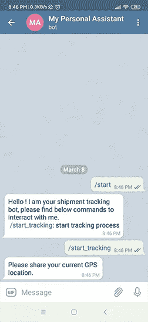
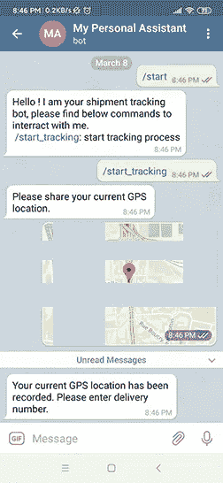
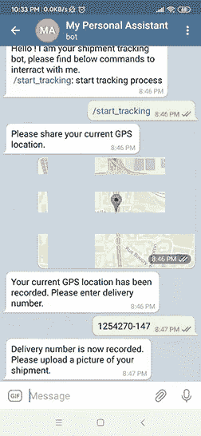
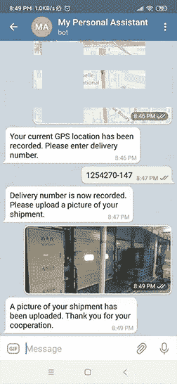
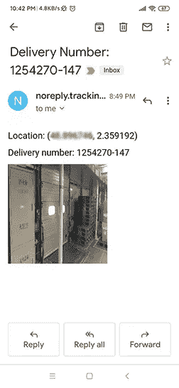
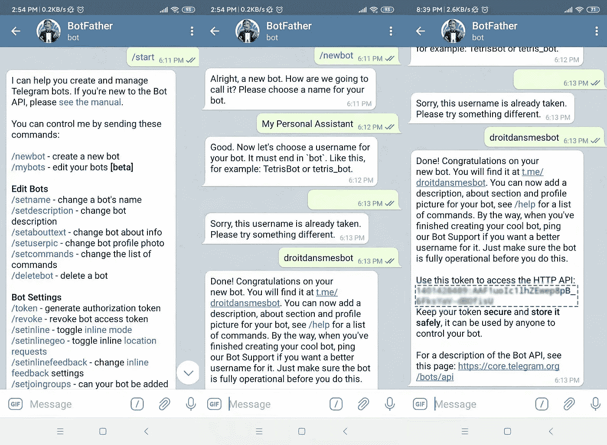

# 使用电报机器人创建一个货物跟踪工具

> 原文：<https://towardsdatascience.com/build-a-real-time-shipment-tracking-tool-using-a-telegram-bot-beb6ab29fca3?source=collection_archive---------12----------------------->

## 设计一个电报机器人，它将与卡车司机互动，以跟踪您的货物，并提供您的运输性能的实时可见性


[K8](https://unsplash.com/@k8_iv?utm_source=unsplash&utm_medium=referral&utm_content=creditCopyText) 在 [Unsplash](https://unsplash.com/s/photos/logistics?utm_source=unsplash&utm_medium=referral&utm_content=creditCopyText) 上拍照

零售商和快速消费品公司正面临着越来越大的压力，以改善他们的供应链，增加他们的灵活性和降低成本。

使用**配送中心(DC)** 是一个有效的解决方案，因为它们允许在一个地方储存来自靠近最终客户的不同供应商的各种产品。

然而，它应该与有效的[发货跟踪](https://www.youtube.com/watch?v=V6qnuZ-QcKE)相结合，以便为商店提供准确的 eta，确保交付流程的透明度并衡量绩效。

💌新文章直接免费放入您的收件箱:[时事通讯](https://www.samirsaci.com/#/portal/signup)

# **一、TMS &跟踪工具的局限性**

## 例子

你是一家中型零售商，在运输行业不成熟的市场上经营。

您希望实施由外部提供商提议的**运输管理系统(TMS)** ，以获得对您的货件的全面可见性和实时跟踪[。](https://www.youtube.com/watch?v=ssdni_n6HDc)

## 你能面对什么样的障碍？

*   **系统接口:**您有多个不同系统的运营商
*   **运营商成熟度:**他们用手工流程(Excel)管理他们的车队
*   **当地具体情况:**承运人不经营自己的车队*(分包)*
*   **谈判能力有限:**因为与其他客户相比，您的业务量较低，承运商拒绝调整他们的流程，也不使用您的系统来记录状态

如果您正面临这些障碍，本文中介绍的解决方案可能会满足您的需求。

# **二。我们需要什么？**

一个简单、便宜且易于实施的解决方案，用于跟踪您的货件

*   不需要为您的运营商进行额外的 IT 开发
*   轻松整合到当前的运输流程中
*   减少物流团队的管理工作量
*   不会影响驾驶员的工作效率
*   不需要额外设备
*   提供可见性、实时跟踪和透明度


电报机器人:您提升物流绩效的最佳盟友

# **三世。什么是电报机器人？**

**电报**

Telegram 是一款安全、便捷的跨平台消息应用，这意味着它可以在您的所有设备上运行。Telegram 在全球拥有超过 5 亿用户，它有一个对所有人免费的开放 API 和协议。有了这个 API，我们可以构建自己的工具，包括机器人。

什么是机器人？

机器人是第三方应用程序，可以通过向用户发送消息、命令和内嵌请求来与用户进行交互。使用 Telegram，您可以通过向电报机器人 API 发送 HTTPS 请求来设计和控制电报机器人。

您的机器人可以发送/接收消息、照片、视频和 GPS 位置，足以构建我们的货件跟踪工具。

**如何与电报机器人互动？**

添加他并开始对话:)

# **四。创建你的追踪助手机器人**

## 标准运营模式(SOP)

对于我们的 bot 的第一个版本，让我们用一个简单版本的 SOP 来记录交付时间。

**确认在目的地卸货**

1.  商店团队已将您的货物从卡车上卸下
2.  司机与你的电报机器人分享 ***货物编号*、 *GPS 位置* n** 和**货物的*图片*** 以确认交货
3.  电报机器人通过电子邮件发送一个 ***交货通知*** 给 ***你的物流团队*** 上面列出的信息

> 编辑:你可以在下面的链接中找到这篇文章的 Youtube 版本和动画。

# 动词 （verb 的缩写）演示:发货交付确认

## 方案

您的货物已在您的商店卸载。司机想在前往下一个目的地之前发送交货确认。

## 第一步:司机打开电报，开始与机器人讨论



驱动程序启动进程|机器人询问 GPS 位置—(图片由作者提供)

## 第二步:司机分享自己的 GPS 位置



司机分享其 GPS 位置| BOT 要求送货编号—(图片由作者提供)

## 第三步:司机分享一个送货号码



司机分享其发货编号| BOT 索要发货图片—(图片由作者提供)

## *第四步:*司机*分享货物的图片*



司机分享发货照片| BOT 停止流程并发送电子邮件(图片由作者提供)

## *第五步:您的物流团队收到发货确认*



BOT 通过邮件向运输团队发送交货确认(图片由作者提供)

[](http://samirsaci.com) [## 萨米尔 Samir 供应链组合的数据科学

### 🏭使用高级数学概念的供应链网络优化👨‍🏭仓储的持续改进…

samirsaci.com](http://samirsaci.com) 

# **七。设计你的电报机器人**

> 你可以在我的 GitHub 资源库中找到完整的代码:[链接](https://github.com/samirsaci/telegram_transport)
> 我的投资组合与其他项目:[萨米尔萨奇](https://samirsaci.com/)

**1。用另一个机器人创建你的机器人:)**

@ BotFather 是一个电报机器人，它将帮助你创建自己的机器人

1.  在电报上搜索@ BotFather，并发送给他 ***'/start'***
2.  回答 ***'/newbot'*** 消息，并按照说明设置一个**名称**和一个**用户名**
3.  您的 bot 现在已经准备好了，创建了一个 API 令牌— **请保留这个令牌的副本！**



用@ BotFather(图片由作者提供)通过三个步骤创建您的电报

**2。安装 Python 包**

包来管理你的电报机器人

```
pip install python-telegram-bot
```

## **3。导入库并启用日志记录**

导入库并初始化你的电报机器人

***TOKEN*** :创建你的 bot
***APP _ NAME***:你的 Heroku 应用的地址(见以下步骤)

## **4。带有对话处理程序的主函数**

为了简化驱动程序的过程，您的 BOT 将使用 Telegram API 的 ConversationHandler 函数按顺序询问信息


由 Telegram API 的 ConversationHandler 函数处理的装运信息收集过程(图片由作者提供)

对话处理程序为具有取消功能的驱动程序创建一系列指令

*照片示例* ***功能***

1.  **photo_file** :提取用户写的消息中最后上传的照片
2.  **链接 1** :电报 API 创建的链接，我们可以从中提取照片文件 id
3.  **link 2**:Telegram API 创建的保存这张照片的网页
4.  **邮件功能**:用 HTML 发送一封带有 delivery_number、gps_location 和内嵌照片的邮件

照片功能示例

关于 Telegram API 的更多细节，我强烈建议查看文章末尾的参考链接列表。

## 5.邮件功能

在收集了递送号码、GPS 位置和装运图片后，您的机器人将使用 **smtplib** python 包和 Gmail 帐户通过电子邮件向您的运输团队发送通知。

可以在脚本 ***mail.py*** 中找到 *mail* 函数。

## 6.在云上托管您的机器人

Heroku 是一个基于云的服务，在这里你可以托管你的网络应用；托管的免费公式提供了足够的资源来运行你的应用程序。

```
Procfile
requirements.txt
```

在 Heroku 上设置您的应用程序需要上面列出的两个文件。

在这篇由[浩辉](https://medium.com/u/500dff1f8d3b?source=post_page-----beb6ab29fca3--------------------------------) ( [链接](/how-to-deploy-a-telegram-bot-using-heroku-for-free-9436f89575d2))撰写的好媒体文章中，你可以找到如何在 Heroku 上部署你的电报机器人的详细说明。

# 后续步骤

*关注我的 medium，了解更多与供应链数据科学相关的见解。*

这是一个非常简单的版本，展示了电报机器人的潜力。

我们可以通过增加

*   实时 GPS 位置跟踪
*   将记录存储在数据库/或/ google 工作表中
*   增加扫描功能(条码/二维码)，避免司机手动输入发货编号
*   在延迟交付的情况下获取商店评论和司机评论的功能？
*   运输敏感货物时的封条管理

你对可以添加的功能有什么想法吗？

**请掉个评论，让我们努力打造更好的版本！**

# 关于我

让我们在 Linkedin 上连线，我是一名供应链工程师，正在使用数据分析来改善物流运营并降低成本。

如果你对数据分析和供应链感兴趣，可以看看我的网站

[](https://samirsaci.com) [## Samir Saci |数据科学与生产力

### 专注于数据科学、个人生产力、自动化、运筹学和可持续发展的技术博客

samirsaci.com](https://samirsaci.com) 

# 参考

为了简洁易读，本文跳过了许多细节。你可以在下面列出的优秀文章中找到详细的说明。

*【1】—*[](https://www.freecodecamp.org/news/learn-to-build-your-first-bot-in-telegram-with-python-4c99526765e4/)**Dzaky Widya、* [*用 Python*](https://www.freecodecamp.org/news/learn-to-build-your-first-bot-in-telegram-with-python-4c99526765e4/) *、freecodecamp.org*学会在电报中构建你的第一个 bot*

**【2】—*[*浩辉*](https://medium.com/u/500dff1f8d3b?source=post_page-----beb6ab29fca3--------------------------------) *、* [*如何免费部署一个使用 Heroku 的电报 Bot*](/how-to-deploy-a-telegram-bot-using-heroku-for-free-9436f89575d2)*、中型**

**【3】—*[*吴伟峰*](https://medium.com/u/9d91b858f6e4?source=post_page-----beb6ab29fca3--------------------------------) *、* [*如何用 Python 创建电报 Bot*](/how-to-deploy-a-telegram-bot-using-heroku-for-free-9436f89575d2)*、中型**

*[4] *—* [电报 API 文档](https://core.telegram.org/)*