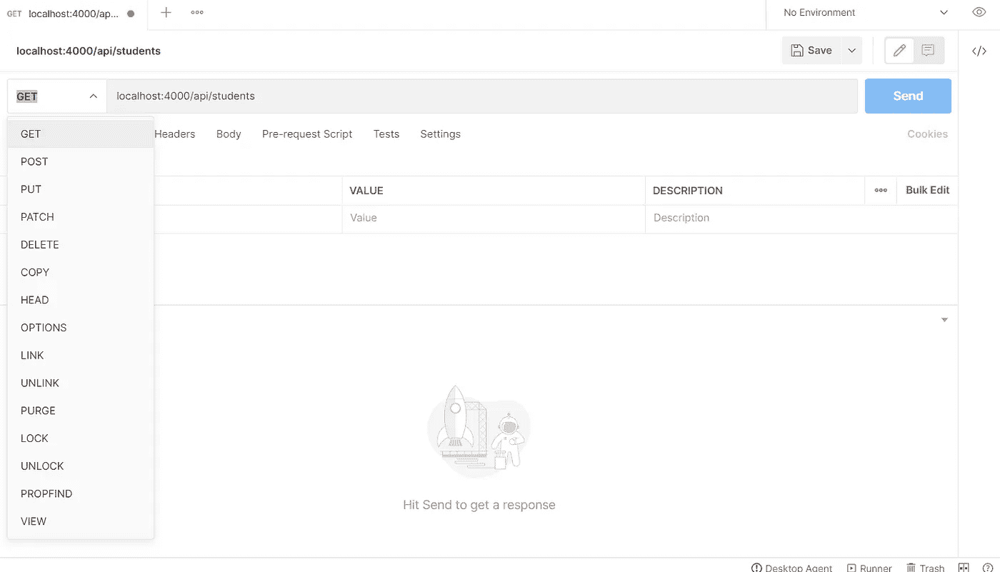
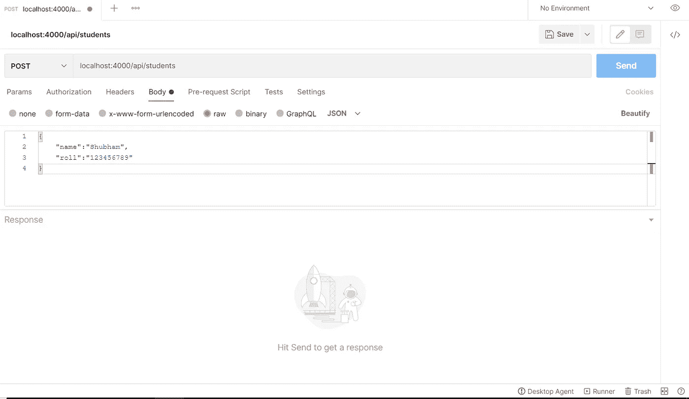

# 用 Node，Express 和 MongoDB 构建一个 REST API

> 原文：<https://towardsdatascience.com/build-a-rest-api-with-node-express-and-mongodb-937ff95f23a5?source=collection_archive---------1----------------------->

## 让我们使用 Node、Express 和 MongoDB 构建一个遵循 CRUD 原则的 REST API，并使用 Postman 测试它。


由 [Unsplash](https://unsplash.com?utm_source=medium&utm_medium=referral) 上 [Greg Rakozy](https://unsplash.com/@grakozy?utm_source=medium&utm_medium=referral) 拍摄的照片

API 现在是很常见的东西。它们在网站上随处可见。API 充当存储所有数据的数据库和用户与之交互以访问数据的前端之间的连接。

**API** 是指**应用编程接口，**是一套明确定义的前端和数据库之间的通信方法。

REST 代表代表性状态转移，是一种架构风格，用于在网络上的计算机系统之间提供标准，使系统之间更容易相互通信。

REST APIs 大多使用 **JSON** 作为传输数据的首选，因为它们易于理解和阅读。

在本教程中，我们将使用 Node、Express 和 MongoDB 来创建一个 REST API，它将支持四个操作— **GET、POST、PUT** 和 **DELETE。**

所以，我们先来讨论这四个操作，并试着理解它们在 API 开发的上下文中意味着什么。

1.  **GET** — GET 表示读取数据。该操作的功能是从数据库中检索数据并呈现给用户。
2.  **POST** — POST，顾名思义，用于向数据库发布/添加新数据。它允许用户向数据库添加新数据。
3.  **上传** —上传意味着更新数据库中已经存在的数据。
4.  **删除** —用于从数据库中删除任何现有数据。

因此，我们的 REST API 将执行所有这四个操作。我们将使用 Express package 来简化我们的工作。我们将使用 MongoDB 作为 NoSQL 数据库来存储我们所有的数据。MongoDB 以 JSON 格式存储数据。

所以，我们会一步一步来。首先，我们将构建 API 端点，然后我们将连接到数据库来执行实际操作。我们将使用 Postman 软件进行 API 测试。

## 设置项目

首先，我们需要在我们的系统上下载 Node。然后我们可以开始创建我们的项目。

因此，首先，我们需要在系统中创建一个文件夹，我们希望在其中构建我们的项目。我将文件夹的名称保留为 *rest-API* 。

然后我们需要移动到我们刚刚创建的 *rest-API* 文件夹中。现在开始一个新项目，我们将在文件夹中运行以下命令:-

```
npm init
```

它会询问有关项目的各种问题，如名称，描述和其他事情。我们希望除了名称和描述之外的所有内容都保持默认模式，我们可以在方便的时候添加名称和描述。

完成后，我们会在文件夹中看到一个 *package.json* 文件。它包含了我们刚刚给出的创建这个文件的所有数据。你可以看到入口点是 *index.js* 文件。

在创建了 *package.json* 文件之后，我们需要在我们的机器上下载 Express。要安装 Express，我们可以:-

```
npm install express --save
```

这将在我们的系统中下载并保存 express，并且将 express 作为一个依赖项添加到我们的 *package.json* 文件中。

我们还想下载一个名为 *nodemon* 的开发依赖项，这将允许我们更快地开发。这将有助于我们避免每次更改时重启服务器，并且会自动刷新，这将节省我们很多时间。

因此，要安装 *nodemon，*我们应该:

```
npm install --save-dev nodemon
```

注意，我们已经使用了 *save-dev* 来安装并将其添加到 *package.json* 文件中作为开发依赖项，因为我们使用它来加速我们的开发过程。

现在，我们需要[将 MongoDB](https://www.mongodb.com/try/download/community) 下载到我们的系统中，然后创建集群并将其连接到您的本地计算机。

接下来，我们必须从我们的 express 应用程序下载*mongose*来与 MongoDB 数据库交互。

要安装*猫鼬*，请执行以下操作:

```
npm install mongoose --save
```

现在，我们准备开始构建我们的 REST API。在开始之前，我想展示一下我的 *package.json* 文件，这样你就可以验证一切进展顺利。

所以，让我们开始构建我们的 REST API。首先，我们需要创建一个名为 *index.js 的文件；正如我们可以看到的，它是我们应用程序的入口点。*

## 索引文件

我们将从 *index.js* 文件开始。我们将首先要求 express 进入我们的系统。

```
const express = require('express');
```

然后，我们将通过编写以下代码行来设置我们的 express 应用程序

```
const app = express();
```

因此，我们将设置一个 GET 函数来使用浏览器测试它。当我们向 *localhost:4000/API* 发出 GET 请求时，我们传递一条消息作为响应。

```
app.get('/api', (req, res) => res.send('Its working!'));
```

然后，我们将设置我们的应用程序开始监听请求。我们将使用 4000 作为端口号。我们在那里使用了 OR 操作符，这样如果有任何通过环境变量定义的端口号，它就可以使用它；不然就用 4000。您可以根据自己的选择选择端口号。我们将 *console.log* 一条消息来检查它是否正常工作。

```
app.listen(process.env.port || 4000, function(){
   console.log('now listening for requests');
});
```

因此，当我们现在使用以下命令启动服务器时:

```
nodemon index
```

当我们转到 *localhost:4000/api，*时，我们会看到消息“*正在工作！”。*同样，在控制台中，我们会收到为控制台设置的消息。

现在，我们已经正确设置了 express 服务器，并且成功发送了第一个 GET 请求。

现在，我们希望将所有四个操作放在一个名为 *api.js* 的单独文件中，该文件位于 *routes* 文件夹下，因为我们希望避免将所有操作都放入 *index.js* 文件中。

因此，我们将删除这个 *index.js* 文件中的 *app.get* 部分。我们想在我们的文件中添加*猫鼬*作为需求。

```
const mongoose = require('mongoose');
```

接下来，在我们的 express 应用程序的设置下面，我们希望连接到 MongoDB。我们将使用以下代码来实现这一点:

```
mongoose.connect('mongodb://localhost/ourdata');
mongoose.Promise = global.Promise;
```

这里， *ourdata* 是我们将在本教程稍后在 MongoDb 中创建的模型的名称。

由于*猫鼬.诺言*现在贬值，我们也将猫鼬的诺言更新为全局诺言。

接下来，我们将在文件中添加一些中间件。我们将首先添加对静态文件的支持。虽然我们不会在本教程中提供静态文件，但拥有它是很好的，因为我们以后无论如何都需要添加一个前端来使用 API。

```
app.use(express.static('public'));
```

然后，我们将添加 Express 解析器来解析从数据库发送或接收的数据。

```
app.use(express.json());
```

然后，我们设置应用程序来使用新的 *api.js* 文件，我们将创建该文件来保存所有四个操作。

```
app.use('/api',require('./routes/api'));
```

我们在开头添加了 *'/api'* ，以避免将其添加到所有四个操作中。

最后，我们添加了一个中间件来处理操作过程中出现的错误。

```
app.use(function(err,req,res,next){
   res.status(422).send({error: err.message});
});
```

以下是 *index.js* 文件的最终代码

## 四个 CRUD 操作的布局

接下来，我们创建一个名为 *router* 的文件夹，并在该文件夹中创建一个名为 *api.js* 的新文件。这将包含我们想要用正在构建的 REST API 完成的所有四个 CRUD 操作。

我们首先在文件中要求 express。然后我们将使用快速路由器创建一个路由器。

```
const express = require('express');
const router = express.Router();
```

所以，让我们开始一个接一个地构建这四个操作。我们不会将任何东西保存到数据库中，因为我们还没有创建数据库，但是我们会更简单地测试它们。

因此，我们将从 **GET** 操作符开始。我们将以这种方式编写 GET 请求的代码:-

```
router.get('/students',function(req,res){
    res.send({type: 'GET'});
};
```

这里，我们给出了一个端点和一个函数，该函数给出一个响应，该响应告诉我们发送的请求的类型。

接下来是 **POST** 请求。这将是一个类似的方式，虽然我们想返回的数据，我们收到的请求。

```
router.post('/students', function(req, res){
    res.send({
        type: 'POST',
        name: req.body.name,
        roll: req.body.roll
    });
});
```

接下来是 **PUT** 和 **DELETE** 请求。现在，我们将返回两个操作的请求类型。它接受带有 *id* 的端点，这表示当我们保存数据到 MongoDB 时 MongoDB 提供的惟一 id。

```
router.put('/students/:id', function(req, res){
    res.send({type: 'PUT'});
});

router.delete('/students/:id', function(req, res){
    res.send({type: 'DELETE'});
});
```

接下来，我们将导出在 *index.js* 文件中使用的模块。

```
module.exports = router;
```

为了测试这些操作，我们将使用一个叫做 Postman 的软件。这很神奇，有助于快速测试 API。

下载 Postman 桌面代理或安装其 Chrome 扩展，开始使用 Postman。邮递员的新工作区如下所示



Postman API 测试

在这里，我们可以选择发送请求的操作类型和目标 URL。对于 POST 请求，我们需要在发送请求的同时发送一些 JSON 数据，这可以通过在 Body 部分添加 JSON 来实现。

您需要选择原始数据类型，然后选择 JSON 作为格式，如下所示:-



邮递员邮件请求

因此，我们可以很容易地通过 Postman 测试所有这些操作。当我们更新数据时，我们还需要在 PUT 请求时提供数据。我们只传递需要更新的数据。

## 构建数据库模式和模型

接下来，我们将创建一个名为 *models* 的文件夹，然后在该文件夹中创建一个 *student.js* 文件。

我们需要在那个文件夹中放入*mongose*,并构建一个模式，然后基于该模式构建一个模型。模式告诉模型如何构造数据。

我们正在建立一个模型，其中包含学生的数据——姓名、他们的点名号码以及他们是否在场。

1.  **名称** —这是字符串数据类型，在模式中不是必填字段。
2.  **Roll** —这也是字符串数据类型，是必填字段。它不能为空。
3.  **呈现** —这是一个布尔型字段，默认为真。

然后，在我们创建的*学生模式*的帮助下，我们创建了名为*学生*的模型。然后，我们导出模型以在 API 文件中使用它。

那么，让我们来看看 student.js 文件:-

## 最终确定 api.js 文件

现在，我们将通过从我们创建的数据库模型中保存和检索数据，使所有四个 API 端点都可用。

因此，我们需要在 API 文件中包含该数据库模型。

```
const Student = require('../models/student');
```

然后，我们从 GET 请求开始。我们会获取数据库中的所有学生，并作为响应发送给他们。您可以为学生添加任何类型的过滤，但是我们将 find 函数保留为空，以便从数据库中访问每个学生。然后我们使用*。catch(next)* 函数帮助捕捉任何错误，并将其传递给下一个中间件——在我们的例子中是错误处理中间件。

```
router.get('/students',function(req,res,next){
    Student.find({}).then(function(students){
        res.send(students);
    }).catch(next);
});
```

接下来，我们要处理 POST 请求。我们在数据库中创建一个新学生，然后返回创建的学生作为响应。

```
router.post('/students',function(req,res,next){
    Student.create(req.body).then(function(student){
        res.send(student);
    }).catch(next);
});
```

接下来，我们有 PUT 请求。我们将使用 *findOneAndUpdate* 函数，使用我们在 URL 端点中传递的 id 在数据库中查找相应的条目。然后，我们在 Id 的帮助下找到同一个学生，并返回更新后的学生作为响应。

```
router.put('/students/:id',function(req,res,next){
    Student.findOneAndUpdate({_id: req.params.id},req.body).then(function(student){
        Student.findOne({_id: req.params.id}).then(function(student){
            res.send(student);
        });
    });
});
```

最后，我们有删除请求。我们使用函数 *findOneAndDelete* 通过提供的 id 在数据库中找到相应的学生，并从数据库中删除该学生。它还返回被删除的学生作为响应。

```
router.delete('/students/:id',function(req,res,next){
    Student.findOneAndDelete({_id: req.params.id}).then(function(student){
        res.send(student);
    });
});
```

我们可以使用 Postman 软件非常容易地测试所有这些。在测试中，一切都应该很好，我们已经做得很好，很干净。

下面是 *api.js* 文件的最终代码:-

最后，我们创建了 REST API，它执行所有四个 CRUD 操作。因此，如你所见，在 Node、Express 和 MongoDB 的帮助下，构建 REST API 非常容易。

希望你觉得这个教程很有趣，并且学到了一些新东西。

这里还有一些值得一读的教程:

</build-a-blog-website-using-django-rest-framework-overview-part-1-1f847d53753f>  <https://javascript.plainenglish.io/build-a-blog-app-with-react-intro-and-set-up-part-1-ddf5c674d25b>  <https://shubhamstudent5.medium.com/build-an-e-commerce-website-with-mern-stack-part-1-setting-up-the-project-eecd710e2696>  <https://medium.com/javascript-in-plain-english/build-a-simple-todo-app-using-react-a492adc9c8a4> 