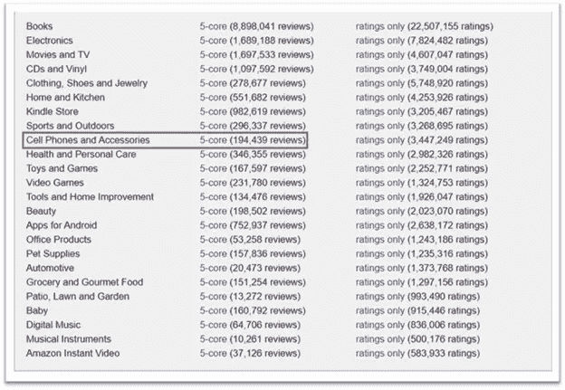
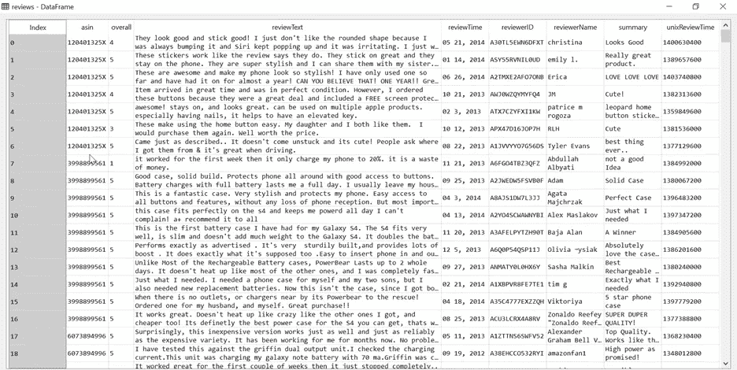
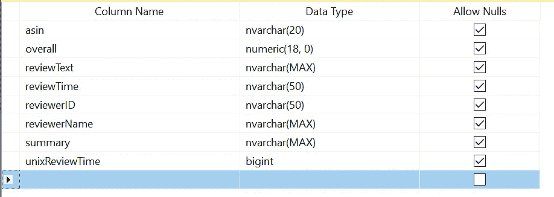
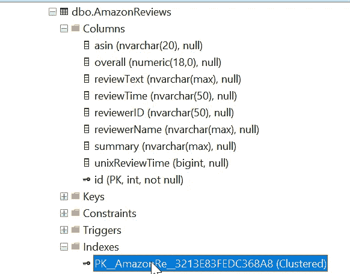
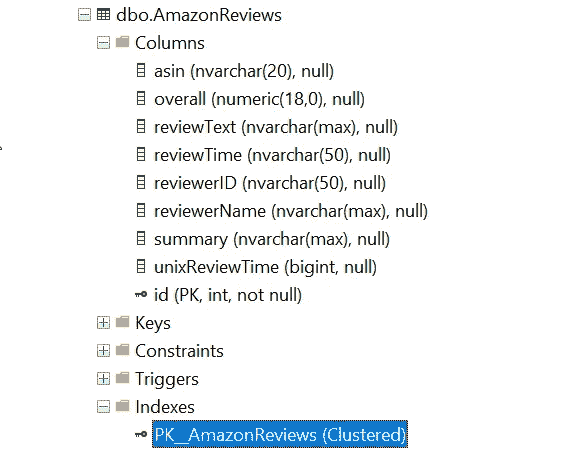
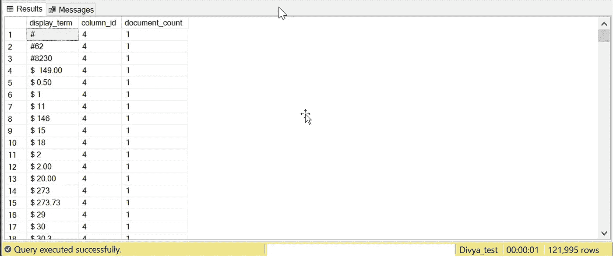
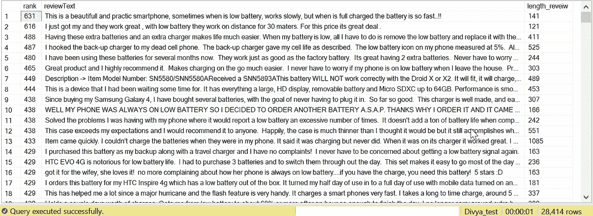
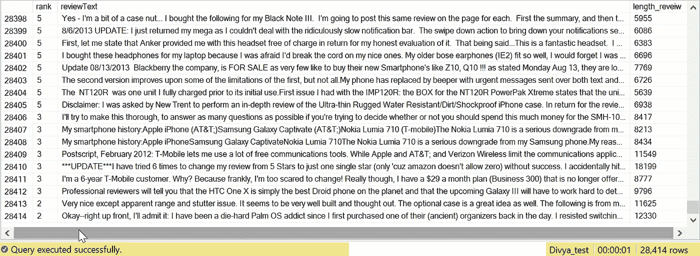
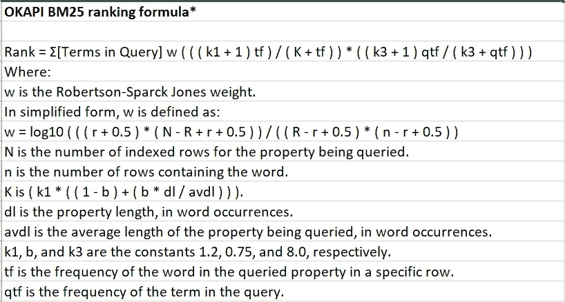

# 用 SQL 构建搜索引擎

> 原文：<https://towardsdatascience.com/build-a-search-engine-with-sql-cc8baf06ddb2?source=collection_archive---------15----------------------->

## 使用全文搜索

在 [Unsplash](https://unsplash.com/s/photos/searching?utm_source=unsplash&utm_medium=referral&utm_content=creditCopyText) 上 [Marten Newhall](https://unsplash.com/@laughayette?utm_source=unsplash&utm_medium=referral&utm_content=creditCopyText) 拍摄的照片

如果您使用 SQL 来执行文本搜索，您可能会使用类似于的**命令。但是 like 命令的限制是它寻找精确的匹配。幸运的是，SQL 提供了一个特性——SQL 全文索引——可以对任何包含原始文本的列进行模糊文本搜索。这是上帝为 NLP 项目派来的。**

我是 python 提供的 NLP 库——scikit learn 和 spaCy 的忠实粉丝。

但是在进入文本处理的深水区之前，最好先尝试一下 SQL 的全文索引。

在本文中，我们将了解如何使用 MS SQL 的文本搜索功能来执行弹性搜索。是的，完全成熟的弹性搜索。

# 资料组

我们将使用亚马逊点评数据集，网址为:

  

让我们专注于一个产品类别

作者捕获的屏幕截图

把下载的 json 导入 python，看一下数据。

作者捕获的屏幕截图

将数据推入 SQL

作者捕获的屏幕截图

## 设置全文搜索功能

先做点家务。

在 SQL 中，检查 SQL Server 中是否安装了全文功能

如果尚未安装，请使用以下链接进行安装。

<https://www.sqlshack.com/hands-full-text-search-sql-server/>  

检查它是否已启用。

在 AmazonReviews 表上创建全文目录。

可以把这里想象成索引将要被填充的地方..

人口…这是什么意思..？

我们很快就会知道…

现在，看看 AmazonReviews 表的主键。

嗯（表示踌躇等）..

该表将 ID 作为主键。

在索引中，它被命名为 PK_AmazonRe_3212…

为了方便以后访问，我们将其重命名。

表的主键

看上去好多了。

现在，我们一直在等待的部分…

填充，即填充全文索引。这使我们能够对评论文本执行超快速搜索。

让我们来看看全文的**内容。**

《金融时报》索引的内容

这就是我们所说的填充索引。

Its 有 121995 个条目。它记录了哪个术语在哪个列中出现了多少次。

就像我们在 scikit learn 中创建的计数矢量器中的词汇表一样。

最后，让**对 reviewText 列执行搜索操作**。

你瞧…！

精确匹配排名更高

28000 行匹配结果。

让我们进一步探索…

比赛的低端

排名较高的行包含与搜索词“低电量”完全匹配的内容。而相反，排名较低的行包含部分匹配，如仅单词“低”或仅单词“电池”。

此外，请注意，当我们滚动浏览结果时，评论的长度会增加。

## 排名是如何运作的？

在这一点上，理解行是如何排列的是很有趣的。

它的排名基于 OKAPI BM 公式。

完整的公式是:

公式来自:[https://docs . Microsoft . com/en-us/SQL/relational-databases/search/limit-search-results-with-rank？view=sql-server-ver15](https://docs.microsoft.com/en-us/sql/relational-databases/search/limit-search-results-with-rank?view=sql-server-ver15)

但实际上归结为以下因素:

查询中的字数

数据库中匹配查询词的行数

以 DB 为单位的行的平均长度

词的频率(DB)

查询中的词频

这解释了为什么具有 12330 个字符的匹配行具有最低的等级分数，而具有 141 个字符的匹配行具有最高的等级分数。

并且使用 SQL 中的全文搜索可以快速、轻松地执行弹性搜索。这种执行模糊搜索并对结果进行排序的能力构成了任何搜索引擎的核心。这个特性最好的部分是索引可以被设置为在基本数据更新时自动更新。

除了使用它的搜索功能之外，我个人在许多 NLP 项目的开始使用了全文索引。例如，浏览索引和术语计数让我对特定领域的停用词有所了解。滚动索引并查看拼写错误的单词或错别字，给了我需要执行的文本清理步骤的线索。

谢谢你能走到这一步。我会写更多这样的帖子。让我知道你对这篇文章的看法，以及你希望通过在 [LinkedIn](https://www.linkedin.com/in/divya-choudharyiisc/) 上给我发消息来了解的其他话题。以后的帖子，请关注我的[媒体](https://learnwithdivya.medium.com/)。