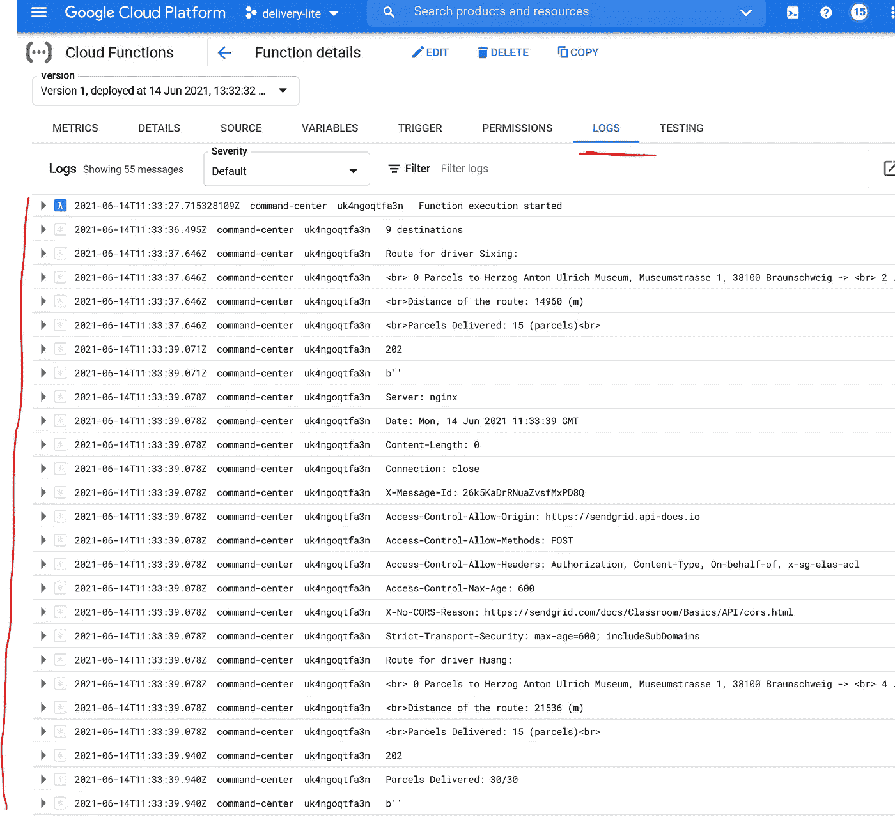

# 在 GCP 建立一个无服务器的交付指挥中心

> 原文：<https://towardsdatascience.com/build-a-serverless-parcel-delivery-command-center-on-gcp-7c2df99b3db1?source=collection_archive---------39----------------------->

## 结合地图，或工具，发送网格和云功能来征用一个送货车队

> 本文展示了如何:
> 
> 1.在 GCP 建立一个云存储，当文件上传时触发云功能；
> 
> 2.用谷歌地图和谷歌 OR-Tools 设置一个计算最优路线策略的云功能；
> 
> 3.通过 SendGrid 向承运人发送说明电子邮件；
> 
> 4.为持续部署设置云构建。

令人惊讶的是，仅仅通过几项服务就可以在云上构建许多现代商业解决方案。开发人员可以将云组件结合起来，构建一个从数据接收到通过电子邮件发送结果的管道，只需点击几下鼠标。价格很灵活。硬件配置最少，尤其是使用无服务器选项时。因此，小型企业现在可以负担起大量的计算能力。计算能力的民主化使许多传统企业迅速现代化。其中之一一定是送货服务。


图一。Joshua Fernandez 在 [Unsplash](https://unsplash.com/s/photos/delivery?utm_source=unsplash&utm_medium=referral&utm_content=creditCopyText) 上的照片

我在 Medium 上看到了两篇文章:一篇是由 [Sebastian Telsemeyer](https://dsdx.medium.com/) 写的，关于用 Cloud Run 和 Pub/Sub 在 GCP 建立一个时间序列预测管道；

</building-a-serverless-containerized-batch-prediction-model-using-google-cloud-run-and-terraform-82c97ab17515>  

第二个是由 Samir Saci 提出的，他使用 Goolge OR-Tools 来优化最后一英里的交付(然而[解决方案](https://developers.google.com/optimization/routing/cvrp)是由 Goolge 在 2020 年首先提出的):

</optimize-e-commerce-last-mile-delivery-with-python-ab9ba37d214c>  

塞巴斯蒂安的文章鼓舞人心。在他的管道中，一个 Pub/Sub 监控一个特定的 GCP 桶。上传 TSV 文件时，它会激活云运行计算，在第二个存储桶中生成结果。他的整个基础设施是无服务器的，并且是用 Terraform 编码的。在我看来，他的管道甚至可以更简单:一个`Finalise/Create`事件触发的云函数，可以代替“Pub/Sub + Cloud Run”组合。更简单的版本需要更少的设置。因为云函数基本上是一个 Lambda 函数，所以它摆脱了整个 Docker 部分和 Gunicorn + Flask 依赖关系。

Samir 的文章展示了一个复杂的*有容量限制的车辆路线* *问题* (CVRP)如何通过 Google OR-Tools 解决。让我们假设有 30 个包裹需要由两个承运人从德国布伦瑞克的一个物流中心分发到九个不同的地方。每个承运人最多可以承运 15 个包裹。然后，Google OR-Tools 会尝试以最低的成本规划路线，同时平衡每个承运人的负载和距离。示例输出如下所示:

```
Hello Driver A, your delivery route is: 
 bring 2 Parcels to Institute of System Security, Muehlenpfordtstrasse 23, 38106 Braunschweig -> 
 bring 2 Parcels to Am Schuetzenpl. 1, 38114 Braunschweig -> 
 bring 3 Parcels to Humboldtstrasse 1, 38106 Braunschweig -> 
 bring 2 Parcels to Johanniterstrasse 5, 38104 Braunschweig -> 
 bring 6 Parcels to Willy-Brandt-Platz 1, 38102 Braunschweig ->
```

OR 工具将十个位置的距离矩阵作为输入之一。在谷歌的原始帖子和萨米尔的文章中，距离矩阵是虚构位置的硬编码虚拟物，路线指示只是以文本形式打印出来。在真实的配送指挥中心，我们需要根据真实地址计算距离矩阵(见我之前的文章[此处](https://medium.com/geekculture/get-geo-data-from-google-cloud-for-your-next-new-home-f0a02c185d5f))并通知承运人他们的路线。


图二。GCP 交付精简版架构。由[onlinewebfonts.com](http://www.onlinewebfonts.com/icon)承运图标，由 CC 3.0 授权。图片作者。

带着这些想法，站在 Sebastian 和 Samir 的肩膀上，我接受了挑战，并在 GCP 实施了一个简单的解决方案。云存储中的上传事件可以触发云函数通过 Google Maps API 构建距离矩阵。或工具然后计算路线。最后，它通过 SendGrid 将路线指示发送给运营商(图 2。).作为奖励，我设置了云构建来持续部署应用程序。这个项目的代码存放在我的 Github 库中。

<https://github.com/dgg32/gcp-delivery-lite>  

# 1.准备输入 Json 数据

输入的 Json 数据包含两部分。第一部分包含所有位置的地址和包裹数量。第一个位置总是承运人装载包裹的物流中心。第二部分是承运人的信息，包括他们的姓名、能力和电子邮件地址。下面是我的 input.json 的缩略版。

# 2.设置发送网格

我们希望通过云功能向运营商发送说明电子邮件。Goolge 建议我们使用可信的第三方提供商，比如 SendGrid。SendGrid 中的免费计划允许每天 100 封邮件永远免费，这对我们的项目来说足够了。


图 3。发送网格 API 设置。图片作者。


图 4。通过整合测试。图片作者。

首先，用免费计划在 [SendGrid](https://sendgrid.com/) 中注册一个账户。然后创建一个发送者身份。这是电子邮件中的“发件人”地址。之后，SendGrid 会向您发送一封电子邮件。在发送电子邮件之前，您需要验证您的单一发件人是否遵循其说明。

然后导航到用户仪表盘，点击打开`Email API`和`Integration Guide`。选择`Web API`和`Python`。然后创建一个 API 键(图 3。)并遵循测试说明，直到您通过集成测试(图 4。).将单个发件人的电子邮件和 API 密钥保存在安全的地方，以备后用。

# 3.建立 GCP

在你的 GCP 控制台上创建一个名为`delivery-lite`的项目。启用`Distance Matrix API`并为其创建一个限制性 API 密钥。这个过程涉及到许多点击，你可以在这里阅读我以前的文章[获得指导。](https://medium.com/geekculture/get-geo-data-from-google-cloud-for-your-next-new-home-f0a02c185d5f)

然后转到`Cloud Function`并创建一个函数`command-center`，选择`Cloud Storage`作为触发类型，选择`Finalize/Create`作为事件。单击“浏览”并创建一个存储桶。点击`SAVE`。


图 5。云功能配置。图片作者。

展开`RUNTIME`设置，添加四个环境变量:

1.  `KEY`是你的距离矩阵 API 键。
2.  `SENDGRID_API_KEY`是您的 SendGrid API 密钥。
3.  `SENDER`是您的单一发件人电子邮件地址。
4.  `PROJECT`是项目名称，在本例中是`delivery-lite`。

然后可以点击`NEXT`按钮进入`Code`页面。启用`Cloud Build API`，并按照警告横幅中的说明创建凭证。完成后，返回到`Code`页面。选择`Python 3.9`作为运行时，输入`main`作为进入点。

在内嵌编辑器中创建一个名为`function.py`的文件。将我的存储库中的内容复制并粘贴到相应的文件中(图。6).或者你可以压缩并上传我的三个文件。按下`DEPLOY`按钮，等待功能就绪。


图 6。定义云函数。图片作者。

`function.py`包含三个辅助功能。前两个用于通过 Maps API 计算地点列表的距离矩阵。第三个通过 SendGrid 发送电子邮件。

`main.py`利用了`function.py`。在第 12 行收到距离矩阵后，脚本将它与运营商信息打包在一起，最后在第 29 行调用 OR-Tools。如果找到了至少一个解决方案，脚本将制定路线指令，并通过第 46 行的 SendGrid 分别发送给每个承运人。在此，我感谢 Samir 和 Google 团队提供的 OR-Tools 代码示例。

# 4.测试管道

设置好一切之后，我们现在可以测试管道了。下面是`input_test.json`文件。修改`carrier`列表中的信息，特别是在`email`字段中输入有效的电子邮件地址，以便接收输出指令。打开云存储页面的一个新选项卡，找到指定的存储桶。将`input_test.json`文件上传到 bucket 中(图 7。).这应该会触发我们的云功能运行。


图 7。将输入数据上传到指定的桶中。图片作者。

如果一切顺利，您可以在云功能页面的`LOGS`中看到新的日志条目。它们是脚本的标准输出(图 8。).



图 8。成功执行管道的日志。图片作者。

你可以查看你的运营商的电子邮件。一封包含路由说明的新电子邮件应该很快就会到达(图 9。).


图 9。带有路线说明的电子邮件。图片作者。

# 5.为持续部署设置云构建

使用云构建建立一个连续部署(CD)管道是非常容易的，这样新的修改就可以被自动和立即地部署。首先，建立一个 Github 存储库，并用这三个文件初始化它。或者你可以直接转到我的知识库。你还需要[先启用](https://medium.com/ci-t/how-to-set-up-a-deployment-pipeline-on-gcp-with-cloud-build-and-cloud-functions-88ef485728f9)`[Cloud Resource Manager](https://medium.com/ci-t/how-to-set-up-a-deployment-pipeline-on-gcp-with-cloud-build-and-cloud-functions-88ef485728f9)`[API](https://medium.com/ci-t/how-to-set-up-a-deployment-pipeline-on-gcp-with-cloud-build-and-cloud-functions-88ef485728f9)。


图 10。云构建触发器设置。图片作者。

接下来，导航到`Cloud Build`页面。创建一个名为`CICD-delivery`的触发器。选择你的 Github 库和`Source`的`^master$`分支(你需要按照 GCP 的指示连接你的 Github 库)。选择`Cloud Build configuration file (YAML or JSON)`，点击`CREATE`。最后，在 Settings 选项卡中，启用`Cloud Functions Developer`角色。

然后，确保文件`cloudbuild.yaml`位于您的存储库的顶层，并且包含以下内容:

该文件指示 Cloud Build 使用正确的区域、存储桶触发器和运行时来部署应用程序。从现在开始，每当你向存储库推送新的变更时，GCP 将自动构建管道并将其部署为云功能。

# 结论

成功！现在，我们有了一个简单的管道，作为递送业务的神经中枢。手动调度已经成为过去。每当您将新订单或新承运商的新 Json 文件上传到桶中时，云功能将自动计算最佳路线，并通知登记的承运商他们的指令。并且只有在运行时才会产生成本。此外，CD 管道确保您的更改可以自动部署。

承认，这个设计是我的指挥中心理念的一个基本实现。您可以在其中构建更多组件，使其更加强大。例如，一旦用完可用层配额，距离矩阵的成本可能会失控。如果我们能够将成对距离存储在数据库中，那就太好了。此外，我们可以将运营商放入一个池中，以便更好地管理他们的个人数据。

即使有了所有这些扩展，管道仍然只是一个大型现实世界优化问题的简单抽象。OR 工具假设所有的订单都是已知的，并且在路线开始之前所有的承运人都已经在物流中心等待。在现实世界中，订单源源不断，承运人无处不在。但我认为，这些违规行为只会对结果产生轻微影响，管道仍然可以保持畅通。此外，距离有时并不是成本计算的最佳替代。幸运的是，距离矩阵 API 也返回两个地方之间的行驶时间，值得进行一些测试，看看哪个度量更好。

此外，我可以想象我们可以从这条管道中创造出非常不同的东西。因为谷歌或-Tools 可以计算其他类型问题的解决方案，我们可以将管道转化为汽车共享指挥中心、公交路线设计师、班次规划服务甚至饮食计算器。

因此，现在是时候让你在这条管道上进一步构建一些东西，并向我展示你的想法。

<https://dgg32.medium.com/membership> 