# 使用亚马逊 S3 和 Route 53 建立一个无服务器网站

> 原文：<https://towardsdatascience.com/build-a-serverless-website-using-amazon-s3-and-route-53-c741fae6ef8d?source=collection_archive---------11----------------------->

## 如何在 15 分钟内托管一个可扩展的网站


图片来自 Unsplash 上的[迭戈·希门尼斯](https://unsplash.com/@diegojimenez)。

# 目录

1.  介绍
2.  在亚马逊 S3 主持一个网站
3.  将自定义域与 Amazon Route 53 相关联
4.  在线主持个人作品集
5.  结论
6.  参考

# 介绍

你有没有想过建立自己的网站？也许是为了展示你的工作、你的业务，或者只是一种在线展示的方式？

对于大多数应用程序来说，网站可以只用客户端代码运行，并且只由 HTML、CSS 和 JavaScript 组成。这类网站通常被定义为静态网站。由于没有运行或维护服务器端代码，使用传统的 web 服务器毫无意义。

Amazon Web Services (AWS)为托管静态或动态网站提供了多种选择。对于静态内容，最简单和最实惠的选择是亚马逊简单存储服务(S3)。

在这篇文章中，我们将介绍如何创建一个 S3 桶，并为虚拟主机设置它，将 S3 端点指向一个自定义域，并创建一个简单的投资组合网站。

# 在亚马逊 S3 主持一个网站

*‘亚马逊简单存储服务(亚马逊 S3)是互联网存储。它旨在使网络规模的计算更容易。亚马逊 S3 有一个简单的网络服务界面，你可以用它在任何时间从网络上的任何地方存储和检索任何数量的数据*。*’*

亚马逊的上述声明总结了 S3 的目的:提供一个简单的接口，以高度可扩展和可靠的方式存储和检索数据。不仅如此，将数据存储在亚马逊 S3 是一个可行且负担得起的解决方案。

这些关键优势加上不需要网络服务器，使得亚马逊 S3 成为静态虚拟主机的理想服务。让我们潜入亚马逊 S3，托管我们的第一个网站。

## 为虚拟主机创建和配置 S3

第一步是创建一个 S3 桶来存储我们的网站文件。为此，请导航至 S3 界面，然后单击“创建时段”。

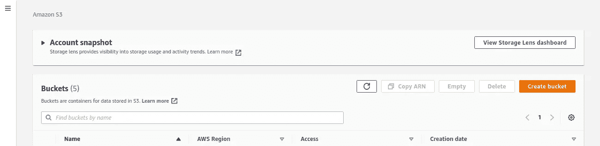

S3 接口。图片由作者提供。

在“常规配置”部分，将“存储桶名称”定义为“投资组合”。#DOMAIN_NAME# '。这将是你的投资组合的主页链接。将#DOMAIN_NAME#替换为您拥有的域名。如果您没有域和/或不想创建域(查看下一节如何注册域),这可以是 rfc3986 中允许的任何字符序列。

在下一部分中，取消选中“阻止所有公共访问”。这将允许用户检索存储在 S3 存储桶中的静态页面。

选中警告框“关闭阻止所有公共访问可能会导致此存储桶和其中的对象成为公共的”，然后单击“创建存储桶”。

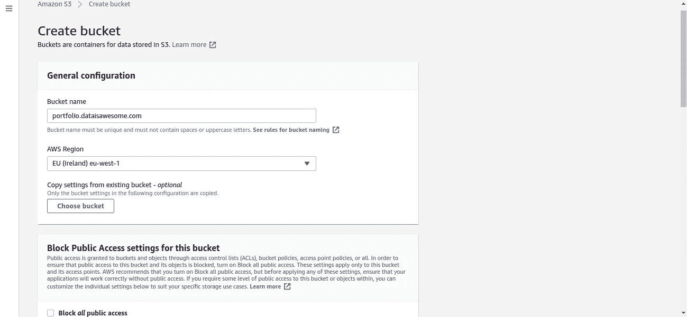

在 S3 创建一个新的存储桶。图片由作者提供。

单击您刚刚创建的存储桶名称，然后转到“属性”。向下滚动并点击“静态虚拟主机”部分的“编辑”按钮。

在此窗口中:

1.  在“静态网站托管”中选择“启用”
2.  在“托管类型”部分保留默认的“托管静态网站”
3.  在“索引文档”中键入“index.html”
4.  单击保存更改

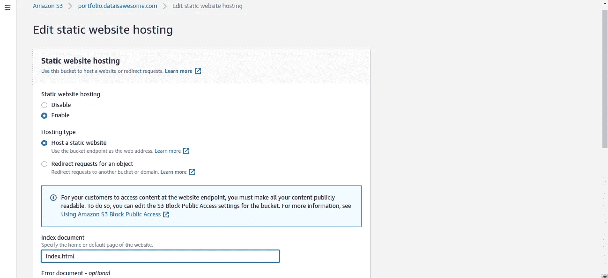

改变 S3 桶到静态网站托管。图片由作者提供。

转到“权限”部分，向下滚动并单击“存储桶策略”部分中的“编辑”按钮。在文本框中，键入以下策略，然后单击“保存更改”。

```
{
    "Version": "2008-10-17",
    "Statement": [
        {
            "Sid": "AllowPublicRead",
            "Effect": "Allow",
            "Principal": {
                "AWS": "*"
            },
            "Action": "s3:GetObject",
            "Resource": "arn:aws:s3:::portfolio.#DOMAIN_NAME#/*"
        }
    ]
}
```

您的存储桶策略应该是这样的。

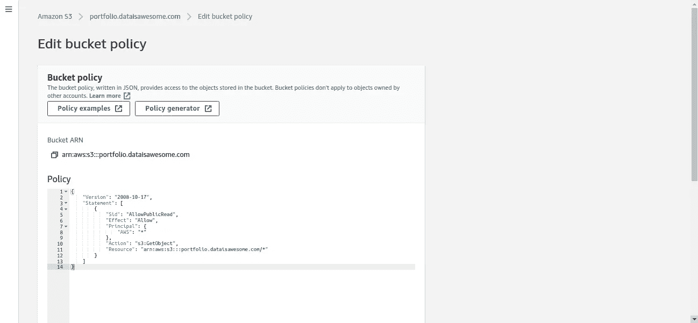

添加 S3 策略以允许公共读取访问 S3 存储桶。图片由作者提供。

## 上传数据并测试网站端点

仍然在您创建的 S3 存储区中，移动到“对象”部分，上传一个名为“index.html”的新文件，其内容如下:

```
<html>
  Hello World!
</html>
```

您可以用任何文本编辑器创建这个文件。请确保将其命名为“index.html”。您的 S3 桶现在应该看起来像这样。

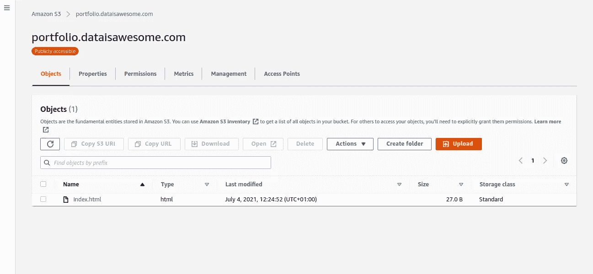

为静态虚拟主机配置的 S3 桶包括一个样本 index.html。图片由作者提供。

我们可以通过打开以下链接来测试网站是否工作:
http://portfolio。# DOMAIN # . S3-website-eu-west-1 . Amazon AWS . com

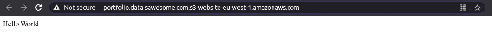

测试新创建的静态虚拟主机。“Hello World”消息表明“index.html”文件已成功检索。图片由作者提供。

好吧！我们刚刚创建了一个工作网站。我们缺少的是这个端点和一个自定义域之间的链接。

如果您有自己的域，或者现在想使用 Route 53 创建一个域，请转到下一部分，将我们新创建的端点链接到该域。否则，转到“在线托管个人投资组合”部分，创建您的第一个投资组合网站。

# 将自定义域与 Amazon Route 53 相关联

Amazon Route 53 是一个高度可用和可扩展的云域名系统(DNS)service⁴.Amazon Route 53 可用于将自定义域路由到任何 AWS 服务(如 S3 端点)。推荐使用该服务，因为它可以轻松地与许多 AWS 服务(如 S3、CloudFront 或 EC2)集成。

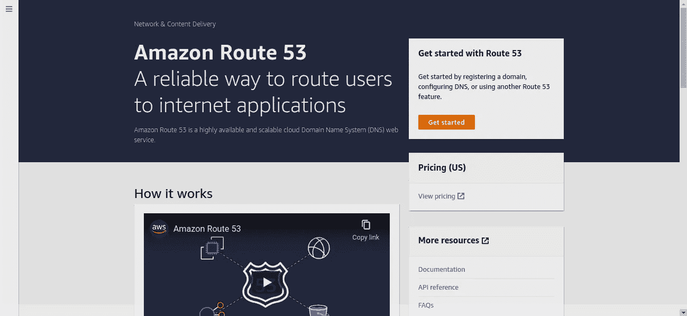

亚马逊路线 53 [主页](https://console.aws.amazon.com/route53/v2/home#Home)。图片由作者提供。

虽然您可以通过多个提供商注册一个域，但 Amazon Route 53 也提供了一种注册自定义域的简单方法。使用 53 号公路简化了从注册域名到托管网站的整个过程。

## 向 Route 53 注册自定义域

要注册域名，请导航至 [Route 53 主页](https://console.aws.amazon.com/route53/v2/home#Home)，然后点击“开始”。点击“注册一个域”，键入您想要注册的域，如果可用，将其添加到购物车。最后，添加如下所示的详细信息，并完成注册过程。


亚马逊 53 路的域名注册页面。图片由作者提供。

当您使用 Route 53 注册一个域时，AWS 会自动为该域创建一个“托管区域”,并在域注册年费之外对托管区域收取少量月费。

如果您决定不使用 Route 53，您可以在注册域名的 12 小时内删除托管区域，并且不会为此向您收费。在本教程中，我们将假设您将使用 Route 53 来处理端点和您的域之间的路由。

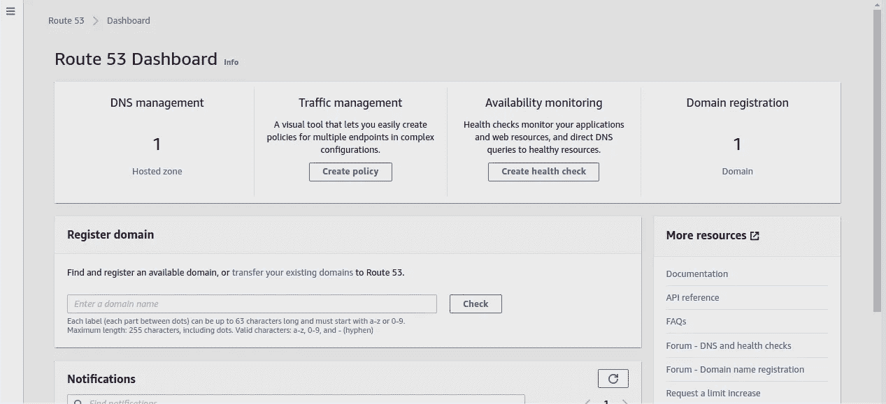

自定义域注册后的 Route 53 接口示例。图片由作者提供。

## 将自定义域与 S3 端点相关联

要链接之前创建的 S3 端点，请点击 [Route 53 主页](https://console.aws.amazon.com/route53/v2/home#Dashboard)中的“托管区域”，然后点击您的域，最后点击“创建记录”。

在这个新窗口中，在“记录名称”中键入“投资组合”,并按如下方式匹配其余字段。确保自动识别的 S3 存储桶与我们刚刚创建的存储桶相匹配。最后，点击“创建记录”。

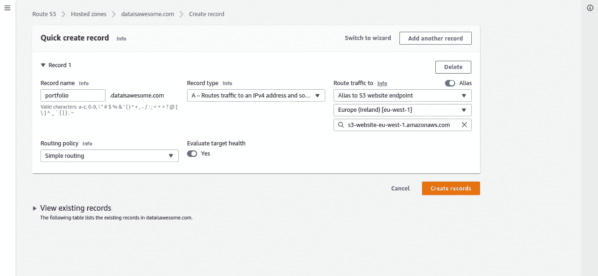

创建 Route 53 记录以将 S3 web 宿主端点链接到自定义域。图片由作者提供。

现在让我们来测试我们的定制域的投资组合。#域# '

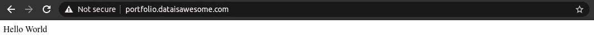

测试到 S3 web 宿主端点的自定义域链接。“Hello World”消息表明“index.html”文件已成功检索。图片由作者提供。

很好。我们设法创建了一个功能齐全的网站托管在 S3，并链接到我们的自定义域。现在，你只需要将你的内容添加到 S3，它将在你的网站上随时可用。

# 在线主持个人作品集

为了完整起见，让我们下载一个引导文件夹模板，并将其添加到我们的网站。

要做到这一点，去 https://startbootstrap.com/theme 的[下载他们免费的自由职业者模板(或者任何你喜欢的模板)。](https://startbootstrap.com/theme)

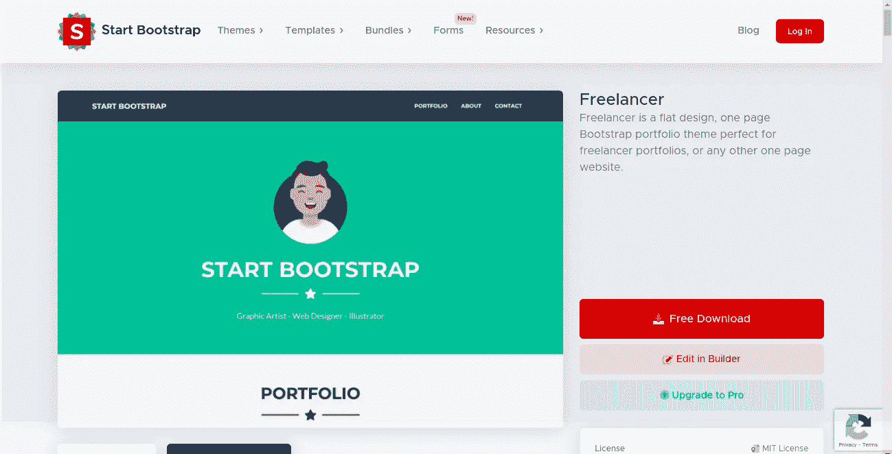

[Start Bootstrap](https://startbootstrap.com/theme) 免费提供的作品集模板快照。

在本地提取 zip 文件的内容，并将文件拖放到您创建的 S3 存储桶中。

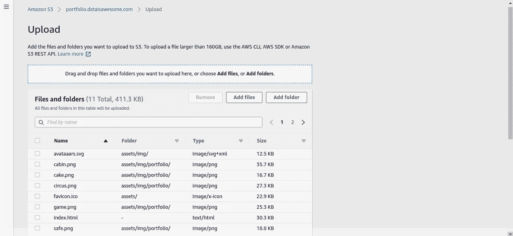

S3 上传界面。图片由作者提供。

最后刷新你的网站，你的新作品集应该会出现。

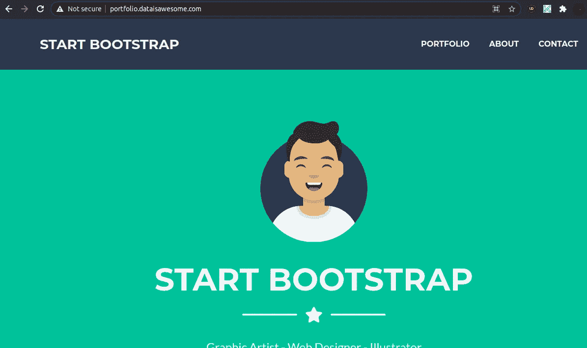

在新创建的 web 服务中运行的项目组合模板。图片由作者提供。

# 结论

托管一个静态网站从来没有这么容易。

亚马逊 S3 提供了一个简单的界面，以灵活、可扩展、快速和廉价的方式存储和检索大量数据。

同时，Route 53 简化了定制域的创建和路由，并且非常容易与 S3 和其他 AWS 服务集成。

似乎这还不够，AWS 为前 12 个 months⁵.使用 S3 的新用户提供了一个免费层因此，如果你的网站低于 5GB，你只需支付域名注册和托管区。

# 参考

[1]亚马逊团队。"*什么是亚马逊 S3？*
[https://docs . AWS . Amazon . com/Amazon S3/latest/user guide/welcome . html](https://docs.aws.amazon.com/AmazonS3/latest/userguide/Welcome.html)

[2] T. Berners-Lee 等.*统一资源标识符(URI):通用语法*(2005)
[https://www.ietf.org/rfc/rfc3986.txt](https://www.ietf.org/rfc/rfc3986.txt)

[3]亚马逊团队。"*设置网站访问权限*"
[https://docs . AWS . Amazon . com/Amazon S3/latest/user guide/websiteaccesspermissionsreqd . html](https://docs.aws.amazon.com/AmazonS3/latest/userguide/WebsiteAccessPermissionsReqd.html)

[4]亚马逊团队。*亚马逊路线 53*
[https://aws.amazon.com/route53/](https://aws.amazon.com/route53/)

[5]亚马逊团队。" *AWS 自由层【https://aws.amazon.com/free/?all-free-tier】"*