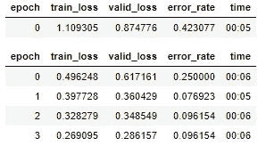

# 构建一个简单的 Web 应用程序来分类 50 美元和 100 美元的钞票

> 原文：<https://towardsdatascience.com/build-a-simple-web-app-to-classify-us-50-dollar-100-dollar-bills-d4ef8298ae6?source=collection_archive---------34----------------------->

## 使用 Jupyter 笔记本从模型到生产

“作者提供的图像”

你有一张 50 美元或 100 美元的钞票，关于这张钞票的一些事情引起了关注，你想检查这张钞票是不是假钞，如果你有一个应用程序，可以上传钞票的照片并立即得到结果，这不是很方便吗？如果你能为自己造一个呢？你可能会说，既然市场上已经有很多其他选择，为什么还会有人开发这样一款应用。好了，这就把我们带到了人工智能和深度学习的话题上。这篇文章不是关于一个应用程序或想法是否是原创的，而是关于如何使用 [fastai](https://www.fast.ai/) 深度学习库和 voila 创建有用的模型并将其部署在网络上。在这篇文章中，我将分享我是如何建立我自己的美国钞票分类器的，通过遵循说明，你也许可以建立一个甚至更好的分类器，或者赋予你独特的想法以生命。话虽如此，我将要提供的代码和指令可能适用于类似的问题，然而，相同的代码和技术并不适合所有的解决方案。

## 深度学习模型

在这个 50 美元和 100 美元分类模型的背景下，该模型将分类或预测图像是 50 美元还是 100 美元的钞票，就像我们人类可以用我们的视觉区分或识别物体一样。例如，一个孩子看到一只鸟向窗外望去，可以立即认出羽毛、喙以及与标签“鸟”相关的特征。孩子以前见过鸟，两个重要的方面来自孩子对鸟的识别或辨认机制:1)鸟的特征，如羽毛、喙、翅膀、形状、颜色等。以及 2)与那些特征相关联的**标签**“鸟”。类似地，该模型以带有标签的图像形式提供数据——“50 美元”或“100 美元”，然后学习这些图像的特征，例如边缘、颜色、梯度等。一旦模型已经从数据中学习，当呈现学习数据中不包括的图像时，它仍然可以识别对象！假设我们为模型提供每种类型的 100 张图片，总共 200 张带有标签的图片。然后我们可以要求模型(以编码的形式提供参数)取每种类型的 80 幅图像(标签)来学习特征(每种类型的 80 幅图像，总共 160 幅图像被称为**训练数据**)，并留出模型没有看到的其余图像(未看到的图像组被称为**验证集**)。验证集用于检查模型已经学习了多少。如何检验模型是否准确？有一些方法可以用来验证模型的口径。我们将继续研究这些方法。使用标签区分图像的过程称为分类。深度学习是基于人脑功能的人工智能的一个子集。我们的大脑中有数十亿个神经元，它们相互发送信号和信息，让我们能够理解周围的环境。深度学习模型利用数据来检测物体、语音、语言，并在没有人类监督的情况下做出决策。

图 1:神经网络的演示(“作者图片”)

对于我们的模型，我们将使用 CNN 或卷积神经网络。简而言之，神经网络由分层包装在一起的人工神经元组成。每一层都由许多神经元组成，这些神经元将图像分解成非常小的部分并寻找模式，这些神经元中的每一个都与下一层中的所有神经元相连，以便它们可以传递它们获得的信息。一层一层地，神经元将所有的碎片放在一起，创建一个有意义的图像(见上面的图 1)。CNN 应用于图像分类问题，好消息是你不必创建任何算法，计算机会为你做所有的计算！

我试图提供这些概念的 10，000 英尺水平的视图，要真正掌握对这些概念的全面理解，我建议您探索大量可用的在线资源和书籍。我可以推荐访问: [Fast.ai](https://www.fast.ai/) 这是目前最好的深度学习免费课程之一。虽然该课程是针对那些已经有一些编码经验的人，但它也是新手获得全面理解的一个很好的课程。

## 功能和限制

我们将要创建的这个模型将是一个很好的练习，可以帮助我们理解这项技术的一些功能和局限性。如前所述，我们将应用 CNN 模型来对 50 美元和 100 美元钞票进行分类，这将需要具有标签的图像形式的数据。模型的效力在很大程度上取决于我们提供的数据。一张钞票有许多复杂的细节，如全息图和只有在紫外光下才可见的特征。这意味着您要么必须拍摄将这些要素纳入视野的照片，要么找到包含这些类型图像的数据集。我没有使用过这样的图片，我将提供我如何创建模型并在网上部署它的说明。但是你已经可以猜到有很多机会让你调整和改进模型，也可以估计一些与这项技术相关的挑战和限制。过多或过少的数据是另一个约束，称为过度拟合，会导致模型效率低下。那么，当您为模型提供与用于训练模型的图像完全不同的图像时，会发生什么呢？该模型在预测方面表现不佳，例如，当使用彩色图像训练模型时，输入黑白图像进行分类可能会突出缺陷。这个模型只能识别它所看到的，或者与相似的图像和物体进行类比。但是，我的模型用我提供的数据取得了显著的效果。理论上的东西说够了，现在让我们开始吧！

## 设置环境

我提供的指导正是我创建和部署这个模型的方式。还有其他方法可以达到同样的效果。由于这是一个使用深度学习库的深度学习模型，你需要在你的计算机上安装一个 NVIDIA GPU(图形处理单元)，但是，我使用并建议使用 GPU 服务器。

1.  第一步:创建一个免费的 Paperspace Gradient 账户，按照[的指示](https://course.fast.ai/start_gradient)操作。创建帐户后，为您的项目创建一个 jupyter 笔记本文件夹和一个笔记本文档/IPYNB 文件。
2.  第二步:创建一个免费的微软 Azure 账户。一旦帐户被创建，你将得到一个 API 密钥，保存在某个地方以备后用(非常重要！).

**下载图片**

从上面第 2 步的 Microsoft Azure 帐户中复制 Bing 图像搜索 API 密钥，并将其粘贴到显示**将您的 API 密钥粘贴到此处**的区域:

*注意:您将使用 Bing 图像搜索 API 键来搜索带标签的图像，并将它们下载到您的笔记本上。下载的图像将成为您的数据集。*

**套餐**

使用以下代码导入包:

粘贴您的 API 密钥:

使用以下功能在 Bing 中搜索图像:

使用下面的代码下载 50 美元和 100 美元的图像:

使用以下代码检查您的文件夹，确保其中包含图像文件:

您的输出应该是这样的。

有时，从互联网下载的文件可能会损坏，要检查此类文件，请使用以下代码:

要删除任何失败或损坏的图像，请使用以下代码:

**数据加载器&数据块**我们下载的图像存储在文件夹中，如您在前面的步骤中所见。为了使这些数据对模型可用，需要创建一个 DataLoaders 对象。DataLoaders 是一个 fastai 类。要将下载的数据转换成 DataLoaders 对象，我们至少需要告诉 fastai 四件事:

我们正在处理哪些类型的数据？如何获取物品清单？这些物品怎么贴标签？如何创建验证集？

为了定制数据加载器，我们将使用称为数据块 API 的东西，下面是使用数据块定制数据加载器的代码(检查代码中的注释，了解每个参数)。

使用以下代码，使用账单数据块指向图像目录:

数据加载器一次成批处理几个项目，并将其提供给 GPU。数据加载器具有培训和验证数据加载器，使用下面的代码查看一些项目:

**数据扩充**

使用 fastai 函数可以应用多种技术来处理图像，如挤压、填充等。但是这些技术可能会导致关键特征的丢失。例如，如果我们挤压或填充一张 100 美元钞票的图片，可能会导致关键特征的丢失，或者使钞票看起来与实际钞票不同，这反过来会降低模型的准确性。我将只提供我用来创建我的模型的技术。数据扩充是指创建我们输入数据的随机变化，这样它们看起来不同，但实际上并不改变数据的含义。常见的图像数据增强技术的例子有旋转、翻转、透视扭曲、亮度变化和对比度变化。对于自然照片图像，如我们在这里使用的，aug_transforms 函数提供了一套标准的增强功能，效果非常好。因为我们的图像现在都是相同的大小，我们可以使用 GPU 将这些放大应用于整批图像，这将节省大量时间。这里有一个我上面刚刚描述的例子，我们使用 RandomResizeCrop。要传入的最重要的参数是 min_scale，它决定了每次至少要选择多少图像。使用下面的代码查看示例:

我们使用 unique=True 让相同的图像在不同版本的 RandomResizedCrop 转换中重复。这是一个更一般的技术的具体例子，称为数据扩充。对于我们的问题，我们没有太多的数据(每种熊最多 150 张照片)，所以为了训练我们的模型，我们将使用图像大小为 224 px 的 RandomResizedCrop，这对于图像分类来说是相当标准的，默认的 aug_transforms:

**型号**

现在我们已经准备好了数据，我们可以训练和测试我们的模型。我们需要创建一个学习器，它将使用函数 cnn_learner，该函数需要一个数据集，在我们的情况下，它是 **dls** ，一个架构，我们将使用一个预训练的 18 层神经网络，称为 **resnet18** ，以及一个度量，它将是 error_rate，给我们错误分类的百分比。使用下面的代码创建学习者:

现在，您应该会看到如下统计数据:

世

**时期**是模型通过训练数据的迭代次数。如前所述， **error_rate** 是我们模型准确性的关键指标(准确性= 1-error_rate)。在最后一次迭代中，error_rate 是 0.096154，这意味着精度是 1–0.096154 = 0.903846 或 **90.3%** ，这已经很不错了！损失是训练集上的误差。loss 和 error_rate 之间是有区别的，loss 的整个目的是定义一个“性能度量”,训练系统可以使用它来自动更新权重。权重和梯度下降是神经网络的一些重要方面，我可能会在另一篇博客文章中介绍。

*注意:您的历元结果可能会有所不同*

我们将使用另一种方法来检查模型所犯的错误，我们将使用一个**混淆矩阵**。使用以下代码运行混淆矩阵:

现在，您应该会看到这样一个矩阵:

“作者提供的图像”

行代表我们数据中的 100 美元和 50 美元，列代表预测。对角线单元给出正确的预测，非对角线单元给出误差。所有 50 美元的预测都是正确的，100 美元的预测有 5 个错误。

使用下面的代码查看模型做出错误预测的图像:

现在，您应该会看到类似这样的内容:

哎呀！一张 100 美元的钞票上有唐纳德·特朗普！难怪模型会出错！

接下来，您可以使用下面的代码选择删除不正确预测的图像:

现在，您应该会看到类似这样的内容:

一旦您决定进行更改、保留或删除图像，请运行以下代码:

**将您的模型转化为应用**

一旦你成功地完成了上面的所有步骤，你的模型就可以变成任何人都可以访问和使用的实际应用程序了。要将模型转换成应用程序，首先需要将模型导出为**。pkl** 文件。使用下面的代码创建您的。pkl 文件，该文件应该出现在您的项目文件夹中。

现在您已经有了一个训练好的模型和一个. pkl 文件，我们只需要创建一个**推理**来获得预测。使用下面的代码创建一个推理:

使用下面的代码，通过一个名为 [ipywidgets](https://ipywidgets.readthedocs.io/en/stable/) 的 GUI 组件创建一个上传按钮:

执行完代码后，您应该会看到一个上传按钮，如下所示:

上传按钮

您可以使用此上传按钮从您的设备上传图像文件以进行预测。如果你有一张 50 美元或 100 美元的钞票，拍一张照片并从你的电脑上传来测试模型，或者你也可以从互联网上下载随机的 50/100 美元的图片进行测试。只有 50 或 100 美元的图像会产生有意义的结果。使用以下代码显示您上传的图像。

我上传了一张 100 美元的图片，你上传的图片应该是这样的:

要使用标签获得图像的预测，请使用以下代码:

输出应该是这样的:

模型预测我上传的图片是 100 美元，准确率 94.78%！万岁！这个模型起作用了，现在它变成了一个应用程序！下一步是安装 [voila](https://voila.readthedocs.io/en/stable/using.html) ，voila 是一个 python 库，它通过隐藏代码单元，只显示小部件按钮和输出，将 jupyter 笔记本转换为 web 应用程序。使用以下代码安装 voila:

**将笔记本转换成网络应用**

成功完成上述步骤后，打开一个**新的** jupyter 笔记本文档，只使用下面的代码。代码只包含创建应用程序所必需的内容，即小部件、事件处理程序、调用。pkl 文件，一个 vbox，将小部件和输出放在一起。我使用 [markdown](https://jupyter-notebook.readthedocs.io/en/stable/examples/Notebook/Working%20With%20Markdown%20Cells.html) 文本来描述我的应用程序，使用以下代码来创建您的应用程序:

**部署**

完成上述所有步骤后，您就可以与全世界分享您的应用程序了！也可以免费做。这个应用程序将只在我的指示桌面上工作，而不是在智能手机上。按照以下步骤进行部署:

1.  创建一个 [GitHub 库](http://github.com/)。
2.  将笔记本(包含应用程序的笔记本)添加到您的 Git 存储库中。
3.  添加。pkl 文件并创建一个需求文件。
4.  导航到[活页夹](https://mybinder.org/)将所有东西放在一起。
5.  将文件下拉列表改为选择 URL。
6.  在“要打开的 URL”字段中，输入`/voila/render/name.ipynb`(用笔记本的名称替换`name`)。
7.  单击右下角的点击板按钮复制 URL 并粘贴到安全的地方。
8.  单击启动。

*注意:binder 构建和启动需要一段时间*

我希望你喜欢我的帖子，并祝贺你建立了一个深度学习模型并部署它！！

我想引用史蒂夫·乔布斯的一句话来结束这篇文章——“保持饥饿”。呆呆

参考资料:

[fast.ai](https://docs.fast.ai/)