# 免费在云上构建一个简单的零停机 NLP web 应用程序

> 原文：<https://towardsdatascience.com/build-a-simple-zero-downtime-nlp-web-application-on-cloud-for-free-50d9e4f3f9c4?source=collection_archive---------50----------------------->

## 为了检测输入消息的情感和得分


[腾雅特](https://unsplash.com/@tengyart?utm_source=medium&utm_medium=referral)在 [Unsplash](https://unsplash.com?utm_source=medium&utm_medium=referral) 上拍摄的照片

# 背景

让我们先快速看一下我的原型做了什么:

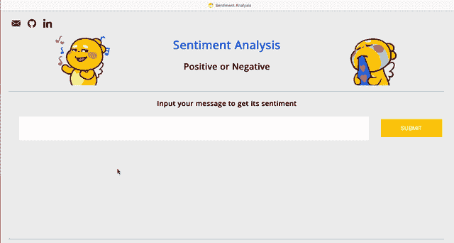

图片由作者制作，gif(内)由 [QooBee](https://www.qoobee.com/) 制作，图标(内)由 [Pixel perfect](https://www.flaticon.com/authors/pixel-perfect) 制作

本文将关注**我们如何将这个基于情感分析的 NLP web 应用程序部署到云中。如何为这个项目构建 NLP 模型的深入主题将在以后的文章中讨论。该模型是使用以下数据源和模型构建的。**

来源数据:[来自 twitter api 的 1，600，000 条标签推文](https://www.kaggle.com/kazanova/sentiment140)

型号:[后勤补给](https://scikit-learn.org/stable/modules/generated/sklearn.linear_model.LogisticRegression.html)

文本矢量器:[哈希矢量器](https://scikit-learn.org/stable/modules/generated/sklearn.feature_extraction.text.HashingVectorizer.html)

# 介绍

## 先决条件

1.  一个**免费的 Heroku 账号**[https://www.heroku.com/free](https://www.heroku.com/free)—强烈推荐获得验证以免费获得**1000 小时/月**，这允许您的单个应用程序零停机，因为只有大约 740 小时/月。
2.  一个**免费的 cron-job 帐户**[https://cron-job.org/en/](https://cron-job.org/en/)——设置一个定期唤醒 web 应用程序的作业。
3.  **Python** 和 **web 框架**的基础知识(GET/POST)。

## 脚本架构

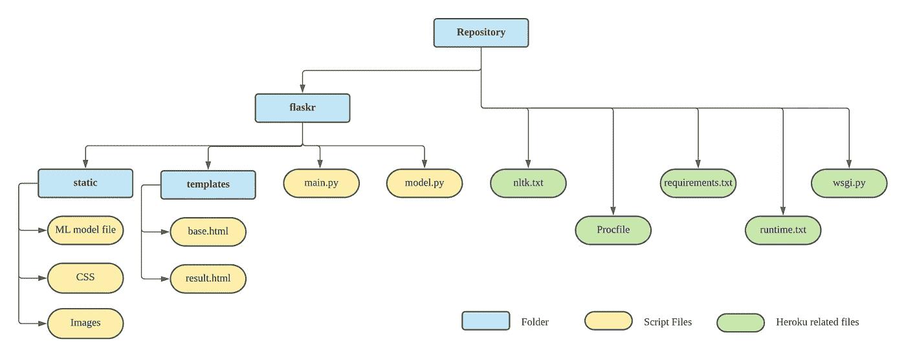

脚本架构

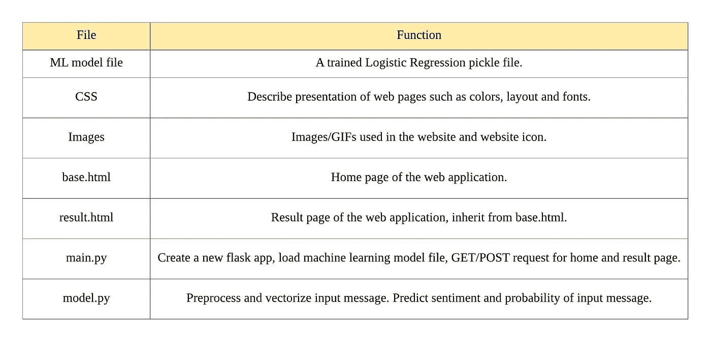

脚本文件的功能

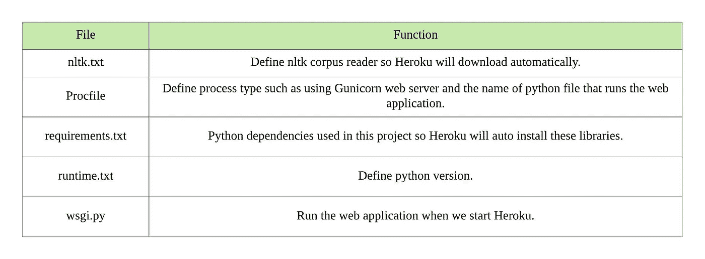

Heroku 相关文件的功能

# 部署

1.从我的 Github 资源库链接的 **medium-article** 分支下载资源库:[https://Github . com/cmy 113/sensation-analysis-project/tree/medium-article](https://github.com/cmy113/sentiment-analysis-project/tree/medium-article)

2.登录[https://dashboard.heroku.com/apps](https://dashboard.heroku.com/apps)并创建一个新应用。输入您唯一的应用程序名称，并选择离您最近的地区。

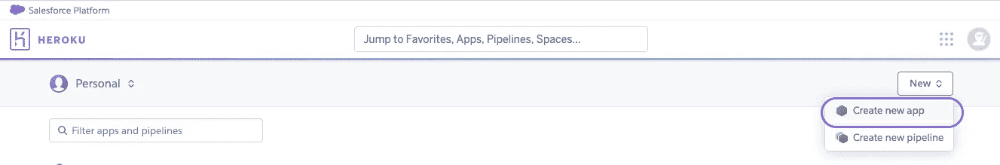

从 [Heroku](https://www.heroku.com) 创建新应用

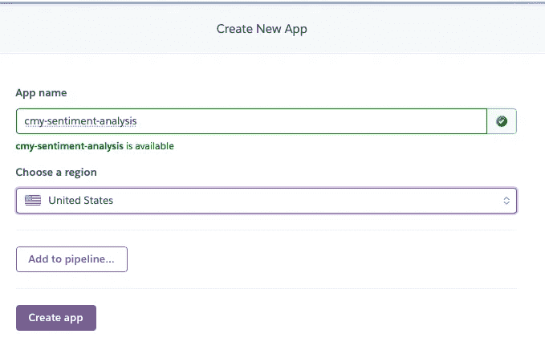

从 [Heroku](https://www.heroku.com) 创建新应用

3.使用以下链接在本地下载并安装 Heroku CLI:[https://devcenter.heroku.com/articles/heroku-cli](https://devcenter.heroku.com/articles/heroku-cli)

4.导航至应用程序的**部署**部分，并遵循**使用 Heroku Git** 部署中的说明

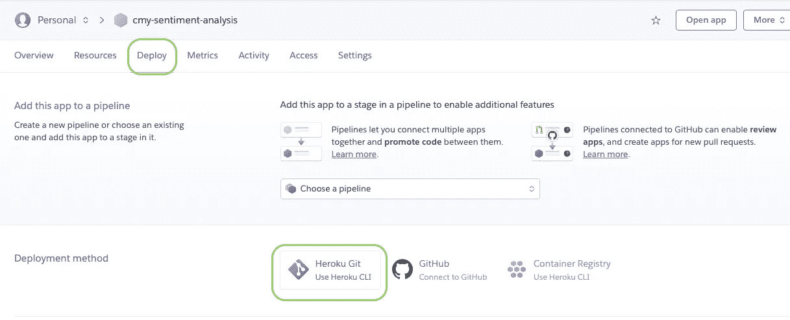

Heroku 从 [Heroku](https://www.heroku.com) 部署

登录 heroku，导航到您在步骤 1 中从 Github 下载的项目目录，初始化 git，定义远程分支，添加所有文件，提交并最终推送到 Heroku

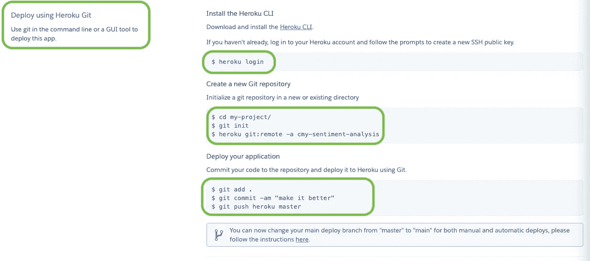

从 [Heroku](https://www.heroku.com) 使用 Heroku CLI

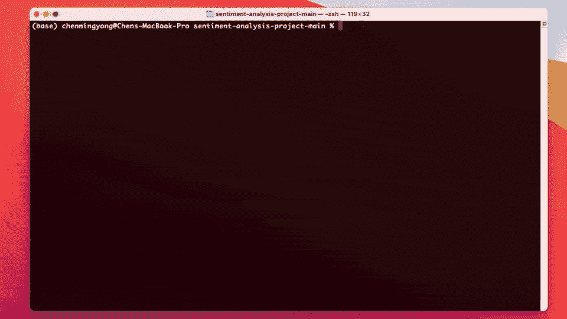

如何使用 Heroku CLI 进行部署

5.web 应用程序现在已经启动并运行，让我们导航到该网站，看看它是否按预期工作。

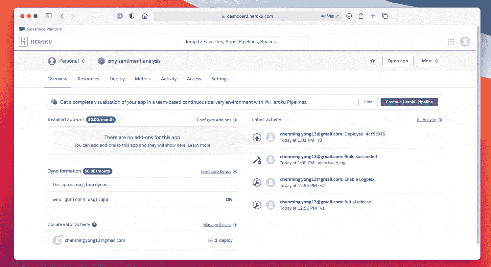

图片由 [Heroku](https://www.heroku.com) 和作者制作，gif(内)由 [QooBee](https://www.qoobee.com/) 制作，图标(内)由 [Pixel perfect](https://www.flaticon.com/authors/pixel-perfect) 制作

8.[可选]还记得我们提到过我们想要一个**零停机应用**吗？为了实现这一点，我们需要定期唤醒 web 应用程序，因为 Heroku 会在应用程序 30 分钟不活动后让其进入睡眠状态。当然，这将消耗你 24*31 = 744 小时的免费 dyno 小时。如果您想使用免费的 dyno 小时构建不同的 web 应用程序，请跳过这一步。

登录到[https://cron-job.org/en/](https://cron-job.org/en/)。单击 CREATE CRONJOB 并输入以下内容:

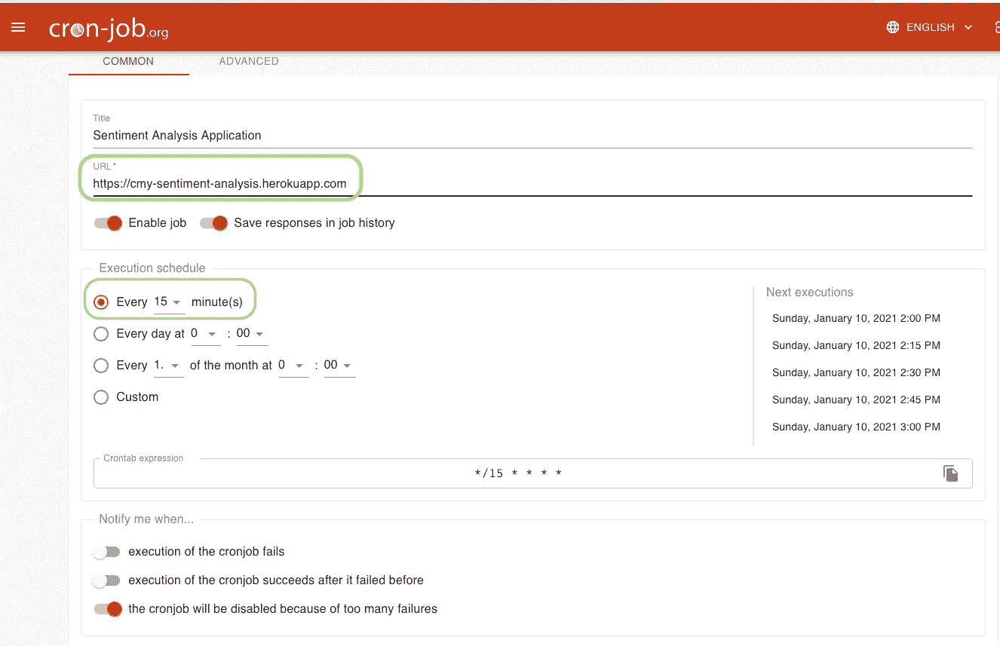

从 cron-job.org[创建克朗乔布](https://cron-job.org/en/)

然后，我们可以看到，根据历史记录，GET 请求被成功执行


cron-job.org 的克朗乔布历史

9.搞定了。耶！我们设法以零成本构建零停机 NLP web 应用程序并将其部署到云中！

# 你能进一步修改什么

因此，在快速了解了如何部署示例 NLP web 应用程序之后，下一个问题是:**如何从中获得更多的好处？**你可以使用这个库作为你现有 NLP 项目的启动，或者你可以在它的基础上修改额外的 **5 东西**:

1.  **将 Heroku 应用与 GitHub** 集成，可以在 GitHub 上**fork**my[repository](https://github.com/cmy113/sentiment-analysis-project)并与 Heroku 同步。注意，我在本文的演示中使用了**中型文章**分支，我可能会对我的**主**分支做一些不定期的更新。
    在 Heroku 中，您可以启用**自动化部署**,从而允许您在每次推送至 Github 存储库时重新创建 web 应用程序！我觉得这很神奇！:)

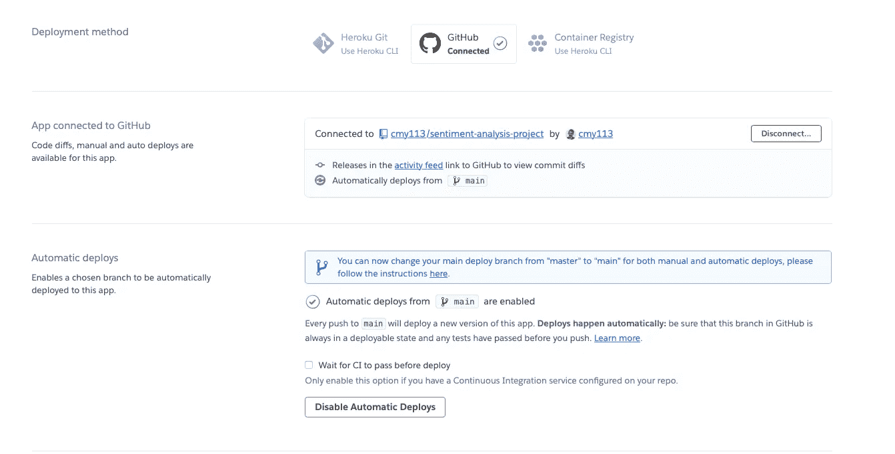

来自 [Heroku](https://www.heroku.com) 的 Github 和 Heroku 之间的集成

2.你需要在你的本地环境中安装一个虚拟环境来**本地修改/测试我现有的代码**。您可以按照下面概述的示例步骤来创建所需的虚拟环境。

```
# Assume you have installed python 3 in your local environment
# I am using python 3.8.5 for this project but the project should work for any version of 3.8 
# Can refer to this tutorial here as well on how to create virtual env [https://www.youtube.com/watch?v=N5vscPTWKOk](https://www.youtube.com/watch?v=N5vscPTWKOk) # Identify where your python3 path is
# e.g. /usr/local/bin/python
which python# Install virtualenv package 
pip install virtualenv# Navigate to home directory 
# Create an Environments directory that stores all your virtual environment 
# Navigate to Environments directory for the next step
cd 
mkdir Environments
cd Environments # Create an empty virtualenv named sentiment-analysis-project
virtualenv -p /usr/local/bin/python sentiment-analysis-project# Activate the virtual environment 
source sentiment-analysis-project/bin/activate # Navigate to downloaded project repository from Github
# Install project dependency from requirements.txt in the virtual environment
cd Downloads/sentiment-analysis-project-medium-article
pip install -r requirements.txt# You might need to download wordnet from nltk if you have not done it before. Open python terminal and run below command: 
# python
# import nltk
# nltk.download('wordnet')
# Please follow this if you have trouble installing the nltk dataset
[https://stackoverflow.com/questions/38916452/nltk-download-ssl-certificate-verify-failed](https://stackoverflow.com/questions/38916452/nltk-download-ssl-certificate-verify-failed)# Finally trigger the application
python wsgi.py# Yay! Time to test/modify the code based on your liking and requirement
```

您应该能够通过访问[**http://127 . 0 . 0 . 1:5000/**](http://127.0.0.1:5000/)在本地访问 web 应用程序

3.根据您希望如何预处理您的输入文本来编辑 **model.py** ，因为该项目主要关注 Twitter 风格的数据。您也可以更改我最初使用的矢量器 [TfidfVectorizer](https://scikit-learn.org/stable/modules/generated/sklearn.feature_extraction.text.TfidfVectorizer.html) ，但是我在将它部署到 Heroku 时遇到了问题，因为大量的词汇导致了 Heroku 自由层版本的内存过载。使用[哈希矢量器](https://scikit-learn.org/stable/modules/generated/sklearn.feature_extraction.text.HashingVectorizer.html)将会克服这个限制。

4.将**静态**文件夹中的**logisticregression . pickle**文件替换为您自己的模型文件，并在本地/Heroku web 应用程序中测试其相应的输出。请注意，并非所有模型都像逻辑回归一样提供概率得分。我的模型基于 160 万 Twitter 数据集，目前的精度大约是 **0.81** (还有很大的提升空间！).

5.**通过编辑 css/html 文件，集成 [Bootstrap](https://getbootstrap.com) 以及根据您的喜好更改图像/gif/图标，改善网络可视化**。我保持了简单的设计，这样任何人都可以很容易地理解代码，并进一步轻松地修改可视化。

# 结论

我真诚地希望这篇文章能够帮助那些已经**在情感分析的基础上构建了自己的自然语言处理(NLP)模型，但是不知道如何可视化地部署它的人**(我在学习 NLP 的时候就忽略了这一点)或者那些渴望了解如何免费部署一个基本的、长期运行的 web 应用程序的人**！**我还会让我的应用程序在[**https://cmy-sentiment-analysis.herokuapp.com**](https://cmy-sentiment-analysis.herokuapp.com)运行，这样任何人都可以随时访问它！我尽最大努力保持我的[代码库](https://github.com/cmy113/sentiment-analysis-project/tree/medium-article)相对**干净和简单**，并添加了大量评论，因此任何对 Python/web 框架了解有限的人都应该能够很快学会！如果你觉得这篇文章有用，或者对我有任何改进的建议，请在下面评论。干杯！