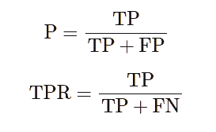

# 使用语义搜索构建更智能的聊天机器人

> 原文：<https://towardsdatascience.com/build-a-smarter-chatbot-with-semantic-search-323c9a77a31d?source=collection_archive---------19----------------------->

来源: [VectorStock](https://www.vectorstock.com/)

## *使用语义搜索引擎，你可以不费吹灰之力扩大聊天机器人的覆盖范围。*

不太久以前，聊天机器人和助手并不好用。像亚马逊 Alexa 这样的公司是由拥有大量 R&D 预算和专业 ML 和 NLP 团队的公司开发的。

但由于 2017 年推出变压器后 NLP 系统性能的飞跃，加上许多这些模型的开源性质，前景正在迅速改变。像 Rasa 这样的公司使得组织可以轻松地构建复杂的代理，这些代理不仅比早期的代理工作得更好，而且只需要很少的时间和金钱来开发，并且不需要专家来设计。

然而，尽管最近取得了一些进步，但仍有很大的改进空间。在本文中，我们将展示如何通过将客户助手聊天机器人附加到语义搜索后端来扩展它，以处理更广泛的查询。

## 亚特兰蒂斯迪拜的基本聊天机器人

当迪拜的亚特兰蒂斯酒店于 2008 年开业时，它的水下套房迅速获得了全世界的关注。今天，他们的网站为潜在访问者列出了一百多个常见问题。出于我们的目的，我们将使用 Rasa 构建一个聊天机器人来处理关于这些主题的查询。

你可能想知道 Rasa 聊天机器人提供了什么优势，而不是简单地访问网站的 FAQ 页面。第一个主要优点是，它对查询给出了直接的回答，而不是要求客户浏览一大串问题。

其次，与 Ctrl-F 搜索相比，Rasa 可以更智能地找到内容。凭借 NLP 模型的支持，它可以优雅地处理拼写错误和释义错误。例如，如果我问“允许我的狗吗”，Rasa 给我下面的结果，而 Ctrl-F 搜索“狗”将不会返回任何结果，因为常见问题是*你允许在迪拜亚特兰蒂斯养宠物吗？*

我们的机器人的源代码可以在[github.com/amin3141/zir-rasabot](https://github.com/amin3141/zir-rasabot)获得，最终版本部署在我们的[演示页面](https://zir-ai.com/demo#chatbot)。下面的文件提供了使用 Rasa 创作语法的核心知识库实现。

*   [nlu.yml](https://github.com/amin3141/zir-rasabot/blob/main/data/nlu.yml) ，包含常见问题及其变体。
*   [domain.yml](https://github.com/amin3141/zir-rasabot/blob/main/domain.yml) ，包含意图的响应和声明。
*   [rules.yml](https://github.com/amin3141/zir-rasabot/blob/main/data/rules.yml) ，将 nlu.yml 中定义的意图映射到 domain.yml 中定义的响应。

## 顾客评论:一个未开发的信息源

随着互联网和在线电子商务的兴起，客户评论是在线景观的普遍元素。评论包含各种各样的信息，但因为它们是以自由形式的文本编写的，并且是用客户自己的话来表达的，所以要访问其中的知识并不容易。

亚特兰蒂斯酒店有数千条评论，其中 326 条包含在 [OpinRank 评论数据集](https://archive.ics.uci.edu/ml/datasets/opinrank+review+dataset)中。[在其他地方](https://blog.zir-ai.com/the-high-cost-of-keyword-search)我们展示了语义搜索平台，如 [Vectara Neural Search](https://vectara.com/) ，如何让组织利用存储为非结构化文本的信息——大规模释放这些数据集中的价值。

Rasa 包含一个称为后备处理器的便利特性，我们将使用它来扩展我们的语义搜索机器人。当机器人没有足够的信心直接处理请求时，它会将请求交给后备处理程序来处理。在这种情况下，我们将针对客户评论语料库运行用户查询，如果结果得分足够高，将显示最多两个匹配项。回退处理程序的源代码可以在 [main/actions/actions.py](https://github.com/amin3141/zir-rasabot/blob/main/actions/actions.py) 中找到。第[41–79](https://github.com/amin3141/zir-rasabot/blob/main/actions/actions.py#L41-L79)行显示了如何准备语义搜索请求、提交请求以及处理结果。

我们如何确定机器人不够自信？为了本文的目的，我们作弊了:我们直接根据评估数据计算了我们的选择指标 F1 得分，并选择了一个最大化它的阈值。虽然这并不妨碍我们从评估结果中得出结论，但我们必须记住，基线聊天机器人被赋予了不切实际的优势。

我们还使用阈值 0.3 来确定语义搜索回退结果是否足以显示。至关重要的是，这个阈值是从一个不相关的数据集获得的。因此，我们希望我们的指标能够准确反映现实世界的表现。

## 比较机器人

复杂系统的性能必须进行概率分析，NLP 驱动的聊天机器人也不例外。缺乏严格的评估将会使你很难确信当你扩展你的系统时你正在取得进步。本节的其余部分描述了我们评估聊天机器人的方法。

首先，我们构建了一个包含 63 个问题的评估集。在预订房间之前，我们询问了五位以前住过酒店的人，他们可能有兴趣了解迪拜亚特兰蒂斯酒店的哪些问题。提示中有几个要点需要注意:首先，它介绍了迪拜酒店的位置，以考虑到地理上相关的问题，如*它离海滩有多远？*其次，它还设定了一个目标，这个目标首先符合构建这样一个机器人的现实商业动机，也就是说，帮助潜在客户决定这是否是他们愿意呆的地方。

为了表征机器人的性能，我们从标准的四类答案分类开始，这对于以前使用过 ML 系统的人来说是熟悉的:

1.  正确答案:聊天机器人正确回答了这个问题。在我们的评估中，单个评估员做出了决定，尽管如果您的预算允许，使用多个评估员更可靠。
2.  误报:聊天机器人回答问题不正确。
3.  假阴性:聊天机器人拒绝回答一个合法的问题。当系统回复*很抱歉，我没有这方面的任何信息时，这种情况就会出现。*
4.  真否定:描述聊天机器人避免回答不合理问题的情况，例如，*马里纳拉海沟有多深？然而，真正的否定在我们的数据集中并不存在，因为所有的问题都是切题的。*

使用这些类，我们将计算*精度*，这是正确回答的已回答问题的比例，以及*真实肯定率*，也称为*召回率*，这是可以正确回答的有效问题的百分比。以下公式表达了这一点:

精确度和真阳性率公式。

为了用一个数字来描述系统的性能，我们将转向 F 值。下面等式中的系数β表示真实阳性率被认为比精度重要β倍。应选择β，以准确反映与假阳性和假阴性结果相关的相对成本。

F 分数的公式

## 总结和分析

来自默认聊天机器人和启用了回退的聊天机器人的回答被评估并分类如下:

*   默认值:(TP=7，FP=7，TN=0，FN=49)
*   回退:(TP=29，FP=24，TN=0，FN=10)

下图显示了他们在上述指标上的相对表现。

最大的改进是聊天机器人的真实阳性率。在现实问题的评估集上，聊天机器人的正确回答率从 13%上升到了 74%。这也使 F1 得分从 20%提高到 63%。最重要的是，这种改进是通过语义搜索访问现有评论轻松实现的。

精度呢？令人惊讶的是，它似乎也有所改善，从 50%上升到 55%。然而，90%的置信区间清楚地表明，这种差异完全在误差范围内，无法得出任何结论。需要产生更多真阳性和假阳性的更大的问题集。如果没有这个时间间隔，就很难得出这个结论。一个很好的经验法则是，对没有置信区间的统计数据要非常怀疑。

我们已经走到路的尽头了吗？我们能像一位前美国总统曾经做过的那样，宣布“任务完成了吗！”在我们的例子中，就像在他的例子中一样，答案是，*没那么快*！在本文的最后一部分，我们将讨论在聊天机器人中添加语义搜索时应该考虑的其他一些事情。

## 总结挑战

顾客评论可能会提到与官方政策不一致的事实。例如，如果顾客询问结账时间，信息性评论可能会说*的结账时间是上午 10 点，但我下午 1 点就离开了，这不是问题*。因此，机器人需要弄清楚什么时候它在权威地回答，什么时候它在第二手资料中寻找答案。一种方法是以这样的陈述开始搜索结果，比如*下面是其他客户不得不说的:*

如果顾客问亚特兰蒂斯酒店的房间是否干净呢？管理层会希望机器人成为志愿者吗*地毯发臭，墙上有蟑螂在跑！很难想象，即使评论是准确的。定期检查回退处理程序产生的响应是确保这些情况不会发生的一种方法。另一个是从语料库中过滤出负面评论。*

## 注释者之间的协议

当我们评估我们的聊天机器人时，我们将每一个回答分为真或假、肯定或否定。这个任务被称为注释，在我们的例子中，它是由团队中的一个软件工程师执行的。几乎可以肯定的是，如果你让另一个人来注释这些回答，结果将是相似的，但不完全相同。

出于这个原因，包含多个注释者并跟踪它们之间的一致程度是一个好的实践。注释者的分歧也应该反映在我们度量的置信区间中，但是这是另一篇文章的主题。

# 资源和引用

*   启用了回退功能的 [Hotel Atlantis 聊天机器人](https://zir-ai.com/demo#chatbot)。
*   [所有 63 个问题的评估结果](https://docs.google.com/spreadsheets/d/1QyETsefGYKF52i2ZX4-Q8skd6FedGXZfUEgRfj9pj6c/edit?usp=sharing)
*   [关键词搜索的高成本](https://blog.zir-ai.com/the-high-cost-of-keyword-search)包括一个教程，展示如何将客户评论上传到 Vectara Neural Search。
*   [Rasa](https://rasa.com/) 利用最新的语言理解技术构建对话系统。
*   甘乃山，K. A .和翟春祥，“基于观点的实体排名”，信息检索，2011 年。

*阿明·艾哈迈德是 Vectara 的联合创始人。聊天机器人是由 Basit Anwer 开发的。*