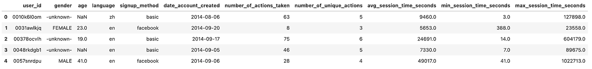
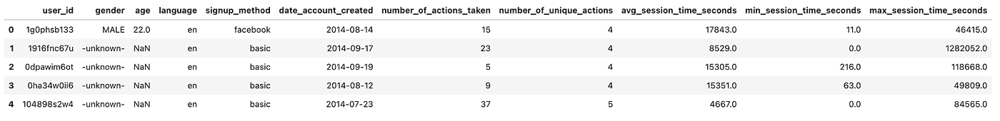
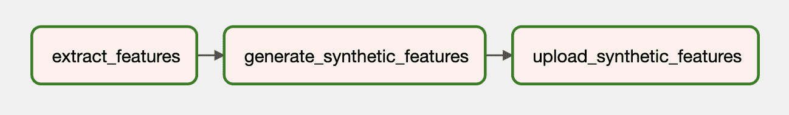

# 使用 Gretel.ai 和 Apache Airflow 构建合成数据管道

> 原文：<https://towardsdatascience.com/build-a-synthetic-data-pipeline-using-gretel-ai-and-apache-airflow-a99f1773112f?source=collection_archive---------25----------------------->

## [现实世界中的数据科学](https://towardsdatascience.com/data-science-in-the-real-world/home)

## *在这篇博文中，我们使用* [*Gretel 的合成数据 API*](https://gretel.ai/synthetics)*和*[*Apache air flow*](https://airflow.apache.org/)构建了一个从 PostgreSQL 数据库生成合成数据的 ETL 管道

照片由[seli̇m·阿尔达·埃尔伊尔马兹](https://unsplash.com/@selimarda?utm_source=medium&utm_medium=referral)在 [Unsplash](https://unsplash.com?utm_source=medium&utm_medium=referral) 上拍摄

嗨，伙计们，我叫德鲁，我是一名软件工程师，在 [Gretel.ai](https://gretel.ai/) 。我最近一直在思考将 Gretel API 集成到现有工具中的模式，这样就很容易建立数据管道，安全和客户隐私是第一位的特性，而不仅仅是事后的想法或检查框。

数据工程师中流行的一个数据工程工具是 Apache Airflow。这也正好与 Gretel 的工作很好。在这篇博文中，我们将向您展示如何使用 Airflow、Gretel 和 PostgreSQL 构建一个合成数据管道。让我们跳进来吧！

# 什么是气流？

[Airflow](https://airflow.apache.org/docs/apache-airflow/stable/howto/operator/index.html) 是一个常用于构建数据管道的工作流自动化工具。它使数据工程师或数据科学家能够使用 Python 和其他熟悉的构造以编程方式定义和部署这些管道。气流的核心是 DAG 或有向无环图的概念。气流 DAG 提供了用于定义管道组件、它们的依赖性和执行顺序的模型和一组 API。

您可能会发现气流管道将数据从产品数据库复制到数据仓库。其他管道可能会执行查询，将规范化的数据连接到适合分析或建模的单个数据集。另一个管道可能发布汇总关键业务指标的每日报告。这些用例有一个共同的主题:协调跨系统的数据移动。这是气流闪耀的地方。

利用 Airflow 及其丰富的[集成生态系统](https://registry.astronomer.io/)，数据工程师和科学家可以将任意数量的不同工具或服务整合到一个易于维护和操作的统一管道中。了解了这些集成功能后，我们现在将开始讨论如何将 Gretel 集成到气流管道中，以改善常见的数据操作工作流。

# 格雷特尔是怎样融入的？

在 Gretel，我们的使命是让数据更容易、更安全地使用。在与客户交谈时，我们经常听到的一个痛点是让数据科学家访问敏感数据所需的时间和精力。使用 [Gretel Synthetics](https://gretel.ai/synthetics) ，我们可以通过生成数据集的合成副本来降低使用敏感数据的风险。通过将 Gretel 与 Airflow 集成，可以创建自助管道，使数据科学家可以轻松快速地获得他们需要的数据，而不需要数据工程师来处理每个新的数据请求。

为了演示这些功能，我们将构建一个 ETL 管道，从数据库中提取用户活动特征，生成数据集的合成版本，并将数据集保存到 S3。随着合成数据集保存在 S3，它可以被数据科学家用于下游建模或分析，而不损害客户隐私。

首先，让我们来鸟瞰一下管道。该图中的每个节点代表一个管道步骤，或气流术语中的“任务”。

*气流上的格雷特合成材料管道示例。(图片由作者提供)*

我们可以将管道分成 3 个阶段，类似于 ETL 管道:

*   **提取**—`extract_features`任务将查询数据库，并将数据转换为一组数据科学家可以用来构建模型的特征。
*   **合成—** `generate_synthetic_features`将提取的特征作为输入，训练一个合成模型，然后使用 Gretel APIs 和云服务生成一组合成的特征。
*   **加载**——`upload_synthetic_features`将综合特征集保存到 S3，在那里它可以被摄取到任何下游模型或分析中。

在接下来的几节中，我们将更详细地探讨这三个步骤。如果你想了解每个代码示例，你可以去[grete lai/Gretel-air flow-pipelines](https://github.com/gretelai/gretel-airflow-pipelines)下载这篇博文中用到的所有代码。repo 还包含启动 Airflow 实例和端到端运行管道的说明。

此外，在我们剖析每个组件之前，查看完整的气流管道可能会有所帮助。以下部分中的代码片段摘自链接用户预订管道。

# 提取特征

第一个任务`extract_features`负责从源数据库中提取原始数据，并将其转换成一组特征。这是一个常见的[特征工程](https://en.wikipedia.org/wiki/Feature_engineering)问题，你可能会在任何机器学习或分析管道中发现。

在我们的示例管道中，我们将提供一个 PostgreSQL 数据库，并加载来自 Airbnb Kaggle 竞赛的预订数据。

这个数据集包含两个表，`Users`和`Sessions`。`Sessions`包含一个外键引用`user_id`。利用这种关系，我们将创建一组包含由用户聚合的各种预订指标的特性。下图显示了用于构建要素的 SQL 查询。

然后从我们的气流管道执行 SQL 查询，并使用以下任务定义将其写入中间 S3 位置

任务的输入`sql_file`决定了在数据库上运行什么样的查询。该查询将被读入任务，然后对数据库执行。然后，查询结果将被写入 S3，远程文件密钥将作为任务的输出返回。

下面的屏幕截图显示了上面提取查询的示例结果集。我们将在下一节描述如何创建该数据集的合成版本。

*查询结果预览。(图片由作者提供)*

# 使用 Gretel APIs 合成特征

为了生成每个特征的合成版本，我们必须首先训练一个合成模型，然后运行该模型来生成合成记录。Gretel 有一组 Python SDKs，可以很容易地集成到 Airflow 任务中。

除了 Python 客户端 SDK，我们还创建了一个 [Gretel Airflow Hook](https://github.com/gretelai/gretel-airflow-pipelines/blob/main/plugins/hooks/gretel.py) 来管理 Gretel API 连接和秘密。设置好 Gretel 气流连接后，连接到 Gretel API 就像

有关如何配置气流连接的更多信息，请参考我们的 Github 知识库[自述文件](https://github.com/gretelai/gretel-airflow-pipelines#2-configure-airflow-connections)。

上例中的`project`变量可以用作使用 Gretel 的 API 训练和运行合成模型的主要入口点。更多细节可以查看我们的 Python API 文档，[https://Python . docs . Gretel . ai/en/stable/projects/projects . html](https://python.docs.gretel.ai/en/stable/projects/projects.html)。

回到预订管道，我们现在来回顾一下`generate_synthetic_features`任务。此步骤负责使用前一任务中提取的特征来训练合成模型。

查看方法签名，您会看到它需要一个路径，`data_source`。该值指向上一步中提取的 S3 要素。在后面的部分中，我们将介绍所有这些输入和输出是如何连接在一起的。

当使用`project.create_model_obj`创建模型时，`model_config`参数代表用于生成模型的合成模型配置。在这个管道中，我们使用我们的[默认模型配置](https://github.com/gretelai/gretel-blueprints/blob/main/config_templates/gretel/synthetics/default.yml)，但是许多其他的[配置选项](https://docs.gretel.ai/synthetics/synthetics-model-configuration)也是可用的。

模型配置好之后，我们调用`model.submit_cloud()`。这将使用 Gretel Cloud 提交用于训练和记录生成的模型。调用`poll(model)`将阻塞任务，直到模型完成训练。

现在模型已经训练好了，我们将使用`get_artifact_link`返回一个链接来下载生成的合成特征。

*合成集特征的数据预览。(图片由作者提供)*

这个工件链接将被用作最终`upload_synthetic_features`步骤的输入。

# 加载合成要素

原始特征已经被提取，并且已经创建了合成版本。现在是上传合成特性的时候了，这样下游消费者就可以访问它们了。在本例中，我们将使用 S3 桶作为数据集的最终目的地。

这项任务非常简单。`data_set`输入值包含一个签名的 HTTP 链接，用于从 Gretel 的 API 下载合成数据集。该任务将把该文件读入 Airflow worker，然后使用已经配置好的 S3 钩子把合成特征文件上传到 S3 桶，下游消费者或模型可以访问它。

# 协调管道

在过去的三个部分中，我们已经浏览了提取、合成和加载数据集所需的所有代码。最后一步是将这些任务捆绑到一个单独的气流管道中。

如果你还记得这篇文章的开头，我们简要地提到了 DAG 的概念。使用 Airflow 的 TaskFlow API，我们可以将这三个 Python 方法组合成一个 DAG，该 DAG 定义了输入、输出以及每个步骤的运行顺序。

如果您遵循这些方法调用的路径，您最终会得到一个看起来像我们的原始特性管道的图。

*气流上的格莱特合成纤维管道。(图片由作者提供)*

如果你想运行这个管道，并看到它的运行，那就去 Github 仓库的[看看吧。在那里，您可以找到关于如何启动一个 Airflow 实例并端到端运行管道的说明。](https://github.com/gretelai/gretel-airflow-pipelines)

# 包装东西

如果您已经做到了这一步，那么您已经看到了如何将 Gretel 集成到基于气流的数据管道中。通过结合 Gretel 的开发人员友好的 API 和 Airflow 强大的钩子和操作符系统，很容易构建 ETL 管道，使数据更容易访问，使用起来更安全。

我们还讨论了一个常见的特性工程用例，其中敏感数据可能不容易访问。通过生成数据集的合成版本，我们降低了暴露任何敏感数据的风险，但仍然保留了数据集的效用，同时使需要它的人可以快速获得它。

从更抽象的角度来考虑特性管道，我们现在有了一个可以重新用于任何数量的新 SQL 查询的模式。通过部署新版本的管道，并替换初始 SQL 查询，我们可以用保护客户隐私的合成数据集来处理任何潜在的敏感查询。唯一需要更改的代码行是 sql 文件的路径。不需要复杂的数据工程。

# 感谢阅读

如果您有任何问题或意见，请发送电子邮件至 [hi@gretel.ai](mailto:hi@gretel.ai) 或加入我们的 [Slack](https://gretel.ai/slackinvite) 。我们希望了解您如何使用 Airflow，以及我们如何才能最好地与您现有的数据管道集成。