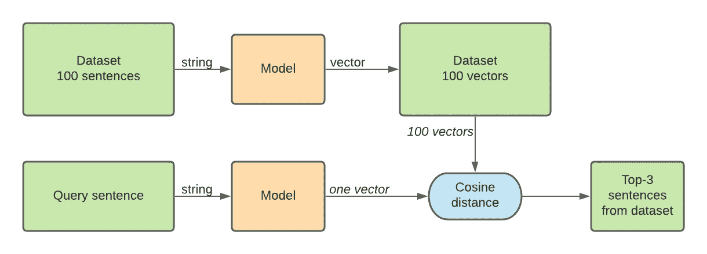
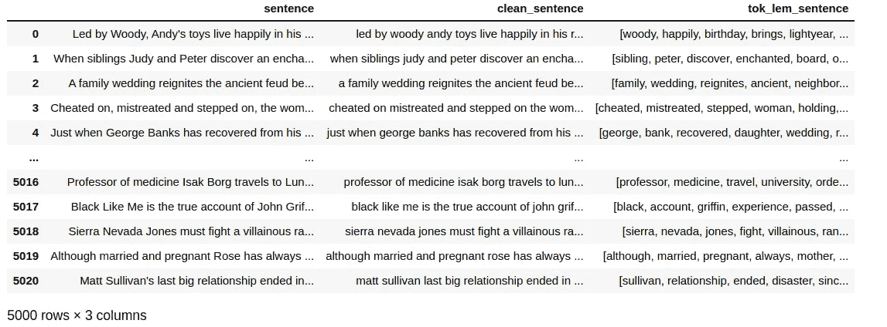
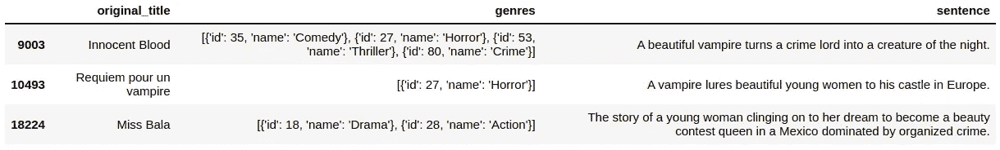

# 用 Python 构建文本推荐系统

> 原文：<https://towardsdatascience.com/build-a-text-recommendation-system-with-python-e8b95d9f251c?source=collection_archive---------4----------------------->

## 使用 NLP 语义相似度来提供最准确的推荐


[**丹尼斯·詹斯**](https://unsplash.com/@dmjdenise)

自然语言处理是机器学习中最令人兴奋的领域之一。它使我们的计算机能够理解非常密集的语料库，分析它们，并为我们提供我们正在寻找的信息。

在本文中，我们将创建一个推荐系统，其行为类似于一个垂直搜索引擎*【3】。它允许在非常有限的与一个主题高度相关的文档中搜索文档。为了充分利用 NLP 的能力，我们将把搜索方法与**语义相似性结合起来。***

***本文包括不同 NLP 模型的数据集、理论、代码和结果。***

## ***为什么要用机器学习？***

1.  *机器学习和深度学习擅长提供捕捉单词和文档语义的文本数据的表示，允许机器说出哪些单词和文档语义相似。深度学习的使用能够为其最终用户提供更多相关结果，提高用户满意度和产品功效。在本文中，我们将致力于一个为您的数据量身定制的解决方案，并且稍后可以将您的数据与用户查询进行比较，以提供排名良好的结果。*
2.  *对于大多数常见的编程语言，如 Python，许多开源库提供了工具，可以在您自己的数据上创建和训练非常简单复杂的机器学习模型。在本文中，我们将看到在您自己的机器上构建和训练模型有多快。*

## *用例*

*想象一下，你想看一部电影，但你已经看完了遗愿清单上的所有电影。今天你想看一部电影，里面一个美丽的女人卷入了一场犯罪。我们将建立的推荐系统会将您理想的电影描述与电影描述数据库进行匹配，并推荐符合您描述的前三部电影。*

*这非常简单，要构建这个管道，您需要:*

1.  *包含要推荐的文本项集合的数据集。*
2.  *一种句子清洁算法*
3.  *匹配算法。*

# *我们来编码吧！*

*您可以在 [jupyter 笔记本](https://github.com/bledem/movie_recommendation/blob/main/recommendation_movie.ipynb)中访问本文的所有代码。*

**

*j .凯利·布里托*

# *准备数据*

## *作为查找表的数据集*

*对于这个玩具实验，我们使用电影数据集[https://www.kaggle.com/rounakbanik/the-movies-dataset](https://www.kaggle.com/rounakbanik/the-movies-dataset)。*

*它包含 2017 年 7 月之前发布的 44，512 部电影的元数据。幸运的是，我们不会全部观看，因为我们会选择符合我们确切愿望的一个。*

*在我们的实验中，我们将只使用表“movies_metadata.csv ”,它包含的属性有:*预算、流派、网页链接、* ***原标题、描述概述*** *、上映日期、口语、IMDb 平均投票、…。**

*我们的推荐系统将使用电影描述概述句子，并应用机器学习模型将每个句子表示为数字特征向量。在将 ML 模型应用于每个句子之后，我们可以连接这些特征向量来创建代表整个数据集的嵌入矩阵。这个矩阵非常重要，它将是我们对系统进行的每个查询的查找表。*

**

*作者图片*

*假设我们有 100 个电影描述句子，我们的嵌入向量大小是 300，那么我们的嵌入矩阵大小将是(100×300)。当用户输入一个句子时，我们使用相同的模型将其查询句子嵌入到 300 维向量中，并计算 100 行中的每一行与嵌入的查询向量之间的余弦距离。*

## *加载数据集*

*下载。csv 文件，并将其作为数据框加载到 python 脚本或笔记本中。*

## *干净的句子*

*我们会做基本的预处理。我们希望给模型一个统一的文本，所以我们在将句子嵌入向量之前对它们进行清理。这将有助于模型**关注内容而不是格式**来找到数据中的相关模式。*

*让我们回顾一下下面的清洁方法。*

*   *删除非字母数字字符/标点符号，*
*   *删除太长和太短的句子，*
*   *删除停用词，*
*   *lemmatize，*
*   *标记化*

*我们使用[正则表达式模式匹配](https://docs.python.org/3/howto/regex.html)从电影描述中删除所有非字母数字字符。*

*我们创建自己的记号赋予器。记号赋予器将一个字符串转换成一个字符串列表，其中每个元素是一个单词。*

```
*word_tokenizer(‘the beautiful tree has lost its leaves’)
>>> [‘the’, ‘beautiful’, ‘tree’, ‘has’, ‘lost’, ‘its’, ‘leaves’]*
```

*我们使用一个词条解释器将一个单词转换成通用形式:*

```
*from nltk.stem import WordNetLemmatizer
stemmer = WordNetLemmatizer()
[stemmer.lemmatize(w) for w in word_tokenize(sentence)]
>>> ['the', 'beautiful', 'tree', 'ha', 'lost', 'his', 'leaf']*
```

*我们通过使用最小单词和最大单词进行过滤，从数据集中删除太短和太长的句子。我们去掉了对提取给定句子的特殊性没有帮助的常用词(停用词)。*

## *清洁的结果*

*我们将“句子”列转换为两列:*

*   **clean_sentence* 这里的句子主要是字母数字文本。*
*   **tok_lem_sentence* 其中数据被词汇化和标记化。*

**

# *加载、训练、预测*

*现在，我们的数据集已准备好进行处理，我们可以比较提供不同折衷方案的不同模型:*

*   *基准/基本 **TF-IDF***
*   ***Word2Vec，**一个简单的前馈网络*
*   *非常灵活和强大的 NLP 库*
*   ***变形金刚**，最先进的深度学习模型。*

*我在下面介绍一个函数，在给定向量之间的余弦距离的情况下，我将使用该函数对最佳推荐进行排序。*

*你可以注意到在 l.11 中，我们在距离矩阵上使用了平均值。距离矩阵的形状是(查询句子中的字数，我们的词汇表中的句子数)。我们计算从查询的每个单词到数据库的每个句子的距离，并取整个查询的平均值。然后我们可以选择与查询距离最小的三个句子。*

# *基准模型，TF-IDF*

## *什么是 TF-IDF？*

*文本语料库通常包含经常出现的单词，并且不包含任何有用的歧视性信息。Tf-idf 旨在降低这些频繁出现的单词在特征向量中的权重。它可以被定义为术语频率(一个词在给定文档中的频率)和逆文档频率(该词在所有文档中的出现次数)的乘积[1]。术语频率/文档频率测量术语在给定文档中的相关性。在我们的例子中，一个文档就是一个句子。*

## *应用 TF-IDF*

*一旦我们在 Tf-idf 模型上拟合我们的数据，我们可以为每个电影描述生成嵌入的 22，180 维向量。这些特征存储在特征矩阵 *tfidf_mat* 中，其中每一行都是嵌入到特征向量中的电影描述记录。*

*当我们从用户输入中获得一个查询时，我们将把它嵌入到相同的向量空间中，并且我们将逐个比较查询句子特征 *embed_query* 和嵌入矩阵 *tfidf_mat* 的句子向量。*

*从距离矩阵中找到最佳索引的函数取每个嵌入句子的余弦距离的平均值，并对结果进行排序。暂时不要注意掩蔽参数，我们将把它用于另一个模型。*

*这个模型使用起来非常简单，只需要几行代码就可以完成，训练也非常快。*

*关于疑问句:'*一个有美女的犯罪故事*'，*

## *前 3 名结果*

> *-一个美丽的吸血鬼把一个犯罪头目变成了夜行动物。无辜的血*
> 
> *-一个吸血鬼引诱年轻漂亮的女人到他在欧洲的城堡。吸血鬼安魂曲*
> 
> *-一个年轻女子在被有组织犯罪控制的墨西哥坚持梦想成为选美皇后的故事。巴拉小姐。*

# *你的数据模型，Word2Vec*

***Word2Vec** 是一个强大而高效的算法，可以捕捉你语料库中单词的语义。Word2vec 在训练期间采用包含许多文档/句子的语料库，并输出一系列向量，文本中的每个单词一个向量。单词向量包含该单词的语义，这意味着在向量空间中接近的两个单词具有相似的含义。国王和王后就像蛋糕和咖啡一样亲密。例如，Word2Vec 可以很容易地用于查找同义词。在训练期间，神经网络根据从训练数据集中推断的出现概率对每个词向量进行加权。这个概率是如何计算的取决于你选择的架构(连续单词包或跳格)。最后，word2vec 模型实际上是一个非常简单的 2 层神经网络，但我们不会关心输出，我们将提取信息编码的隐藏状态[3]。word2vec 的优势在于它采用高维稀疏单词表示(如 tf-idf 或 hot encoded vectors ),并将其映射为密集表示，希望在更小的维度中。*

## *应用 word2vec*

*我们使用 [*gensim*](https://radimrehurek.com/gensim/auto_examples/index.html#documentation) 库在我们的语料库数据上训练一个 word2vec 模型。我们首先需要提供词汇表(我们要向量化的单词列表)，然后在几个时期内训练模型。默认情况下，模型训练 CBOW。*

*Word2Vec 的主要缺点是它不能为最初不在词汇表使用训练中的单词生成向量。这就是为什么我们需要提供一个 utils 函数 *is_word_in_model* 来从查询语句中删除在训练集中看不到的单词。*

*我们使用他们的库函数 *n_similarity* 来有效地计算查询语句和数据集语句之间的距离。*

## *前 3 名结果*

> *- A tragic love story set in contemporary Shanghai. The film stars Zhou Xun in a dual role as two different women and Jia Hongsheng as a man obsessed with finding a woman from his past. 苏州河*
> 
> *-一个发光的球体用一系列黑暗幻想、色情和恐怖的故事恐吓一个年轻的女孩。重金属。*
> 
> *-弗里茨·兰的心理惊悚片讲述了一个女人嫁给了一个有致命嗜好的陌生人，通过他们的爱，他试图摆脱他的强迫症行为。门外的秘密*

# *很好的妥协模式，斯帕西*

*[spaCy](https://spacy.io/usage/spacy-101/) 是一个 python 开源库，包含许多针对各种语言的预先计算的模型(参见 64+语言列表[这里](https://spacy.io/usage/models))。因为我们需要加载与每个单词相关的向量，所以我们使用一个经过训练的管道来访问特征向量，即 [en_core_web_lg](https://spacy.io/models/en#en_core_web_lg) 。他们将其 NN 称为 Tok2Vec，我们可以使用包含 685k 个关键字的预训练权重作为在网页语料库上训练的 685k 个维度 300 的唯一向量。SpaCy 有自己的深度学习库和模型。你可以在这里阅读更多关于他们默认的 CNN+散列嵌入模型[。他们的管道包括记号化器、词汇化器和单词级矢量化，所以我们只需要提供字符串形式的句子。](https://spacy.io/api/architectures#HashEmbedCNN)*

*我们使用掩码 l.12，以防该单词在预训练的语料库中没有单词。*

## *前 3 名结果:*

*就算预计 spaCy 比 TF-IDF 更厉害，对于这句话，给出的结果也和 TF-IDF 一样。*

**

# *最强大的变形金刚*

*如果我们想要一个鲁棒且准确的方法，我们可以使用深度学习。幸运的是，许多图书馆已经发布了他们自己的预训练权重，我们不需要花几个月的时间在整个互联网上训练一个非常深入的模型。*

*我们将使用伯特建筑。成本高于以前的模型，但对环境的理解也更加敏锐。*

## *变形金刚库*

*' SentenceTransformers '团队开发了他们自己的高级管道，以方便在 Python 中使用变压器。你可以点击查看他们的车型和推荐列表[。我个人选择了**满足** *高质量*的快速模型**-MiniLM-L6-v2。**](https://www.sbert.net/docs/pretrained_models.html)*

## *前 3 名结果*

> *-一个年轻女子在被有组织犯罪控制的墨西哥坚持梦想成为选美皇后的故事。巴拉小姐。*
> 
> *-在一名年轻女子在她的邻居中被可怕地谋杀后，一名生活在纽约市的自决女子-好像是在测试她自身安全的极限-将自己推进了一场不可思议的冒险性关系。很快，她变得越来越警惕与她接触的每个男人的动机，以及她自己的动机。在切口处。*
> 
> *-一个奋斗中的美国艺术家和一个美丽的中国香港妓女之间的爱情故事。苏丝黄的世界*

*与以前的模型相比，我们可以看到结果的改进。*

# *用 HuggingFace 编写自己的 BERT 管道*

*SentenceTransformer 在后端使用 [HuggingFace](https://huggingface.co/) 架构。HuggingFace 作为 NLP 技术的开源提供商领导着这项研究。他们免费公开模型、数据集和代码库。任何人都可以训练他们的模型并将结果推送到他们的数据库中。*

*我们将使用标记化器(AutoTokenizer)和模型(AutoModel)来检索句子-transformer/ **释义-MiniLM-L6-v2** 。*

*我们可以选择在 CPU 或 GPU 上训练，我们使用 *fit_transform* 使用一批数据来生成我们的嵌入矩阵，以避免内存过载。再次在*转换*方法中，我们使用 *mean_pooling* 函数来推断每个单词的向量，并对每个句子进行平均。这种汇集比以前更复杂，因为 BERT 中的注意机制使用掩码，我们在平均之前将它们应用于结果。*

*代码比我们使用 SentenceTransformer 时稍长，但我们也有更多的灵活性。我们需要设计自己的推断方法也更加透明*

## *训练和预测(CPU 或 GPU)*

*训练需要时间，所以如果你有 GPU，用它来加快你的训练。对于这个数据集，在我的 16Gb 8 CPUs 本地计算机上，对 20，000 个句子行的训练在 CPU 上花费了**12 分钟，而当我使用具有相同训练配置的本地 GPU (GeForce MX150)时，训练仅花费了**6 分钟**。***

## *示例查询:*

***查询**:‘一只狗在和他的朋友玩’*

***伯特模型:**“一个男人拯救了一只德国牧羊犬，两人如何成为好朋友的故事。”[我的狗郁金香]*

***查询**:“一部欧洲英雄电影”*

*伯特模型:“在一个反乌托邦的欧洲，一名警察调查一名连环杀人案嫌犯，使用了他现在已经名誉扫地的前导师写的有争议的方法。”[Forbrydelsens 元素]*

**(我们可以断定它不存在于数据库中)**

***查询**:《一个女服务员的故事》*

*伯特模特:“一名女服务员不顾一切地想要实现她当餐馆老板的梦想，踏上了将青蛙王子变回人类的旅程，但是在她吻了他之后，她不得不面对同样的问题。”[公主和青蛙]*

# *结论*

*一旦我们加载并矢量化了初始数据集，我们就可以使用一个新句子作为查询，并从数据集中检索与该查询句子匹配的前 3 个最接近的项目。*

*为此，我们使用了简单的 **TF-IDF** 模型，该模型使用单词和句子中的频率来创建向量。我们使用了 **Word2Vec** 模型，一个简单的神经网络。我们使用了 **spaCy** ，它可以处理和计算许多不同语言的向量，具有最先进的性能。*

*最后，我们使用 transformer 模型来利用最新的深度学习方法进行矢量化。深度学习技术可以实现最好的(主观上)检索结果，但它们较慢。选择最适合你权衡的方法！*

# *资源*

*[1] Python *机器学习*，Sebastian Raschka，Packt Edition([https://www . packtpub . com/product/Python-Machine-Learning-third-Edition/9781789955750](https://www.packtpub.com/product/python-machine-learning-third-edition/9781789955750))*

*[2][http://mccormickml . com/2016/04/19/word 2 vec-Tutorial-The-skip-gram-model/](http://mccormickml.com/2016/04/19/word2vec-tutorial-the-skip-gram-model/)，[http://mccormickml . com/assets/word 2 vec/Alex _ Minnaar _ word 2 vec _ Tutorial _ Part _ II _ The _ Continuous _ Bag-of-Words _ model . pdf](http://mccormickml.com/assets/word2vec/Alex_Minnaar_Word2Vec_Tutorial_Part_II_The_Continuous_Bag-of-Words_Model.pdf)*

*[3] *用于搜索的深度学习*，托马索·特奥菲利，曼宁出版。*