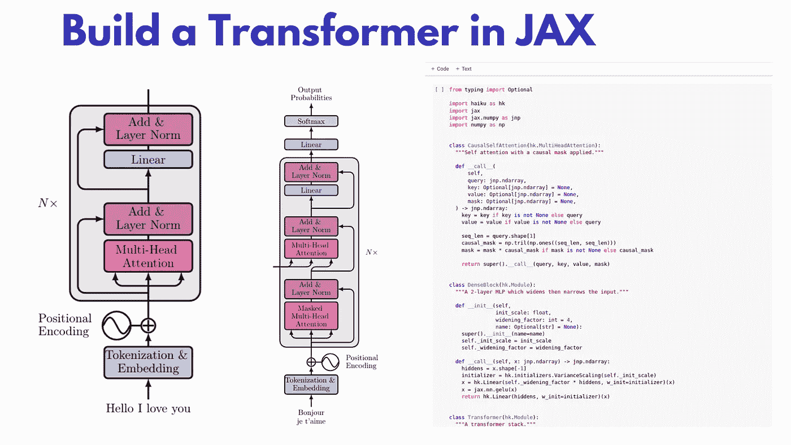

# 从零开始在 JAX 建造一个变压器

> 原文：<https://towardsdatascience.com/build-a-transformer-in-jax-from-scratch-how-to-write-and-train-your-own-models-9aa02b5b28fd?source=collection_archive---------16----------------------->

## 如何编写和训练自己的模型



作者图片

在本教程中，我们将探讨如何开发一个神经网络(神经网络)与 JAX。还有什么比[变压器](https://theaisummer.com/transformer/)更好的型号可以选择。随着 JAX 越来越受欢迎，越来越多的开发团队开始尝试使用它，并将其整合到他们的项目中。尽管它缺乏 Tensorflow 或 Pytorch 的成熟度，但它为构建和训练深度学习模型提供了一些很好的功能。

如果你还没有对 JAX 的基础知识有一个坚实的理解，看看我以前的文章。你也可以在我们的 [Github 库](https://github.com/The-AI-Summer/JAX-examples)中找到完整的代码。

俳句和 Flax 似乎是 Google/Deepmind 内部最多的框架，拥有最活跃的 Github 社区。对于本文，我将从第一个开始，看看以后是否还需要另一个。

所以你准备好用 JAX 和俳句做一个变形金刚了吗？对了，我假设你对变形金刚有扎实的了解。如果你还没有，请指点我们关于[注意](https://theaisummer.com/attention/)和[变形金刚](https://theaisummer.com/transformer/)的文章。

让我们从自我关注块开始。

# 自我关注障碍

首先，我们需要引进 JAX 和俳句

```
*import* jax
*import* jax.numpy *as* jnp
*import* haiku *as* hk
import numpy *as* np
```

幸运的是，俳句有一个内置的`MultiHeadAttention`模块，可以扩展来构建一个屏蔽的自我关注模块。我们的块接受查询、键、值以及掩码，并将输出作为 JAX 数组返回。可以看到代码非常熟悉标准 Pytorch 或者 Tensorflow 代码。我们所要做的就是构建因果掩码，使用`np.trill()`使第 k 个以上数组的所有元素无效，乘以我们的掩码，并将所有内容传递给`hk.MultiHeadAttention`模块

这个片段允许我介绍俳句的第一个关键原则。所有模块都应该是`hk.Module`的子类。这意味着他们应该实现`__init__`和`__call__`，以及其他方法。在某种意义上，这与 Pytorch 模块的架构相同，我们实现了一个`__init__`和一个`forward`。

为了清楚起见，让我们构建一个简单的 2 层多层感知器作为`hk.Module`，它将方便地用在下面的变压器中。

# 线性层

一个简单的两层 MLP 看起来像这样。你可以再次注意到它看起来多么熟悉。

这里需要注意一些事情:

*   俳句为我们提供了一组`hk.initializers`下的权重初始化器，在这里我们可以找到最[常见的方法](https://dm-haiku.readthedocs.io/en/latest/api.html#module-haiku.initializers)。
*   它还内置了许多流行的层和模块，如`hk.Linear`。如需完整列表，请查看官方文档。
*   没有提供激活函数，因为 JAX 已经有一个名为`jax.nn`的子包，在那里我们可以找到[激活函数](https://jax.readthedocs.io/en/latest/jax.nn.html)，比如`relu`或者`softmax`。

# 标准化层

层规范化是 transformer 架构的另一个组成部分，我们也可以在 Haiku 的公共模块中找到它。

# 变形金刚

现在说说好东西。下面你可以找到一个非常简单的转换器，它利用了我们预先定义的模块。在`__init__`中，我们定义了基本变量，如层数、注意力头和辍学率。在`__call__`中，我们使用一个`for`循环组成一个块列表。

如您所见，每个模块包括:

*   标准化层
*   自我关注障碍
*   两个脱落层
*   两个标准化层
*   两个跳跃连接(`h = h + h_attn`和`h = h + h_dense`)
*   两层致密块体

最后，我们还添加了一个最终的规范化层。

我想现在你已经意识到用 JAX 建立一个神经网络非常简单。

# 嵌入层

最后，让我们也包括嵌入层。很高兴知道俳句还提供了一个嵌入层，它将从我们输入的句子中创建标记。令牌然后被添加到[位置嵌入](https://theaisummer.com/positional-embeddings/)，产生最终输入。

`hk.get_parameter(param_name, ...)`用于访问模块的可训练参数。但是你可能会问，为什么不像我们在 Pytorch 中那样使用对象属性呢？这就是俳句的第二个关键原则发挥作用的地方。**我们使用这个 API，这样我们就可以使用** `hk.transform`将代码转换成一个纯函数。这不是很容易理解，但我会尽可能地把它说清楚。

# 为什么是纯函数？

JAX 的力量体现在它的函数转换中:用 T2 向量化函数的能力，用 T3 自动并行化，用 T4 实时编译。这里需要注意的是，为了转换一个函数，它需要是纯的。

**纯函数**是具有以下特性的函数:

*   对于相同的参数，函数返回值是相同的(没有局部静态变量、非局部变量、可变引用参数或输入流的变化)
*   函数应用程序没有副作用(没有局部静态变量、非局部变量、可变引用参数或输入/输出流的变异)。


*来源:* [*Scala 纯函数 by O'Reily*](https://www.oreilly.com/library/view/scala-reactive-programming/9781787288645/d41d894b-d1a6-4ae3-acec-8c97720d80d0.xhtml)

这实际上意味着一个纯函数将总是:

*   **如果用相同的输入调用，返回相同的结果**
*   **所有的输入数据都通过函数参数传递，所有的结果都通过函数结果**输出

Haiku 提供了一个名为`hk.transform`的函数转换，它将具有面向对象的、功能上“不纯”的模块的函数转换成可以与 JAX 一起使用的纯函数。为了在实践中看到这一点，让我们继续训练我们的 Transformer 模型。

# 向前传球

典型的向前传球包括:

1.  获取输入并计算输入嵌入
2.  运行通过变压器的块
3.  返回输出

上述步骤可以很容易地用 JAX 组成如下:

虽然代码很简单，但它的结构可能看起来有点奇怪。实际的正向传递通过`forward_fn`功能执行。然而，我们用返回`forward_fn`的`build_forward_fn`函数包装它。什么鬼东西？

接下来，我们需要使用`hk.transform`将`forward_fn`函数转换成一个纯函数，这样我们就可以利用自动微分、并行化等功能。

这将通过以下方式实现:

这就是为什么我们不是简单地定义一个函数，而是包装并返回函数本身，或者更准确地说是一个[可调用的](https://www.geeksforgeeks.org/callable-in-python/)。然后，这个可调用函数可以被传递到`hk.transform`中，成为一个纯函数。如果这是清楚的，让我们继续我们的损失函数。

# 损失函数

损失函数是我们熟知的交叉熵函数，不同之处在于我们还考虑了掩模。JAX 再次提供了`one_hot`和`log_softmax`功能。

如果你还和我在一起，喝一口咖啡，因为从现在开始事情会变得严重。是时候建立我们的训练循环了。

# 训练循环

因为 Jax 和 Haiku 都没有内置的优化功能，我们将使用另一个框架，名为 [Optax](https://github.com/deepmind/optax) 。如开头所述，Optax 是渐变处理的 goto 包。

首先，您需要了解一些关于 Optax 的事情:

Optax 的关键改造是`GradientTransformation`。转换由两个函数定义，即`__init__`和`__update__`。`__init__`初始化状态，`__update__`根据状态和参数的当前值转换梯度

```
state = init(params)
grads, state = update(grads, state, params=None)
```

为了减少我们的`main`函数，我们将把渐变更新提取到它自己的类中。

首先，`GradientUpdater`接受模型、损失函数和优化器。

1.  该模型将是由`hk.transform`转换的纯`forward_fn`函数

```
forward_fn = build_forward_fn(vocab_size, d_model, num_heads, num_layers, dropout_rate)forward_fn = hk.transform(forward_fn)
```

2.损失函数将是具有固定`forward_fn`和“vocab_size”的部分的结果

```
loss_fn = functools.partial(lm_loss_fn, forward_fn.apply, vocab_size)
```

3.优化器是一组按顺序运行的优化转换(可以使用`optax.chain`组合操作)

```
optimizer = optax.chain(
    optax.clip_by_global_norm(grad_clip_value),
    optax.adam(learning_rate, b1=0.9, b2=0.99)
)
```

梯度更新器将被初始化如下:

```
updater = GradientUpdater(forward_fn.init, loss_fn, optimizer)
```

看起来会像这样:

在`__init__`中，我们用`self._opt.init(params)`初始化优化器，并声明优化的状态。状态将是具有以下内容的字典:

*   当前步骤
*   优化程序状态
*   可训练参数
*   (一个随机生成的密钥传入`jax.random.split`)

`update`功能将更新优化器的状态以及可训练参数。最终，它将返回新的状态。

```
updates, opt_state = self._opt.update(g, state['opt_state'])params = optax.apply_updates(params, updates)
```

这里还有两件事需要注意:

*   `jax.value_and_grad()`是一个[特殊函数](https://jax.readthedocs.io/en/latest/jax.html#jax.value_and_grad)，它返回一个带梯度的可微函数。
*   `__init__`和`__update__`都用`functools.partial(jax.jit, static_argnums=0`标注，这将触发即时编译器，并在运行时将它们编译成 XLA。注意，如果我们没有将`forward_fn` 转换成一个纯函数，这是不可能的。

最后，我们准备构建整个训练循环，它结合了迄今为止提到的所有思想和代码。

注意我们是如何合并`GradientUpdate`的。这只是两行代码:

*   `state = updater.init(rng, data)`
*   `state, metrics = updater.update(state, data)`

仅此而已。我希望你们现在对 JAX 及其能力有了更清楚的了解。

# 感谢

所展示的代码在很大程度上受到了俳句框架的官方例子的启发。已经对其进行了修改，以适应本文的需要。有关完整的示例列表，请查看[官方知识库](https://github.com/deepmind/dm-haiku/tree/master/examples)。

# 结论

在本文中，我们看到了如何使用俳句在 JAX 开发和训练一个普通的变压器。尽管代码并不难理解，但它仍然缺乏 Pytorch 或 Tensorflow 的可读性。我强烈建议尝试一下，发现 JAX 的优点和缺点，看看它是否适合你的下一个项目。根据我的经验，JAX 非常适合需要高性能的研究应用，但对于现实项目来说还不够成熟。在我们的[不和谐频道](https://discord.com/invite/k6NXwe7PXh)让我们知道你的想法。别忘了访问我们的博客[艾夏](https://theaisummer.com/)获取类似文章。

*原载于 2021 年 3 月 19 日*[*【https://theaisummer.com】*](https://theaisummer.com/jax-transformer/)*。*