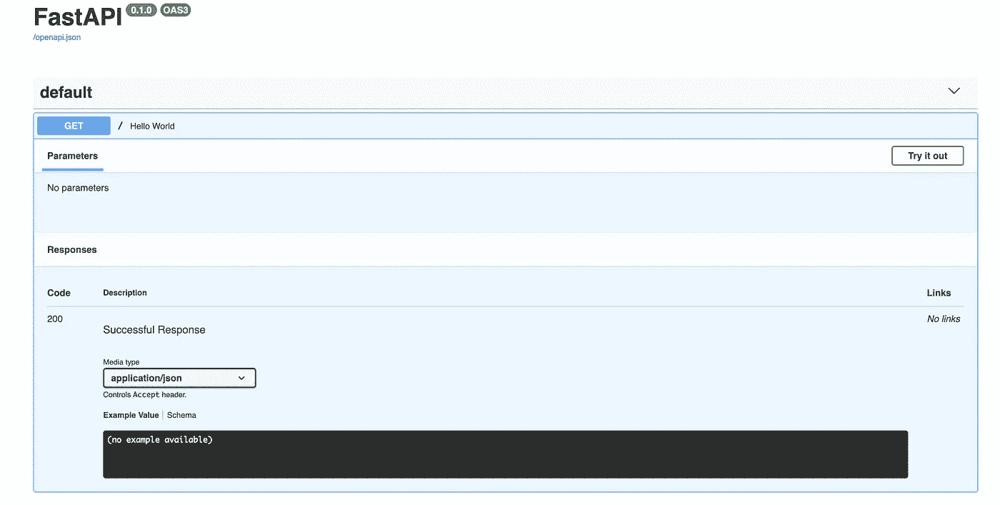
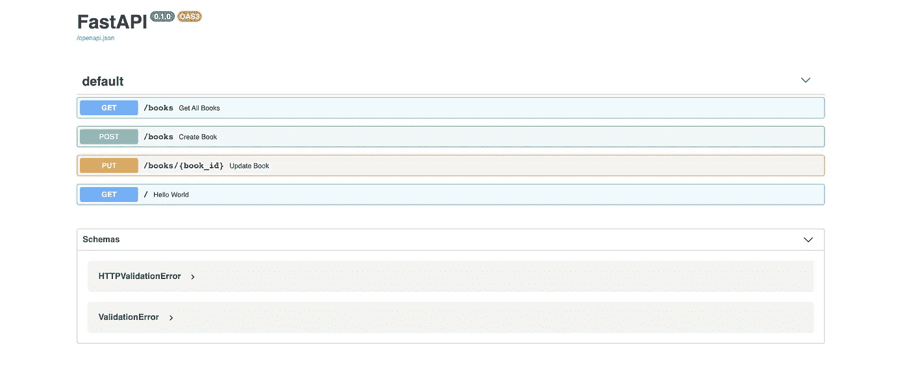
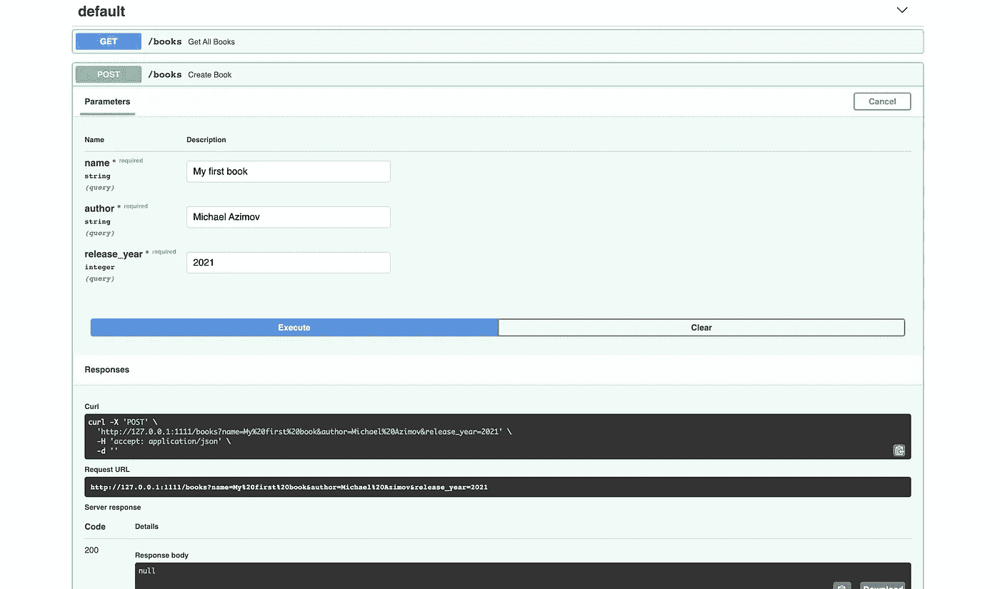
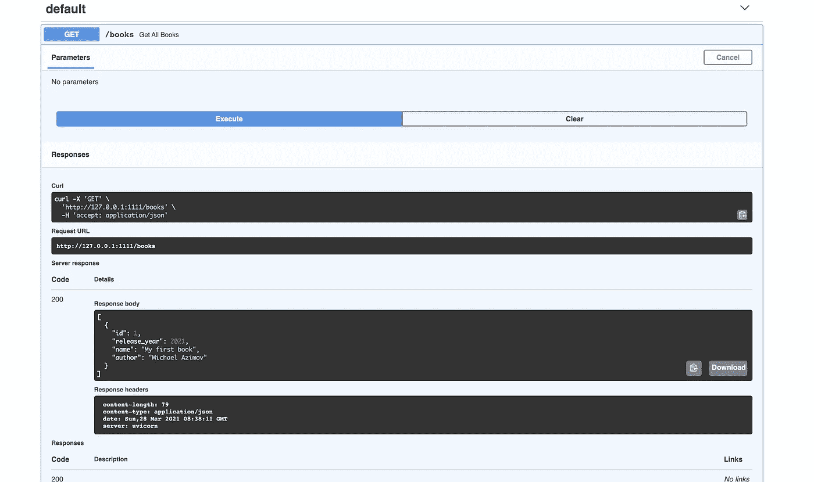
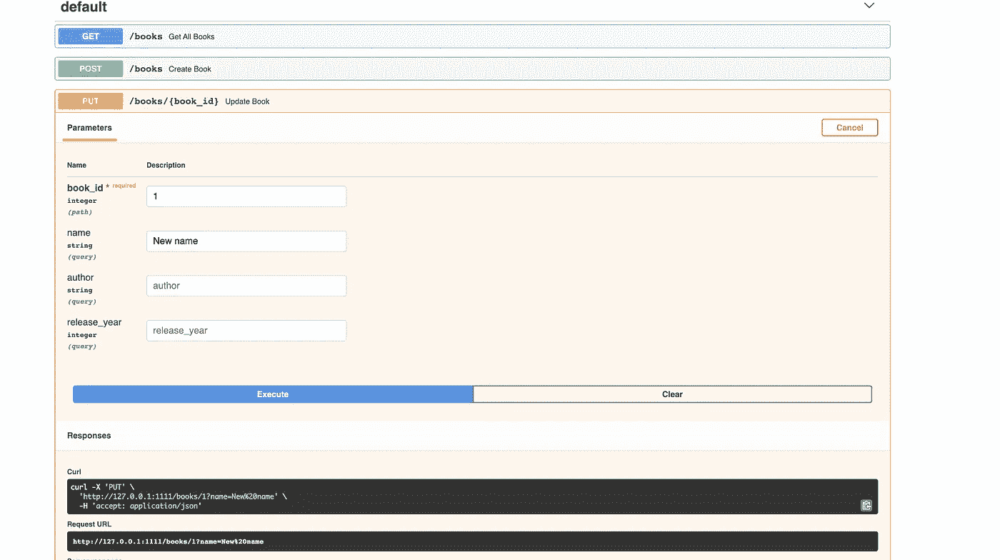
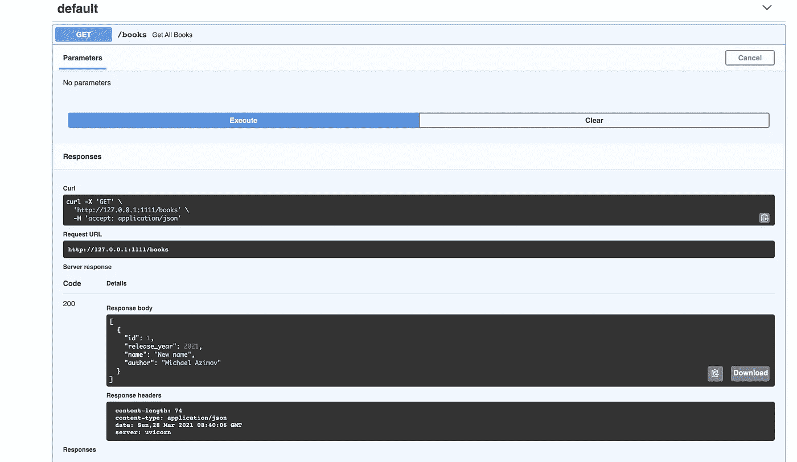

# 用 FastAPI & SQLAlchemy 构建异步 python 服务

> 原文：<https://towardsdatascience.com/build-an-async-python-service-with-fastapi-sqlalchemy-196d8792fa08?source=collection_archive---------0----------------------->

## 使用 FastAPI 和新的 SQLAlchemy AsyncIO 支持构建一个完全异步的 python 服务，包括异步数据库查询


[约翰·卡梅隆](https://unsplash.com/@john_cameron?utm_source=medium&utm_medium=referral)在 [Unsplash](https://unsplash.com?utm_source=medium&utm_medium=referral) 上拍照

# 背景

## 在开始之前

在这篇博文中，我们将构建一个小的 CRUD python 应用程序(我将使用 Python 3.9，但它应该可以在 3.7+上工作)。这篇文章将关注 FastAPI 和 async SQLAlchemy 的实现和使用，而不是 AsyncIO 在 Python 中的理论和一般用法。此外，这个职位假设你有以下主题的知识:
1。Python 语言与生态系统(venvs，IDE)
2。SQL 和 SQLALchemy
3。HTTP web 服务概念

这篇文章中的所有代码都可以在这个公共知识库中找到:[https://github.com/azimovMichael/my-async-app](https://github.com/azimovMichael/my-async-app)

## 异步编程和 python AsyncIO

异步编程是一种编程模式，它使代码能够独立于主应用程序线程运行。异步编程被用在许多用例中，比如事件驱动的系统、高度可伸缩的应用等等。

异步编程并不是一个新概念。它已经存在了一段时间，尤其是在 JavaScript 生态系统中。Python 3.4 [引入了 *asyncio*](https://realpython.com/async-io-python/) 包，实现了 Python 对 [Async/Await](https://en.wikipedia.org/wiki/Async/await) 设计的支持。有很多关于它的例子和教程，但我最喜欢的是:[python 异步编程简介](https://medium.com/velotio-perspectives/an-introduction-to-asynchronous-programming-in-python-af0189a88bbb)，[多任务不是我的强项，所以我怎么能责怪 Python 呢？](https://medium.com/swlh/how-has-python-helped-me-bake-cakes-more-efficiently-b870a1f111ac)(由我的同事 [Danielle shaul](https://medium.com/u/a4d8e3602d7d?source=post_page-----196d8792fa08--------------------------------) )和[Concurrent Burgers-Understand async/await](https://tiangolo.medium.com/concurrent-burgers-understand-async-await-eeec05ae7cfe)(由 FastAPI [的创建者 Sebastián Ramírez](https://medium.com/u/963974981597?source=post_page-----196d8792fa08--------------------------------) )

# 初始设置

## 准备环境

首先，你需要用一个新的[虚拟环境](https://docs.python.org/3/tutorial/venv.html)创建一个新项目。在新的 venv 里面，安装我们的第一个包——[FastAPI](https://fastapi.tiangolo.com/#installation)和[uvicon](https://www.uvicorn.org/)。

```
pip install fastapi uvicorn[standard] 
```

FastAPI 是一个相当新的 python(微)web 框架，内置了对异步端点的支持。

Uvicorn 是我们选择的 ASGI 服务器。ASGI 是 python WSGI 的异步姐妹。

现在我们已经准备好了一些代码。

## 第一个异步端点

要配置 FastAPI 服务，创建一个名为`app.py`的 python 模块，代码如下:

这段代码没做什么。它使用 uvicorn ASGI 服务器在端口 1111 上启动了一个 FastAPI 应用程序，没有任何自定义端点。FastAPI 自带对 [OpenAPI Docs](https://www.openapis.org/) 的开箱即用支持，因此你可以运行该应用程序，并在浏览器中转至:[http://127 . 0 . 0 . 1:1111/Docs](http://127.0.0.1:1111/docs)。如果一切顺利，您应该会看到类似如下的网页:


自动生成的 API 文档的初始视图

现在我们准备创建我们的第一个异步端点。

在您的`app.py`文件中，添加一个名为`hello_world`的异步函数，并将其挂载到基本 GET 路径:

重新运行服务，您应该会看到两个新东西:在 API 文档中，您应该会看到我们的新端点，您也可以使用“试用”按钮调用它:



我们新终端的文档

你也可以去[http://127 . 0 . 0 . 1:1111](http://127.0.0.1:1111/docs)/，在我们的浏览器中看到“hello_world”响应文本。

**我们有了第一个异步端点！🎆**

# 书店 CRUD 应用程序

所以，这篇文章的目的是建立一个小的 CRUD 应用程序。出于演示的目的，我们将构建一个简单的书店应用程序，能够创建、更新和获取书籍。

## SQLAlchemy 和 AsyncIO

为了使用 DB 来存储书籍，我使用 Python 的 SQLalchemy 库和支持 asyncio([*aiosqlite*](https://aiosqlite.omnilib.dev/en/latest/))的 sqlite 方言

安装必要的软件包:

```
pip install SQLAlchemy==1.4.3 aiosqlite
```

SQLAlchemy 1.4.X 是一个非常新的版本，有很多升级和新特性(这是迈向备受期待的 2.0 版本的第一步)，在这里详细介绍。在这篇文章中，我将主要关注新的异步支持。
**SQLAlchemy****Asyncio 在 1.4 版本早期应该算是 alpha 级别(！).**

一旦我们安装了 SQLAlchemy，我们需要配置我们的数据库连接。创建一个名为`db`的新 python 包，并在其中创建一个名为`config.py` *:* 的新模块

我们的数据库服务器是 SQLLite(一个本地`test.db`文件)的本地实例，我们将使用支持异步查询的`aiosqlite` 方言与它对话。我们正在使用新的`create_async_engine`函数创建 db 引擎。创建的会话标记有两个唯一的标志:`expire_on_commit=*False*` 确保我们的数据库实体和字段在会话提交后仍然可用，而`class_=AsyncSession`是新的异步会话。我们还将使用好的、旧的`declarative_base`来配置我们即将创建的 DB 模型。

> 如果你想使用不同的数据库(MySql、PostgreSQL 等)，你需要安装一个支持 AsyncIO 的兼容驱动程序，并更新`DATABASE_URL`参数。

## 数据库模型

我们正在构建一个书店应用程序，所以我们的主数据库表应该是一本书，这一点也不奇怪。在`db`包中创建一个名为`models`的新包，并在其中创建一个名为`book.py` *的新模块。*
我们的图书实体也会有一些字段——名称、作者、发行年份:

为了创建一个新的实体，我们将使用一个 DAL(数据访问层)类，它将负责这个 DB 模型的所有 sql 函数。在其中创建一个`dals`包和一个`book_dal.py`模块:

我们有 3 个函数:一个`create_book`函数接收我们的实体字段，并将一条新记录保存到数据库。一个`get_all_books`函数返回数据库中的所有书籍，一个`update_book`函数接收 book_id 和书籍字段的可选新值并更新它们。在`update_book`函数中，我们添加了一个名为`synchronize_session`的执行选项，它告诉会话使用`fetch`方法“刷新”更新的实体，以确保我们在内存中的实体将与我们更新的新值保持一致。

现在我们需要一些将使用这些 DAL 函数的新端点，所以让我们将它们添加到我们的`app.py` *:*

每个端点异步创建一个 DB 会话，一个带有会话的 BookDAL 实例，并调用相关函数(如果您的“干净代码”本能现在正在尖叫，那完全没问题，我们将在几个段落中解决它们)。

> 注意 PUT 方法:通过使用带有默认值的`Optional`类型，我们使查询参数成为可选的。

但是，为了让所有这些好东西实际工作，我们需要创建我们的*书籍* 表格。为此，我们将利用 [FastAPI 的事件特性](https://fastapi.tiangolo.com/advanced/events/)，并在应用启动时创建必要的表(显然，这不是我们想要在生产应用中做的事情):

现在，您可以运行应用程序，并查看 API 文档页面。它应该是这样的:



API 文档是交互式的，因此您可以直接从该页面调用我们的新端点。创建一本书:



您可以使用任何想要的输入参数。执行该命令后，您应该会在我们的 books 表中看到一条新记录。现在，让我们使用 *get* 端点来获取它:



正如你所看到的，我们的应用程序用我们的新书作出了回应，这本书被赋予了 id 1。我们现在可以使用更新图书上传功能来更新该图书:



然后再次获取它，并验证该书的名称实际上已经更改:



**祝贺你，你已经创建了你的第一个完全异步的 python 服务！🎉**

# 重构

现在我们有了一个可以工作的异步应用程序，我想使用一些 FastAPI 特性来使代码更简洁。

## API 路由器

目前，我们的`app.py`文件包含了我们所有的端点。在现实世界的应用程序中，我们可以有更多的端点，这个文件可以变得非常大。为了避免这种情况，我们可以使用 FastAPI 的 [API 路由器](https://fastapi.tiangolo.com/tutorial/bigger-applications/?h=router#apirouter)特性。创建一个`routers`包并在其中创建一个`book_router.py`文件:

`book_router.py`文件将包含与我们的 book 实体相关的所有 http 路由。现在我们需要更新我们的`app.py`文件来包含这个新的路由器:

您可以使用交互式 API 文档来验证我们的端点是否正常工作。

## 属国

你注意到我们在端点实现中使用的所有样板代码了吗？数据库会话初始化？如果我们不必为我们的每一个端点实现它，那该有多好，对吗？幸运的是，FastAPI 再次帮助了我们！

我们可以使用 FastAPIs [依赖注入功能](https://fastapi.tiangolo.com/tutorial/dependencies/)使`book_dal`成为端点的依赖。这样我们只实现一次 BookDAL 的创建逻辑，然后就可以在每个端点使用了。创建一个`dependencies.py`文件并添加一个`get_book_dal`函数:

现在，我们需要使用 FastAPIs 依赖特性使这个函数成为端点的依赖项:

> FastAPIs 依赖注入特性，非常强大而且易于使用。在我们的用例中，我们用它来为我们的端点注入 DAL 类，但是我们可以注入许多其他的东西——安全组件、商业智能组件等等。

验证我们的端点仍然工作，这就结束了！

# 结论

Python asyncio 相对较新，有很多复杂性和其他有趣的用例我们没有涉及，我鼓励你们每个人探索这个令人兴奋的新世界。

FastAPI 是一个新的现代 web 框架，强调速度、易用性，当然还有对 AsyncIO 的内置支持。

在本文中，我们构建了一个完全异步的 python 应用程序——从使用 FastAPI 的异步 http 端点到使用 SQLAlchemy 1.4 的异步 DB 查询。一个非常重要的话题是测试异步端点和代码，这个话题我们在这篇文章中没有涉及，我期待在我的下一篇文章中讨论这个话题。