# 为你的机器学习模型建立一个令人敬畏的用户界面

> 原文：<https://towardsdatascience.com/build-an-awesome-ui-for-your-machine-learning-models-7fab52ecdd86?source=collection_archive---------8----------------------->

## 我如何为我的 PDF-to-audiobook 转换器构建一个出色的用户界面

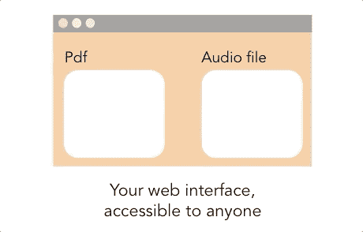

PDF 到有声读物

最终界面托管在 Gradio hub！

<https://gradio.app/hub/aliabd/text_speech>  

# **简介**

数据科学家、数据分析师和机器学习工程师面临的一个重大挑战是向非技术人员展示和演示他们的模型。这通常需要额外的技能，包括前端开发、后端开发，有时甚至是开发运维。即使你在这些领域很熟练，完成这项工作也需要大量的时间。一些库可以为您处理这项工作，让您将更多的精力放在模型开发任务上。 [Gradio](https://www.gradio.app/) 就是一个很好的例子；这是一个 Python 库，可以为每个机器学习模型生成易于使用的 UI。

本教程将探索这个库，并向您展示如何使用它来构建 PDF-to-Audiobook 演示。所以，让我们开始吧！

# **格拉迪欧是什么？**

[Gradio](https://github.com/gradio-app/gradio) 是一个[开源](https://github.com/gradio-app/gradio) Python 库，它允许你为机器学习模型构建一个用户界面，并在几行代码中进行部署。如果你之前在 python 中用过 Dash 或者 Streamlit，也差不多；然而，它直接与笔记本集成，不需要单独的 python 脚本。

# **如何运作？**

用起来很简单；为了渲染一个界面，我们需要五个组件:前三个我们可以根据你的模型的用例自由定制，最后两个绑定到渲染和部署:

1.  一个**输入组件**:定义输入的类型(文件、文本框、图片上传等)。)
2.  一个**输出组件**:定义输出的类型(文件、文本框、标签、音频等)。)
3.  **可调用函数**:应用于输入并呈现在输出中的主要推理函数。该功能可以是任何东西，从简单的打印到预先训练的模型— [查看组件列表](https://www.gradio.app/docs)。
4.  **接口类**:是一个 python 类，它将可调用函数与呈现接口中的输入进行映射。
5.  **launch()** **函数**负责在 gradio 服务器上运行应用程序。

[查看更多详细文档和 Gradio 入门页面](https://www.gradio.app/getting_started)

在幕后，Gradio 使用 Flask 框架构建接口组件并在本地运行，然后在它们的域上进行端口转发，这样您就有了一个已部署的链接(24 小时有效)。

如果你想要一个永久的链接，你可以设置一个 [Gradio 高级账户](https://www.gradio.app/)，Gradio 将在他们的服务器上的 docker 镜像中托管你的整个应用程序。

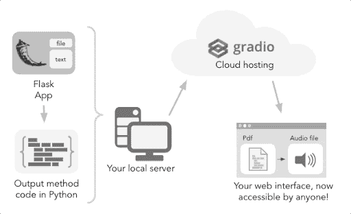

Gradio 工作流程

调用`launch()`会生成一个公共的、可共享的链接，只要您的服务器打开，您就可以自由地共享它——因为它共享工作区会话依赖项。在使用 colab 笔记本的情况下，总是会自动创建一个可共享的链接。一般是这样的: **XXXXX.gradio.app** 。尽管该链接与 gradio 域相关联，但它只是本地服务器的代理，并不从托管界面收集或存储数据。

但是，要注意这些可共享的链接是公开的，这意味着任何人都可以访问你的界面。因此，不要通过输入函数暴露任何敏感数据，也不要允许对您的机器进行任何危险的修改。我们可以通过设置用户名和密码在 launch 函数中配置 auth 参数来解决这个问题。

如果您设置 **share=False(默认)**，则仅创建一个本地链接，您可以通过[端口转发](https://www.ssh.com/ssh/tunneling/example)与特定用户共享该链接。

在接下来的几个步骤中，我们将使用 Gradio 为 PDF-to-audiobook 转换器构建一个用户界面，以便更加熟悉这个库。

# **步骤 1:将文本转换为语音的逻辑(后端)**

在下面的代码中，我利用 [pdfminer](https://pdfminersix.readthedocs.io/en/latest/) 将 pdf 文件转换成纯文本。接下来，我使用[谷歌文本语音转换](https://gtts.readthedocs.io/en/latest/)将文本转换成音频格式。

函数 pdf_to_text()将是我们将传递给接口的可调用函数。

# **第二步:定义输入输出组件**

根据功能和用例，您可以传递多个输入。但是，您需要将多个输入作为一个列表(数组)结构来传递。在我们的例子中，我们将只传递一个输入组件和一个输出组件。

输入将是一个文件；输出将是一个音频文件。我们可以通过指示组件名来决定输入或输出的类型，如下所示:

```
import gradio as griface = gr.Interface(
   fn = pdf_to_text,
   inputs = 'file',
   outputs = 'audio'
   )
```

# **第三步:启动应用**

启动应用程序将初始化 flask 应用程序，并触发本地主机服务器显示该应用程序。launch()函数有许多参数，允许您共享接口、在 colab 上调试它、内联显示它或在浏览器中打开它。所以，当他们走到一起时:

当您运行上面的代码片段时，您将得到类似如下的内容:

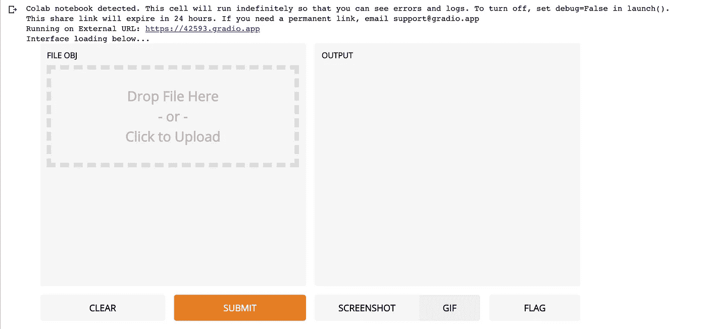

在 Gradio 本地服务器上运行的接口

假设您正在使用 colab 笔记本。在这种情况下，您可以直接使用该界面，或者在页面顶部导航与 gradio 应用程序相关联的外部 URL。然后拖动任何 pdf 文件，点击提交，等待编译。

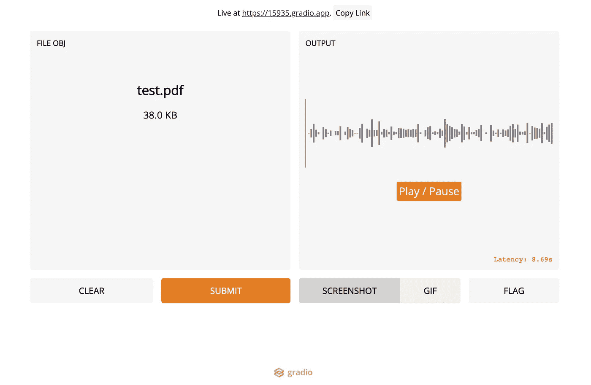

上传 pdf 文件并将其转换为音频

现在，我们有了输入文本的音频版本。厉害！

我们还可以使用实时 URL 来临时公开共享应用程序——正如我们前面讨论的那样，这样人们就可以尝试它，而不必担心安装依赖项和拥有在本地服务器上运行应用程序的基本技能。你需要做的就是在 **launch(share = true)** 函数中把 share 标志变成 True。然而，该链接将可用于 24 小时导航；如果你想让它永久托管在 Gradio 主机上，你可以考虑创建一个 [Gradio 高级账户](https://gradio.app/hosted)。

此外，我们可以在接口函数中为同步响应将标志“live”设置为 true。你也可以添加一个标题，描述，甚至写一篇文章或报告来描述这个界面。这些参数可以接受 **markdown 或 HTML** 中的文本，这不是很棒吗？[您可以在这里查看所有可用的界面选项](https://www.gradio.app/docs#Creating%20an%20Intercace)。

下面是将前面的功能添加到界面功能后的最终应用:

如下图所示，我们添加的段落在< p > 标签下创建了一个**新 div，并带有一个名为 *article* 的类。**

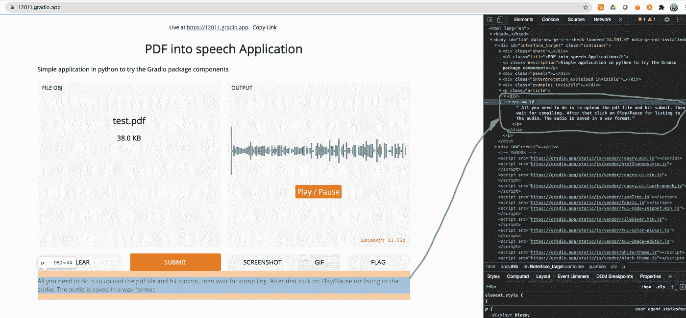

确认它接受 HTML 降价

# 部署

为了维护该界面的永久链接，您可能需要订阅 Gradio，每月 7 美元。使用与您的 GitHub 回购相同的账户进行认购至关重要。您需要做的就是选择项目存储库、分支名称、可执行文件名称以及您希望接收通知的电子邮件。

> [他们允许每个人在二月份使用二月份促销代码部署一个免费链接](https://gradio.app/introducing-hosted)

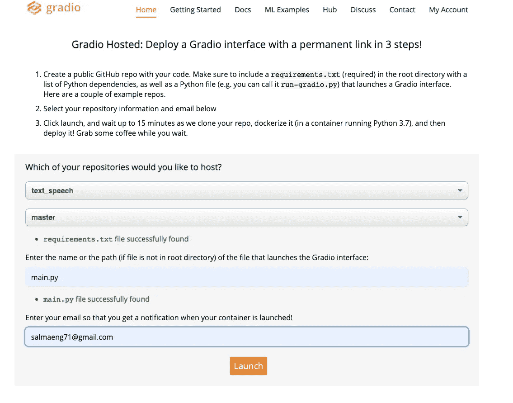

部署梯度屏幕

一旦你点击启动按钮，它将建立界面-这可能需要几分钟，取决于应用程序的大小。

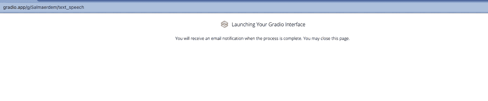

启动屏幕

最后，我们有一个永久的界面 URL，你可以在这里试用一下。

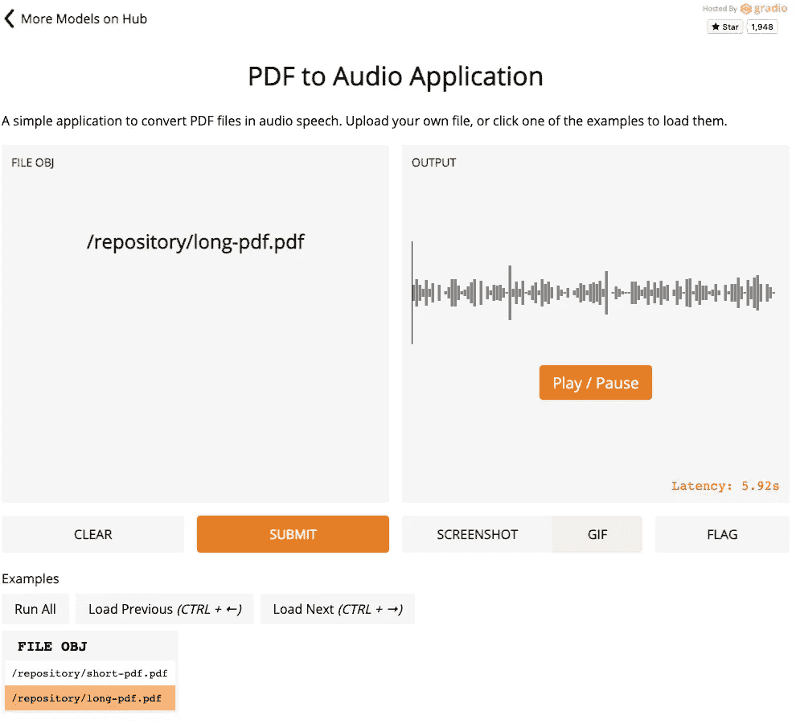

最终接口托管在 [Gradio hub](https://gradio.app/hub/aliabd/text_speech)

它在移动设备上看起来也很整洁，反应灵敏👌

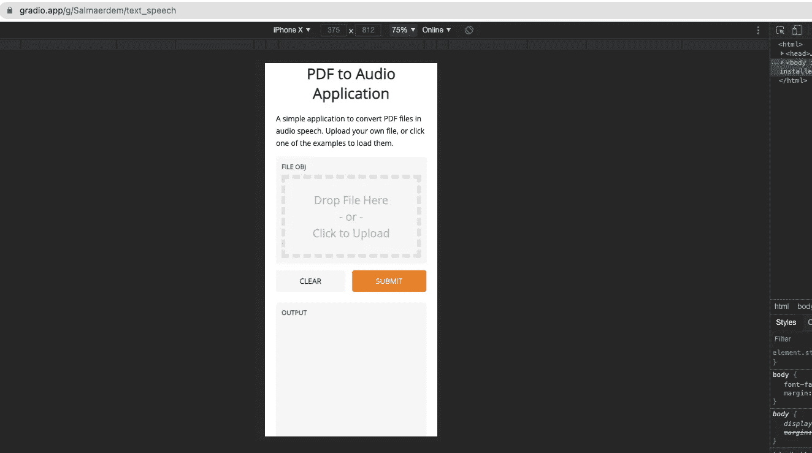

在 iPhone x 尺寸上模拟的界面

如果您导航回您的帐户，您可以选择在 [Gradio Hub](https://gradio.app/hub) 发布与社区的界面。

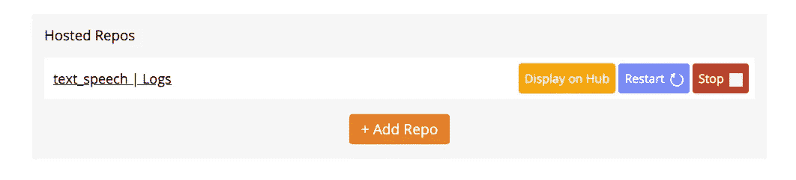

用户帐户仪表板

此外，您可以从 Logs 链接访问部署错误。

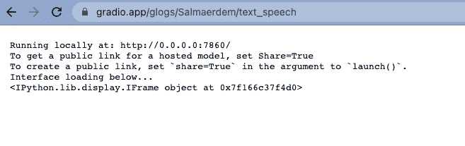

部署后记录输出

# **成交记录**

我希望这篇短文让您对使用 gradio 库有了全面的了解。一旦您的工作是活的，您可以有更多的反馈，最终使您能够增强模型。这是一个迭代的过程，反馈是其中必不可少的一部分。使用 gradio 可以使这一步更加舒适和灵活，使您能够专注于改进模型。如有疑问，请在下方评论区评论；我很乐意帮忙。感谢阅读！

# 参考

*   与本教程相关的 [GitHub 库](https://github.com/salma71/text_speech)
*   [Gradio 文档](https://www.gradio.app/docs)
*   [Gradio GitHub 回购](https://github.com/gradio-app/gradio)
*   [在野外轻松共享和测试 ML 模型](https://arxiv.org/pdf/1906.02569.pdf)